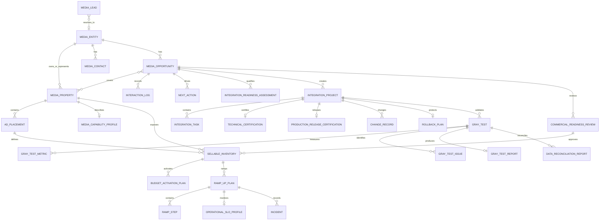

# PG OS 媒体生命周期、多角色协同、易用性与 Codex 可执行开发规范 V1.8.0

> **文件性质：** 本文件经过业务架构、软件工程、UI/UX 与系统测试四轮联合评审，是 PG OS 首期媒体生命周期设计、开发、测试和验收的统一权威规范。  
> **关键变化：** V1.4.1 不再使用“一个 `stage_status` 表达所有状态”的方式，而是采用 `生命周期阶段 + 当前工作节点 + 节点执行状态 + 运行控制状态 + 联合里程碑` 五维状态向量。  
> **结论：** 本版可以作为 AI 代码生成、数据库迁移、后端状态机、前端可用操作、自动化测试和项目验收的共同输入。

# 联合评审结论与已解决问题

| 评审角色 | V1.3 主要问题 | V1.4 处理结果 |
|---|---|---|
| 业务架构 | 旧状态章节与新增权威层重复；业务阶段、工程节点、暂停状态混在一起 | 建立单一状态模型和上下文边界，删除双重权威 |
| 软件工程 | `SAME_AS_SOURCE`、`ANY_ACTIVE_NON_TERMINAL` 等伪枚举；节点状态爆炸；副作用和事件一致性不足 | 使用固定节点、正交控制状态、显式 Target Mode、事务 Outbox 和语义校验 |
| UI/UX | 页面可能自行复制门禁；按钮、错误、补救动作和责任转移缺少统一来源 | UI 只消费 Available Transitions 与 Gate Results，统一迁移向导和补救入口 |
| 系统测试 | 验收用例很多，但没有自动生成覆盖矩阵和状态图静态检查 | 增加模型测试、迁移覆盖矩阵、Schema/Graph Lint、迁移原子性和回归门禁 |

## 版本定性

- 业务生命周期 S0—S5 没有改变；
- 状态机数据结构发生兼容性变化；
- `workflow_schema_version` 从 1.x 升至 2.1.0；
- 上线前必须执行第 19 章的数据迁移和双写验证。


# V1.5.0 最终用户角色评审结论

V1.5.0 在 V1.4.1 状态机、工程和测试底座上，增加最终使用者层。核心目标不是增加更多生命周期状态，而是让 CEO、媒体采购、技术、运营、销售、财务和法务打开系统后即可完成本职工作。

## 本版新增

- CEO 决策工作台与 `DecisionBrief`；
- 媒体经理推进工作台；
- 媒体总监组合与资源审批工作台；
- SDK 技术对接 `Integration Cockpit`；
- 运营 G1—G5 与生产运行控制台；
- 销售总监资源组合与销售准备度工作台；
- 销售经理可售媒体搜索、推荐和预算启用工作台；
- 财务准备度审核；
- 法务准备度审核；
- `SellabilityPassport` 媒体可售护照；
- Commercial Ready 六类并行准备度；
- 字段所有权、角色视图、代理委托和通知治理；
- 全链路跨角色交接和 UI 协作呈现。

## 不变边界

- S0—S5 主生命周期不变；
- T0—T6、G0—G5 节点不变；
- Transition Registry 仍是状态流转唯一来源；
- 销售、财务和法务准备度作为并行子审核，不制造新的主阶段；
- Legal、Financial、Technical 和 Operations 的阻断不得由 CEO 或业务角色无痕绕过。


# V1.6.0 引导式操作评审结论

V1.5.0 已经明确九类角色看到什么、能做什么；V1.6.0 进一步明确系统如何一步一步带用户完成任务。

## 本版解决的问题

- 用户进入系统后仍可能不知道先做什么；
- 页面虽然按角色拆分，但复杂任务仍需要理解完整状态机；
- 表单、Checklist、证据和审批分散；
- 失败提示可能告诉用户“不能继续”，却没有直接给出补救路径；
- 跨角色交接完成后，用户不清楚接下来由谁处理；
- 技术和运营熟练用户需要高效率模式，新用户需要强引导模式。

## 最终模式

```text
默认：Guided Mode 引导式模式
可选：Professional Mode 专业模式
```

两种模式使用同一后端 Transition、Guard、Checklist、权限和审计。专业模式只能提高操作效率，不能降低门槛。

## 引导式体验目标

系统必须让用户在每一个任务中明确知道：

1. 我现在要完成什么；
2. 为什么现在需要完成；
3. 系统已经知道什么；
4. 我还需要补充什么；
5. 为什么某项未通过；
6. 如何解决；
7. 提交后会发生什么；
8. 下一步由谁处理。


# V1.7.0 易用性闭环联合评审结论

本轮不是继续增加流程，而是对 V1.6.0 做三轮减法式修正：

## 第一轮：入口和步骤减法

- 17 个 Guided Flow 保留为系统能力，但不作为菜单入口；
- 用户从 Next Best Action、任务卡、告警或对象主操作自动进入正确流程；
- 原 106 个逻辑步骤继续用于规则和审计；
- UI 合并为 2—3 个可见阶段为主，复杂审核不超过 5 个可见阶段；
- 简单任务改用 Quick Action，不再强制打开完整向导。

## 第二轮：信息和界面减法

- 首页第一屏最多 5 张核心卡、7 个核心数字、2 张图；
- 默认导航不超过 6 个一级入口；
- 普通页面默认不展开超过 8 个 Checklist Item；
- 销售推荐默认突出 3 个主要结果；
- CEO 决策默认控制在一屏；
- 原始日志、完整审计和全部专业字段默认折叠。

## 第三轮：审核和语言减法

- 标准项目使用 Fast Track，但仍需责任人确认；
- 财务、法务、技术和商业审核默认只看与标准模板的差异；
- 非标准、高风险和重大定制才进入 Enhanced Review；
- 普通用户界面使用业务语言，系统代码只在专业模式和审计中展示；
- 上线必须通过九类岗位真实任务基准，而不能仅以页面和功能完成为准。

## 最终目标

```text
易使用：不需要先学习系统结构
界面清爽：第一屏只展示当前最重要内容
任务直观：自动告诉用户现在做什么
责任明确：始终显示 Owner、DRI、等待方和下一责任人
协同高效：标准项目快速处理，风险项目完整审核
```


# V1.8.0 Codex 开发适配联合评审结论

V1.7.0 已经描述了系统最终应达到的业务、状态机、岗位和 UI 结果；但直接交给 Codex 修改现有项目时，还必须解决仓库适配、增量改造、验证证据和安全回滚问题。

V1.8.0 形成以下开发套件：

```text
主规范
+ Workflow Machine
+ 仓库根目录 AGENTS.md
+ Codex Implementation Backlog
+ Repository Overlay Template
```

## Codex 执行循环

```text
扫描仓库
→ 记录基线
→ 建立规范到代码的映射
→ 证明真实缺口
→ 选择最小垂直切片
→ 修改
→ 用仓库真实命令验证
→ 输出证据并更新剩余缺口
```

## 核心原则

- 先读仓库，再改代码；
- 先证明缺口，再新增能力；
- 复用现有架构，不替换技术栈；
- 一次只改一个可验证能力；
- 数据迁移采用 Expand/Contract；
- 重要行为通过 Feature Flag 上线；
- 完成结论必须附实际命令和测试证据；
- PG OS 继续不依赖 Docker。

# 0. 如何使用本规范

## 0.1 规范关键词

本文档使用以下规范词：

| 关键词 | 含义 |
|---|---|
| `MUST` / 必须 | 强制要求，不允许 AI 自行修改、删减或绕过 |
| `MUST_NOT` / 禁止 | 明确禁止的设计或实现 |
| `SHOULD` / 应 | 默认必须遵守；偏离时必须在实现说明中给出理由 |
| `MAY` / 可 | 可选能力，由当前任务范围决定 |
| `CONFIGURABLE` / 可配置 | 默认值必须实现，同时允许管理员调整 |
| `DERIVED` / 派生 | 不由用户直接维护，应由系统计算 |
| `IMMUTABLE` / 不可变 | 创建后不得直接修改，只能通过专用纠错流程处理 |

## 0.2 规则编号

关键规则均使用唯一编号，例如：

```text
INV-001
WF-S1-TO-S2-001
RBAC-010
UI-021
API-005
AC-014
```

AI 在输出设计方案、实施计划、代码说明和测试报告时，应引用相关规则编号。

## 0.3 冲突处理

出现需求、代码、注释或历史实现冲突时，按以下优先级处理：

```text
不可违反约束
>
领域模型、状态机、权限矩阵
>
接口、页面、验收规则
>
当前明确任务
>
现有代码中的非冲突实现
>
AI 自行推断
```

AI 不得通过“已有代码如此实现”为理由违反更高优先级规则。

## 0.4 AI 不确定性处理

遇到本文档未定义的细节时：

1. 先检查是否可由现有代码、数据库或配置确定；
2. 优先采用不改变业务语义、可回滚、最小范围的实现；
3. 不得自行增加新的生命周期阶段；
4. 不得自行合并本文档定义的领域对象；
5. 不得自行扩大首期范围；
6. 必须在实现说明中列出假设；
7. 高影响决策应保留为配置或明确的待决项，而不是硬编码。

---

# 1. 产品使命与首期范围

## 1.1 产品使命

PG OS 首期是 Poly-Gamma 的**媒体供给侧生产和商业化管理系统**。

系统必须将：

```text
公开市场和内部渠道中的潜在媒体
```

通过标准化流程转化为：

```text
销售可以识别、理解、报价和推荐，
工程与运营能够安全灰度、逐级放量并稳定承接规模化预算的媒体资源
```

系统必须区分：

```text
Commercial Ready = 可以开始有限售卖和受控投放
Scale Ready      = 可以在监控、止损和回滚保护下承接规模化预算
```

Commercial Ready 不得解释为可以立即开放全部流量或无限预算。

## 1.2 首期核心链路


S0—S5 是唯一主生命周期；Limited Sellable 至 Active Scaled 是 S5 内部运行子流程。


## 1.2A 跨职能协作使命

PG OS 不仅管理媒体所处状态，还必须管理媒体采购、管理决策与技术交付之间的责任转移。

```text
媒体采购经理形成真实、完整、可推进的合作机会
        ↓
媒体采购总监判断组合优先级并批准工程资源投入
        ↓
SDK 技术对接工程师完成技术预评估并正式接受交接
        ↓
三方按统一里程碑完成技术认证、生产发布、灰度和规模化运行
```

任何项目不得以“群里已沟通”“对方口头同意”“技术正在看”替代结构化责任、交付物、审批和下一步行动。

## 1.3 首期必须实现

- 媒体自动发现或批量导入；
- 媒体线索清洗、识别和去重；
- 媒体线索分配和人工初筛；
- 媒体主体、媒体产品、联系人和广告位建档；
- 媒体价值评分；
- 媒体合作意愿评分；
- 技术可行性预评估；
- 工程资源投入审批；
- 正式工程交接与退回；
- 阶段 DRI、RACI 与责任转移；
- 商务跟进和下一步行动；
- 技术对接项目与任务；
- 商务技术承诺审核；
- 媒体定制开发申请与治理；
- 跨职能决策、会议行动项和自动升级；
- 技术认证；
- 生产发布认证；
- 灰度测试计划、分级测试、指标、异常和报告；
- Commercial Ready 准入审核；
- 有限可售资源；
- 预算启用计划；
- 分阶段放量计划与 Ramp Step；
- Scale Ready 审核；
- 生产可观测性、自动暂停、事故和回滚；
- 可售卖媒体资源；
- 生命周期漏斗；
- 我的工作台；
- 阶段超期、任务超期和阻塞预警；
- 权限、操作日志和状态变更历史。

## 1.4 首期明确不做

除当前任务明确要求外，AI `MUST_NOT` 主动扩展以下完整能力：

- 完整广告主 CRM；
- 完整 Campaign 生命周期；
- DSP 出价与算法策略；
- 完整广告素材生产平台；
- 完整合同法务平台；
- 完整发票、回款和财务总账；
- 自动媒体结算；
- 完整广告主知识图谱；
- 复杂低代码审批引擎；
- 完整多租户 SaaS；
- 与首期媒体生命周期无关的通用 OA；
- 为“未来可能需要”而预建大量空模块。

允许保留必要外键、扩展字段或接口边界，但不得生成无实际首期用途的菜单、页面和流程。

---

# 2. 不可违反约束

## 2.1 产品与流程约束

- **INV-001**：系统唯一核心主流程必须是 `S0 → S1 → S2 → S3 → S4 → S5`。
- **INV-002**：AI `MUST_NOT` 新增、删除、合并或改变 S0—S5 的业务含义。
- **INV-003**：技术对接完成不等于 Commercial Ready。
- **INV-004**：只有通过 Commercial Ready 审核的资源才可以进入正式可售卖媒体库。
- **INV-005**：销售只能使用 `commercial_ready_status=APPROVED` 且处于允许销售状态的资源；只有 `scale_readiness_status=APPROVED` 的资源才允许进入规模化预算放量。
- **INV-006**：所有阶段迁移必须由后端状态机验证，不能只依赖前端隐藏或禁用按钮。
- **INV-007**：每次阶段迁移必须产生不可篡改的审计记录。
- **INV-008**：任何活跃媒体合作机会必须存在负责人、下一步行动和截止时间。
- **INV-009**：任何技术对接项目必须存在 PG 技术负责人和媒体方技术联系人；媒体方联系人暂缺时必须标记阻塞。
- **INV-010**：任何灰度测试必须先存在已通过的技术验收。
- **INV-011**：任何 Commercial Ready 审核必须关联一份灰度测试报告。
- **INV-012**：暂停、关闭和退回不得删除历史阶段、历史评分、历史任务和历史测试结果。

## 2.2 领域对象约束

- **INV-020**：`MediaEntity`、`MediaProperty`、`AdPlacement`、`MediaContact`、`MediaOpportunity`、`IntegrationProject`、`GrayTest`、`CommercialReadinessReview` 和 `SellableInventory` 必须独立建模。
- **INV-021**：禁止使用一张“media”大表承载所有公司、App、联系人、广告位、商务、技术和测试信息。
- **INV-022**：一个媒体主体可以拥有多个媒体产品。
- **INV-023**：一个媒体产品可以拥有多个广告位。
- **INV-024**：一个媒体主体可以拥有多个联系人。
- **INV-025**：同一媒体产品可以存在多个技术对接项目，但同一时间只能有一个相同 `integration_scope` 的活跃项目。
- **INV-026**：灰度测试按“技术对接项目 + 广告位集合 + 国家/区域范围”建立，不得仅以媒体公司为粒度。
- **INV-027**：可售卖资源必须至少明确到媒体产品和广告位；不能只创建公司级可售资源。
- **INV-028**：采集来源数据和人工确认数据必须可区分，不得用人工值无痕覆盖原始发现数据。

## 2.3 工程约束

- **INV-040**：PG OS 不使用 Docker 作为本地开发或生产运行的必需条件。
- **INV-041**：AI 必须先检查现有仓库技术栈，不得未经明确要求更换框架、ORM、数据库或构建体系。
- **INV-042**：所有权限校验必须在服务端执行；前端权限只负责交互显示。
- **INV-043**：枚举和业务阈值不得散落硬编码在多个页面中，应集中定义。
- **INV-044**：生产界面不得出现开发注释、占位菜单、Lorem Ipsum、无意义假数据或“功能开发中”页面。
- **INV-045**：数据库结构变化必须通过版本化迁移实现，不得要求手工修改生产数据库。
- **INV-046**：删除默认采用软删除或停用；涉及审计和历史的业务记录禁止物理删除。
- **INV-047**：接口必须返回稳定的机器可识别错误码，不能只返回自然语言错误。
- **INV-048**：所有时间在存储层使用 UTC，在界面按用户时区显示。
- **INV-049**：金额必须同时包含数值和币种；禁止无币种金额。
- **INV-050**：比例统一存储为小数或基点，必须在领域模型中保持一致，禁止同一字段混用 0.2 与 20。

## 2.4 技术发布、灰度与规模化约束

- **INV-051**：灰度测试通过不等于允许立即分发大规模预算。
- **INV-052**：S2 进入 S3 前必须完成 `IntegrationReadinessAssessment`。
- **INV-053**：测试环境技术联调与生产发布必须分别形成 `TechnicalCertification` 和 `ProductionReleaseCertification`。
- **INV-054**：没有生产发布认证的媒体不得启动真实用户流量灰度。
- **INV-055**：灰度必须支持 G0—G5 分级模型，禁止从测试环境直接跳到全量生产。
- **INV-056**：流量放量和预算放量必须独立配置、审批和回滚。
- **INV-057**：Commercial Ready 默认只能进入 `LIMITED_SELLABLE`。
- **INV-058**：任何规模化预算启用前必须存在已批准的 `RampUpPlan`。
- **INV-059**：每个 `RampStep` 必须包含流量、QPS、预算、观察时间、通过条件、自动暂停条件和回退步骤。
- **INV-060**：真实预算必须关联 `BudgetActivationPlan`。
- **INV-061**：没有达标的 `DataReconciliationReport` 不得进入 Scale Ready。
- **INV-062**：没有有效 `RollbackPlan` 或 Kill Switch 不得规模化放量。
- **INV-063**：触发 `AUTO_PAUSE` 后必须停止继续放量并暂停受影响范围。
- **INV-064**：自动暂停必须保留异常快照、受影响范围和恢复审批记录。
- **INV-065**：生产版本、SDK/API、配置和广告位映射变化必须记录 `ChangeRecord`。
- **INV-066**：重大生产变更后必须重新验证受影响范围。
- **INV-067**：Mobile、CTV、DOOH 必须使用渠道特定认证模板。
- **INV-068**：Scale Ready 必须基于连续观察窗口，不得基于单点数据。
- **INV-069**：大规模预算运行期间必须持续监控技术、质量、预算和对账指标。
- **INV-070**：事故恢复后不得直接恢复事故前最高放量级别。


## 2.5 跨职能协作与责任治理约束

- **INV-071**：任一活跃媒体在当前阶段必须且只能存在一个阶段 DRI。
- **INV-072**：同一关键决策只能有一个 `Accountable` 角色，禁止多个最终负责人。
- **INV-073**：媒体采购经理不得直接承诺 SDK 定制、技术性能、数据能力或技术上线日期。
- **INV-074**：涉及 QPS、超时、隐私字段、频控、竞价链路、报表或发布计划的商务承诺，必须经 SDK 技术负责人确认。
- **INV-075**：`IntegrationReadinessAssessment=READY` 只证明条件基本具备，不代表 PG 已批准投入工程资源。
- **INV-076**：没有已批准的 `EngineeringResourceCommitment`，技术项目不得进入正常开发状态。
- **INV-077**：SDK 技术对接工程师必须正式接受 `IntegrationHandover`，技术执行才算启动。
- **INV-078**：被退回的交接必须包含退回原因、缺失项、责任人和截止时间。
- **INV-079**：交接退回后，阶段 DRI 自动返回媒体采购经理，直至重新提交并被接受。
- **INV-080**：任何阻塞必须指定责任方、行动负责人、截止时间和升级时间；禁止只写“等待中”。
- **INV-081**：媒体专属定制必须经 SDK 技术负责人和媒体采购总监共同批准。
- **INV-082**：媒体采购经理不得在技术审批前对外承诺定制范围或交付日期。
- **INV-083**：跨职能关键决策必须形成 `CrossFunctionalDecision`，不得只保存在邮件、群聊或口头会议中。
- **INV-084**：媒体采购总监必须综合商业价值、成功概率、技术投入、上线周期和工程容量确定项目优先级。
- **INV-085**：商务范围、技术范围、灰度范围和可售范围必须可追溯关联。
- **INV-086**：工程交接后新增或变化的商务承诺必须触发技术影响复核。
- **INV-087**：项目连续阻塞超过配置的 OLA/SLA 必须自动升级。
- **INV-088**：媒体采购经理、媒体采购总监和 SDK 工程师必须使用同一套 M0—M10 里程碑。
- **INV-089**：媒体采购总监可以暂停低价值、高投入或长期无进展项目，但必须记录组合决策依据。
- **INV-090**：跨职能 KPI 不得仅奖励签约数量或任务数量，必须衡量交接质量、上线稳定性和商业结果。


---


## 2.7 最终用户角色与岗位操作约束

- **INV-116**：每类最终用户必须有独立默认工作台。
- **INV-117**：所有工作台必须包含“需要我处理、等待他人处理、风险与超期”三个统一队列。
- **INV-118**：用户默认只展示完成岗位任务所需的信息，其他内容按权限渐进展开。
- **INV-119**：销售总监与销售经理必须为不同角色、权限和数据范围。
- **INV-120**：销售只能使用状态为 ACTIVE 的 SellabilityPassport。
- **INV-121**：销售不得承诺 SellabilityPassport 范围之外的国家、广告位、格式、预算、价格或上线日期。
- **INV-122**：Commercial Ready 必须同时满足媒体采购、技术、运营、销售、财务和法务准备度。
- **INV-123**：财务未确认结算主体、币种、账期、税务、对账和毛利时，不得启用真实商业预算。
- **INV-124**：法务存在媒体权属、数据处理、跨境数据、重大责任或合同效力阻断时，任何角色不得 Override。
- **INV-125**：每个业务字段必须有唯一 Field Owner；其他角色通过审批、评论或变更请求协作。
- **INV-126**：同一业务事实不得要求多个角色重复录入。
- **INV-127**：系统计算字段不得由用户重复填写或手工覆盖。
- **INV-128**：CEO 审批必须使用 DecisionBrief，不得要求 CEO 自行阅读完整技术和操作页面。
- **INV-129**：CEO 可以批准商业和资源例外，但不得绕过技术安全、财务重大风险和法务不可接受阻断。
- **INV-130**：角色切换必须显式显示当前身份和数据范围。
- **INV-131**：代理委托必须有角色范围、数据范围、有效期和完整审计。
- **INV-132**：代理权限不得超过委托人原有权限，不得循环委托。
- **INV-133**：Auto Pause、SEV1/SEV2、法务阻断和财务重大风险通知不得关闭。
- **INV-134**：页面主操作必须由 available-transitions、gate-results 或已注册 Review Action 驱动。
- **INV-135**：媒体详情页必须按角色使用不同默认视图，不允许所有岗位默认展示同一超长页面。
- **INV-136**：销售、财务和法务审核必须并行进行，任何一个未通过时 Composite Commercial Readiness 不得通过。
- **INV-137**：关键商务、财务、合同或技术范围变化必须使相关岗位准备度变为 STALE_REVIEW_REQUIRED。
- **INV-138**：字段修改必须通知受影响的下游 Field Owner 和审批人。
- **INV-139**：跨角色交接必须形成 Handoff Card，明确发送方、接收方、交付物、截止时间和接受状态。
- **INV-140**：即时通信、邮件或会议中的关键决策必须转化为系统 Decision、Action、Interaction 或 Review，不得仅存在于外部沟通记录。


## 2.8 引导式操作与易用性约束

- **INV-141**：默认操作模式必须为 Guided Mode。
- **INV-142**：每个引导页面最多只能有一个主操作按钮。
- **INV-143**：一个向导默认包含 3—7 个步骤，超过 7 步必须拆分为子任务。
- **INV-144**：每个步骤必须说明目的、所需输入、完成标准和下一步。
- **INV-145**：系统已有数据必须自动继承，不得要求用户重复填写。
- **INV-146**：所有预填数据必须显示来源和更新时间。
- **INV-147**：低置信度 AI 提取结果必须由 Field Owner 确认。
- **INV-148**：系统计算字段必须只读，并可查看计算依据。
- **INV-149**：字段校验应在当前步骤完成时进行，不得把全部错误推迟到最终提交。
- **INV-150**：失败门槛必须同时提供责任人、补救动作和重新检查入口。
- **INV-151**：被其他角色阻塞时，向导必须进入 Waiting for Other Role，而不是要求当前用户反复提交。
- **INV-152**：向导必须支持自动保存、退出和跨设备继续。
- **INV-153**：恢复过期草稿时必须显示底层数据差异并重新校验。
- **INV-154**：提交前必须显示目标状态、责任转移、审批人和主要副作用。
- **INV-155**：提交成功后必须显示新状态、下一步、下一责任人和预计时间。
- **INV-156**：危险动作必须使用引导式确认，不允许仅用通用弹窗。
- **INV-157**：Auto Pause、回滚和事故恢复必须使用专用紧急向导。
- **INV-158**：Professional Mode 不得绕过任何 Guard、Checklist、Approval、Evidence 或审计。
- **INV-159**：首次使用岗位功能时提供情境式引导，不得强制播放长教程。
- **INV-160**：同一提示在用户完成后不得持续重复打扰。
- **INV-161**：每个角色工作台必须提供 Next Best Action。
- **INV-162**：Next Best Action 必须优先展示安全、重大阻断和超期任务。
- **INV-163**：AI 可以总结、建议和预填候选值，但不得自动审批和执行高风险动作。
- **INV-164**：向导不得暴露内部枚举、错误栈和数据库术语给普通用户。
- **INV-165**：所有错误码必须映射为用户可理解的原因和补救动作。
- **INV-166**：引导式页面必须支持键盘操作、屏幕阅读器和颜色之外的状态表达。
- **INV-167**：引导式模式必须在 1280px 宽度下完成核心任务，不依赖横向滚动。
- **INV-168**：用户在任一步骤都能查看整体进度，但非必要的后续字段应渐进展开。
- **INV-169**：跨角色向导的最后一步必须生成 HandoffCard。
- **INV-170**：用户主动切换 Professional Mode 时必须保留当前草稿和步骤状态。


## 2.9 易用性闭环与减法设计约束

- **INV-171**：普通用户不得从菜单中手工选择 Guided Flow。
- **INV-172**：系统必须根据角色、状态、风险和待办自动路由操作界面。
- **INV-173**：简单、低风险且不改变状态的任务必须优先使用 Quick Action。
- **INV-174**：逻辑步骤可以多于用户可见阶段，但每个逻辑步骤必须且只能归属一个可见阶段。
- **INV-175**：普通 Guided Flow 用户可见阶段不得超过 5 个；紧急流程不得超过 4 个。
- **INV-176**：首页第一屏核心卡片不得超过 5 张。
- **INV-177**：首页第一屏核心数字不得超过 7 个。
- **INV-178**：一级导航不得超过 6 个，角色无权限入口必须隐藏。
- **INV-179**：普通步骤默认展开的 Checklist Item 不得超过 8 个。
- **INV-180**：普通页面默认展开的字段分组不得超过 3 个。
- **INV-181**：销售推荐默认突出结果不得超过 3 个。
- **INV-182**：CEO 决策默认方案不得超过 3 个，并应在一屏完成摘要阅读。
- **INV-183**：标准项目必须优先使用标准模板和差异审核。
- **INV-184**：Fast Track 只能减少重复检查，不得自动审批或降低门槛。
- **INV-185**：没有实质差异的标准内容默认折叠，但完整审计必须保留。
- **INV-186**：重大定制、非标准账期、跨境数据例外、排他和高责任条款必须进入 Enhanced Review。
- **INV-187**：用户界面默认不得展示内部状态码、Transition ID、Object Version 和程序错误栈。
- **INV-188**：按钮必须使用“动词+对象”的明确文案。
- **INV-189**：界面不得使用“确定”“处理”“操作”等无法说明结果的主按钮。
- **INV-190**：技术和运营可以默认使用专业密度，但高风险动作仍必须使用引导式确认。
- **INV-191**：用户密度偏好只改变布局，不改变字段可见权限和业务规则。
- **INV-192**：每个工作台必须分为 Focus、Work 和 Analyze 三层，默认打开 Focus。
- **INV-193**：真实用户任务基准未通过时，不得以“功能已开发”判定可上线。
- **INV-194**：核心任务成功率低于 85% 时必须阻断正式发布。
- **INV-195**：界面埋点不得记录敏感字段值，只记录行为和性能元数据。
- **INV-196**：相同标准模板的内容不得要求各审核角色逐项重新填写。
- **INV-197**：审核页面必须优先展示差异、风险和待决策项。
- **INV-198**：普通联系记录、提醒和 Owner/Due Date 更新不得打开全屏流程。
- **INV-199**：安全止损动作必须优先于事故文档填写。
- **INV-200**：V1.7.0 之后新增 UI 元素必须证明其对任务完成有直接价值。


## 2.10 Codex 仓库改造与代码生成约束

- **INV-201**：修改产品代码前必须读取适用范围内的全部 AGENTS.md。
- **INV-202**：产品代码修改前必须生成 Repository Map、Baseline Report、Repository Overlay 和 Spec Gap Matrix。
- **INV-203**：未搜索现有实现前，不得认定能力缺失。
- **INV-204**：必须复用仓库已有语言、框架、包管理器、目录和测试惯例。
- **INV-205**：未经明确架构决策，不得替换框架、数据库、状态管理或包管理器。
- **INV-206**：不得新增 Docker 作为项目必要依赖。
- **INV-207**：每个 Change Batch 只处理一个完整、可验证能力。
- **INV-208**：能力应尽量形成 Domain、Persistence、Service、API/UI、Permission、Test 和 Observability 的垂直切片。
- **INV-209**：无关重构、全仓格式化和依赖升级不得混入功能批次。
- **INV-210**：超出建议修改范围时必须说明原因和回滚。
- **INV-211**：所有变更必须列出对应规范章节、Transition、Guard 或 Acceptance Criteria。
- **INV-212**：生成代码不得手工改，必须修改生成源并执行项目生成命令。
- **INV-213**：不得自行发明验证命令，必须优先发现仓库脚本。
- **INV-214**：修改前必须记录既有失败，修改后必须区分新旧失败。
- **INV-215**：不得删除、跳过或弱化测试来制造通过。
- **INV-216**：不得用 Mock 成功代替真实 Workflow、权限、事务或生产控制。
- **INV-217**：数据库重大变更必须采用 Expand/Contract，首批不得删除旧字段。
- **INV-218**：Backfill 必须幂等、可重试，并提供数量和不变量校验。
- **INV-219**：历史状态无法唯一映射时进入人工复核，禁止猜测。
- **INV-220**：新默认工作台、Guided UX、Fast Track 和历史准入强制必须使用 Feature Flag。
- **INV-221**：Feature Flag 必须有 Owner、默认状态、目标角色、Kill Switch 和移除日期。
- **INV-222**：临时 Flag 永久保留属于缺陷。
- **INV-223**：优先通过 Adapter 接入现有系统，不得无必要整体重写。
- **INV-224**：兼容层删除前必须经过观察期和回滚演练。
- **INV-225**：Workflow 受控字段不得通过通用 PATCH 更新。
- **INV-226**：前端不得成为 Guard、权限或审批的唯一真相。
- **INV-227**：权限修改必须包含允许和拒绝测试。
- **INV-228**：迁移、状态机、权限、事件、UI 和生产控制均必须有相应验证证据。
- **INV-229**：每个批次必须可独立回退或通过 Flag 停用。
- **INV-230**：通知失败不得伪装为状态迁移失败，必须遵循 Outbox。
- **INV-231**：安全关键预算、流量和回滚副作用必须验证真实控制路径。
- **INV-232**：不得从自然语言自行增加未注册的状态、角色或 Transition。
- **INV-233**：仓库与规范冲突必须写入 Decision Log，不得静默选择。
- **INV-234**：破坏性数据、安全、隐私和不可解决权限冲突必须标记 Blocker。
- **INV-235**：非破坏性不确定项采用最小、可逆、兼容实现。
- **INV-236**：能力被判断为已存在时，也必须提供代码和测试证据。
- **INV-237**：Completion Report 必须列出命令、结果、文件、迁移、Flag、回滚和剩余缺口。
- **INV-238**：不得只写“测试通过”，必须列出实际执行命令。
- **INV-239**：MD、YAML 和仓库代码的版本及引用必须一致。
- **INV-240**：合并前必须通过目标任务测试、静态检查和仓库原有 CI 门禁。

# 3. 领域词汇表

| 中文名称 | 英文标识 | 定义 |
|---|---|---|
| 媒体线索 | MediaLead | 尚未完成人工确认的潜在媒体记录 |
| 媒体主体 | MediaEntity | 拥有、运营或合法代理媒体资源的公司或法律主体 |
| 媒体产品 | MediaProperty | App、网站、CTV 频道、FAST Channel、DOOH 网络、PC 客户端等具体媒体资产 |
| 广告位 | AdPlacement | 媒体产品中可承载广告的具体库存单元 |
| 媒体联系人 | MediaContact | 媒体方商务、技术、运营、法务或财务联系人 |
| 媒体合作机会 | MediaOpportunity | PG 对一个媒体主体或媒体产品的合作推进实例 |
| 沟通记录 | InteractionLog | 电话、会议、邮件、消息等有效沟通记录 |
| 下一步行动 | NextAction | 当前负责人必须完成的下一项明确动作 |
| 技术对接项目 | IntegrationProject | 媒体与 PG 的一次可管理技术接入工作 |
| 技术任务 | IntegrationTask | 技术对接项目中的具体工作项 |
| 技术认证 | TechnicalCertification | 对 SDK/API、广告链路和数据链路在受控环境是否完成的正式结论 |
| 灰度测试 | GrayTest | 在受控流量、广告位、区域和预算下进行的商业化前验证 |
| 商业化准入审核 | CommercialReadinessReview | 决定媒体资源是否进入 Commercial Ready 的正式审核 |
| 可售卖资源 | SellableInventory | 销售可使用的媒体产品、广告位、区域、规格和商业条件组合 |
| 生命周期阶段 | LifecycleStage | S0—S5 的主业务阶段 |
| 阶段子状态 | StageStatus | 某一生命周期阶段内部的执行状态 |
| 阻塞 | Blocker | 阻止当前工作继续推进的明确问题 |
| 暂缓 | On Hold | 暂时停止推进，但保留恢复可能 |
| 关闭 | Closed | 当前合作机会终止，不再作为活跃机会推进 |
| 技术对接准备度审核 | IntegrationReadinessAssessment | 商务正式移交工程前的输入、环境、隐私和发布能力审核 |
| 媒体能力档案 | MediaCapabilityProfile | 媒体广告技术、隐私、发布和运维能力档案 |
| 技术认证 | TechnicalCertification | SDK/API、广告链路和数据链路在受控环境的认证 |
| 生产发布认证 | ProductionReleaseCertification | 正式版本、配置和生产环境链路认证 |
| 灰度等级 | GrayLevel | G0—G5 分级测试与放量等级 |
| 数据对账报告 | DataReconciliationReport | PG 与媒体关键链路数据差异报告 |
| 预算启用计划 | BudgetActivationPlan | 真实预算在特定媒体、广告位、国家和交易路径上的启用配置 |
| 放量计划 | RampUpPlan | 从有限可售逐步扩大到规模运行的计划 |
| 放量步骤 | RampStep | 一次明确的流量、QPS 和预算提升动作 |
| 规模化就绪 | Scale Ready | 已具备承接规模预算的技术、质量、运维和回滚能力 |
| 运行指标档案 | OperationalSLOProfile | 运行告警、暂停和恢复阈值 |
| 生产事故 | Incident | 影响投放、质量、收入、稳定性或合规的生产异常 |
| 变更记录 | ChangeRecord | 生产版本、配置、协议和映射变化记录 |
| 回滚计划 | RollbackPlan | 异常时停止、降级或恢复稳定版本和流量级别的计划 |
| 技术预评估 | TechnicalPreAssessment | 正式工程投入前的轻量技术可行性、工作量和风险判断 |
| 工程资源承诺 | EngineeringResourceCommitment | 媒体采购总监批准 PG 投入工程资源的正式记录 |
| 技术交接 | IntegrationHandover | 媒体采购向 SDK 工程师提交的标准交付包及接受/退回记录 |
| 商务技术承诺 | CommercialTechnicalCommitment | 影响技术能力、性能、隐私、数据或上线时间的商务承诺 |
| 定制开发申请 | CustomizationRequest | 媒体要求偏离标准产品或标准配置时的评估和审批对象 |
| 组合优先级评估 | PortfolioPriorityAssessment | 比较媒体项目商业价值、技术投入和成功概率的评估 |
| 跨职能决策 | CrossFunctionalDecision | 对范围、资源、定制、延期、暂停或终止作出的正式决定 |
| 会议行动项 | MeetingAction | 跨职能会议形成的可执行任务、责任人和期限 |
| 责任分配 | ResponsibilityAssignment | 当前阶段 DRI、RACI 和责任转移记录 |
| 内部协作时限 | OLA | PG 内部团队之间的响应和交付时限 |
| 外部服务时限 | SLA | PG 与媒体之间约定的响应或交付时限 |

---

# 4. 核心聚合与实体关系

## 4.1 实体关系图



## 4.2 聚合边界

### Media Discovery 聚合

- `MediaLead`
- `LeadSourceSnapshot`
- `LeadDeduplicationMatch`

### Media Master Data 聚合

- `MediaEntity`
- `MediaProperty`
- `AdPlacement`
- `MediaContact`

### Media Opportunity 聚合

- `MediaOpportunity`
- `InteractionLog`
- `NextAction`
- `StageTransition`
- `Blocker`


### Cross-Functional Governance 聚合

- `ResponsibilityAssignment`
- `TechnicalPreAssessment`
- `EngineeringResourceCommitment`
- `IntegrationHandover`
- `CommercialTechnicalCommitment`
- `CustomizationRequest`
- `PortfolioPriorityAssessment`
- `CrossFunctionalDecision`
- `MeetingAction`

### Integration Readiness 聚合

- `IntegrationReadinessAssessment`
- `MediaCapabilityProfile`

### Integration 聚合

- `IntegrationProject`
- `IntegrationTask`
- `TechnicalCertification`
- `ProductionReleaseCertification`
- `ChangeRecord`
- `RollbackPlan`

### Gray Test 聚合

- `GrayTest`
- `GrayTestMetric`
- `GrayTestIssue`
- `GrayTestReport`
- `DataReconciliationReport`

### Commercialization 聚合

- `CommercialReadinessReview`
- `CommercialReadinessChecklistItem`
- `SellableInventory`
- `SellabilityChange`
- `BudgetActivationPlan`

### Scale Operations 聚合

- `RampUpPlan`
- `RampStep`
- `OperationalSLOProfile`
- `Incident`

AI 不得跨聚合直接写入内部对象，应通过应用服务或领域服务完成。

---

# 5. 通用数据规范

## 5.1 通用字段

除纯关联表外，核心业务表应包含：

| 字段 | 类型 | 规则 |
|---|---|---|
| `id` | UUID | 主键，创建后不可变 |
| `created_at` | datetime | UTC，系统生成 |
| `created_by` | UUID | 创建用户或系统账号 |
| `updated_at` | datetime | UTC，系统生成 |
| `updated_by` | UUID | 最近修改用户或系统账号 |
| `version` | integer | 乐观锁版本号 |
| `is_deleted` | boolean | 默认 false |
| `deleted_at` | datetime nullable | 软删除时间 |
| `deleted_by` | UUID nullable | 软删除操作人 |

## 5.2 ID 与编号

- 内部主键使用 UUID。
- 面向用户展示的对象应具有可读编号。
- 编号不得作为数据库主键。
- 建议格式：

```text
ML-20260731-000001      Media Lead
ME-20260731-000001      Media Entity
MP-20260731-000001      Media Property
MO-20260731-000001      Media Opportunity
IP-20260731-000001      Integration Project
GT-20260731-000001      Gray Test
CR-20260731-000001      Commercial Readiness
SI-20260731-000001      Sellable Inventory
```

## 5.3 枚举管理

所有核心枚举必须：

- 在单一后端定义中维护；
- 由 API 暴露给前端或由共享类型生成；
- 存储稳定英文代码；
- 界面展示本地化中文名称；
- 不允许页面自行拼写枚举字符串。

## 5.4 来源与可信度

自动发现或外部导入的字段，建议保存：

| 字段 | 含义 |
|---|---|
| `source_type` | 来源类型 |
| `source_url` | 来源链接 |
| `observed_at` | 数据观察时间 |
| `raw_value` | 原始值 |
| `normalized_value` | 标准化值 |
| `confidence_score` | 0—100 |
| `verified_status` | 未验证、人工确认、系统验证、已过期 |
| `verified_by` | 验证人 |
| `verified_at` | 验证时间 |

## 5.5 历史与覆盖

- 自动发现数据不得因人工编辑而丢失。
- 业务主表可保留当前有效值。
- 原始值和历史值必须进入来源快照或字段历史表。
- 对 DAU、MAU、请求量、QPS、底价等时间相关字段，必须包含 `as_of_date`。
- 用户修改关键字段时应记录修改前后值。

---

# 6. 领域实体规范

# 6.1 MediaLead

## 6.1.1 目的

保存系统自动发现、批量导入或人工录入，但尚未完成正式建档的潜在媒体。

## 6.1.2 核心字段

| 字段 | 类型 | 必填 | 规则 |
|---|---|---:|---|
| `lead_no` | string | 是 | 唯一可读编号 |
| `source_type` | enum | 是 | 见来源枚举 |
| `source_name` | string | 是 | 数据源名称 |
| `source_url` | string | 否 | 原始页面或文件来源 |
| `raw_name` | string | 是 | 来源中的原始媒体名称 |
| `normalized_name` | string | 是 | 标准化名称 |
| `company_name` | string | 否 | 发现的公司名称 |
| `property_name` | string | 否 | App/网站/频道名称 |
| `property_type` | enum | 否 | 媒体产品类型 |
| `bundle_id` | string | 否 | App Package/Bundle |
| `domain` | string | 否 | 标准化域名 |
| `country_code` | string | 否 | ISO 3166-1 alpha-2 |
| `store_url` | string | 否 | 应用商店地址 |
| `contact_email` | string | 否 | 公开邮箱 |
| `lead_score` | integer | 是 | 0—100，系统计算 |
| `dedup_status` | enum | 是 | 去重状态 |
| `assignment_status` | enum | 是 | 分配状态 |
| `owner_user_id` | UUID | 否 | 当前媒体采购经理 |
| `lead_status` | enum | 是 | 媒体线索内部处理状态，不属于 Opportunity 状态机 |
| `discovered_at` | datetime | 是 | 首次发现时间 |
| `last_observed_at` | datetime | 是 | 最近观察时间 |
| `resolution_type` | enum | 否 | 创建新主体、关联已有主体、无效等 |
| `resolved_entity_id` | UUID | 否 | 解析到的媒体主体 |
| `resolution_note` | text | 否 | 解析说明 |

## 6.1.3 来源枚举

```yaml
MediaLeadSourceType:
  - APP_STORE
  - WEBSITE_CRAWL
  - ADS_TXT
  - APP_ADS_TXT
  - SELLERS_JSON
  - INDUSTRY_DIRECTORY
  - NEWS
  - EVENT
  - PARTNER_REFERRAL
  - MANUAL_ENTRY
  - EXCEL_IMPORT
  - INTERNAL_REFERRAL
  - OTHER
```

## 6.1.4 去重状态

```yaml
LeadDedupStatus:
  - NOT_CHECKED
  - CHECKING
  - UNIQUE
  - POSSIBLE_DUPLICATE
  - CONFIRMED_DUPLICATE
  - MERGED
```

## 6.1.5 唯一与匹配规则

系统必须按以下优先级执行去重：

1. `property_type + bundle_id` 完全一致；
2. 标准化主域名一致；
3. 应用商店唯一 ID 一致；
4. 公司注册标识一致；
5. 标准化公司名 + 国家高度相似；
6. 标准化产品名 + 开发者名高度相似；
7. 联系邮箱域名一致且名称相似。

可能重复不得自动删除，应进入人工确认队列。

---

# 6.2 MediaEntity

## 6.2.1 定义

代表媒体资源所有者、运营者或具有合法代理权的法律主体。

## 6.2.2 核心字段

| 字段 | 类型 | 必填 | 规则 |
|---|---|---:|---|
| `entity_no` | string | 是 | 唯一 |
| `legal_name` | string | 是 | 法律全称 |
| `display_name` | string | 是 | 系统展示名 |
| `brand_name` | string | 否 | 对外品牌 |
| `entity_role` | enum | 是 | OWNER、OPERATOR、AUTHORIZED_RESELLER 等 |
| `registration_country` | string | 是 | ISO 国家代码 |
| `registration_number` | string | 否 | 注册号 |
| `website_domain` | string | 否 | 标准化主域名 |
| `parent_entity_id` | UUID | 否 | 母公司 |
| `ownership_verified_status` | enum | 是 | 资源权属验证状态 |
| `compliance_risk_level` | enum | 是 | LOW/MEDIUM/HIGH/CRITICAL |
| `active_status` | enum | 是 | ACTIVE/INACTIVE/BLOCKED |
| `profile_summary` | text | 否 | 媒体主体简介 |

## 6.2.3 约束

- 同一国家下 `registration_number` 非空时应唯一。
- `website_domain` 不能作为唯一公司识别依据。
- 代理商与最终媒体所有者应分别建档，并通过授权关系关联。
- 高风险或阻断状态不允许新建 Commercial Ready 审核。

---

# 6.3 MediaProperty

## 6.3.1 媒体产品类型

```yaml
MediaPropertyType:
  - MOBILE_APP
  - CTV_APP
  - SMART_TV_OS
  - FAST_CHANNEL
  - WEBSITE
  - MOBILE_WEB
  - PC_CLIENT
  - DOOH_NETWORK
  - DIGITAL_SIGNAGE
  - AUDIO_STREAM
  - GAME
  - OTHER
```

## 6.3.2 核心字段

| 字段 | 类型 | 必填 | 规则 |
|---|---|---:|---|
| `property_no` | string | 是 | 唯一 |
| `entity_id` | UUID | 是 | 所属或代理主体 |
| `property_type` | enum | 是 | 产品类型 |
| `name` | string | 是 | 媒体产品名称 |
| `bundle_id` | string | 条件必填 | App 类必须 |
| `domain` | string | 条件必填 | Web 类必须 |
| `store_url` | string | 否 | 应用商店 |
| `operating_system` | enum | 否 | ANDROID、IOS、ROKU 等 |
| `primary_country_code` | string | 是 | 主要市场 |
| `supported_country_codes` | array | 是 | 可用市场 |
| `dau_value` | bigint | 否 | DAU 数值 |
| `dau_as_of_date` | date | 条件必填 | 有 DAU 时必填 |
| `dau_source` | string | 条件必填 | 有 DAU 时必填 |
| `mau_value` | bigint | 否 | MAU 数值 |
| `mau_as_of_date` | date | 条件必填 | 有 MAU 时必填 |
| `monthly_requests_estimate` | bigint | 否 | 月请求量估算 |
| `peak_qps_estimate` | integer | 否 | 峰值 QPS |
| `monetization_status` | enum | 是 | 未商业化、已商业化等 |
| `app_ads_txt_status` | enum | 否 | App 类 |
| `ads_txt_status` | enum | 否 | Web 类 |
| `content_category_codes` | array | 否 | 内容分类 |
| `brand_safety_level` | enum | 是 | 品牌安全等级 |
| `lifecycle_active_status` | enum | 是 | ACTIVE/PAUSED/RETIRED |

## 6.3.3 唯一约束

- App 类：`property_type + bundle_id + operating_system` 唯一。
- Web 类：标准化注册域名唯一；子域名按业务需要单独建档。
- FAST Channel：`entity_id + channel_name + primary_country_code` 应唯一。
- DOOH：一个网络作为 MediaProperty，单块屏幕不得默认建成独立 MediaProperty。

---

# 6.4 AdPlacement

## 6.4.1 核心字段

| 字段 | 类型 | 必填 | 规则 |
|---|---|---:|---|
| `placement_no` | string | 是 | 唯一 |
| `property_id` | UUID | 是 | 所属媒体产品 |
| `name` | string | 是 | 广告位名称 |
| `external_placement_id` | string | 否 | 媒体侧 ID |
| `format_type` | enum | 是 | 广告格式 |
| `environment_type` | enum | 是 | APP、CTV、WEB、DOOH 等 |
| `position_type` | enum | 否 | PRE_ROLL、MID_ROLL 等 |
| `width` | integer | 否 | 像素 |
| `height` | integer | 否 | 像素 |
| `min_duration_seconds` | integer | 否 | 视频 |
| `max_duration_seconds` | integer | 否 | 视频 |
| `daily_request_estimate` | bigint | 否 | 日请求量 |
| `daily_impression_estimate` | bigint | 否 | 日曝光 |
| `floor_price_amount` | decimal | 否 | 底价 |
| `floor_price_currency` | string | 条件必填 | ISO 4217 |
| `frequency_cap_supported` | boolean | 是 | 是否支持频控 |
| `targeting_capabilities` | array | 否 | 支持定向 |
| `creative_review_required` | boolean | 是 | 是否预审 |
| `creative_review_sla_hours` | integer | 否 | 审核时效 |
| `active_status` | enum | 是 | ACTIVE/PAUSED/RETIRED |

## 6.4.2 格式枚举

```yaml
AdFormatType:
  - BANNER
  - INTERSTITIAL
  - NATIVE
  - REWARDED_VIDEO
  - APP_OPEN
  - IN_FEED
  - VIDEO
  - CTV_VIDEO
  - DISPLAY
  - AUDIO
  - DOOH
  - STREAMING_OVERLAY
  - OTHER
```

---

# 6.5 MediaContact

## 6.5.1 核心字段

| 字段 | 类型 | 必填 | 规则 |
|---|---|---:|---|
| `entity_id` | UUID | 是 | 所属主体 |
| `name` | string | 是 | 姓名 |
| `department` | string | 否 | 部门 |
| `title` | string | 否 | 职务 |
| `contact_role` | enum | 是 | 商务、技术、运营、法务、财务、决策人 |
| `email` | string | 否 | 邮箱 |
| `phone` | string | 否 | 电话 |
| `messaging_handle` | string | 否 | 微信等 |
| `linkedin_url` | string | 否 | LinkedIn |
| `decision_power_level` | enum | 是 | UNKNOWN/INFLUENCER/DECISION_MAKER/EXECUTOR |
| `relationship_status` | enum | 是 | 未联系、有效、失联、离职等 |
| `last_verified_at` | datetime | 否 | 最近确认时间 |
| `is_primary` | boolean | 是 | 同一角色最多一个主联系人 |

至少一个有效联系方式必须存在。

---

# 6.6 MediaOpportunity

## 6.6.1 定义

`MediaOpportunity` 是生命周期状态的主要载体。一个媒体主体可以有多个合作机会，例如不同国家、不同产品组合或不同合作模式。

## 6.6.2 核心字段

| 字段 | 类型 | 必填 | 规则 |
|---|---|---:|---|
| `opportunity_no` | string | 是 | 唯一 |
| `entity_id` | UUID | 是 | 媒体主体 |
| `name` | string | 是 | 机会名称 |
| `lifecycle_stage` | enum | 是 | S0—S5；正式 Opportunity 从 S1 开始 |
| `workflow_node` | enum | 是 | 当前可执行工作节点 |
| `node_status` | enum | 是 | 当前节点执行状态 |
| `control_status` | enum | 是 | ACTIVE/ON_HOLD/SUSPENDED/CLOSED/TERMINATED |
| `milestone_code` | enum | 是 | M0—M10 联合里程碑 |
| `workflow_version` | integer | 是 | 乐观锁及迁移版本 |
| `owner_user_id` | UUID | 是 | 媒体采购经理 |
| `media_director_user_id` | UUID | 否 | 媒体采购总监 |
| `priority` | enum | 是 | P0/P1/P2/P3 |
| `property_ids` | relation | 是 | 至少一个媒体产品 |
| `cooperation_model` | enum | 否 | SDK/API/VAST 等 |
| `media_value_score` | integer | 否 | 0—100 |
| `cooperation_intent_level` | integer | 否 | 1—5 |
| `estimated_monthly_revenue_amount` | decimal | 否 | 预估收入 |
| `estimated_monthly_revenue_currency` | string | 条件必填 | 有金额时必填 |
| `expected_commercial_ready_date` | date | 否 | 预计 Ready 日期 |
| `next_action_id` | UUID | 条件必填 | 活跃机会必须 |
| `blocker_status` | enum | 是 | NONE/BLOCKED |
| `close_reason` | enum | 否 | 关闭原因 |
| `closed_at` | datetime | 否 | 关闭时间 |

## 6.6.3 生命周期阶段枚举

```yaml
LifecycleStage:
  S0_MEDIA_LEAD: 媒体线索池
  S1_MEDIA_CANDIDATE: 媒体候选库
  S2_BUSINESS_FOLLOW_UP: 媒体商务跟进
  S3_TECHNICAL_INTEGRATION: 媒体技术对接
  S4_GRAY_TEST: 媒体灰度测试
  S5_COMMERCIAL_READY: 商业化就绪
```

说明：S0 主要由 `MediaLead` 承载。MediaLead 成功转换时创建或关联 `MediaOpportunity`，初始阶段为 S1。

---

# 6.7 InteractionLog 与 NextAction

## 6.7.1 InteractionLog

有效沟通记录必须包含：

- 沟通类型；
- 沟通时间；
- 参与人；
- 核心内容；
- 媒体方反馈；
- 合作意愿变化；
- 关键承诺；
- 附件或会议纪要；
- 是否生成下一步行动。

## 6.7.2 NextAction

| 字段 | 类型 | 必填 |
|---|---|---:|
| `opportunity_id` | UUID | 是 |
| `action_type` | enum | 是 |
| `title` | string | 是 |
| `description` | text | 否 |
| `owner_user_id` | UUID | 是 |
| `counterparty_contact_id` | UUID | 否 |
| `due_at` | datetime | 是 |
| `status` | enum | 是 |
| `completed_at` | datetime | 否 |
| `completion_note` | text | 条件必填 |

规则：

- 活跃机会任一时刻必须至少有一个 `OPEN` 或 `IN_PROGRESS` 的 NextAction。
- 完成当前 NextAction 时，若机会仍活跃，系统应要求创建下一个 NextAction。
- 逾期后自动进入用户工作台和管理预警。

---

# 6.8 IntegrationProject

## 6.8.1 接入模式

```yaml
IntegrationMode:
  - PG_FULL_ANDROID_SDK
  - PG_FULL_IOS_SDK
  - IVT_SDK_PLUS_RTB_API
  - RTB_API_ONLY
  - SERVER_TO_SERVER
  - CTV_SDK
  - CTV_OPENRTB
  - VAST_TAG
  - SSAI
  - WEBVIEW_VAST
  - WEB_JS_TAG
  - HEADER_BIDDING
  - DOOH_DEVICE_SDK
  - DOOH_API
  - OTHER
```

## 6.8.2 核心字段

| 字段 | 类型 | 必填 | 规则 |
|---|---|---:|---|
| `integration_no` | string | 是 | 唯一 |
| `opportunity_id` | UUID | 是 | 所属机会 |
| `integration_mode` | enum | 是 | 接入模式 |
| `integration_scope` | string | 是 | 产品、平台、区域组合的标准化标识 |
| `property_ids` | relation | 是 | 至少一个 |
| `placement_ids` | relation | 否 | 可在后续补充 |
| `pg_technical_owner_id` | UUID | 是 | PG 技术负责人 |
| `media_technical_contact_id` | UUID | 否 | 缺失则阻塞 |
| `planned_start_date` | date | 是 | 计划开始 |
| `planned_completion_date` | date | 是 | 计划完成 |
| `actual_start_at` | datetime | 否 | 实际开始 |
| `actual_completion_at` | datetime | 否 | 实际完成 |
| `status` | enum | 是 | 技术项目状态 |
| `sdk_version` | string | 否 | SDK 模式 |
| `api_version` | string | 否 | API 模式 |
| `test_environment_status` | enum | 是 | 测试环境状态 |
| `privacy_profile_id` | UUID | 否 | 隐私采集配置 |
| `technical_certification_id` | UUID | 否 | 技术认证 |
| `production_release_certification_id` | UUID | 否 | 生产发布认证 |

## 6.8.3 项目状态

```yaml
IntegrationProjectStatus:
  - NOT_STARTED
  - COLLECTING_REQUIREMENTS
  - SOLUTION_CONFIRMATION
  - DEVELOPMENT
  - INTEGRATION_TESTING
  - BLOCKED
  - WAITING_FOR_MEDIA
  - WAITING_FOR_PG
  - READY_FOR_ACCEPTANCE
  - ACCEPTANCE_FAILED
  - TECHNICALLY_COMPLETED
  - CANCELLED
```

---

# 6.9 IntegrationTask

任务必须支持：

- 任务模板生成；
- 前置依赖；
- PG/媒体责任方；
- 计划和实际时间；
- 任务状态；
- 阻塞原因；
- 文件和日志；
- 验收结果。

```yaml
IntegrationTaskStatus:
  - TODO
  - IN_PROGRESS
  - WAITING
  - BLOCKED
  - READY_FOR_REVIEW
  - COMPLETED
  - CANCELLED
```

关键任务模板至少包括：

1. 媒体资料收集；
2. 广告位和流量确认；
3. 隐私字段确认；
4. 对接方案确认；
5. 测试环境配置；
6. 账户和媒体映射；
7. 请求接收验证；
8. 响应解析验证；
9. 素材展示验证；
10. 曝光回传验证；
11. 点击回传验证；
12. Win Notice / burl / lurl 验证；
13. IVT 初始化验证；
14. 日志和错误码验证；
15. QPS、超时和重试验证；
16. 报表数据核对；
17. 技术验收。

---

# 6.10 TechnicalCertification

## 6.10.1 结论

```yaml
TechnicalCertificationResult:
  - PASSED
  - PASSED_WITH_CONDITIONS
  - FAILED
```

## 6.10.2 必检项

- 请求能够稳定发送；
- PG 能够正确接收；
- 字段符合约定；
- 广告响应正确解析；
- 素材正常展示；
- 曝光正常回传；
- 点击正常回传；
- Win Notice / burl / lurl 正常；
- 超时、重试和错误处理正常；
- IVT 初始化和结果正常；
- 隐私字段符合约定；
- 报表可核对；
- 日志可追踪；
- 无阻断灰度测试的问题。

`PASSED_WITH_CONDITIONS` 仅允许存在非阻断问题，并必须创建整改任务和截止时间。

历史代码中的 `TechnicalAcceptance` 仅作为兼容别名，领域语义以 `TechnicalCertification` 为准。

---

# 6.11 GrayTest

## 6.11.1 核心字段

| 字段 | 类型 | 必填 | 规则 |
|---|---|---:|---|
| `gray_test_no` | string | 是 | 唯一 |
| `integration_project_id` | UUID | 是 | 技术项目 |
| `property_ids` | relation | 是 | 测试产品 |
| `placement_ids` | relation | 是 | 至少一个 |
| `country_codes` | array | 是 | 至少一个 |
| `start_at` | datetime | 是 | 开始时间 |
| `end_at` | datetime | 是 | 结束时间 |
| `budget_amount` | decimal | 否 | 测试预算 |
| `budget_currency` | string | 条件必填 | 有预算时必填 |
| `traffic_cap_requests` | bigint | 否 | 请求上限 |
| `traffic_percentage` | decimal | 否 | 流量比例 |
| `owner_user_id` | UUID | 是 | 运营负责人 |
| `status` | enum | 是 | 测试状态 |
| `pass_result` | enum | 否 | 通过结果 |
| `report_id` | UUID | 否 | 测试报告 |

## 6.11.2 测试状态

```yaml
GrayTestStatus:
  - NOT_STARTED
  - RUNNING
  - PAUSED
  - OBSERVING
  - WAITING_FOR_MEDIA_FIX
  - WAITING_FOR_PG_FIX
  - RETEST_REQUIRED
  - READY_FOR_REVIEW
  - COMPLETED
  - CANCELLED
```

## 6.11.3 结果

```yaml
GrayTestResult:
  - PASSED
  - PASSED_WITH_CONDITIONS
  - FAILED
```

---

# 6.12 GrayTestMetric

指标记录必须包含：

- 指标代码；
- 数值；
- 单位；
- 时间范围；
- 数据来源；
- PG 数据；
- 媒体数据；
- 差异值；
- 阈值；
- 是否达标；
- 备注。

首期指标至少覆盖：

### 技术稳定性

- `REQUEST_COUNT`
- `REQUEST_SUCCESS_RATE`
- `TIMEOUT_RATE`
- `ERROR_RATE`
- `SDK_INITIALIZATION_RATE`
- `AD_LOAD_SUCCESS_RATE`
- `IMPRESSION_CALLBACK_RATE`
- `CLICK_CALLBACK_RATE`
- `WIN_NOTICE_SUCCESS_RATE`
- `REPORTING_DELAY_MINUTES`

### 流量质量

- `IVT_RATE`
- `SUSPICIOUS_DEVICE_RATE`
- `DUPLICATE_DEVICE_RATE`
- `GEO_MATCH_RATE`
- `DEVICE_MATCH_RATE`
- `VIEWABILITY_RATE`
- `VIDEO_COMPLETION_RATE`
- `ABNORMAL_CLICK_RATE`
- `DATACENTER_TRAFFIC_RATE`

### 商业表现

- `BID_RATE`
- `FILL_RATE`
- `WIN_RATE`
- `CLEAR_RATE`
- `IMPRESSION_RATE`
- `CPM`
- `ECPM`
- `SPEND`
- `REVENUE`
- `GROSS_MARGIN`

### 运营能力

- `CREATIVE_REVIEW_SLA_HOURS`
- `ISSUE_RESPONSE_SLA_HOURS`
- `REPORT_VARIANCE_RATE`
- `RECONCILIATION_COMPLETION_RATE`

具体阈值必须配置化，不得散落在页面代码中。

---

# 6.13 CommercialReadinessReview

## 6.13.1 审核状态

```yaml
CommercialReadinessStatus:
  - DRAFT
  - SUBMITTED
  - UNDER_REVIEW
  - CHANGES_REQUESTED
  - APPROVED
  - REJECTED
  - REVOKED
```

## 6.13.2 审核维度

- 主体与权属；
- 商务条件；
- 技术验收；
- 灰度测试；
- 流量质量；
- 合规；
- 销售资料；
- 可售资源配置。

## 6.13.3 审核规则

- 必须关联已完成的 GrayTestReport。
- 技术验收必须为 `PASSED` 或被允许的 `PASSED_WITH_CONDITIONS`。
- 灰度测试必须为 `PASSED` 或被允许的 `PASSED_WITH_CONDITIONS`。
- `PASSED_WITH_CONDITIONS` 必须列出条件、负责人和截止时间。
- 存在 `CRITICAL` 合规风险时禁止批准。
- 审核通过后创建或激活 SellableInventory。
- 审核撤销后必须自动暂停相关 SellableInventory。

---

# 6.14 SellableInventory

## 6.14.1 核心字段

| 字段 | 类型 | 必填 | 规则 |
|---|---|---:|---|
| `inventory_no` | string | 是 | 唯一 |
| `commercial_readiness_review_id` | UUID | 是 | 审核来源 |
| `property_id` | UUID | 是 | 媒体产品 |
| `placement_id` | UUID | 是 | 广告位 |
| `country_codes` | array | 是 | 可售市场 |
| `deal_type` | enum | 是 | OA/PMP/PD/PG 等 |
| `floor_price_amount` | decimal | 否 | 底价 |
| `currency` | string | 条件必填 | 有金额时必填 |
| `daily_available_impressions` | bigint | 否 | 可售日库存 |
| `supported_formats` | array | 是 | 广告格式 |
| `creative_requirements` | json | 是 | 素材规范 |
| `targeting_capabilities` | array | 否 | 定向能力 |
| `frequency_cap_rules` | json | 否 | 频控规则 |
| `restricted_categories` | array | 否 | 禁投行业 |
| `creative_review_sla_hours` | integer | 否 | 素材审核周期 |
| `effective_from` | datetime | 是 | 生效时间 |
| `effective_to` | datetime | 否 | 失效时间 |
| `sellable_status` | enum | 是 | 可售状态 |
| `sales_owner_id` | UUID | 否 | 销售支持负责人 |

## 6.14.2 可售状态

```yaml
SellableStatus:
  - ACTIVE
  - LIMITED
  - PAUSED
  - INVENTORY_SHORTAGE
  - TECHNICAL_INCIDENT
  - QUALITY_OBSERVATION
  - COMPLIANCE_HOLD
  - COMMERCIAL_HOLD
  - TERMINATED
```

---


# 6.15 IntegrationReadinessAssessment

用于判断媒体是否具备正式进入工程对接的条件，是 S2→S3 的强制门禁。

```yaml
IntegrationReadinessResult:
  - READY
  - READY_WITH_BLOCKERS
  - NOT_READY
```

至少审核：

- 媒体主体、产品、广告位和国家范围；
- PG 与媒体商务、技术负责人；
- 接入模式和当前广告技术架构；
- 请求量、QPS、广告格式；
- 隐私字段和授权时机；
- 测试环境；
- 生产发布路径和审核周期；
- 流量比例控制；
- Kill Switch 和回滚能力。

`READY_WITH_BLOCKERS` 只能以阻塞或等待状态创建技术项目。

---

# 6.16 MediaCapabilityProfile

按 MediaProperty 维护：

- 广告技术栈；
- 聚合、瀑布流或并发竞价；
- SDK/API/VAST 能力；
- 请求、竞胜、展示和回传；
- 素材审核；
- 频控；
- 远程配置；
- 灰度比例；
- 发布周期；
- 日志、报表和监控；
- 隐私字段；
- 渠道特定能力。

重大能力变化后，相关认证应标记为 `REVIEW_REQUIRED`。

---

# 6.17 ProductionReleaseCertification

证明正式版本、正式配置和真实生产环境已完成验证。

| 字段 | 类型 | 必填 |
|---|---|---:|
| `integration_project_id` | UUID | 是 |
| `app_or_property_version` | string | 是 |
| `sdk_version` | string | 否 |
| `api_version` | string | 否 |
| `configuration_version` | string | 是 |
| `production_bundle_or_domain` | string | 是 |
| `release_at` | datetime | 是 |
| `production_validation_at` | datetime | 是 |
| `result` | enum | 是 |
| `rollback_plan_id` | UUID | 是 |
| `validated_by` | UUID | 是 |

必须验证正式 Bundle/域名、广告位映射、Endpoint、请求、响应、素材、曝光、点击、Win Notice、IVT、日志、报表和回滚。

---

# 6.18 DataReconciliationReport

按观察窗口核对：

```text
Request → Response/Bid → Win → Fill → Impression → Click → Spend → Revenue
```

每项必须保存 PG 值、媒体值、绝对差异、差异率、阈值、时间区间、时区、数据延迟、原因和结论。

---

# 6.19 BudgetActivationPlan

真实预算启用的轻量控制对象，不等同于完整 Campaign 系统。

| 字段 | 类型 | 必填 |
|---|---|---:|
| `inventory_id` | UUID | 是 |
| `budget_source_name` | string | 是 |
| `advertiser_or_agency_name` | string | 是 |
| `buyer_seat` | string | 条件必填 |
| `deal_id` | string | 否 |
| `country_codes` | array | 是 |
| `placement_ids` | relation | 是 |
| `daily_budget_amount` | decimal | 是 |
| `total_budget_amount` | decimal | 否 |
| `currency` | string | 是 |
| `frequency_cap_rules` | json | 否 |
| `creative_approval_status` | enum | 是 |
| `status` | enum | 是 |
| `approved_by` | UUID | 条件必填 |

---

# 6.20 RampUpPlan

描述从有限可售逐步达到规模运行的整体计划。

```yaml
RampUpPlanStatus:
  - DRAFT
  - SUBMITTED
  - APPROVED
  - RUNNING
  - PAUSED
  - FAILED
  - COMPLETED
  - CANCELLED
```

必须关联媒体产品、广告位、国家、预算启用计划、Ramp Step、SLO、对账、自动暂停、回滚和值班负责人。

---

# 6.21 RampStep

| 字段 | 类型 | 必填 |
|---|---|---:|
| `sequence` | integer | 是 |
| `gray_level` | enum | 是 |
| `traffic_percentage` | decimal | 否 |
| `qps_cap` | integer | 否 |
| `daily_request_cap` | bigint | 否 |
| `daily_spend_cap_amount` | decimal | 是 |
| `currency` | string | 是 |
| `minimum_observation_hours` | integer | 是 |
| `minimum_sample_size` | bigint | 否 |
| `pass_criteria` | json | 是 |
| `auto_pause_criteria` | json | 是 |
| `rollback_step_id` | UUID | 否 |
| `approval_status` | enum | 是 |

禁止直接修改序号跳级。

---

# 6.22 OperationalSLOProfile

监控技术稳定性、广告链路、流量质量、预算和数据对账。

```yaml
SLOThresholdLevel:
  - INFO
  - WARNING
  - CRITICAL
  - AUTO_PAUSE
```

每条阈值必须包含适用范围、窗口、最少样本量、触发动作和恢复条件。

---

# 6.23 Incident

```yaml
IncidentSeverity:
  - SEV1
  - SEV2
  - SEV3
  - SEV4
```

必须记录发现时间、影响范围、触发指标、预算和版本、临时处置、自动暂停、回滚、根因、恢复验证和后续行动。

---

# 6.24 ChangeRecord

覆盖 App、SDK、API、VAST、配置、Endpoint、账户映射、广告位、远程配置、隐私字段和竞价链路变化。

---

# 6.25 RollbackPlan

至少包含：

- 回滚触发条件；
- Kill Switch；
- 可回退版本和配置；
- 预算和流量暂停方式；
- 媒体与 PG 负责人；
- 最大恢复时间；
- 回滚后验证；
- 恢复放量起始步骤。

没有可执行回滚方案不得进入真实灰度和规模化放量。


# 6.26 ResponsibilityAssignment

记录每个阶段的唯一 DRI、RACI 和责任转移。

| 字段 | 类型 | 必填 |
|---|---|---:|
| `opportunity_id` | UUID | 是 |
| `lifecycle_stage` | enum | 是 |
| `milestone_code` | enum | 否 |
| `dri_user_id` | UUID | 是 |
| `accountable_role` | enum | 是 |
| `responsible_user_ids` | array | 是 |
| `consulted_user_ids` | array | 否 |
| `informed_user_ids` | array | 否 |
| `effective_from` | datetime | 是 |
| `effective_to` | datetime | 否 |
| `assignment_reason` | text | 是 |

同一阶段同一时点只能有一个有效 DRI；责任转移不得覆盖历史记录。

---

# 6.27 TechnicalPreAssessment

```yaml
TechnicalFeasibility:
  - STANDARD_INTEGRATION
  - MINOR_ADAPTATION
  - MAJOR_CUSTOMIZATION
  - CURRENTLY_NOT_FEASIBLE
  - INFORMATION_INSUFFICIENT
```

至少记录接入模式、当前广告架构、隐私冲突、测试和发布能力、灰度控制、回滚能力、预计人日、风险、定制需求和是否建议继续。

技术预评估不是正式技术认证，也不是工程资源承诺。

---

# 6.28 EngineeringResourceCommitment

| 字段 | 类型 | 必填 |
|---|---|---:|
| `opportunity_id` | UUID | 是 |
| `technical_pre_assessment_id` | UUID | 是 |
| `effort_size` | enum | 是 |
| `estimated_person_days` | decimal | 是 |
| `required_engineering_roles` | array | 是 |
| `planned_start_date` | date | 是 |
| `planned_completion_date` | date | 是 |
| `engineering_priority` | enum | 是 |
| `customization_allowed` | boolean | 是 |
| `approved_status` | enum | 是 |
| `approved_by` | UUID | 条件必填 |
| `approval_reason` | text | 条件必填 |
| `re_review_at` | datetime | 否 |

```yaml
EngineeringEffortSize:
  - XS
  - S
  - M
  - L
  - XL
```

---

# 6.29 IntegrationHandover

```yaml
HandoverStatus:
  - DRAFT
  - SUBMITTED
  - ACCEPTED
  - ACCEPTED_WITH_CONDITIONS
  - RETURNED
  - EXPIRED
```

交接包必须包含主体、媒体产品、广告位、国家、联系人、商务模式、技术预评估、工程资源审批、接入范围、隐私、测试环境、生产发布路径、外部承诺、风险和附件。

```yaml
HandoverReturnReason:
  - MEDIA_SCOPE_UNCLEAR
  - PLACEMENT_SCOPE_UNCLEAR
  - INTEGRATION_MODE_UNCONFIRMED
  - TRAFFIC_DATA_INSUFFICIENT
  - PRIVACY_POLICY_UNCONFIRMED
  - MEDIA_TECHNICAL_OWNER_MISSING
  - TEST_ENVIRONMENT_MISSING
  - RELEASE_PATH_UNKNOWN
  - COMMERCIAL_TECHNICAL_CONFLICT
  - DOCUMENTS_CONTRADICTORY
  - ENGINEERING_RESOURCE_NOT_APPROVED
  - OTHER
```

---

# 6.30 CommercialTechnicalCommitment

```yaml
TechnicalCommitmentType:
  - SDK_FEATURE
  - CUSTOMIZATION
  - QPS
  - TIMEOUT
  - CLEAR_RATE
  - INITIALIZATION_RATE
  - DATA_FIELD
  - PRIVACY_RESTRICTION
  - FREQUENCY_CAP
  - AUCTION_LOGIC
  - WATERFALL_POSITION
  - WIN_NOTICE
  - REPORTING_SLA
  - GRAY_PERCENTAGE
  - RELEASE_DATE
  - OTHER
```

```yaml
CommitmentReviewStatus:
  - DRAFT
  - TECH_REVIEW_REQUIRED
  - APPROVED
  - APPROVED_WITH_CONDITIONS
  - REJECTED
  - WITHDRAWN
```

未经技术批准不得对外生效。

---

# 6.31 CustomizationRequest

```yaml
CustomizationType:
  - STANDARD_CONFIGURATION
  - SUPPORTED_EXTENSION
  - REUSABLE_PRODUCT_ENHANCEMENT
  - MEDIA_SPECIFIC_CUSTOMIZATION
  - NOT_SUPPORTED
```

必须评估标准方案为何不能满足、预计人日、可复用性、主版本影响、兼容范围、测试成本、维护周期、成本承担、商业收益和终止条件。

`MEDIA_SPECIFIC_CUSTOMIZATION` 必须由 SDK 技术负责人和媒体采购总监共同批准。

---

# 6.32 PortfolioPriorityAssessment

至少包含商业价值、成功概率、预算适配、战略价值、技术投入、上线周期、合规风险、媒体配合度、工程负载和推荐优先级。

```yaml
PortfolioPriority:
  - P0_STRATEGIC_CRITICAL
  - P1_HIGH
  - P2_NORMAL
  - P3_LOW
  - HOLD
  - STOP
```

---

# 6.33 CrossFunctionalDecision

用于记录工程资源、范围变化、定制审批、日期变化、暂停终止、灰度例外和重大风险接受。必须包含参与角色、选项、结论、依据、影响、执行人、生效时间和复核时间。

---

# 6.34 MeetingAction

会议行动项必须包含来源、动作、负责人、协作人、截止时间、状态、阻塞、完成结果、里程碑影响和升级规则，并自动进入负责人工作台。


# 6.35 RoleWorkspaceConfiguration

定义每个岗位的默认首页、三个统一队列、专属模块、默认媒体详情视图、KPI 和可执行动作。

# 6.36 DecisionBrief

CEO 和高层审批的结构化摘要。

| 字段 | 必填 |
|---|---:|
| `decision_required` | 是 |
| `recommendation` | 是 |
| `alternative_options` | 是 |
| `commercial_impact` | 是 |
| `engineering_impact` | 是 |
| `financial_impact` | 是 |
| `legal_risk` | 是 |
| `deadline` | 是 |
| `owner` | 是 |

DecisionBrief 必须从系统事实和岗位审核中生成，AI 可以协助总结，但责任人必须确认。

# 6.37 SellabilityPassport

销售人员使用的媒体可售护照，聚合媒体、技术、运营、价格、财务和法律信息。

必须包含：

- 可售媒体产品、国家、广告位和格式；
- Commercial Ready 与 Scale Ready；
- 可承接规模和日预算范围；
- 价格、计价模式和最低预算；
- 受众和广告主适配；
- 素材、频控、落地页和行业限制；
- Buyer Seat、Deal 和交易路径要求；
- 预计上线周期；
- 有效期；
- 销售、媒体和运营联系人。

# 6.38 SalesEnablementReview

销售总监负责确认资源是否能够被准确销售。

```yaml
SalesEnablementReviewStatus:
  - DRAFT
  - SUBMITTED
  - CHANGES_REQUESTED
  - APPROVED
  - REJECTED
  - EXPIRED
```

审核销售包装、价格指导、可售范围、广告主适配、上线周期、限制和销售话术边界。

# 6.39 FinancialReadinessReview

财务准备度至少包含：

- 合同主体、结算主体和付款主体；
- 币种、税务和发票类型；
- 计费模式和结算周期；
- 对账来源和差异规则；
- 付款条款；
- 最低消耗、保证金、预付款和信用额度；
- 预计成本、收入、毛利和现金周期；
- 银行信息状态；
- 财务风险等级。

# 6.40 LegalReadinessReview

法务准备度至少包含：

- 合同状态和签约主体；
- 媒体资源和广告位授权；
- app-ads.txt/ads.txt 权限；
- 数据处理、隐私和跨境数据；
- 保密、知识产权和素材责任；
- IVT、质量、SLA、赔偿和责任限制；
- 终止、排他、分包和审计；
- 法律适用和争议解决；
- 生效、到期和续约规则；
- 法务风险等级和不可 Override 阻断。

# 6.41 MediaRecommendationRequest

销售经理输入广告主、国家、人群、格式、预算、投放时间和 KPI，系统只从有效 SellabilityPassport 中推荐媒体。

# 6.42 DelegationAssignment

记录委托人、代理人、角色范围、数据范围、有效时间、原因和审计。禁止循环委托和越权委托。

# 6.43 NotificationPreference

记录通知渠道和摘要偏好，但不得关闭强制安全、事故、法务和财务重大风险通知。

# 6.44 RoleFieldOwnership

记录字段组的 Owner、Approver、可编辑角色、可见角色、变更影响和下游通知。

# 6.45 CompositeCommercialReadiness

```text
Media Procurement Ready
+ Technical Ready
+ Operations Ready
+ Sales Enablement Ready
+ Financial Ready
+ Legal Ready
= Commercial Ready
```

六项必须均为 APPROVED 且未过期。任一关键字段变化后，受影响审核自动进入 STALE_REVIEW_REQUIRED。


# 6.46 GuidedFlowDefinition

定义一个完整的引导任务，包括适用角色、入口、目标、步骤、组件、输出、专业模式和完成后的交接。

# 6.47 GuidedFlowInstance

```yaml
GuidedFlowInstance:
  flow_instance_id: uuid
  guided_flow_id: string
  object_id: uuid
  user_id: uuid
  active_role: enum
  current_step_id: string
  status:
    - NOT_STARTED
    - IN_PROGRESS
    - WAITING_FOR_USER
    - WAITING_FOR_OTHER_ROLE
    - BLOCKED
    - READY_TO_SUBMIT
    - SUBMITTING
    - COMPLETED
    - STALE
    - CANCELLED
  draft_version: integer
  source_object_version: integer
  started_at: datetime
  last_saved_at: datetime
  completed_at: datetime_or_null
```

# 6.48 GuidedStepDefinition

定义单个步骤的标题、目的、组件、输入、输出、完成标准、帮助、是否可返回和自动保存。

# 6.49 GuidedDraft

保存用户尚未提交的结构化输入、证据引用、当前步骤和表单状态。草稿不得成为正式业务事实。

# 6.50 NextBestAction

```yaml
NextBestAction:
  action_code: string
  why_now: string
  impact_if_delayed: string
  estimated_effort: string
  due_at: datetime_or_null
  primary_action: object
  secondary_actions: [object]
```

# 6.51 GuidedHelpContent

情境式帮助内容，包括字段解释、示例、错误补救、数据来源和岗位操作指南。帮助内容必须版本化。

# 6.52 GuidedCompletionSummary

向导完成后生成：

- 执行结果；
- 新状态；
- 新责任人；
- 下一步行动；
- 通知对象；
- 需要等待的依赖；
- 可撤销或修正路径。

# 6.53 ProfessionalModePreference

记录用户在特定角色和任务类型下的模式偏好。高风险任务仍强制使用 Guided Mode。


# 6.54 RepositoryMap

记录现有项目的语言、框架、目录、模块、数据库、权限、UI、测试和 CI，作为 Codex 修改代码的仓库事实。

# 6.55 RepositoryOverlay

把仓库无关规范映射到真实项目路径和命令。

# 6.56 SpecificationGap

```yaml
SpecificationGap:
  capability_code:
  spec_sections:
  repository_evidence:
  status:
    - PRESENT_VALIDATED
    - PRESENT_UNVALIDATED
    - PARTIAL
    - MISSING
    - CONFLICTING
  recommended_task_id:
  risk:
  notes:
```

# 6.57 CodexTaskCard

Codex 最小实施单元，包含目标、依赖、规范来源、先查内容、允许范围、禁止范围、输出、验收证据和回滚。

# 6.58 ChangeBatch

一次可独立验证和回退的代码修改批次，优先对应一个 CodexTaskCard。

# 6.59 BaselineReport

记录修改前真实命令和结果，用于区分既有失败与新增失败。

# 6.60 ValidationEvidence

记录命令、测试、截图或 API 示例、迁移校验、不变量校验和已知限制。

# 6.61 CodexDecisionLog

记录规范与仓库冲突、兼容策略、技术选择和后续移除条件。

# 6.62 FeatureFlagPlan

记录默认状态、目标角色、逐步启用、Kill Switch、监控和移除日期。

# 6.63 DataBackfillPlan

定义历史数据 Dry Run、幂等映射、人工异常队列、校验和回滚。

# 6.64 CodexCompletionReport

每个任务完成后的结构化交付记录，不能用口头总结替代。

# 7. 媒体评分规范

# 7.1 媒体价值评分

满分 100，默认权重如下：

| 维度 | 权重 |
|---|---:|
| 流量规模 | 20 |
| 地域价值 | 10 |
| 广告位价值 | 15 |
| 用户质量 | 10 |
| 技术可行性 | 10 |
| 商业可行性 | 15 |
| 合规与品牌安全 | 10 |
| 战略价值 | 10 |

要求：

- 每个维度保存原始分和说明；
- 总分由系统派生；
- 权重可配置；
- 默认 S1 → S2 最低分为 60；
- 管理层特别批准必须记录理由；
- 评分修改必须保留历史；
- 超过 90 天未更新的评分应标记为可能过期。

# 7.2 合作意愿评分

| 等级 | 定义 | 可验证行为 |
|---:|---|---|
| 1 | 未回复或拒绝 | 无有效沟通或明确拒绝 |
| 2 | 已回复但无计划 | 仅礼貌回复，无后续动作 |
| 3 | 愿意继续交流 | 同意继续讨论，但未提供资源 |
| 4 | 有实质合作行动 | 提供资料、安排会议或开放测试准备 |
| 5 | 已确认推进计划 | 明确负责人、接入方式和时间表 |

要求：

- S1 → S2 默认要求合作意愿不低于 3；
- S2 → S3 默认要求合作意愿不低于 4；
- 评分必须关联最近一条有效沟通记录；
- 评分变化应记录变化原因。

---


# 7.3 组合优先级评估

媒体采购总监应综合判断：

```text
商业价值 × 成功概率 × 预算适配 × 战略价值
÷ 技术投入 ÷ 预计上线周期
```

该表达说明决策方向，不强制采用固定数学公式。系统必须支持商业价值、技术成本、上线速度、媒体意愿、预算适配、战略价值、合规风险、媒体配合度和工程容量等维度。

# 7.4 技术预评估时效

技术预评估属于轻量判断，不得演变为未批准的完整开发。系统应配置预评估最大工时、接单时限、结论时限、信息不足退回时限和超时升级路径。

# 8. 业务架构与权威边界

## 8.1 业务能力地图

```text
媒体发现
→ 媒体主数据
→ 媒体合作机会
→ 技术预评估与资源决策
→ 正式工程交接
→ 技术交付与认证
→ 真实灰度
→ Commercial Ready
→ 受控放量
→ Scale Ready
→ 稳定规模运行
```

## 8.2 业务上下文

| 上下文 | 权威数据 | 禁止行为 |
|---|---|---|
| Media Discovery | 原始线索、来源快照、去重结果 | 不得直接创建 Commercial Ready 资源 |
| Media Master Data | 主体、媒体产品、广告位、联系人 | 不得存储合作机会状态 |
| Media Opportunity | 商业价值、意愿、负责人、下一步行动 | 不得直接修改技术认证 |
| Workflow | 当前状态向量、迁移、Gate、审批快照、计时 | 不得承载媒体业务主数据 |
| Integration Delivery | 技术项目、任务、证据、认证和发布 | 不得直接修改生命周期字段 |
| Commercialization | Commercial Ready、可售库存、预算启用 | 不得绕过灰度和审批 |
| Runtime Operations | Ramp、SLO、Incident、Auto Pause、Rollback | 不得无审批扩大预算上限 |

## 8.3 Source of Truth

- 媒体名称、Bundle、域名：Media Master Data；
- 生命周期当前位置：Workflow Instance；
- 当前 DRI：Responsibility Assignment；
- 技术完成证据：Gate Execution 与 Certification；
- 是否可售：Sellable Inventory；
- 是否可规模化：Scale Readiness Review；
- 实际预算上限：Budget Activation Plan；
- 是否暂停：Workflow `control_status` 与运行 Incident。

## 8.4 单一业务实例

一个 `MediaOpportunity` 对应一个明确的合作范围：

```text
媒体主体
+ 媒体产品集合
+ 目标国家
+ 合作模式
+ 商业目标
```

范围发生实质变化时，应创建新 Opportunity 或通过受控变更流程重新评估，不能无痕扩大原项目。

## 8.5 终止和止损原则

以下情况应进入暂停或关闭评审：

- 连续两个评审周期没有有效媒体推进；
- 技术预评估为不可行；
- 定制投入超过批准上限；
- 工程资源投入与预期商业价值显著失配；
- 媒体长期无法提供技术负责人或生产发布路径；
- 合规、权属或品牌安全存在不可接受风险；
- 上线后持续触发 Auto Pause 且无法修复。

决策必须形成 `CrossFunctionalDecision`，并保留投入、原因和后续可恢复条件。

# 9. 统一状态向量

## 9.1 状态结构

```yaml
WorkflowState:
  lifecycle_stage: enum
  workflow_node: enum
  node_status: enum
  control_status: enum
  milestone_code: enum_or_null
  workflow_version: integer
```

## 9.2 五个维度的职责

| 维度 | 解决的问题 |
|---|---|
| `lifecycle_stage` | 媒体位于 S0—S5 哪个主阶段 |
| `workflow_node` | 当前真正要完成的具体工作 |
| `node_status` | 当前节点进行中、阻塞、失败或完成 |
| `control_status` | 整个机会是否活跃、暂缓、系统暂停或关闭 |
| `milestone_code` | 三方共同认可的成果位置 |

## 9.3 为什么不再使用单一 stage_status

单一字段会同时混入：

- 业务阶段；
- 当前工程任务；
- 是否阻塞；
- 是否暂停；
- 是否已经完成；
- 灰度等级。

这会导致状态数量指数增长、退回逻辑不稳定、UI 含义不一致。V1.4.1 将这些语义正交拆分。

## 9.4 枚举

```yaml
lifecycle_stages:
- S0_MEDIA_LEAD
- S1_MEDIA_CANDIDATE
- S2_BUSINESS_FOLLOW_UP
- S3_TECHNICAL_INTEGRATION
- S4_GRAY_TEST
- S5_COMMERCIAL_READY

node_statuses:
- READY
- IN_PROGRESS
- BLOCKED
- FAILED
- PASSED
- CANCELLED

control_statuses:
- ACTIVE
- ON_HOLD
- SUSPENDED
- CLOSED
- TERMINATED

milestones:
- M0_MEDIA_CONFIRMED
- M1_BUSINESS_QUALIFIED
- M2_TECH_PRE_ASSESSED
- M3_ENGINEERING_APPROVED
- M4_HANDOVER_ACCEPTED
- M5_TECHNICALLY_CERTIFIED
- M6_PRODUCTION_RELEASE_CERTIFIED
- M7_G3_PASSED
- M8_COMMERCIAL_READY
- M9_SCALE_READY
- M10_STABLE_SCALED
```

## 9.5 节点与阶段映射

```yaml
S0_SCREENING: S0_MEDIA_LEAD
S1_FIRST_CONTACT: S1_MEDIA_CANDIDATE
S1_INFORMATION_COLLECTION: S1_MEDIA_CANDIDATE
S1_INTERNAL_EVALUATION: S1_MEDIA_CANDIDATE
S2_TECH_PREASSESSMENT: S2_BUSINESS_FOLLOW_UP
S2_ENGINEERING_RESOURCE_REVIEW: S2_BUSINESS_FOLLOW_UP
S2_HANDOVER_PREPARATION: S2_BUSINESS_FOLLOW_UP
S2_HANDOVER_REVIEW: S2_BUSINESS_FOLLOW_UP
S3_T0_SCOPE_LOCK: S3_TECHNICAL_INTEGRATION
S3_T1_ENVIRONMENT: S3_TECHNICAL_INTEGRATION
S3_T2_PROTOCOL: S3_TECHNICAL_INTEGRATION
S3_T3_AD_CHAIN: S3_TECHNICAL_INTEGRATION
S3_T4_IVT_PRIVACY: S3_TECHNICAL_INTEGRATION
S3_T5_DATA_RECONCILIATION: S3_TECHNICAL_INTEGRATION
S3_G0_SANDBOX: S3_TECHNICAL_INTEGRATION
S3_TECH_CERT_REVIEW: S3_TECHNICAL_INTEGRATION
S3_T6_PRODUCTION_RELEASE: S3_TECHNICAL_INTEGRATION
S3_PRODUCTION_VALIDATION: S3_TECHNICAL_INTEGRATION
S4_G1_PRODUCTION_SHADOW: S4_GRAY_TEST
S4_G2_LIMITED_TRAFFIC: S4_GRAY_TEST
S4_G3_LIMITED_BUDGET: S4_GRAY_TEST
S4_COMMERCIAL_READY_REVIEW: S4_GRAY_TEST
S5_LIMITED_ACTIVATION: S5_COMMERCIAL_READY
S5_LIMITED_SELLABLE: S5_COMMERCIAL_READY
S5_G4_CONTROLLED_RAMP: S5_COMMERCIAL_READY
S5_G5_SCALE_QUALIFICATION: S5_COMMERCIAL_READY
S5_SCALE_REVIEW: S5_COMMERCIAL_READY
S5_SCALE_READY: S5_COMMERCIAL_READY
S5_ACTIVE_SCALED: S5_COMMERCIAL_READY
```

## 9.6 核心不变量

- 当前节点必须属于当前阶段；
- `control_status != ACTIVE` 时，除恢复、关闭和系统处置外，不允许正常晋级；
- 当前节点只能有一个有效 DRI；
- 正常迁移后新节点默认为 `IN_PROGRESS`；
- 已完成节点的结果保存在 `GateExecution`，不依赖当前状态字段保留；
- G0 属于 S3；G1—G3 属于 S4；G4—G5 属于 S5；
- Active Scaled 的日常运行由 `control_status` 与 Incident 控制，不再新增大量临时子状态。

# 10. Guard、Checklist 与审批快照

## 10.1 安全表达式

Guard 只允许白名单 DSL，不允许 `eval`、JavaScript、SQL 片段或任意代码。

```yaml
operators:
  comparison: [EQ, NE, GT, GTE, LT, LTE, IN, NOT_IN]
  existence: [EXISTS, NOT_EXISTS]
  cross_field: [EQ_PATH, GTE_PATH, LTE_PATH]
  time: [BEFORE_NOW, AFTER_NOW, DURATION_GTE]
  collection: [COUNT_EQ, COUNT_GTE, ALL_MATCH, ANY_MATCH]
```

## 10.2 Guard 结果

```yaml
GateResult:
  - PASS
  - FAIL
  - OVERRIDE_REQUIRED
  - BLOCKED
```

- FAIL：补充数据后可重试；
- OVERRIDE_REQUIRED：仅 Transition 明确允许的角色可批准；
- BLOCKED：任何角色不得绕过。

## 10.3 Checklist Item 数据结构

```yaml
ChecklistItem:
  code: string
  status: [NOT_CHECKED, PASSED, FAILED, WAIVED, EXPIRED]
  evidence_type: [FIELD, DOCUMENT, LOG, REPORT, APPROVAL, EXTERNAL_VALIDATION]
  evidence_reference: string
  verified_by: uuid
  verified_at: datetime
  expires_at: datetime_or_null
  remediation_owner: uuid_or_null
  remediation_due_at: datetime_or_null
```

## 10.4 Checklist Registry

```yaml
CANDIDATE_INFORMATION:
- MEDIA_ENTITY_CONFIRMED
- MEDIA_PROPERTY_CONFIRMED
- PRIMARY_CONTACT_CONFIRMED
- PRIMARY_MARKET_CONFIRMED
- TRAFFIC_OR_USER_SCALE_VERIFIED
- COMMERCIAL_VALUE_SUMMARY_COMPLETED
- RISK_SUMMARY_COMPLETED
- ACTIVE_NEXT_ACTION_EXISTS
BUSINESS_QUALIFIED:
- CANDIDATE_INFORMATION_PASSED
- EFFECTIVE_INTERACTION_EXISTS
- MEDIA_VALUE_GTE_60
- COOPERATION_INTENT_GTE_3
- NO_CRITICAL_COMPLIANCE_RISK
TECHNICAL_PRE_ASSESSMENT_OUTPUT:
- FEASIBILITY_RESULT
- RECOMMENDED_INTEGRATION_MODE
- ESTIMATED_PERSON_DAYS
- CUSTOMIZATION_TYPE
- PRIVACY_RISK
- RELEASE_RISK
- TEST_ENVIRONMENT_STATUS
- GRAY_CONTROL_CAPABILITY
- ROLLBACK_CAPABILITY
- BLOCKING_QUESTIONS
- CONTINUE_RECOMMENDATION
ENGINEERING_RESOURCE_GATE:
- TECHNICAL_PRE_ASSESSMENT_COMPLETED
- PORTFOLIO_PRIORITY_ASSESSMENT_COMPLETED
- EFFORT_SIZE_DEFINED
- PERSON_DAYS_DEFINED
- REQUIRED_ROLES_DEFINED
- PLANNED_START_DATE_DEFINED
- PLANNED_COMPLETION_DATE_DEFINED
- ENGINEERING_CAPACITY_CONFIRMED
- COMMERCIAL_VALUE_CONFIRMED
- CUSTOMIZATION_APPROVED_IF_REQUIRED
INTEGRATION_HANDOVER:
- ENGINEERING_RESOURCE_APPROVED_AND_ACTIVE
- MEDIA_ENTITY_AND_PROPERTY_SCOPE_CONFIRMED
- PLACEMENT_SCOPE_CONFIRMED
- COUNTRY_SCOPE_CONFIRMED
- INTEGRATION_MODE_CONFIRMED
- PG_AND_MEDIA_CONTACTS_CONFIRMED
- PRIVACY_POLICY_CONFIRMED
- TEST_ENVIRONMENT_CONFIRMED
- PRODUCTION_RELEASE_PATH_CONFIRMED
- COMMERCIAL_TECHNICAL_CONFLICT_RESOLVED
- ALL_TECHNICAL_COMMITMENTS_REVIEWED
- CUSTOMIZATION_APPROVED_IF_REQUIRED
T0_SCOPE_LOCK:
- PROPERTY_SCOPE_FROZEN
- PLACEMENT_SCOPE_FROZEN
- COUNTRY_SCOPE_FROZEN
- FORMAT_SCOPE_FROZEN
- SDK_OR_API_VERSION_FROZEN
- PRIVACY_FIELD_POLICY_FROZEN
- ENDPOINTS_DEFINED
- RESPONSIBILITY_BOUNDARY_DEFINED
- ACCEPTANCE_CRITERIA_DEFINED
- OPEN_SCOPE_CONFLICT_COUNT_ZERO
T1_ENVIRONMENT_READY:
- TEST_ACCOUNT_READY
- CREDENTIALS_READY
- ENDPOINT_REACHABLE
- TEST_DEVICE_OR_APP_READY
- WHITELIST_READY
- SUPPLIER_PUBLISHER_PLACEMENT_MAPPING_READY
- LOG_ACCESS_READY
- REPORT_ACCESS_READY
- ALERT_CONTACT_READY
- KILL_SWITCH_READY
- ROLLBACK_ENTRY_READY
T2_PROTOCOL_VERIFIED:
- REQUEST_SCHEMA_PASSED
- REQUIRED_FIELDS_PASSED
- ENUM_AND_ENCODING_PASSED
- RESPONSE_PARSE_PASSED
- NO_BID_PASSED
- TIMEOUT_PASSED
- RETRY_PASSED
- ERROR_CODE_PASSED
- MACRO_REPLACEMENT_PASSED
- BURL_LURL_PASSED_IF_APPLICABLE
- QPS_LIMIT_PASSED
- CLOCK_TIMEZONE_PASSED
T3_AD_CHAIN_VERIFIED:
- REQUEST_RECEIVED
- BID_OR_RESPONSE_RECEIVED
- WIN_TRACKED
- CREATIVE_RENDERED
- IMPRESSION_TRACKED
- CLICK_TRACKED
- COMPLETION_OR_INTERACTION_TRACKED_IF_APPLICABLE
- SPEND_REVENUE_REPORTED
- ALL_IN_SCOPE_FORMATS_PASSED
T4_IVT_PRIVACY_VERIFIED:
- CONSENT_BEFORE_BEHAVIOR_PASSED
- CONSENT_AFTER_BEHAVIOR_PASSED
- REJECT_BEHAVIOR_PASSED
- CONSENT_REVOKE_PASSED
- NO_IDENTIFIER_BEHAVIOR_PASSED
- WEAK_NETWORK_PASSED
- IDENTIFIER_TIMEOUT_PASSED
- FOREGROUND_BACKGROUND_PASSED
- PROCESS_RESTART_PASSED
- PROHIBITED_FIELD_COUNT_ZERO
T5_DATA_RECONCILED:
- REQUEST_RECONCILED
- BID_RECONCILED
- WIN_RECONCILED
- IMPRESSION_RECONCILED
- CLICK_RECONCILED
- SPEND_RECONCILED_IF_APPLICABLE
- REVENUE_RECONCILED_IF_APPLICABLE
- TIMEZONE_ALIGNED
- UNEXPLAINED_BLOCKING_VARIANCE_COUNT_ZERO
G0_SANDBOX:
- SANDBOX_SCOPE_DEFINED
- TEST_CREATIVE_APPROVED
- ALL_CRITICAL_TECH_METRICS_PASSED
- NO_OPEN_BLOCKING_TECH_ISSUES
- TECHNICAL_REPORT_GENERATED
GRAY_LEVEL_PASS:
- MINIMUM_OBSERVATION_REACHED
- MINIMUM_SAMPLE_REACHED
- BLOCKING_METRIC_FAILURE_COUNT_ZERO
- DATA_RECONCILIATION_PASSED
- OPEN_SEV1_SEV2_COUNT_ZERO
- AUTO_PAUSE_NOT_ACTIVE
- MATERIAL_CHANGE_REVIEW_CLEAR
COMMERCIAL_READINESS:
- G3_RESULT_PASSED
- GRAY_TEST_REPORT_GENERATED
- OPEN_CRITICAL_ISSUE_COUNT_ZERO
- MEDIA_OWNERSHIP_VERIFIED
- BILLING_MODEL_DEFINED
- SETTLEMENT_CYCLE_DEFINED
- CURRENCY_DEFINED
- RECONCILIATION_RULE_DEFINED
- PRICE_OR_REVENUE_SHARE_DEFINED
- MEDIA_PROFILE_COMPLETE
- PLACEMENT_SPEC_COMPLETE
- AUDIENCE_PROFILE_COMPLETE
- RESTRICTION_PROFILE_COMPLETE
- COMPLIANCE_BLOCKER_COUNT_ZERO
LIMITED_ACTIVATION:
- SELLABLE_INVENTORY_CONFIGURED
- TRAFFIC_CAP_DEFINED
- QPS_CAP_DEFINED
- BUDGET_CAP_DEFINED
- BUDGET_ACTIVATION_PLAN_APPROVED
- MONITORING_ACTIVE
- ROLLBACK_PLAN_VERIFIED
SCALE_READINESS:
- G4_PASSED
- G5_PASSED
- SEVEN_CONSECUTIVE_24H_WINDOWS_PASSED
- SEVEN_RECONCILIATION_WINDOWS_PASSED
- OPEN_SEV1_COUNT_ZERO
- OPEN_SEV2_COUNT_ZERO
- MEDIA_RESPONSE_SLA_GTE_95_PERCENT
- ROLLBACK_DRILL_PASSED
- AUTO_PAUSE_VALIDATION_PASSED
- PEAK_QPS_VALIDATION_PASSED
- CONFIGURATION_CHANGE_REVIEW_PASSED
- BUDGET_PACING_VALIDATION_PASSED
```

## 10.5 Guard Registry

```yaml
LEAD_DEDUP_RESOLVED:
  path: lead.dedup_status
  op: IN
  value:
  - UNIQUE
  - MERGED
LEAD_OWNER_PRESENT:
  path: lead.owner_user_id
  op: EXISTS
LEAD_IDENTIFIABLE_RESOURCE:
  path: lead.identifiable_resource_count
  op: GTE
  value: 1
ACTIVE_NEXT_ACTION:
  path: opportunity.active_next_action_count
  op: GTE
  value: 1
EFFECTIVE_INTERACTION_EXISTS:
  path: opportunity.effective_interaction_count
  op: GTE
  value: 1
CANDIDATE_CORE_INFO_COMPLETE:
  path: opportunity.candidate_core_info_status
  op: EQ
  value: COMPLETE
MEDIA_VALUE_GTE_60:
  path: opportunity.media_value_score
  op: GTE
  value: 60
COOPERATION_INTENT_GTE_3:
  path: opportunity.cooperation_intent_level
  op: GTE
  value: 3
NO_CRITICAL_COMPLIANCE_RISK:
  path: opportunity.open_critical_compliance_count
  op: EQ
  value: 0
TPA_OUTPUT_COMPLETE:
  path: technical_pre_assessment.output_checklist_status
  op: EQ
  value: PASSED
TPA_NOT_INFEASIBLE:
  path: technical_pre_assessment.feasibility
  op: NOT_IN
  value:
  - CURRENTLY_NOT_FEASIBLE
TPA_NOT_INFORMATION_INSUFFICIENT:
  path: technical_pre_assessment.feasibility
  op: NOT_IN
  value:
  - INFORMATION_INSUFFICIENT
PORTFOLIO_ASSESSMENT_COMPLETE:
  path: portfolio_priority_assessment.status
  op: EQ
  value: COMPLETED
ENGINEERING_CAPACITY_CONFIRMED:
  path: engineering_resource_commitment.capacity_status
  op: EQ
  value: CONFIRMED
CUSTOMIZATION_APPROVED_IF_REQUIRED:
  path: customization_request.required_approval_status
  op: IN
  value:
  - NOT_REQUIRED
  - APPROVED
ENGINEERING_APPROVAL_ACTIVE:
  path: engineering_resource_commitment.status
  op: EQ
  value: APPROVED
ENGINEERING_APPROVAL_NOT_EXPIRED:
  path: engineering_resource_commitment.expires_at
  op: AFTER_NOW
HANDOVER_CHECKLIST_PASSED:
  path: integration_handover.checklist_status
  op: EQ
  value: PASSED
ALL_TECH_COMMITMENTS_REVIEWED:
  path: opportunity.unreviewed_technical_commitment_count
  op: EQ
  value: 0
NO_UNRESOLVED_COMMERCIAL_TECH_CONFLICT:
  path: opportunity.unresolved_commercial_technical_conflict_count
  op: EQ
  value: 0
HANDOVER_SNAPSHOT_CURRENT:
  path: integration_handover.snapshot_status
  op: EQ
  value: CURRENT
HANDOVER_CONDITIONS_ALLOWED:
  path: integration_handover.condition_policy_status
  op: EQ
  value: ALLOWED_NON_BLOCKING
HANDOVER_CONDITIONS_HAVE_OWNER_DUE:
  path: integration_handover.conditions_owner_due_complete
  op: EQ
  value: true
T0_CHECKLIST_PASSED:
  path: gate.T0_SCOPE_LOCK.status
  op: EQ
  value: PASSED
T1_CHECKLIST_PASSED:
  path: gate.T1_ENVIRONMENT_READY.status
  op: EQ
  value: PASSED
T2_CHECKLIST_PASSED:
  path: gate.T2_PROTOCOL_VERIFIED.status
  op: EQ
  value: PASSED
T3_CHECKLIST_PASSED:
  path: gate.T3_AD_CHAIN_VERIFIED.status
  op: EQ
  value: PASSED
T4_CHECKLIST_PASSED:
  path: gate.T4_IVT_PRIVACY_VERIFIED.status
  op: EQ
  value: PASSED
T5_CHECKLIST_PASSED:
  path: gate.T5_DATA_RECONCILED.status
  op: EQ
  value: PASSED
G0_CHECKLIST_PASSED:
  path: gate.G0_SANDBOX.status
  op: EQ
  value: PASSED
ALL_T0_G0_GATES_PASSED:
  path: integration_project.t0_g0_passed_count
  op: EQ
  value: 7
NO_OPEN_BLOCKING_TECH_ISSUES:
  path: integration_project.open_blocking_issue_count
  op: EQ
  value: 0
PRODUCTION_RELEASE_RECORDED:
  path: production_release.status
  op: EQ
  value: RELEASED
PRODUCTION_VALIDATION_PASSED:
  path: production_release.validation_status
  op: EQ
  value: PASSED
ROLLBACK_PLAN_VERIFIED:
  path: rollback_plan.verification_status
  op: EQ
  value: PASSED
MONITORING_ACTIVE:
  path: operational_slo_profile.monitoring_status
  op: EQ
  value: ACTIVE
NO_OPEN_CRITICAL_ISSUES:
  path: opportunity.open_critical_issue_count
  op: EQ
  value: 0
GRAY_MIN_OBSERVATION_REACHED:
  path: gray_level.actual_observation_hours
  op: GTE_PATH
  value_path: gray_level.minimum_observation_hours
GRAY_MIN_SAMPLE_REACHED:
  path: gray_level.actual_sample_size
  op: GTE_PATH
  value_path: gray_level.minimum_sample_size
GRAY_BLOCKING_METRICS_PASS:
  path: gray_level.blocking_metric_failure_count
  op: EQ
  value: 0
GRAY_RECONCILIATION_PASSED:
  path: gray_level.reconciliation_status
  op: EQ
  value: PASSED
NO_OPEN_SEV1_SEV2:
  path: opportunity.open_sev1_sev2_count
  op: EQ
  value: 0
NO_ACTIVE_AUTO_PAUSE:
  path: opportunity.auto_pause_status
  op: NE
  value: ACTIVE
NO_MATERIAL_CHANGE_REVIEW:
  path: opportunity.material_change_review_status
  op: IN
  value:
  - NOT_REQUIRED
  - PASSED
LIMITED_BUDGET_PLAN_APPROVED:
  path: budget_activation_plan.status
  op: EQ
  value: APPROVED
CREATIVE_APPROVED:
  path: budget_activation_plan.creative_approval_status
  op: EQ
  value: APPROVED
COMMERCIAL_READY_CHECKLIST_PASSED:
  path: commercial_readiness_review.checklist_status
  op: EQ
  value: PASSED
COMMERCIAL_READY_APPROVALS_COMPLETE:
  path: commercial_readiness_review.required_approval_count
  op: EQ_PATH
  value_path: commercial_readiness_review.approved_count
APPROVAL_SNAPSHOT_CURRENT:
  path: approval_snapshot.status
  op: EQ
  value: ACTIVE
SELLABLE_INVENTORY_CONFIGURED:
  path: sellable_inventory.configuration_status
  op: EQ
  value: COMPLETE
TRAFFIC_CAP_DEFINED:
  path: sellable_inventory.traffic_cap
  op: EXISTS
QPS_CAP_DEFINED:
  path: sellable_inventory.qps_cap
  op: EXISTS
BUDGET_CAP_DEFINED:
  path: budget_activation_plan.daily_budget_amount
  op: GT
  value: 0
RAMP_PLAN_APPROVED:
  path: ramp_up_plan.status
  op: EQ
  value: APPROVED
CURRENT_RAMP_STEP_APPROVED:
  path: ramp_step.approval_status
  op: EQ
  value: APPROVED
G3_STABLE_BASELINE_EXISTS:
  path: ramp_up_plan.g3_stable_baseline_status
  op: EQ
  value: PASSED
SCALE_PROFILE_PASSED:
  path: scale_readiness_review.profile_status
  op: EQ
  value: PASSED
SCALE_APPROVALS_COMPLETE:
  path: scale_readiness_review.required_approval_count
  op: EQ_PATH
  value_path: scale_readiness_review.approved_count
LARGE_BUDGET_PLAN_APPROVED:
  path: budget_activation_plan.scale_status
  op: EQ
  value: APPROVED
CURRENT_CONFIGURATION_CERTIFIED:
  path: production_release.current_configuration_certification
  op: EQ
  value: PASSED
STABILITY_WINDOW_PASSED:
  path: scaled_operation.stability_window_status
  op: EQ
  value: PASSED
ALL_BLOCKERS_RESOLVED:
  path: workflow.open_blocker_count
  op: EQ
  value: 0
RESUME_CONDITIONS_MET:
  path: workflow.resume_condition_status
  op: EQ
  value: PASSED
AUTO_PAUSE_TRIGGERED:
  path: operational_slo_profile.auto_pause_triggered
  op: EQ
  value: true
IMPACT_REVIEW_APPROVED:
  path: impact_review.status
  op: EQ
  value: APPROVED
```

## 10.6 审批快照

```yaml
ApprovalSnapshot:
  snapshot_id: uuid
  object_id: uuid
  object_version: integer
  transition_id: string
  checklist_version: string
  checklist_results: json
  guard_results: json
  material_fields_hash: string
  submitted_at: datetime
  status: [ACTIVE, APPROVED, REJECTED, STALE_REVIEW_REQUIRED]
```

关键范围、价格、结算、隐私、技术版本、广告位或预算字段变化时，快照自动失效。

# 11. Transition Catalog

## 11.1 Transition 结构

```yaml
Transition:
  id: string
  version: string
  command: string
  from:
    nodes: [enum]
    node_statuses: [enum]
    control_statuses: [enum]
  target:
    mode: [FIXED, MUTATE_CURRENT, RESOLVE_FROM_FIELD]
  actors: [role]
  approvers: [role]
  dri:
    current_role: role_or_dynamic_resolver
    next_role: role_or_dynamic_resolver
  checklist: checklist_code_or_null
  guards: [guard_code]
  blockers: [blocker_code]
  required_fields: [field_path]
  override: object
  side_effects: [effect_code]
  events: [event_code]
  errors: [error_code]
  ui: object
  execution: object
```

## 11.2 Target Mode

- `FIXED`：进入明确的阶段和节点；
- `MUTATE_CURRENT`：只修改当前状态向量中的指定字段；
- `RESOLVE_FROM_FIELD`：通过已注册 Resolver 从结构化字段解析目标节点。

三种 Mode 均为正式枚举，不允许使用 `SAME_AS_SOURCE`、`ANY_ACTIVE_NON_TERMINAL`、`CLOSED_OR_TERMINATED` 等伪状态。

## 11.3 权威机器定义

```yaml
workflow_machine:
  spec_version: 1.8.0
  schema_version: 2.5.0
  initial_state:
    lifecycle_stage: S0_MEDIA_LEAD
    workflow_node: S0_SCREENING
    node_status: IN_PROGRESS
    control_status: ACTIVE
    milestone: null
  roles:
  - CEO
  - MEDIA_PROCUREMENT_DIRECTOR
  - MEDIA_PROCUREMENT_MANAGER
  - TECHNICAL_LEAD
  - SDK_INTEGRATION_ENGINEER
  - OPERATIONS_LEAD
  - OPERATIONS_SPECIALIST
  - SALES_MANAGER
  - SALES_USER
  - COMMERCIAL_LEGAL_REVIEWER
  - FINANCE_REVIEWER
  - ADMIN
  - READ_ONLY_AUDITOR
  - SYSTEM
  - SALES_DIRECTOR
  - LEGAL_REVIEWER
  stages:
  - S0_MEDIA_LEAD
  - S1_MEDIA_CANDIDATE
  - S2_BUSINESS_FOLLOW_UP
  - S3_TECHNICAL_INTEGRATION
  - S4_GRAY_TEST
  - S5_COMMERCIAL_READY
  node_stage_registry:
    S0_SCREENING: S0_MEDIA_LEAD
    S1_FIRST_CONTACT: S1_MEDIA_CANDIDATE
    S1_INFORMATION_COLLECTION: S1_MEDIA_CANDIDATE
    S1_INTERNAL_EVALUATION: S1_MEDIA_CANDIDATE
    S2_TECH_PREASSESSMENT: S2_BUSINESS_FOLLOW_UP
    S2_ENGINEERING_RESOURCE_REVIEW: S2_BUSINESS_FOLLOW_UP
    S2_HANDOVER_PREPARATION: S2_BUSINESS_FOLLOW_UP
    S2_HANDOVER_REVIEW: S2_BUSINESS_FOLLOW_UP
    S3_T0_SCOPE_LOCK: S3_TECHNICAL_INTEGRATION
    S3_T1_ENVIRONMENT: S3_TECHNICAL_INTEGRATION
    S3_T2_PROTOCOL: S3_TECHNICAL_INTEGRATION
    S3_T3_AD_CHAIN: S3_TECHNICAL_INTEGRATION
    S3_T4_IVT_PRIVACY: S3_TECHNICAL_INTEGRATION
    S3_T5_DATA_RECONCILIATION: S3_TECHNICAL_INTEGRATION
    S3_G0_SANDBOX: S3_TECHNICAL_INTEGRATION
    S3_TECH_CERT_REVIEW: S3_TECHNICAL_INTEGRATION
    S3_T6_PRODUCTION_RELEASE: S3_TECHNICAL_INTEGRATION
    S3_PRODUCTION_VALIDATION: S3_TECHNICAL_INTEGRATION
    S4_G1_PRODUCTION_SHADOW: S4_GRAY_TEST
    S4_G2_LIMITED_TRAFFIC: S4_GRAY_TEST
    S4_G3_LIMITED_BUDGET: S4_GRAY_TEST
    S4_COMMERCIAL_READY_REVIEW: S4_GRAY_TEST
    S5_LIMITED_ACTIVATION: S5_COMMERCIAL_READY
    S5_LIMITED_SELLABLE: S5_COMMERCIAL_READY
    S5_G4_CONTROLLED_RAMP: S5_COMMERCIAL_READY
    S5_G5_SCALE_QUALIFICATION: S5_COMMERCIAL_READY
    S5_SCALE_REVIEW: S5_COMMERCIAL_READY
    S5_SCALE_READY: S5_COMMERCIAL_READY
    S5_ACTIVE_SCALED: S5_COMMERCIAL_READY
  node_statuses:
  - READY
  - IN_PROGRESS
  - BLOCKED
  - FAILED
  - PASSED
  - CANCELLED
  control_statuses:
  - ACTIVE
  - ON_HOLD
  - SUSPENDED
  - CLOSED
  - TERMINATED
  milestones:
  - M0_MEDIA_CONFIRMED
  - M1_BUSINESS_QUALIFIED
  - M2_TECH_PRE_ASSESSED
  - M3_ENGINEERING_APPROVED
  - M4_HANDOVER_ACCEPTED
  - M5_TECHNICALLY_CERTIFIED
  - M6_PRODUCTION_RELEASE_CERTIFIED
  - M7_G3_PASSED
  - M8_COMMERCIAL_READY
  - M9_SCALE_READY
  - M10_STABLE_SCALED
  guard_registry:
    LEAD_DEDUP_RESOLVED:
      path: lead.dedup_status
      op: IN
      value:
      - UNIQUE
      - MERGED
    LEAD_OWNER_PRESENT:
      path: lead.owner_user_id
      op: EXISTS
    LEAD_IDENTIFIABLE_RESOURCE:
      path: lead.identifiable_resource_count
      op: GTE
      value: 1
    ACTIVE_NEXT_ACTION:
      path: opportunity.active_next_action_count
      op: GTE
      value: 1
    EFFECTIVE_INTERACTION_EXISTS:
      path: opportunity.effective_interaction_count
      op: GTE
      value: 1
    CANDIDATE_CORE_INFO_COMPLETE:
      path: opportunity.candidate_core_info_status
      op: EQ
      value: COMPLETE
    MEDIA_VALUE_GTE_60:
      path: opportunity.media_value_score
      op: GTE
      value: 60
    COOPERATION_INTENT_GTE_3:
      path: opportunity.cooperation_intent_level
      op: GTE
      value: 3
    NO_CRITICAL_COMPLIANCE_RISK:
      path: opportunity.open_critical_compliance_count
      op: EQ
      value: 0
    TPA_OUTPUT_COMPLETE:
      path: technical_pre_assessment.output_checklist_status
      op: EQ
      value: PASSED
    TPA_NOT_INFEASIBLE:
      path: technical_pre_assessment.feasibility
      op: NOT_IN
      value:
      - CURRENTLY_NOT_FEASIBLE
    TPA_NOT_INFORMATION_INSUFFICIENT:
      path: technical_pre_assessment.feasibility
      op: NOT_IN
      value:
      - INFORMATION_INSUFFICIENT
    PORTFOLIO_ASSESSMENT_COMPLETE:
      path: portfolio_priority_assessment.status
      op: EQ
      value: COMPLETED
    ENGINEERING_CAPACITY_CONFIRMED:
      path: engineering_resource_commitment.capacity_status
      op: EQ
      value: CONFIRMED
    CUSTOMIZATION_APPROVED_IF_REQUIRED:
      path: customization_request.required_approval_status
      op: IN
      value:
      - NOT_REQUIRED
      - APPROVED
    ENGINEERING_APPROVAL_ACTIVE:
      path: engineering_resource_commitment.status
      op: EQ
      value: APPROVED
    ENGINEERING_APPROVAL_NOT_EXPIRED:
      path: engineering_resource_commitment.expires_at
      op: AFTER_NOW
    HANDOVER_CHECKLIST_PASSED:
      path: integration_handover.checklist_status
      op: EQ
      value: PASSED
    ALL_TECH_COMMITMENTS_REVIEWED:
      path: opportunity.unreviewed_technical_commitment_count
      op: EQ
      value: 0
    NO_UNRESOLVED_COMMERCIAL_TECH_CONFLICT:
      path: opportunity.unresolved_commercial_technical_conflict_count
      op: EQ
      value: 0
    HANDOVER_SNAPSHOT_CURRENT:
      path: integration_handover.snapshot_status
      op: EQ
      value: CURRENT
    HANDOVER_CONDITIONS_ALLOWED:
      path: integration_handover.condition_policy_status
      op: EQ
      value: ALLOWED_NON_BLOCKING
    HANDOVER_CONDITIONS_HAVE_OWNER_DUE:
      path: integration_handover.conditions_owner_due_complete
      op: EQ
      value: true
    T0_CHECKLIST_PASSED:
      path: gate.T0_SCOPE_LOCK.status
      op: EQ
      value: PASSED
    T1_CHECKLIST_PASSED:
      path: gate.T1_ENVIRONMENT_READY.status
      op: EQ
      value: PASSED
    T2_CHECKLIST_PASSED:
      path: gate.T2_PROTOCOL_VERIFIED.status
      op: EQ
      value: PASSED
    T3_CHECKLIST_PASSED:
      path: gate.T3_AD_CHAIN_VERIFIED.status
      op: EQ
      value: PASSED
    T4_CHECKLIST_PASSED:
      path: gate.T4_IVT_PRIVACY_VERIFIED.status
      op: EQ
      value: PASSED
    T5_CHECKLIST_PASSED:
      path: gate.T5_DATA_RECONCILED.status
      op: EQ
      value: PASSED
    G0_CHECKLIST_PASSED:
      path: gate.G0_SANDBOX.status
      op: EQ
      value: PASSED
    ALL_T0_G0_GATES_PASSED:
      path: integration_project.t0_g0_passed_count
      op: EQ
      value: 7
    NO_OPEN_BLOCKING_TECH_ISSUES:
      path: integration_project.open_blocking_issue_count
      op: EQ
      value: 0
    PRODUCTION_RELEASE_RECORDED:
      path: production_release.status
      op: EQ
      value: RELEASED
    PRODUCTION_VALIDATION_PASSED:
      path: production_release.validation_status
      op: EQ
      value: PASSED
    ROLLBACK_PLAN_VERIFIED:
      path: rollback_plan.verification_status
      op: EQ
      value: PASSED
    MONITORING_ACTIVE:
      path: operational_slo_profile.monitoring_status
      op: EQ
      value: ACTIVE
    NO_OPEN_CRITICAL_ISSUES:
      path: opportunity.open_critical_issue_count
      op: EQ
      value: 0
    GRAY_MIN_OBSERVATION_REACHED:
      path: gray_level.actual_observation_hours
      op: GTE_PATH
      value_path: gray_level.minimum_observation_hours
    GRAY_MIN_SAMPLE_REACHED:
      path: gray_level.actual_sample_size
      op: GTE_PATH
      value_path: gray_level.minimum_sample_size
    GRAY_BLOCKING_METRICS_PASS:
      path: gray_level.blocking_metric_failure_count
      op: EQ
      value: 0
    GRAY_RECONCILIATION_PASSED:
      path: gray_level.reconciliation_status
      op: EQ
      value: PASSED
    NO_OPEN_SEV1_SEV2:
      path: opportunity.open_sev1_sev2_count
      op: EQ
      value: 0
    NO_ACTIVE_AUTO_PAUSE:
      path: opportunity.auto_pause_status
      op: NE
      value: ACTIVE
    NO_MATERIAL_CHANGE_REVIEW:
      path: opportunity.material_change_review_status
      op: IN
      value:
      - NOT_REQUIRED
      - PASSED
    LIMITED_BUDGET_PLAN_APPROVED:
      path: budget_activation_plan.status
      op: EQ
      value: APPROVED
    CREATIVE_APPROVED:
      path: budget_activation_plan.creative_approval_status
      op: EQ
      value: APPROVED
    COMMERCIAL_READY_CHECKLIST_PASSED:
      path: commercial_readiness_review.checklist_status
      op: EQ
      value: PASSED
    COMMERCIAL_READY_APPROVALS_COMPLETE:
      path: commercial_readiness_review.required_approval_count
      op: EQ_PATH
      value_path: commercial_readiness_review.approved_count
    APPROVAL_SNAPSHOT_CURRENT:
      path: approval_snapshot.status
      op: EQ
      value: ACTIVE
    SELLABLE_INVENTORY_CONFIGURED:
      path: sellable_inventory.configuration_status
      op: EQ
      value: COMPLETE
    TRAFFIC_CAP_DEFINED:
      path: sellable_inventory.traffic_cap
      op: EXISTS
    QPS_CAP_DEFINED:
      path: sellable_inventory.qps_cap
      op: EXISTS
    BUDGET_CAP_DEFINED:
      path: budget_activation_plan.daily_budget_amount
      op: GT
      value: 0
    RAMP_PLAN_APPROVED:
      path: ramp_up_plan.status
      op: EQ
      value: APPROVED
    CURRENT_RAMP_STEP_APPROVED:
      path: ramp_step.approval_status
      op: EQ
      value: APPROVED
    G3_STABLE_BASELINE_EXISTS:
      path: ramp_up_plan.g3_stable_baseline_status
      op: EQ
      value: PASSED
    SCALE_PROFILE_PASSED:
      path: scale_readiness_review.profile_status
      op: EQ
      value: PASSED
    SCALE_APPROVALS_COMPLETE:
      path: scale_readiness_review.required_approval_count
      op: EQ_PATH
      value_path: scale_readiness_review.approved_count
    LARGE_BUDGET_PLAN_APPROVED:
      path: budget_activation_plan.scale_status
      op: EQ
      value: APPROVED
    CURRENT_CONFIGURATION_CERTIFIED:
      path: production_release.current_configuration_certification
      op: EQ
      value: PASSED
    STABILITY_WINDOW_PASSED:
      path: scaled_operation.stability_window_status
      op: EQ
      value: PASSED
    ALL_BLOCKERS_RESOLVED:
      path: workflow.open_blocker_count
      op: EQ
      value: 0
    RESUME_CONDITIONS_MET:
      path: workflow.resume_condition_status
      op: EQ
      value: PASSED
    AUTO_PAUSE_TRIGGERED:
      path: operational_slo_profile.auto_pause_triggered
      op: EQ
      value: true
    IMPACT_REVIEW_APPROVED:
      path: impact_review.status
      op: EQ
      value: APPROVED
    MEDIA_PROCUREMENT_READINESS_APPROVED:
      path: composite_readiness.media_procurement.status
      op: EQ
      value: APPROVED
    TECHNICAL_READINESS_APPROVED:
      path: composite_readiness.technical.status
      op: EQ
      value: APPROVED
    OPERATIONS_READINESS_APPROVED:
      path: composite_readiness.operations.status
      op: EQ
      value: APPROVED
    SALES_ENABLEMENT_REVIEW_APPROVED:
      path: sales_enablement_review.status
      op: EQ
      value: APPROVED
    FINANCIAL_READINESS_REVIEW_APPROVED:
      path: financial_readiness_review.status
      op: EQ
      value: APPROVED
    LEGAL_READINESS_REVIEW_APPROVED:
      path: legal_readiness_review.status
      op: EQ
      value: APPROVED
    COMPOSITE_COMMERCIAL_READINESS_PASSED:
      path: composite_commercial_readiness.status
      op: EQ
      value: PASSED
    SELLABILITY_PASSPORT_ACTIVE:
      path: sellability_passport.status
      op: EQ
      value: ACTIVE
    SALES_REQUEST_WITHIN_PASSPORT_SCOPE:
      path: media_recommendation_request.passport_scope_validation
      op: EQ
      value: PASSED
    NO_NON_OVERRIDABLE_LEGAL_BLOCK:
      path: legal_readiness_review.open_non_overridable_block_count
      op: EQ
      value: 0
    NO_CRITICAL_FINANCIAL_BLOCK:
      path: financial_readiness_review.open_critical_block_count
      op: EQ
      value: 0
  checklist_registry:
    CANDIDATE_INFORMATION:
    - MEDIA_ENTITY_CONFIRMED
    - MEDIA_PROPERTY_CONFIRMED
    - PRIMARY_CONTACT_CONFIRMED
    - PRIMARY_MARKET_CONFIRMED
    - TRAFFIC_OR_USER_SCALE_VERIFIED
    - COMMERCIAL_VALUE_SUMMARY_COMPLETED
    - RISK_SUMMARY_COMPLETED
    - ACTIVE_NEXT_ACTION_EXISTS
    BUSINESS_QUALIFIED:
    - CANDIDATE_INFORMATION_PASSED
    - EFFECTIVE_INTERACTION_EXISTS
    - MEDIA_VALUE_GTE_60
    - COOPERATION_INTENT_GTE_3
    - NO_CRITICAL_COMPLIANCE_RISK
    TECHNICAL_PRE_ASSESSMENT_OUTPUT:
    - FEASIBILITY_RESULT
    - RECOMMENDED_INTEGRATION_MODE
    - ESTIMATED_PERSON_DAYS
    - CUSTOMIZATION_TYPE
    - PRIVACY_RISK
    - RELEASE_RISK
    - TEST_ENVIRONMENT_STATUS
    - GRAY_CONTROL_CAPABILITY
    - ROLLBACK_CAPABILITY
    - BLOCKING_QUESTIONS
    - CONTINUE_RECOMMENDATION
    ENGINEERING_RESOURCE_GATE:
    - TECHNICAL_PRE_ASSESSMENT_COMPLETED
    - PORTFOLIO_PRIORITY_ASSESSMENT_COMPLETED
    - EFFORT_SIZE_DEFINED
    - PERSON_DAYS_DEFINED
    - REQUIRED_ROLES_DEFINED
    - PLANNED_START_DATE_DEFINED
    - PLANNED_COMPLETION_DATE_DEFINED
    - ENGINEERING_CAPACITY_CONFIRMED
    - COMMERCIAL_VALUE_CONFIRMED
    - CUSTOMIZATION_APPROVED_IF_REQUIRED
    INTEGRATION_HANDOVER:
    - ENGINEERING_RESOURCE_APPROVED_AND_ACTIVE
    - MEDIA_ENTITY_AND_PROPERTY_SCOPE_CONFIRMED
    - PLACEMENT_SCOPE_CONFIRMED
    - COUNTRY_SCOPE_CONFIRMED
    - INTEGRATION_MODE_CONFIRMED
    - PG_AND_MEDIA_CONTACTS_CONFIRMED
    - PRIVACY_POLICY_CONFIRMED
    - TEST_ENVIRONMENT_CONFIRMED
    - PRODUCTION_RELEASE_PATH_CONFIRMED
    - COMMERCIAL_TECHNICAL_CONFLICT_RESOLVED
    - ALL_TECHNICAL_COMMITMENTS_REVIEWED
    - CUSTOMIZATION_APPROVED_IF_REQUIRED
    T0_SCOPE_LOCK:
    - PROPERTY_SCOPE_FROZEN
    - PLACEMENT_SCOPE_FROZEN
    - COUNTRY_SCOPE_FROZEN
    - FORMAT_SCOPE_FROZEN
    - SDK_OR_API_VERSION_FROZEN
    - PRIVACY_FIELD_POLICY_FROZEN
    - ENDPOINTS_DEFINED
    - RESPONSIBILITY_BOUNDARY_DEFINED
    - ACCEPTANCE_CRITERIA_DEFINED
    - OPEN_SCOPE_CONFLICT_COUNT_ZERO
    T1_ENVIRONMENT_READY:
    - TEST_ACCOUNT_READY
    - CREDENTIALS_READY
    - ENDPOINT_REACHABLE
    - TEST_DEVICE_OR_APP_READY
    - WHITELIST_READY
    - SUPPLIER_PUBLISHER_PLACEMENT_MAPPING_READY
    - LOG_ACCESS_READY
    - REPORT_ACCESS_READY
    - ALERT_CONTACT_READY
    - KILL_SWITCH_READY
    - ROLLBACK_ENTRY_READY
    T2_PROTOCOL_VERIFIED:
    - REQUEST_SCHEMA_PASSED
    - REQUIRED_FIELDS_PASSED
    - ENUM_AND_ENCODING_PASSED
    - RESPONSE_PARSE_PASSED
    - NO_BID_PASSED
    - TIMEOUT_PASSED
    - RETRY_PASSED
    - ERROR_CODE_PASSED
    - MACRO_REPLACEMENT_PASSED
    - BURL_LURL_PASSED_IF_APPLICABLE
    - QPS_LIMIT_PASSED
    - CLOCK_TIMEZONE_PASSED
    T3_AD_CHAIN_VERIFIED:
    - REQUEST_RECEIVED
    - BID_OR_RESPONSE_RECEIVED
    - WIN_TRACKED
    - CREATIVE_RENDERED
    - IMPRESSION_TRACKED
    - CLICK_TRACKED
    - COMPLETION_OR_INTERACTION_TRACKED_IF_APPLICABLE
    - SPEND_REVENUE_REPORTED
    - ALL_IN_SCOPE_FORMATS_PASSED
    T4_IVT_PRIVACY_VERIFIED:
    - CONSENT_BEFORE_BEHAVIOR_PASSED
    - CONSENT_AFTER_BEHAVIOR_PASSED
    - REJECT_BEHAVIOR_PASSED
    - CONSENT_REVOKE_PASSED
    - NO_IDENTIFIER_BEHAVIOR_PASSED
    - WEAK_NETWORK_PASSED
    - IDENTIFIER_TIMEOUT_PASSED
    - FOREGROUND_BACKGROUND_PASSED
    - PROCESS_RESTART_PASSED
    - PROHIBITED_FIELD_COUNT_ZERO
    T5_DATA_RECONCILED:
    - REQUEST_RECONCILED
    - BID_RECONCILED
    - WIN_RECONCILED
    - IMPRESSION_RECONCILED
    - CLICK_RECONCILED
    - SPEND_RECONCILED_IF_APPLICABLE
    - REVENUE_RECONCILED_IF_APPLICABLE
    - TIMEZONE_ALIGNED
    - UNEXPLAINED_BLOCKING_VARIANCE_COUNT_ZERO
    G0_SANDBOX:
    - SANDBOX_SCOPE_DEFINED
    - TEST_CREATIVE_APPROVED
    - ALL_CRITICAL_TECH_METRICS_PASSED
    - NO_OPEN_BLOCKING_TECH_ISSUES
    - TECHNICAL_REPORT_GENERATED
    GRAY_LEVEL_PASS:
    - MINIMUM_OBSERVATION_REACHED
    - MINIMUM_SAMPLE_REACHED
    - BLOCKING_METRIC_FAILURE_COUNT_ZERO
    - DATA_RECONCILIATION_PASSED
    - OPEN_SEV1_SEV2_COUNT_ZERO
    - AUTO_PAUSE_NOT_ACTIVE
    - MATERIAL_CHANGE_REVIEW_CLEAR
    COMMERCIAL_READINESS:
    - G3_RESULT_PASSED
    - GRAY_TEST_REPORT_GENERATED
    - OPEN_CRITICAL_ISSUE_COUNT_ZERO
    - MEDIA_OWNERSHIP_VERIFIED
    - BILLING_MODEL_DEFINED
    - SETTLEMENT_CYCLE_DEFINED
    - CURRENCY_DEFINED
    - RECONCILIATION_RULE_DEFINED
    - PRICE_OR_REVENUE_SHARE_DEFINED
    - MEDIA_PROFILE_COMPLETE
    - PLACEMENT_SPEC_COMPLETE
    - AUDIENCE_PROFILE_COMPLETE
    - RESTRICTION_PROFILE_COMPLETE
    - COMPLIANCE_BLOCKER_COUNT_ZERO
    - MEDIA_PROCUREMENT_READINESS_APPROVED
    - TECHNICAL_READINESS_APPROVED
    - OPERATIONS_READINESS_APPROVED
    - SALES_ENABLEMENT_REVIEW_APPROVED
    - FINANCIAL_READINESS_REVIEW_APPROVED
    - LEGAL_READINESS_REVIEW_APPROVED
    LIMITED_ACTIVATION:
    - SELLABLE_INVENTORY_CONFIGURED
    - TRAFFIC_CAP_DEFINED
    - QPS_CAP_DEFINED
    - BUDGET_CAP_DEFINED
    - BUDGET_ACTIVATION_PLAN_APPROVED
    - MONITORING_ACTIVE
    - ROLLBACK_PLAN_VERIFIED
    SCALE_READINESS:
    - G4_PASSED
    - G5_PASSED
    - SEVEN_CONSECUTIVE_24H_WINDOWS_PASSED
    - SEVEN_RECONCILIATION_WINDOWS_PASSED
    - OPEN_SEV1_COUNT_ZERO
    - OPEN_SEV2_COUNT_ZERO
    - MEDIA_RESPONSE_SLA_GTE_95_PERCENT
    - ROLLBACK_DRILL_PASSED
    - AUTO_PAUSE_VALIDATION_PASSED
    - PEAK_QPS_VALIDATION_PASSED
    - CONFIGURATION_CHANGE_REVIEW_PASSED
    - BUDGET_PACING_VALIDATION_PASSED
  target_resolver_registry:
    IMPACT_REVIEW_TARGET_V1:
      source_field: impact_review.recovery_node
      allowed_targets:
      - S3_T2_PROTOCOL
      - S3_T3_AD_CHAIN
      - S3_T4_IVT_PRIVACY
      - S3_T5_DATA_RECONCILIATION
      - S3_T6_PRODUCTION_RELEASE
      - S3_PRODUCTION_VALIDATION
      - S4_G1_PRODUCTION_SHADOW
      - S4_G2_LIMITED_TRAFFIC
      - S4_G3_LIMITED_BUDGET
      - S5_G4_CONTROLLED_RAMP
      target_stage_source: node_stage_registry
      target_node_status: IN_PROGRESS
      target_control_status: ACTIVE
  transitions:
  - id: TR-001
    version: 1.0.0
    command: ConvertMediaLeadToCandidate
    from:
      nodes:
      - S0_SCREENING
      node_statuses:
      - IN_PROGRESS
      control_statuses:
      - ACTIVE
    target:
      mode: FIXED
      stage: S1_MEDIA_CANDIDATE
      node: S1_FIRST_CONTACT
      node_status: IN_PROGRESS
      control_status: ACTIVE
      milestone: M0_MEDIA_CONFIRMED
    actors:
    - MEDIA_PROCUREMENT_MANAGER
    - MEDIA_PROCUREMENT_DIRECTOR
    approvers: []
    dri:
      current_role: MEDIA_PROCUREMENT_MANAGER
      next_role: MEDIA_PROCUREMENT_MANAGER
    checklist: null
    guards:
    - LEAD_DEDUP_RESOLVED
    - LEAD_OWNER_PRESENT
    - LEAD_IDENTIFIABLE_RESOURCE
    blockers:
    - LEAD_INVALID
    - CONFIRMED_DUPLICATE
    required_fields:
    - lead.normalized_name
    - next_action.owner_user_id
    - next_action.due_at
    override:
      allowed: false
      roles: []
      reason_required: false
      expiry_required: false
    side_effects:
    - CREATE_OR_LINK_MEDIA_ENTITY
    - CREATE_OR_LINK_MEDIA_PROPERTY
    - CREATE_MEDIA_OPPORTUNITY
    - CREATE_NEXT_ACTION
    - MARK_LEAD_CONVERTED
    events:
    - MediaLeadConverted
    errors:
    - LEAD_DUPLICATE_UNRESOLVED
    - LEAD_REQUIRED_DATA_MISSING
    - LEAD_OWNER_REQUIRED
    ui:
      label_zh: 转入媒体候选
      intent: primary
      confirmation: STANDARD
      show_gate_panel: true
      guided_flow_id: GF-MEDIA-DISCOVERY
      guided_mode_default: true
      professional_mode_allowed: true
      show_next_state_preview: true
      show_responsibility_transfer: true
      save_draft_allowed: true
      single_primary_action: true
    execution:
      transaction_required: true
      idempotency_required: true
      optimistic_lock_required: true
      success_events_after_commit: true
      failure_zero_side_effects: true
    test_metadata:
      required_case_types: &id001
      - HAPPY_PATH
      - INVALID_FROM_STATE
      - UNAUTHORIZED_ACTOR
      - MISSING_REQUIRED_FIELD
      - FAILED_GUARD
      - TRIGGERED_BLOCKER
      - MISSING_OR_REJECTED_APPROVAL
      - OVERRIDE_POLICY
      - CONCURRENCY
      - IDEMPOTENCY
      - ATOMICITY
      - EVENT_DELIVERY
      - UI_METADATA
      - AUDIT_COMPLETENESS
      expected_minimum_generated_cases: 17
      test_id_prefix: TR-001
  - id: TR-002
    version: 1.0.0
    command: CompleteFirstEffectiveContact
    from:
      nodes:
      - S1_FIRST_CONTACT
      node_statuses:
      - IN_PROGRESS
      control_statuses:
      - ACTIVE
    target:
      mode: FIXED
      stage: S1_MEDIA_CANDIDATE
      node: S1_INFORMATION_COLLECTION
      node_status: IN_PROGRESS
      control_status: ACTIVE
    actors:
    - MEDIA_PROCUREMENT_MANAGER
    approvers: []
    dri:
      current_role: MEDIA_PROCUREMENT_MANAGER
      next_role: MEDIA_PROCUREMENT_MANAGER
    checklist: null
    guards:
    - EFFECTIVE_INTERACTION_EXISTS
    - ACTIVE_NEXT_ACTION
    blockers: []
    required_fields: []
    override:
      allowed: false
      roles: []
      reason_required: false
      expiry_required: false
    side_effects: []
    events: []
    errors:
    - EFFECTIVE_INTERACTION_REQUIRED
    - NEXT_ACTION_REQUIRED
    ui:
      label_zh: 完成首次有效联系
      intent: primary
      confirmation: STANDARD
      show_gate_panel: true
      guided_flow_id: GF-MEDIA-DISCOVERY
      guided_mode_default: true
      professional_mode_allowed: true
      show_next_state_preview: true
      show_responsibility_transfer: true
      save_draft_allowed: true
      single_primary_action: true
    execution:
      transaction_required: true
      idempotency_required: true
      optimistic_lock_required: true
      success_events_after_commit: true
      failure_zero_side_effects: true
    test_metadata:
      required_case_types: *id001
      expected_minimum_generated_cases: 11
      test_id_prefix: TR-002
  - id: TR-003
    version: 1.0.0
    command: CompleteCandidateInformation
    from:
      nodes:
      - S1_INFORMATION_COLLECTION
      node_statuses:
      - IN_PROGRESS
      control_statuses:
      - ACTIVE
    target:
      mode: FIXED
      stage: S1_MEDIA_CANDIDATE
      node: S1_INTERNAL_EVALUATION
      node_status: IN_PROGRESS
      control_status: ACTIVE
    actors:
    - MEDIA_PROCUREMENT_MANAGER
    approvers: []
    dri:
      current_role: MEDIA_PROCUREMENT_MANAGER
      next_role: MEDIA_PROCUREMENT_MANAGER
    checklist: CANDIDATE_INFORMATION
    guards:
    - CANDIDATE_CORE_INFO_COMPLETE
    - ACTIVE_NEXT_ACTION
    blockers: []
    required_fields: []
    override:
      allowed: false
      roles: []
      reason_required: false
      expiry_required: false
    side_effects: []
    events: []
    errors:
    - CANDIDATE_INFORMATION_INCOMPLETE
    - NEXT_ACTION_REQUIRED
    ui:
      label_zh: 完成候选资料
      intent: primary
      confirmation: STANDARD
      show_gate_panel: true
      guided_flow_id: GF-MEDIA-DISCOVERY
      guided_mode_default: true
      professional_mode_allowed: true
      show_next_state_preview: true
      show_responsibility_transfer: true
      save_draft_allowed: true
      single_primary_action: true
    execution:
      transaction_required: true
      idempotency_required: true
      optimistic_lock_required: true
      success_events_after_commit: true
      failure_zero_side_effects: true
    test_metadata:
      required_case_types: *id001
      expected_minimum_generated_cases: 11
      test_id_prefix: TR-003
  - id: TR-004
    version: 1.0.0
    command: ApproveBusinessQualification
    from:
      nodes:
      - S1_INTERNAL_EVALUATION
      node_statuses:
      - IN_PROGRESS
      control_statuses:
      - ACTIVE
    target:
      mode: FIXED
      stage: S2_BUSINESS_FOLLOW_UP
      node: S2_TECH_PREASSESSMENT
      node_status: IN_PROGRESS
      control_status: ACTIVE
      milestone: M1_BUSINESS_QUALIFIED
    actors:
    - MEDIA_PROCUREMENT_MANAGER
    approvers:
    - MEDIA_PROCUREMENT_DIRECTOR
    dri:
      current_role: MEDIA_PROCUREMENT_MANAGER
      next_role: SDK_INTEGRATION_ENGINEER
    checklist: BUSINESS_QUALIFIED
    guards:
    - MEDIA_VALUE_GTE_60
    - COOPERATION_INTENT_GTE_3
    - NO_CRITICAL_COMPLIANCE_RISK
    blockers: []
    required_fields: []
    override:
      allowed: true
      roles:
      - MEDIA_PROCUREMENT_DIRECTOR
      - CEO
      reason_required: true
      expiry_required: true
    side_effects:
    - CREATE_TECH_PREASSESSMENT_TASK
    - START_TECH_PREASSESSMENT_OLA
    events:
    - BusinessQualificationApproved
    - ResponsibilityTransferred
    errors:
    - BUSINESS_QUALIFICATION_INCOMPLETE
    - MEDIA_VALUE_SCORE_NOT_QUALIFIED
    - COOPERATION_INTENT_NOT_QUALIFIED
    ui:
      label_zh: 批准进入技术预评估
      intent: primary
      confirmation: STANDARD
      show_gate_panel: true
      guided_flow_id: GF-MEDIA-DISCOVERY
      guided_mode_default: true
      professional_mode_allowed: true
      show_next_state_preview: true
      show_responsibility_transfer: true
      save_draft_allowed: true
      single_primary_action: true
    execution:
      transaction_required: true
      idempotency_required: true
      optimistic_lock_required: true
      success_events_after_commit: true
      failure_zero_side_effects: true
    test_metadata:
      required_case_types: *id001
      expected_minimum_generated_cases: 17
      test_id_prefix: TR-004
  - id: TR-005
    version: 1.0.0
    command: CompleteTechnicalPreAssessment
    from:
      nodes:
      - S2_TECH_PREASSESSMENT
      node_statuses:
      - IN_PROGRESS
      control_statuses:
      - ACTIVE
    target:
      mode: FIXED
      stage: S2_BUSINESS_FOLLOW_UP
      node: S2_ENGINEERING_RESOURCE_REVIEW
      node_status: IN_PROGRESS
      control_status: ACTIVE
      milestone: M2_TECH_PRE_ASSESSED
    actors:
    - SDK_INTEGRATION_ENGINEER
    - TECHNICAL_LEAD
    approvers: []
    dri:
      current_role: SDK_INTEGRATION_ENGINEER
      next_role: MEDIA_PROCUREMENT_DIRECTOR
    checklist: TECHNICAL_PRE_ASSESSMENT_OUTPUT
    guards:
    - TPA_OUTPUT_COMPLETE
    - TPA_NOT_INFEASIBLE
    - TPA_NOT_INFORMATION_INSUFFICIENT
    blockers: []
    required_fields: []
    override:
      allowed: false
      roles: []
      reason_required: false
      expiry_required: false
    side_effects:
    - CREATE_PORTFOLIO_REVIEW_TASK
    - STOP_TECH_PREASSESSMENT_OLA
    - START_ENGINEERING_REVIEW_OLA
    events:
    - TechnicalPreAssessmentCompleted
    - ResponsibilityTransferred
    errors:
    - TECHNICAL_PRE_ASSESSMENT_OUTPUT_INCOMPLETE
    - TECHNICALLY_NOT_FEASIBLE
    - TECHNICAL_INFORMATION_INSUFFICIENT
    ui:
      label_zh: 完成技术预评估
      intent: primary
      confirmation: STANDARD
      show_gate_panel: true
      guided_flow_id: GF-TECH-PREASSESSMENT
      guided_mode_default: true
      professional_mode_allowed: true
      show_next_state_preview: true
      show_responsibility_transfer: true
      save_draft_allowed: true
      single_primary_action: true
    execution:
      transaction_required: true
      idempotency_required: true
      optimistic_lock_required: true
      success_events_after_commit: true
      failure_zero_side_effects: true
    test_metadata:
      required_case_types: *id001
      expected_minimum_generated_cases: 12
      test_id_prefix: TR-005
  - id: TR-006
    version: 1.0.0
    command: ApproveEngineeringResourceCommitment
    from:
      nodes:
      - S2_ENGINEERING_RESOURCE_REVIEW
      node_statuses:
      - IN_PROGRESS
      control_statuses:
      - ACTIVE
    target:
      mode: FIXED
      stage: S2_BUSINESS_FOLLOW_UP
      node: S2_HANDOVER_PREPARATION
      node_status: IN_PROGRESS
      control_status: ACTIVE
      milestone: M3_ENGINEERING_APPROVED
    actors:
    - MEDIA_PROCUREMENT_DIRECTOR
    approvers:
    - MEDIA_PROCUREMENT_DIRECTOR
    dri:
      current_role: MEDIA_PROCUREMENT_DIRECTOR
      next_role: MEDIA_PROCUREMENT_MANAGER
    checklist: ENGINEERING_RESOURCE_GATE
    guards:
    - PORTFOLIO_ASSESSMENT_COMPLETE
    - ENGINEERING_CAPACITY_CONFIRMED
    - CUSTOMIZATION_APPROVED_IF_REQUIRED
    blockers:
    - TECHNICALLY_NOT_FEASIBLE
    - CRITICAL_COMPLIANCE_RISK
    - ENGINEERING_CAPACITY_UNAVAILABLE
    - CUSTOMIZATION_NOT_SUPPORTED
    required_fields: []
    override:
      allowed: false
      roles: []
      reason_required: false
      expiry_required: false
    side_effects:
    - CREATE_ENGINEERING_RESOURCE_COMMITMENT
    - SET_APPROVAL_EXPIRY_45_DAYS
    - CREATE_HANDOVER_PREPARATION_TASK
    events:
    - EngineeringResourceCommitmentApproved
    - ResponsibilityTransferred
    errors:
    - ENGINEERING_RESOURCE_GATE_INCOMPLETE
    - JOINT_CUSTOMIZATION_APPROVAL_REQUIRED
    - ENGINEERING_CAPACITY_UNAVAILABLE
    ui:
      label_zh: 批准工程资源投入
      intent: primary
      confirmation: STANDARD
      show_gate_panel: true
      guided_flow_id: GF-ENGINEERING-RESOURCE
      guided_mode_default: true
      professional_mode_allowed: true
      show_next_state_preview: true
      show_responsibility_transfer: true
      save_draft_allowed: true
      single_primary_action: true
    execution:
      transaction_required: true
      idempotency_required: true
      optimistic_lock_required: true
      success_events_after_commit: true
      failure_zero_side_effects: true
    test_metadata:
      required_case_types: *id001
      expected_minimum_generated_cases: 18
      test_id_prefix: TR-006
  - id: TR-007
    version: 1.0.0
    command: SubmitIntegrationHandover
    from:
      nodes:
      - S2_HANDOVER_PREPARATION
      node_statuses:
      - IN_PROGRESS
      control_statuses:
      - ACTIVE
    target:
      mode: FIXED
      stage: S2_BUSINESS_FOLLOW_UP
      node: S2_HANDOVER_REVIEW
      node_status: IN_PROGRESS
      control_status: ACTIVE
    actors:
    - MEDIA_PROCUREMENT_MANAGER
    approvers: []
    dri:
      current_role: MEDIA_PROCUREMENT_MANAGER
      next_role: SDK_INTEGRATION_ENGINEER
    checklist: INTEGRATION_HANDOVER
    guards:
    - ENGINEERING_APPROVAL_ACTIVE
    - ENGINEERING_APPROVAL_NOT_EXPIRED
    - HANDOVER_CHECKLIST_PASSED
    - ALL_TECH_COMMITMENTS_REVIEWED
    - NO_UNRESOLVED_COMMERCIAL_TECH_CONFLICT
    blockers: []
    required_fields: []
    override:
      allowed: false
      roles: []
      reason_required: false
      expiry_required: false
    side_effects:
    - CREATE_HANDOVER_SNAPSHOT
    - CREATE_HANDOVER_REVIEW_TASK
    - START_HANDOVER_REVIEW_OLA
    events:
    - IntegrationHandoverSubmitted
    - ResponsibilityTransferred
    errors:
    - ENGINEERING_RESOURCE_NOT_APPROVED
    - ENGINEERING_RESOURCE_APPROVAL_EXPIRED
    - HANDOVER_CHECKLIST_INCOMPLETE
    - COMMERCIAL_TECHNICAL_COMMITMENT_UNREVIEWED
    ui:
      label_zh: 提交正式工程交接
      intent: primary
      confirmation: STANDARD
      show_gate_panel: true
      guided_flow_id: GF-HANDOVER-PREPARE
      guided_mode_default: true
      professional_mode_allowed: true
      show_next_state_preview: true
      show_responsibility_transfer: true
      save_draft_allowed: true
      single_primary_action: true
    execution:
      transaction_required: true
      idempotency_required: true
      optimistic_lock_required: true
      success_events_after_commit: true
      failure_zero_side_effects: true
    test_metadata:
      required_case_types: *id001
      expected_minimum_generated_cases: 14
      test_id_prefix: TR-007
  - id: TR-008
    version: 1.0.0
    command: ReturnIntegrationHandover
    from:
      nodes:
      - S2_HANDOVER_REVIEW
      node_statuses:
      - IN_PROGRESS
      - BLOCKED
      control_statuses:
      - ACTIVE
    target:
      mode: FIXED
      stage: S2_BUSINESS_FOLLOW_UP
      node: S2_HANDOVER_PREPARATION
      node_status: IN_PROGRESS
      control_status: ACTIVE
    actors:
    - SDK_INTEGRATION_ENGINEER
    approvers: []
    dri:
      current_role: SDK_INTEGRATION_ENGINEER
      next_role: MEDIA_PROCUREMENT_MANAGER
    checklist: null
    guards: []
    blockers: []
    required_fields:
    - return_reason_code
    - missing_items
    - due_at
    override:
      allowed: false
      roles: []
      reason_required: false
      expiry_required: false
    side_effects:
    - CREATE_SUPPLEMENT_ACTIONS
    - STOP_HANDOVER_REVIEW_OLA
    - START_HANDOVER_SUPPLEMENT_OLA
    events:
    - IntegrationHandoverReturned
    - ResponsibilityTransferred
    errors:
    - HANDOVER_RETURN_REASON_REQUIRED
    - HANDOVER_MISSING_ITEMS_REQUIRED
    - HANDOVER_DUE_DATE_REQUIRED
    ui:
      label_zh: 退回工程交接
      intent: warning
      confirmation: STANDARD
      show_gate_panel: true
      guided_flow_id: GF-HANDOVER-REVIEW
      guided_mode_default: true
      professional_mode_allowed: true
      show_next_state_preview: true
      show_responsibility_transfer: true
      save_draft_allowed: true
      single_primary_action: true
    execution:
      transaction_required: true
      idempotency_required: true
      optimistic_lock_required: true
      success_events_after_commit: true
      failure_zero_side_effects: true
    test_metadata:
      required_case_types: *id001
      expected_minimum_generated_cases: 12
      test_id_prefix: TR-008
  - id: TR-009
    version: 1.0.0
    command: AcceptIntegrationHandover
    from:
      nodes:
      - S2_HANDOVER_REVIEW
      node_statuses:
      - IN_PROGRESS
      control_statuses:
      - ACTIVE
    target:
      mode: FIXED
      stage: S3_TECHNICAL_INTEGRATION
      node: S3_T0_SCOPE_LOCK
      node_status: IN_PROGRESS
      control_status: ACTIVE
      milestone: M4_HANDOVER_ACCEPTED
    actors:
    - SDK_INTEGRATION_ENGINEER
    approvers: []
    dri:
      current_role: SDK_INTEGRATION_ENGINEER
      next_role: SDK_INTEGRATION_ENGINEER
    checklist: null
    guards:
    - HANDOVER_SNAPSHOT_CURRENT
    - HANDOVER_CHECKLIST_PASSED
    blockers:
    - HANDOVER_MANDATORY_RETURN_CONDITION_EXISTS
    required_fields: []
    override:
      allowed: false
      roles: []
      reason_required: false
      expiry_required: false
    side_effects:
    - CREATE_INTEGRATION_PROJECT
    - GENERATE_CHANNEL_TASKS
    - CREATE_T0_TASK
    - START_S3_TIMER
    events:
    - IntegrationHandoverAccepted
    - TechnicalIntegrationStarted
    errors:
    - HANDOVER_SNAPSHOT_STALE
    - HANDOVER_BLOCKING_CONDITION_EXISTS
    ui:
      label_zh: 接受工程交接
      intent: primary
      confirmation: STANDARD
      show_gate_panel: true
      guided_flow_id: GF-HANDOVER-REVIEW
      guided_mode_default: true
      professional_mode_allowed: true
      show_next_state_preview: true
      show_responsibility_transfer: true
      save_draft_allowed: true
      single_primary_action: true
    execution:
      transaction_required: true
      idempotency_required: true
      optimistic_lock_required: true
      success_events_after_commit: true
      failure_zero_side_effects: true
    test_metadata:
      required_case_types: *id001
      expected_minimum_generated_cases: 12
      test_id_prefix: TR-009
  - id: TR-010
    version: 1.0.0
    command: AcceptIntegrationHandoverWithConditions
    from:
      nodes:
      - S2_HANDOVER_REVIEW
      node_statuses:
      - IN_PROGRESS
      control_statuses:
      - ACTIVE
    target:
      mode: FIXED
      stage: S3_TECHNICAL_INTEGRATION
      node: S3_T0_SCOPE_LOCK
      node_status: IN_PROGRESS
      control_status: ACTIVE
      milestone: M4_HANDOVER_ACCEPTED
    actors:
    - SDK_INTEGRATION_ENGINEER
    approvers: []
    dri:
      current_role: SDK_INTEGRATION_ENGINEER
      next_role: SDK_INTEGRATION_ENGINEER
    checklist: null
    guards:
    - HANDOVER_SNAPSHOT_CURRENT
    - HANDOVER_CONDITIONS_ALLOWED
    - HANDOVER_CONDITIONS_HAVE_OWNER_DUE
    blockers:
    - HANDOVER_MANDATORY_RETURN_CONDITION_EXISTS
    required_fields: []
    override:
      allowed: false
      roles: []
      reason_required: false
      expiry_required: false
    side_effects:
    - CREATE_INTEGRATION_PROJECT
    - CREATE_CONDITION_TASKS
    - SCHEDULE_CONDITION_EXPIRY
    - CREATE_T0_TASK
    events:
    - IntegrationHandoverAcceptedWithConditions
    - TechnicalIntegrationStarted
    errors:
    - HANDOVER_CONDITIONS_REQUIRED
    - HANDOVER_CONDITION_NOT_ALLOWED
    - HANDOVER_BLOCKING_CONDITION_EXISTS
    ui:
      label_zh: 条件接受工程交接
      intent: warning
      confirmation: STANDARD
      show_gate_panel: true
      guided_flow_id: GF-HANDOVER-REVIEW
      guided_mode_default: true
      professional_mode_allowed: true
      show_next_state_preview: true
      show_responsibility_transfer: true
      save_draft_allowed: true
      single_primary_action: true
    execution:
      transaction_required: true
      idempotency_required: true
      optimistic_lock_required: true
      success_events_after_commit: true
      failure_zero_side_effects: true
    test_metadata:
      required_case_types: *id001
      expected_minimum_generated_cases: 13
      test_id_prefix: TR-010
  - id: TR-011
    version: 1.0.0
    command: CompleteT0ScopeLock
    from:
      nodes:
      - S3_T0_SCOPE_LOCK
      node_statuses:
      - IN_PROGRESS
      control_statuses:
      - ACTIVE
    target:
      mode: FIXED
      stage: S3_TECHNICAL_INTEGRATION
      node: S3_T1_ENVIRONMENT
      node_status: IN_PROGRESS
      control_status: ACTIVE
    actors:
    - SDK_INTEGRATION_ENGINEER
    approvers:
    - TECHNICAL_LEAD
    dri:
      current_role: SDK_INTEGRATION_ENGINEER
      next_role: SDK_INTEGRATION_ENGINEER
    checklist: T0_SCOPE_LOCK
    guards:
    - T0_CHECKLIST_PASSED
    blockers:
    - OPEN_SCOPE_CONFLICT_EXISTS
    - UNREVIEWED_POST_HANDOVER_COMMITMENT_EXISTS
    required_fields: []
    override:
      allowed: false
      roles: []
      reason_required: false
      expiry_required: false
    side_effects:
    - CREATE_SCOPE_BASELINE
    - CREATE_T1_TASKS
    events:
    - IntegrationScopeLocked
    errors:
    - T0_SCOPE_LOCK_CHECKLIST_INCOMPLETE
    - OPEN_SCOPE_CONFLICT_EXISTS
    ui:
      label_zh: 完成 T0 范围锁定
      intent: primary
      confirmation: STANDARD
      show_gate_panel: true
      guided_flow_id: GF-TECH-T0-T6
      guided_mode_default: true
      professional_mode_allowed: true
      show_next_state_preview: true
      show_responsibility_transfer: true
      save_draft_allowed: true
      single_primary_action: true
    execution:
      transaction_required: true
      idempotency_required: true
      optimistic_lock_required: true
      success_events_after_commit: true
      failure_zero_side_effects: true
    test_metadata:
      required_case_types: *id001
      expected_minimum_generated_cases: 14
      test_id_prefix: TR-011
  - id: TR-012
    version: 1.0.0
    command: CompleteT1EnvironmentPreparation
    from:
      nodes:
      - S3_T1_ENVIRONMENT
      node_statuses:
      - IN_PROGRESS
      control_statuses:
      - ACTIVE
    target:
      mode: FIXED
      stage: S3_TECHNICAL_INTEGRATION
      node: S3_T2_PROTOCOL
      node_status: IN_PROGRESS
      control_status: ACTIVE
    actors:
    - SDK_INTEGRATION_ENGINEER
    approvers: []
    dri:
      current_role: SDK_INTEGRATION_ENGINEER
      next_role: SDK_INTEGRATION_ENGINEER
    checklist: T1_ENVIRONMENT_READY
    guards:
    - T1_CHECKLIST_PASSED
    blockers:
    - TEST_ENVIRONMENT_UNAVAILABLE
    - CREDENTIALS_UNAVAILABLE
    - NO_KILL_SWITCH
    - NO_ROLLBACK_ENTRY
    required_fields: []
    override:
      allowed: false
      roles: []
      reason_required: false
      expiry_required: false
    side_effects:
    - CREATE_T2_TASKS
    events:
    - IntegrationEnvironmentReady
    errors:
    - T1_ENVIRONMENT_CHECKLIST_INCOMPLETE
    - TEST_ENVIRONMENT_UNAVAILABLE
    ui:
      label_zh: 完成 T1 环境准备
      intent: primary
      confirmation: STANDARD
      show_gate_panel: true
      guided_flow_id: GF-TECH-T0-T6
      guided_mode_default: true
      professional_mode_allowed: true
      show_next_state_preview: true
      show_responsibility_transfer: true
      save_draft_allowed: true
      single_primary_action: true
    execution:
      transaction_required: true
      idempotency_required: true
      optimistic_lock_required: true
      success_events_after_commit: true
      failure_zero_side_effects: true
    test_metadata:
      required_case_types: *id001
      expected_minimum_generated_cases: 14
      test_id_prefix: TR-012
  - id: TR-013
    version: 1.0.0
    command: CompleteT2ProtocolIntegration
    from:
      nodes:
      - S3_T2_PROTOCOL
      node_statuses:
      - IN_PROGRESS
      control_statuses:
      - ACTIVE
    target:
      mode: FIXED
      stage: S3_TECHNICAL_INTEGRATION
      node: S3_T3_AD_CHAIN
      node_status: IN_PROGRESS
      control_status: ACTIVE
    actors:
    - SDK_INTEGRATION_ENGINEER
    approvers: []
    dri:
      current_role: SDK_INTEGRATION_ENGINEER
      next_role: SDK_INTEGRATION_ENGINEER
    checklist: T2_PROTOCOL_VERIFIED
    guards:
    - T2_CHECKLIST_PASSED
    blockers:
    - REQUIRED_PROTOCOL_FIELD_FAILED
    - TIMEOUT_OR_QPS_BLOCKING_FAILURE
    required_fields: []
    override:
      allowed: false
      roles: []
      reason_required: false
      expiry_required: false
    side_effects:
    - CREATE_T3_TASKS
    events:
    - ProtocolIntegrationVerified
    errors:
    - T2_PROTOCOL_CHECKLIST_INCOMPLETE
    - PROTOCOL_PERFORMANCE_NOT_QUALIFIED
    ui:
      label_zh: 完成 T2 协议联调
      intent: primary
      confirmation: STANDARD
      show_gate_panel: true
      guided_flow_id: GF-TECH-T0-T6
      guided_mode_default: true
      professional_mode_allowed: true
      show_next_state_preview: true
      show_responsibility_transfer: true
      save_draft_allowed: true
      single_primary_action: true
    execution:
      transaction_required: true
      idempotency_required: true
      optimistic_lock_required: true
      success_events_after_commit: true
      failure_zero_side_effects: true
    test_metadata:
      required_case_types: *id001
      expected_minimum_generated_cases: 12
      test_id_prefix: TR-013
  - id: TR-014
    version: 1.0.0
    command: CompleteT3AdDeliveryChain
    from:
      nodes:
      - S3_T3_AD_CHAIN
      node_statuses:
      - IN_PROGRESS
      control_statuses:
      - ACTIVE
    target:
      mode: FIXED
      stage: S3_TECHNICAL_INTEGRATION
      node: S3_T4_IVT_PRIVACY
      node_status: IN_PROGRESS
      control_status: ACTIVE
    actors:
    - SDK_INTEGRATION_ENGINEER
    approvers: []
    dri:
      current_role: SDK_INTEGRATION_ENGINEER
      next_role: SDK_INTEGRATION_ENGINEER
    checklist: T3_AD_CHAIN_VERIFIED
    guards:
    - T3_CHECKLIST_PASSED
    blockers:
    - IN_SCOPE_FORMAT_FAILED
    - IMPRESSION_OR_CLICK_CALLBACK_FAILED
    required_fields: []
    override:
      allowed: false
      roles: []
      reason_required: false
      expiry_required: false
    side_effects:
    - CREATE_T4_TASKS
    events:
    - AdDeliveryChainVerified
    errors:
    - T3_AD_CHAIN_CHECKLIST_INCOMPLETE
    - TRACKING_CALLBACK_NOT_VERIFIED
    ui:
      label_zh: 完成 T3 广告链路
      intent: primary
      confirmation: STANDARD
      show_gate_panel: true
      guided_flow_id: GF-TECH-T0-T6
      guided_mode_default: true
      professional_mode_allowed: true
      show_next_state_preview: true
      show_responsibility_transfer: true
      save_draft_allowed: true
      single_primary_action: true
    execution:
      transaction_required: true
      idempotency_required: true
      optimistic_lock_required: true
      success_events_after_commit: true
      failure_zero_side_effects: true
    test_metadata:
      required_case_types: *id001
      expected_minimum_generated_cases: 12
      test_id_prefix: TR-014
  - id: TR-015
    version: 1.0.0
    command: CompleteT4IvtPrivacyCertification
    from:
      nodes:
      - S3_T4_IVT_PRIVACY
      node_statuses:
      - IN_PROGRESS
      control_statuses:
      - ACTIVE
    target:
      mode: FIXED
      stage: S3_TECHNICAL_INTEGRATION
      node: S3_T5_DATA_RECONCILIATION
      node_status: IN_PROGRESS
      control_status: ACTIVE
    actors:
    - SDK_INTEGRATION_ENGINEER
    approvers:
    - TECHNICAL_LEAD
    dri:
      current_role: SDK_INTEGRATION_ENGINEER
      next_role: SDK_INTEGRATION_ENGINEER
    checklist: T4_IVT_PRIVACY_VERIFIED
    guards:
    - T4_CHECKLIST_PASSED
    blockers:
    - PROHIBITED_FIELD_COLLECTED
    - CONSENT_BEHAVIOR_FAILED
    required_fields: []
    override:
      allowed: false
      roles: []
      reason_required: false
      expiry_required: false
    side_effects:
    - CREATE_T5_TASKS
    events:
    - IvtPrivacyVerified
    errors:
    - T4_IVT_PRIVACY_CHECKLIST_INCOMPLETE
    - PROHIBITED_FIELD_COLLECTED
    ui:
      label_zh: 完成 T4 IVT 与隐私认证
      intent: primary
      confirmation: STANDARD
      show_gate_panel: true
      guided_flow_id: GF-TECH-T0-T6
      guided_mode_default: true
      professional_mode_allowed: true
      show_next_state_preview: true
      show_responsibility_transfer: true
      save_draft_allowed: true
      single_primary_action: true
    execution:
      transaction_required: true
      idempotency_required: true
      optimistic_lock_required: true
      success_events_after_commit: true
      failure_zero_side_effects: true
    test_metadata:
      required_case_types: *id001
      expected_minimum_generated_cases: 14
      test_id_prefix: TR-015
  - id: TR-016
    version: 1.0.0
    command: CompleteT5DataReconciliation
    from:
      nodes:
      - S3_T5_DATA_RECONCILIATION
      node_statuses:
      - IN_PROGRESS
      control_statuses:
      - ACTIVE
    target:
      mode: FIXED
      stage: S3_TECHNICAL_INTEGRATION
      node: S3_G0_SANDBOX
      node_status: IN_PROGRESS
      control_status: ACTIVE
    actors:
    - SDK_INTEGRATION_ENGINEER
    approvers: []
    dri:
      current_role: SDK_INTEGRATION_ENGINEER
      next_role: SDK_INTEGRATION_ENGINEER
    checklist: T5_DATA_RECONCILED
    guards:
    - T5_CHECKLIST_PASSED
    blockers:
    - UNEXPLAINED_BLOCKING_VARIANCE_EXISTS
    required_fields: []
    override:
      allowed: false
      roles: []
      reason_required: false
      expiry_required: false
    side_effects:
    - CREATE_G0_TEST_PLAN
    events:
    - TechnicalDataReconciled
    errors:
    - T5_DATA_RECONCILIATION_INCOMPLETE
    - DATA_VARIANCE_NOT_EXPLAINED
    ui:
      label_zh: 完成 T5 数据对账
      intent: primary
      confirmation: STANDARD
      show_gate_panel: true
      guided_flow_id: GF-TECH-T0-T6
      guided_mode_default: true
      professional_mode_allowed: true
      show_next_state_preview: true
      show_responsibility_transfer: true
      save_draft_allowed: true
      single_primary_action: true
    execution:
      transaction_required: true
      idempotency_required: true
      optimistic_lock_required: true
      success_events_after_commit: true
      failure_zero_side_effects: true
    test_metadata:
      required_case_types: *id001
      expected_minimum_generated_cases: 11
      test_id_prefix: TR-016
  - id: TR-017
    version: 1.0.0
    command: CompleteG0SandboxTest
    from:
      nodes:
      - S3_G0_SANDBOX
      node_statuses:
      - IN_PROGRESS
      control_statuses:
      - ACTIVE
    target:
      mode: FIXED
      stage: S3_TECHNICAL_INTEGRATION
      node: S3_TECH_CERT_REVIEW
      node_status: IN_PROGRESS
      control_status: ACTIVE
    actors:
    - SDK_INTEGRATION_ENGINEER
    approvers: []
    dri:
      current_role: SDK_INTEGRATION_ENGINEER
      next_role: TECHNICAL_LEAD
    checklist: G0_SANDBOX
    guards:
    - G0_CHECKLIST_PASSED
    blockers:
    - OPEN_BLOCKING_TECH_ISSUE_EXISTS
    required_fields: []
    override:
      allowed: false
      roles: []
      reason_required: false
      expiry_required: false
    side_effects:
    - CREATE_TECH_CERT_REVIEW
    events:
    - G0SandboxPassed
    errors:
    - G0_SANDBOX_NOT_PASSED
    - BLOCKING_TECH_ISSUE_EXISTS
    ui:
      label_zh: 完成 G0 Sandbox
      intent: primary
      confirmation: STANDARD
      show_gate_panel: true
      guided_flow_id: GF-TECH-T0-T6
      guided_mode_default: true
      professional_mode_allowed: true
      show_next_state_preview: true
      show_responsibility_transfer: true
      save_draft_allowed: true
      single_primary_action: true
    execution:
      transaction_required: true
      idempotency_required: true
      optimistic_lock_required: true
      success_events_after_commit: true
      failure_zero_side_effects: true
    test_metadata:
      required_case_types: *id001
      expected_minimum_generated_cases: 11
      test_id_prefix: TR-017
  - id: TR-018
    version: 1.0.0
    command: ApproveTechnicalCertification
    from:
      nodes:
      - S3_TECH_CERT_REVIEW
      node_statuses:
      - IN_PROGRESS
      control_statuses:
      - ACTIVE
    target:
      mode: FIXED
      stage: S3_TECHNICAL_INTEGRATION
      node: S3_T6_PRODUCTION_RELEASE
      node_status: IN_PROGRESS
      control_status: ACTIVE
      milestone: M5_TECHNICALLY_CERTIFIED
    actors:
    - TECHNICAL_LEAD
    approvers:
    - TECHNICAL_LEAD
    dri:
      current_role: TECHNICAL_LEAD
      next_role: SDK_INTEGRATION_ENGINEER
    checklist: null
    guards:
    - ALL_T0_G0_GATES_PASSED
    - NO_OPEN_BLOCKING_TECH_ISSUES
    blockers:
    - MATERIAL_SCOPE_CHANGED_AFTER_G0
    required_fields: []
    override:
      allowed: false
      roles: []
      reason_required: false
      expiry_required: false
    side_effects:
    - CREATE_TECHNICAL_CERTIFICATION
    - CREATE_T6_RELEASE_TASKS
    events:
    - TechnicalCertificationPassed
    - ResponsibilityTransferred
    errors:
    - TECHNICAL_CERTIFICATION_GATE_INCOMPLETE
    - MATERIAL_SCOPE_REVIEW_REQUIRED
    ui:
      label_zh: 批准技术认证
      intent: primary
      confirmation: STANDARD
      show_gate_panel: true
      guided_flow_id: GF-TECH-T0-T6
      guided_mode_default: true
      professional_mode_allowed: true
      show_next_state_preview: true
      show_responsibility_transfer: true
      save_draft_allowed: true
      single_primary_action: true
    execution:
      transaction_required: true
      idempotency_required: true
      optimistic_lock_required: true
      success_events_after_commit: true
      failure_zero_side_effects: true
    test_metadata:
      required_case_types: *id001
      expected_minimum_generated_cases: 14
      test_id_prefix: TR-018
  - id: TR-019
    version: 1.0.0
    command: RecordProductionRelease
    from:
      nodes:
      - S3_T6_PRODUCTION_RELEASE
      node_statuses:
      - IN_PROGRESS
      control_statuses:
      - ACTIVE
    target:
      mode: FIXED
      stage: S3_TECHNICAL_INTEGRATION
      node: S3_PRODUCTION_VALIDATION
      node_status: IN_PROGRESS
      control_status: ACTIVE
    actors:
    - SDK_INTEGRATION_ENGINEER
    approvers: []
    dri:
      current_role: SDK_INTEGRATION_ENGINEER
      next_role: SDK_INTEGRATION_ENGINEER
    checklist: null
    guards:
    - PRODUCTION_RELEASE_RECORDED
    - ROLLBACK_PLAN_VERIFIED
    blockers: []
    required_fields:
    - production_release.version
    - production_release.configuration_version
    - production_release.bundle_or_domain
    - production_release.released_at
    override:
      allowed: false
      roles: []
      reason_required: false
      expiry_required: false
    side_effects:
    - CREATE_CHANGE_RECORD
    - CREATE_PRODUCTION_VALIDATION_TASKS
    events:
    - ProductionVersionReleased
    errors:
    - PRODUCTION_RELEASE_DATA_INCOMPLETE
    - PRODUCTION_VERSION_NOT_AVAILABLE
    - ROLLBACK_PLAN_REQUIRED
    ui:
      label_zh: 登记生产发布
      intent: primary
      confirmation: STANDARD
      show_gate_panel: true
      guided_flow_id: GF-TECH-T0-T6
      guided_mode_default: true
      professional_mode_allowed: true
      show_next_state_preview: true
      show_responsibility_transfer: true
      save_draft_allowed: true
      single_primary_action: true
    execution:
      transaction_required: true
      idempotency_required: true
      optimistic_lock_required: true
      success_events_after_commit: true
      failure_zero_side_effects: true
    test_metadata:
      required_case_types: *id001
      expected_minimum_generated_cases: 15
      test_id_prefix: TR-019
  - id: TR-020
    version: 1.0.0
    command: ApproveProductionReleaseCertification
    from:
      nodes:
      - S3_PRODUCTION_VALIDATION
      node_statuses:
      - IN_PROGRESS
      control_statuses:
      - ACTIVE
    target:
      mode: FIXED
      stage: S4_GRAY_TEST
      node: S4_G1_PRODUCTION_SHADOW
      node_status: IN_PROGRESS
      control_status: ACTIVE
      milestone: M6_PRODUCTION_RELEASE_CERTIFIED
    actors:
    - SDK_INTEGRATION_ENGINEER
    approvers:
    - TECHNICAL_LEAD
    - OPERATIONS_LEAD
    dri:
      current_role: SDK_INTEGRATION_ENGINEER
      next_role: OPERATIONS_LEAD
    checklist: null
    guards:
    - PRODUCTION_VALIDATION_PASSED
    - ROLLBACK_PLAN_VERIFIED
    - MONITORING_ACTIVE
    - NO_OPEN_CRITICAL_ISSUES
    blockers: []
    required_fields: []
    override:
      allowed: false
      roles: []
      reason_required: false
      expiry_required: false
    side_effects:
    - CREATE_PRODUCTION_RELEASE_CERTIFICATION
    - CREATE_G1_TEST
    - ACTIVATE_G1_LIMITS
    - START_G1_TIMER
    events:
    - ProductionReleaseCertified
    - GrayTestStarted
    - ResponsibilityTransferred
    errors:
    - PRODUCTION_VALIDATION_INCOMPLETE
    - ROLLBACK_VALIDATION_REQUIRED
    - MONITORING_NOT_ACTIVE
    ui:
      label_zh: 批准生产发布并启动 G1
      intent: primary
      confirmation: STANDARD
      show_gate_panel: true
      guided_flow_id: GF-TECH-T0-T6
      guided_mode_default: true
      professional_mode_allowed: true
      show_next_state_preview: true
      show_responsibility_transfer: true
      save_draft_allowed: true
      single_primary_action: true
    execution:
      transaction_required: true
      idempotency_required: true
      optimistic_lock_required: true
      success_events_after_commit: true
      failure_zero_side_effects: true
    test_metadata:
      required_case_types: *id001
      expected_minimum_generated_cases: 15
      test_id_prefix: TR-020
  - id: TR-021
    version: 1.0.0
    command: AdvanceG1ToG2
    from:
      nodes:
      - S4_G1_PRODUCTION_SHADOW
      node_statuses:
      - IN_PROGRESS
      control_statuses:
      - ACTIVE
    target:
      mode: FIXED
      stage: S4_GRAY_TEST
      node: S4_G2_LIMITED_TRAFFIC
      node_status: IN_PROGRESS
      control_status: ACTIVE
    actors:
    - OPERATIONS_LEAD
    approvers:
    - TECHNICAL_LEAD
    dri:
      current_role: OPERATIONS_LEAD
      next_role: OPERATIONS_LEAD
    checklist: GRAY_LEVEL_PASS
    guards:
    - GRAY_MIN_OBSERVATION_REACHED
    - GRAY_MIN_SAMPLE_REACHED
    - GRAY_BLOCKING_METRICS_PASS
    - GRAY_RECONCILIATION_PASSED
    - NO_OPEN_SEV1_SEV2
    - NO_ACTIVE_AUTO_PAUSE
    - NO_MATERIAL_CHANGE_REVIEW
    blockers: []
    required_fields: []
    override:
      allowed: false
      roles: []
      reason_required: false
      expiry_required: false
    side_effects:
    - SAVE_G1_SNAPSHOT
    - ACTIVATE_G2_LIMITS
    events:
    - G1Passed
    - GrayLevelAdvanced
    errors:
    - G1_OBSERVATION_WINDOW_NOT_REACHED
    - G1_SAMPLE_SIZE_NOT_REACHED
    - G1_PASS_CRITERIA_NOT_MET
    ui:
      label_zh: G1 通过，进入 G2
      intent: primary
      confirmation: STANDARD
      show_gate_panel: true
      guided_flow_id: GF-GRAY-G1-G3
      guided_mode_default: true
      professional_mode_allowed: true
      show_next_state_preview: true
      show_responsibility_transfer: true
      save_draft_allowed: true
      single_primary_action: true
    execution:
      transaction_required: true
      idempotency_required: true
      optimistic_lock_required: true
      success_events_after_commit: true
      failure_zero_side_effects: true
    test_metadata:
      required_case_types: *id001
      expected_minimum_generated_cases: 18
      test_id_prefix: TR-021
  - id: TR-022
    version: 1.0.0
    command: AdvanceG2ToG3
    from:
      nodes:
      - S4_G2_LIMITED_TRAFFIC
      node_statuses:
      - IN_PROGRESS
      control_statuses:
      - ACTIVE
    target:
      mode: FIXED
      stage: S4_GRAY_TEST
      node: S4_G3_LIMITED_BUDGET
      node_status: IN_PROGRESS
      control_status: ACTIVE
    actors:
    - OPERATIONS_LEAD
    approvers:
    - TECHNICAL_LEAD
    - MEDIA_PROCUREMENT_DIRECTOR
    dri:
      current_role: OPERATIONS_LEAD
      next_role: OPERATIONS_LEAD
    checklist: GRAY_LEVEL_PASS
    guards:
    - GRAY_MIN_OBSERVATION_REACHED
    - GRAY_MIN_SAMPLE_REACHED
    - GRAY_BLOCKING_METRICS_PASS
    - GRAY_RECONCILIATION_PASSED
    - NO_OPEN_SEV1_SEV2
    - LIMITED_BUDGET_PLAN_APPROVED
    - CREATIVE_APPROVED
    blockers: []
    required_fields: []
    override:
      allowed: false
      roles: []
      reason_required: false
      expiry_required: false
    side_effects:
    - SAVE_G2_SNAPSHOT
    - ACTIVATE_G3_TRAFFIC_AND_BUDGET_CAPS
    events:
    - G2Passed
    - GrayLevelAdvanced
    errors:
    - G2_PASS_CRITERIA_NOT_MET
    - LIMITED_BUDGET_PLAN_REQUIRED
    - CREATIVE_NOT_APPROVED
    ui:
      label_zh: G2 通过，进入 G3
      intent: primary
      confirmation: STANDARD
      show_gate_panel: true
      guided_flow_id: GF-GRAY-G1-G3
      guided_mode_default: true
      professional_mode_allowed: true
      show_next_state_preview: true
      show_responsibility_transfer: true
      save_draft_allowed: true
      single_primary_action: true
    execution:
      transaction_required: true
      idempotency_required: true
      optimistic_lock_required: true
      success_events_after_commit: true
      failure_zero_side_effects: true
    test_metadata:
      required_case_types: *id001
      expected_minimum_generated_cases: 18
      test_id_prefix: TR-022
  - id: TR-023
    version: 1.0.0
    command: SubmitCommercialReadiness
    from:
      nodes:
      - S4_G3_LIMITED_BUDGET
      node_statuses:
      - IN_PROGRESS
      control_statuses:
      - ACTIVE
    target:
      mode: FIXED
      stage: S4_GRAY_TEST
      node: S4_COMMERCIAL_READY_REVIEW
      node_status: IN_PROGRESS
      control_status: ACTIVE
      milestone: M7_G3_PASSED
    actors:
    - OPERATIONS_LEAD
    - MEDIA_PROCUREMENT_MANAGER
    approvers: []
    dri:
      current_role: OPERATIONS_LEAD
      next_role: MEDIA_PROCUREMENT_DIRECTOR
    checklist: COMMERCIAL_READINESS
    guards:
    - GRAY_MIN_OBSERVATION_REACHED
    - GRAY_MIN_SAMPLE_REACHED
    - GRAY_BLOCKING_METRICS_PASS
    - GRAY_RECONCILIATION_PASSED
    - COMMERCIAL_READY_CHECKLIST_PASSED
    - MEDIA_PROCUREMENT_READINESS_APPROVED
    - TECHNICAL_READINESS_APPROVED
    - OPERATIONS_READINESS_APPROVED
    - SALES_ENABLEMENT_REVIEW_APPROVED
    - FINANCIAL_READINESS_REVIEW_APPROVED
    - LEGAL_READINESS_REVIEW_APPROVED
    - NO_NON_OVERRIDABLE_LEGAL_BLOCK
    - NO_CRITICAL_FINANCIAL_BLOCK
    blockers:
    - OPEN_CRITICAL_ISSUE_EXISTS
    - OWNERSHIP_NOT_VERIFIED
    - COMPLIANCE_BLOCKER_EXISTS
    required_fields: []
    override:
      allowed: false
      roles: []
      reason_required: false
      expiry_required: false
    side_effects:
    - GENERATE_GRAY_TEST_REPORT
    - CREATE_COMMERCIAL_READY_REVIEW
    - CREATE_APPROVAL_SNAPSHOT
    - CREATE_SALES_ENABLEMENT_REVIEW
    - CREATE_FINANCIAL_READINESS_REVIEW
    - CREATE_LEGAL_READINESS_REVIEW
    - CREATE_COMPOSITE_READINESS_ROOM
    events:
    - G3Passed
    - CommercialReadinessSubmitted
    - ResponsibilityTransferred
    errors:
    - G3_PASS_CRITERIA_NOT_MET
    - COMMERCIAL_READINESS_CHECKLIST_INCOMPLETE
    - SALES_ENABLEMENT_REVIEW_REQUIRED
    - FINANCIAL_READINESS_REVIEW_REQUIRED
    - LEGAL_READINESS_REVIEW_REQUIRED
    - COMPOSITE_COMMERCIAL_READINESS_NOT_PASSED
    ui:
      label_zh: 提交 Commercial Ready 审核
      intent: primary
      confirmation: STANDARD
      show_gate_panel: true
      guided_flow_id: GF-COMPOSITE-READINESS
      guided_mode_default: true
      professional_mode_allowed: false
      show_next_state_preview: true
      show_responsibility_transfer: true
      save_draft_allowed: true
      single_primary_action: true
    execution:
      transaction_required: true
      idempotency_required: true
      optimistic_lock_required: true
      success_events_after_commit: true
      failure_zero_side_effects: true
    test_metadata:
      required_case_types: *id001
      expected_minimum_generated_cases: 17
      test_id_prefix: TR-023
  - id: TR-024
    version: 1.0.0
    command: ReturnCommercialReadinessForRemediation
    from:
      nodes:
      - S4_COMMERCIAL_READY_REVIEW
      node_statuses:
      - IN_PROGRESS
      - BLOCKED
      control_statuses:
      - ACTIVE
    target:
      mode: FIXED
      stage: S4_GRAY_TEST
      node: S4_G3_LIMITED_BUDGET
      node_status: IN_PROGRESS
      control_status: ACTIVE
    actors:
    - MEDIA_PROCUREMENT_DIRECTOR
    - COMMERCIAL_LEGAL_REVIEWER
    - TECHNICAL_LEAD
    - OPERATIONS_LEAD
    approvers: []
    dri:
      current_role: MEDIA_PROCUREMENT_DIRECTOR
      next_role: OPERATIONS_LEAD
    checklist: null
    guards: []
    blockers: []
    required_fields:
    - return_reason_code
    - remediation_items
    - due_at
    override:
      allowed: false
      roles: []
      reason_required: false
      expiry_required: false
    side_effects:
    - MARK_REVIEW_CHANGES_REQUESTED
    - CREATE_REMEDIATION_TASKS
    - INVALIDATE_APPROVAL_SNAPSHOT
    events:
    - CommercialReadinessReturned
    errors:
    - RETURN_REASON_REQUIRED
    - REMEDIATION_ITEMS_REQUIRED
    ui:
      label_zh: 退回 Commercial Ready 整改
      intent: warning
      confirmation: STANDARD
      show_gate_panel: true
      guided_flow_id: GF-COMPOSITE-READINESS
      guided_mode_default: true
      professional_mode_allowed: false
      show_next_state_preview: true
      show_responsibility_transfer: true
      save_draft_allowed: true
      single_primary_action: true
    execution:
      transaction_required: true
      idempotency_required: true
      optimistic_lock_required: true
      success_events_after_commit: true
      failure_zero_side_effects: true
    test_metadata:
      required_case_types: *id001
      expected_minimum_generated_cases: 12
      test_id_prefix: TR-024
  - id: TR-025
    version: 1.0.0
    command: ApproveCommercialReadiness
    from:
      nodes:
      - S4_COMMERCIAL_READY_REVIEW
      node_statuses:
      - IN_PROGRESS
      control_statuses:
      - ACTIVE
    target:
      mode: FIXED
      stage: S5_COMMERCIAL_READY
      node: S5_LIMITED_ACTIVATION
      node_status: IN_PROGRESS
      control_status: ACTIVE
      milestone: M8_COMMERCIAL_READY
    actors:
    - MEDIA_PROCUREMENT_DIRECTOR
    approvers:
    - MEDIA_PROCUREMENT_DIRECTOR
    - TECHNICAL_LEAD
    - OPERATIONS_LEAD
    - SALES_DIRECTOR
    - FINANCE_REVIEWER
    - LEGAL_REVIEWER
    dri:
      current_role: MEDIA_PROCUREMENT_DIRECTOR
      next_role: MEDIA_PROCUREMENT_DIRECTOR
    checklist: COMMERCIAL_READINESS
    guards:
    - COMMERCIAL_READY_APPROVALS_COMPLETE
    - APPROVAL_SNAPSHOT_CURRENT
    - COMPOSITE_COMMERCIAL_READINESS_PASSED
    - NO_NON_OVERRIDABLE_LEGAL_BLOCK
    - NO_CRITICAL_FINANCIAL_BLOCK
    blockers: []
    required_fields: []
    override:
      allowed: false
      roles: []
      reason_required: false
      expiry_required: false
    side_effects:
    - CREATE_LIMITED_INVENTORY
    - MARK_NON_SCALE_READY
    - CREATE_LIMITED_ACTIVATION_TASK
    - GENERATE_SELLABILITY_PASSPORT_DRAFT
    - CREATE_FINANCIAL_MONITORING_PROFILE
    - CREATE_LEGAL_VALIDITY_WATCH
    events:
    - CommercialReadinessApproved
    - CompositeCommercialReadinessApproved
    - SellabilityPassportDrafted
    errors:
    - READINESS_APPROVAL_INCOMPLETE
    - READINESS_APPROVAL_REJECTED
    - APPROVAL_SNAPSHOT_STALE
    - COMPOSITE_COMMERCIAL_READINESS_NOT_PASSED
    - LEGAL_READINESS_BLOCKED
    - FINANCIAL_READINESS_BLOCKED
    ui:
      label_zh: 批准 Commercial Ready
      intent: primary
      confirmation: STANDARD
      show_gate_panel: true
      guided_flow_id: GF-COMPOSITE-READINESS
      guided_mode_default: true
      professional_mode_allowed: false
      show_next_state_preview: true
      show_responsibility_transfer: true
      save_draft_allowed: true
      single_primary_action: true
    execution:
      transaction_required: true
      idempotency_required: true
      optimistic_lock_required: true
      success_events_after_commit: true
      failure_zero_side_effects: true
    test_metadata:
      required_case_types: *id001
      expected_minimum_generated_cases: 13
      test_id_prefix: TR-025
  - id: TR-026
    version: 1.0.0
    command: ActivateLimitedSellability
    from:
      nodes:
      - S5_LIMITED_ACTIVATION
      node_statuses:
      - IN_PROGRESS
      control_statuses:
      - ACTIVE
    target:
      mode: FIXED
      stage: S5_COMMERCIAL_READY
      node: S5_LIMITED_SELLABLE
      node_status: IN_PROGRESS
      control_status: ACTIVE
    actors:
    - MEDIA_PROCUREMENT_MANAGER
    approvers:
    - MEDIA_PROCUREMENT_DIRECTOR
    dri:
      current_role: MEDIA_PROCUREMENT_DIRECTOR
      next_role: OPERATIONS_LEAD
    checklist: LIMITED_ACTIVATION
    guards:
    - SELLABLE_INVENTORY_CONFIGURED
    - TRAFFIC_CAP_DEFINED
    - QPS_CAP_DEFINED
    - BUDGET_CAP_DEFINED
    - LIMITED_BUDGET_PLAN_APPROVED
    - MONITORING_ACTIVE
    - ROLLBACK_PLAN_VERIFIED
    blockers: []
    required_fields: []
    override:
      allowed: false
      roles: []
      reason_required: false
      expiry_required: false
    side_effects:
    - SET_LIMITED_SELLABLE_STATUS
    - ACTIVATE_LIMITED_CAPS
    - NOTIFY_SALES_LIMITED_SCOPE
    events:
    - LimitedSellabilityActivated
    - ResponsibilityTransferred
    errors:
    - SELLABLE_INVENTORY_NOT_CONFIGURED
    - TRAFFIC_CAP_REQUIRED
    - QPS_CAP_REQUIRED
    - BUDGET_CAP_REQUIRED
    ui:
      label_zh: 激活有限可售
      intent: primary
      confirmation: STANDARD
      show_gate_panel: true
      guided_flow_id: GF-LIMITED-SELLABILITY
      guided_mode_default: true
      professional_mode_allowed: false
      show_next_state_preview: true
      show_responsibility_transfer: true
      save_draft_allowed: true
      single_primary_action: true
    execution:
      transaction_required: true
      idempotency_required: true
      optimistic_lock_required: true
      success_events_after_commit: true
      failure_zero_side_effects: true
    test_metadata:
      required_case_types: *id001
      expected_minimum_generated_cases: 18
      test_id_prefix: TR-026
  - id: TR-027
    version: 1.0.0
    command: StartG4ControlledRamp
    from:
      nodes:
      - S5_LIMITED_SELLABLE
      node_statuses:
      - IN_PROGRESS
      control_statuses:
      - ACTIVE
    target:
      mode: FIXED
      stage: S5_COMMERCIAL_READY
      node: S5_G4_CONTROLLED_RAMP
      node_status: IN_PROGRESS
      control_status: ACTIVE
    actors:
    - OPERATIONS_LEAD
    approvers:
    - TECHNICAL_LEAD
    - MEDIA_PROCUREMENT_DIRECTOR
    dri:
      current_role: OPERATIONS_LEAD
      next_role: OPERATIONS_LEAD
    checklist: null
    guards:
    - RAMP_PLAN_APPROVED
    - CURRENT_RAMP_STEP_APPROVED
    - G3_STABLE_BASELINE_EXISTS
    - MONITORING_ACTIVE
    - ROLLBACK_PLAN_VERIFIED
    - NO_OPEN_CRITICAL_ISSUES
    blockers: []
    required_fields: []
    override:
      allowed: false
      roles: []
      reason_required: false
      expiry_required: false
    side_effects:
    - ACTIVATE_G4_LIMITS
    - SET_RAMP_PLAN_RUNNING
    - START_G4_TIMER
    events:
    - RampUpPlanStarted
    - G4Started
    errors:
    - RAMP_UP_PLAN_NOT_APPROVED
    - G4_RAMP_STEP_NOT_APPROVED
    - G3_STABLE_BASELINE_REQUIRED
    ui:
      label_zh: 启动 G4 受控放量
      intent: primary
      confirmation: STANDARD
      show_gate_panel: true
      guided_flow_id: GF-SCALE-G4-G5
      guided_mode_default: true
      professional_mode_allowed: true
      show_next_state_preview: true
      show_responsibility_transfer: true
      save_draft_allowed: true
      single_primary_action: true
    execution:
      transaction_required: true
      idempotency_required: true
      optimistic_lock_required: true
      success_events_after_commit: true
      failure_zero_side_effects: true
    test_metadata:
      required_case_types: *id001
      expected_minimum_generated_cases: 17
      test_id_prefix: TR-027
  - id: TR-028
    version: 1.0.0
    command: AdvanceG4ToG5
    from:
      nodes:
      - S5_G4_CONTROLLED_RAMP
      node_statuses:
      - IN_PROGRESS
      control_statuses:
      - ACTIVE
    target:
      mode: FIXED
      stage: S5_COMMERCIAL_READY
      node: S5_G5_SCALE_QUALIFICATION
      node_status: IN_PROGRESS
      control_status: ACTIVE
    actors:
    - OPERATIONS_LEAD
    approvers:
    - TECHNICAL_LEAD
    dri:
      current_role: OPERATIONS_LEAD
      next_role: TECHNICAL_LEAD
    checklist: GRAY_LEVEL_PASS
    guards:
    - GRAY_MIN_OBSERVATION_REACHED
    - GRAY_MIN_SAMPLE_REACHED
    - GRAY_BLOCKING_METRICS_PASS
    - GRAY_RECONCILIATION_PASSED
    - NO_OPEN_SEV1_SEV2
    - NO_ACTIVE_AUTO_PAUSE
    - CURRENT_RAMP_STEP_APPROVED
    blockers: []
    required_fields: []
    override:
      allowed: false
      roles: []
      reason_required: false
      expiry_required: false
    side_effects:
    - SAVE_G4_SNAPSHOT
    - ACTIVATE_G5_LIMITS
    events:
    - G4Passed
    - G5Started
    - ResponsibilityTransferred
    errors:
    - G4_PASS_CRITERIA_NOT_MET
    - NEXT_RAMP_STEP_NOT_APPROVED
    ui:
      label_zh: G4 通过，进入 G5
      intent: primary
      confirmation: STANDARD
      show_gate_panel: true
      guided_flow_id: GF-SCALE-G4-G5
      guided_mode_default: true
      professional_mode_allowed: true
      show_next_state_preview: true
      show_responsibility_transfer: true
      save_draft_allowed: true
      single_primary_action: true
    execution:
      transaction_required: true
      idempotency_required: true
      optimistic_lock_required: true
      success_events_after_commit: true
      failure_zero_side_effects: true
    test_metadata:
      required_case_types: *id001
      expected_minimum_generated_cases: 18
      test_id_prefix: TR-028
  - id: TR-029
    version: 1.0.0
    command: SubmitScaleReadiness
    from:
      nodes:
      - S5_G5_SCALE_QUALIFICATION
      node_statuses:
      - IN_PROGRESS
      control_statuses:
      - ACTIVE
    target:
      mode: FIXED
      stage: S5_COMMERCIAL_READY
      node: S5_SCALE_REVIEW
      node_status: IN_PROGRESS
      control_status: ACTIVE
    actors:
    - TECHNICAL_LEAD
    - OPERATIONS_LEAD
    approvers: []
    dri:
      current_role: TECHNICAL_LEAD
      next_role: TECHNICAL_LEAD
    checklist: SCALE_READINESS
    guards:
    - GRAY_MIN_OBSERVATION_REACHED
    - GRAY_MIN_SAMPLE_REACHED
    - SCALE_PROFILE_PASSED
    - NO_OPEN_SEV1_SEV2
    blockers: []
    required_fields: []
    override:
      allowed: false
      roles: []
      reason_required: false
      expiry_required: false
    side_effects:
    - SAVE_G5_SNAPSHOT
    - CREATE_SCALE_REVIEW
    - CREATE_APPROVAL_SNAPSHOT
    events:
    - G5Passed
    - ScaleReadinessSubmitted
    errors:
    - G5_PASS_CRITERIA_NOT_MET
    - SCALE_READINESS_PROFILE_NOT_QUALIFIED
    ui:
      label_zh: 提交 Scale Ready 审核
      intent: primary
      confirmation: STANDARD
      show_gate_panel: true
      guided_flow_id: GF-SCALE-G4-G5
      guided_mode_default: true
      professional_mode_allowed: true
      show_next_state_preview: true
      show_responsibility_transfer: true
      save_draft_allowed: true
      single_primary_action: true
    execution:
      transaction_required: true
      idempotency_required: true
      optimistic_lock_required: true
      success_events_after_commit: true
      failure_zero_side_effects: true
    test_metadata:
      required_case_types: *id001
      expected_minimum_generated_cases: 13
      test_id_prefix: TR-029
  - id: TR-030
    version: 1.0.0
    command: ReturnScaleReadinessForRemediation
    from:
      nodes:
      - S5_SCALE_REVIEW
      node_statuses:
      - IN_PROGRESS
      - BLOCKED
      control_statuses:
      - ACTIVE
    target:
      mode: FIXED
      stage: S5_COMMERCIAL_READY
      node: S5_G5_SCALE_QUALIFICATION
      node_status: IN_PROGRESS
      control_status: ACTIVE
    actors:
    - TECHNICAL_LEAD
    - OPERATIONS_LEAD
    - MEDIA_PROCUREMENT_DIRECTOR
    approvers: []
    dri:
      current_role: TECHNICAL_LEAD
      next_role: TECHNICAL_LEAD
    checklist: null
    guards: []
    blockers: []
    required_fields:
    - return_reason_code
    - remediation_items
    - due_at
    override:
      allowed: false
      roles: []
      reason_required: false
      expiry_required: false
    side_effects:
    - MARK_SCALE_REVIEW_CHANGES_REQUESTED
    - CREATE_REMEDIATION_TASKS
    - INVALIDATE_APPROVAL_SNAPSHOT
    events:
    - ScaleReadinessReturned
    errors:
    - RETURN_REASON_REQUIRED
    - REMEDIATION_ITEMS_REQUIRED
    ui:
      label_zh: 退回 Scale Ready 整改
      intent: warning
      confirmation: STANDARD
      show_gate_panel: true
      guided_flow_id: GF-SCALE-G4-G5
      guided_mode_default: true
      professional_mode_allowed: true
      show_next_state_preview: true
      show_responsibility_transfer: true
      save_draft_allowed: true
      single_primary_action: true
    execution:
      transaction_required: true
      idempotency_required: true
      optimistic_lock_required: true
      success_events_after_commit: true
      failure_zero_side_effects: true
    test_metadata:
      required_case_types: *id001
      expected_minimum_generated_cases: 12
      test_id_prefix: TR-030
  - id: TR-031
    version: 1.0.0
    command: ApproveScaleReadiness
    from:
      nodes:
      - S5_SCALE_REVIEW
      node_statuses:
      - IN_PROGRESS
      control_statuses:
      - ACTIVE
    target:
      mode: FIXED
      stage: S5_COMMERCIAL_READY
      node: S5_SCALE_READY
      node_status: IN_PROGRESS
      control_status: ACTIVE
      milestone: M9_SCALE_READY
    actors:
    - TECHNICAL_LEAD
    approvers:
    - TECHNICAL_LEAD
    - OPERATIONS_LEAD
    - MEDIA_PROCUREMENT_DIRECTOR
    dri:
      current_role: TECHNICAL_LEAD
      next_role: OPERATIONS_LEAD
    checklist: SCALE_READINESS
    guards:
    - SCALE_APPROVALS_COMPLETE
    - APPROVAL_SNAPSHOT_CURRENT
    blockers: []
    required_fields: []
    override:
      allowed: false
      roles: []
      reason_required: false
      expiry_required: false
    side_effects:
    - SET_SCALE_READINESS_APPROVED
    - ENABLE_LARGER_BUDGET_PLAN_APPROVAL
    events:
    - ScaleReadinessApproved
    - ResponsibilityTransferred
    errors:
    - SCALE_APPROVAL_INCOMPLETE
    - SCALE_APPROVAL_REJECTED
    - APPROVAL_SNAPSHOT_STALE
    ui:
      label_zh: 批准 Scale Ready
      intent: primary
      confirmation: STANDARD
      show_gate_panel: true
      guided_flow_id: GF-SCALE-G4-G5
      guided_mode_default: true
      professional_mode_allowed: true
      show_next_state_preview: true
      show_responsibility_transfer: true
      save_draft_allowed: true
      single_primary_action: true
    execution:
      transaction_required: true
      idempotency_required: true
      optimistic_lock_required: true
      success_events_after_commit: true
      failure_zero_side_effects: true
    test_metadata:
      required_case_types: *id001
      expected_minimum_generated_cases: 13
      test_id_prefix: TR-031
  - id: TR-032
    version: 1.0.0
    command: ActivateScaledBudget
    from:
      nodes:
      - S5_SCALE_READY
      node_statuses:
      - IN_PROGRESS
      control_statuses:
      - ACTIVE
    target:
      mode: FIXED
      stage: S5_COMMERCIAL_READY
      node: S5_ACTIVE_SCALED
      node_status: IN_PROGRESS
      control_status: ACTIVE
      milestone: M9_SCALE_READY
    actors:
    - OPERATIONS_LEAD
    approvers:
    - MEDIA_PROCUREMENT_DIRECTOR
    dri:
      current_role: OPERATIONS_LEAD
      next_role: OPERATIONS_LEAD
    checklist: null
    guards:
    - LARGE_BUDGET_PLAN_APPROVED
    - CURRENT_CONFIGURATION_CERTIFIED
    - MONITORING_ACTIVE
    - NO_OPEN_SEV1_SEV2
    blockers: []
    required_fields: []
    override:
      allowed: false
      roles: []
      reason_required: false
      expiry_required: false
    side_effects:
    - ACTIVATE_SCALED_CAPS
    - START_CONTINUOUS_RECONCILIATION
    - START_STABILITY_WINDOW
    events:
    - ScaledBudgetActivated
    errors:
    - LARGE_BUDGET_ACTIVATION_PLAN_REQUIRED
    - CURRENT_CONFIGURATION_NOT_CERTIFIED
    - ACTIVE_INCIDENT_EXISTS
    ui:
      label_zh: 启动规模化预算
      intent: primary
      confirmation: STANDARD
      show_gate_panel: true
      guided_flow_id: GF-SCALE-G4-G5
      guided_mode_default: true
      professional_mode_allowed: true
      show_next_state_preview: true
      show_responsibility_transfer: true
      save_draft_allowed: true
      single_primary_action: true
    execution:
      transaction_required: true
      idempotency_required: true
      optimistic_lock_required: true
      success_events_after_commit: true
      failure_zero_side_effects: true
    test_metadata:
      required_case_types: *id001
      expected_minimum_generated_cases: 15
      test_id_prefix: TR-032
  - id: TR-033
    version: 1.0.0
    command: ConfirmStableScaledOperation
    from:
      nodes:
      - S5_ACTIVE_SCALED
      node_statuses:
      - IN_PROGRESS
      control_statuses:
      - ACTIVE
    target:
      mode: MUTATE_CURRENT
      set:
        node_status: PASSED
        milestone: M10_STABLE_SCALED
    actors:
    - OPERATIONS_LEAD
    approvers:
    - TECHNICAL_LEAD
    - MEDIA_PROCUREMENT_DIRECTOR
    dri:
      current_role: OPERATIONS_LEAD
      next_role: OPERATIONS_LEAD
    checklist: null
    guards:
    - STABILITY_WINDOW_PASSED
    - NO_OPEN_SEV1_SEV2
    - GRAY_RECONCILIATION_PASSED
    blockers: []
    required_fields: []
    override:
      allowed: false
      roles: []
      reason_required: false
      expiry_required: false
    side_effects:
    - CREATE_STABLE_OPERATION_REPORT
    events:
    - StableScaledOperationConfirmed
    errors:
    - STABILITY_WINDOW_NOT_PASSED
    - DATA_RECONCILIATION_NOT_QUALIFIED
    ui:
      label_zh: 确认稳定规模运行
      intent: primary
      confirmation: STANDARD
      show_gate_panel: true
      guided_flow_id: GF-SCALE-G4-G5
      guided_mode_default: true
      professional_mode_allowed: true
      show_next_state_preview: true
      show_responsibility_transfer: true
      save_draft_allowed: true
      single_primary_action: true
    execution:
      transaction_required: true
      idempotency_required: true
      optimistic_lock_required: true
      success_events_after_commit: true
      failure_zero_side_effects: true
    test_metadata:
      required_case_types: *id001
      expected_minimum_generated_cases: 14
      test_id_prefix: TR-033
  - id: TR-OP-001
    version: 1.0.0
    command: BlockCurrentWorkflowNode
    from:
      nodes: &id002
      - S0_SCREENING
      - S1_FIRST_CONTACT
      - S1_INFORMATION_COLLECTION
      - S1_INTERNAL_EVALUATION
      - S2_TECH_PREASSESSMENT
      - S2_ENGINEERING_RESOURCE_REVIEW
      - S2_HANDOVER_PREPARATION
      - S2_HANDOVER_REVIEW
      - S3_T0_SCOPE_LOCK
      - S3_T1_ENVIRONMENT
      - S3_T2_PROTOCOL
      - S3_T3_AD_CHAIN
      - S3_T4_IVT_PRIVACY
      - S3_T5_DATA_RECONCILIATION
      - S3_G0_SANDBOX
      - S3_TECH_CERT_REVIEW
      - S3_T6_PRODUCTION_RELEASE
      - S3_PRODUCTION_VALIDATION
      - S4_G1_PRODUCTION_SHADOW
      - S4_G2_LIMITED_TRAFFIC
      - S4_G3_LIMITED_BUDGET
      - S4_COMMERCIAL_READY_REVIEW
      - S5_LIMITED_ACTIVATION
      - S5_LIMITED_SELLABLE
      - S5_G4_CONTROLLED_RAMP
      - S5_G5_SCALE_QUALIFICATION
      - S5_SCALE_REVIEW
      - S5_SCALE_READY
      - S5_ACTIVE_SCALED
      node_statuses:
      - IN_PROGRESS
      control_statuses:
      - ACTIVE
    target:
      mode: MUTATE_CURRENT
      set:
        node_status: BLOCKED
    actors:
    - MEDIA_PROCUREMENT_MANAGER
    - MEDIA_PROCUREMENT_DIRECTOR
    - SDK_INTEGRATION_ENGINEER
    - TECHNICAL_LEAD
    - OPERATIONS_LEAD
    - SYSTEM
    approvers: []
    dri:
      current_role: CURRENT_ASSIGNED_DRI
      next_role: RESPONSIBLE_PARTY_RESOLVER
    required_fields:
    - blocker.category
    - blocker.responsible_party
    - blocker.action_owner_id
    - blocker.due_at
    - blocker.escalation_at
    guards: []
    blockers: []
    override:
      allowed: false
      roles: []
      reason_required: false
      expiry_required: false
    side_effects:
    - CREATE_BLOCKER
    - PAUSE_NODE_OLA
    - CREATE_RESOLUTION_ACTION
    events:
    - WorkflowNodeBlocked
    errors:
    - BLOCKER_RESPONSIBLE_PARTY_REQUIRED
    - BLOCKER_OWNER_REQUIRED
    - BLOCKER_DUE_DATE_REQUIRED
    ui:
      label_zh: 标记阻塞
      intent: warning
      confirmation: STANDARD
      show_gate_panel: false
      guided_flow_id: GF-WORKFLOW-CONTROL
      guided_mode_default: true
      professional_mode_allowed: false
      show_next_state_preview: true
      show_responsibility_transfer: true
      save_draft_allowed: true
      single_primary_action: true
    execution:
      transaction_required: true
      idempotency_required: true
      optimistic_lock_required: true
      success_events_after_commit: true
      failure_zero_side_effects: true
    test_metadata:
      required_case_types: *id001
      expected_minimum_generated_cases: 14
      test_id_prefix: TR-OP-001
  - id: TR-OP-002
    version: 1.0.0
    command: ResumeBlockedWorkflowNode
    from:
      nodes: *id002
      node_statuses:
      - BLOCKED
      control_statuses:
      - ACTIVE
    target:
      mode: MUTATE_CURRENT
      set:
        node_status: IN_PROGRESS
    actors:
    - CURRENT_ASSIGNED_DRI
    - MEDIA_PROCUREMENT_DIRECTOR
    - TECHNICAL_LEAD
    - OPERATIONS_LEAD
    approvers: []
    dri:
      current_role: CURRENT_ASSIGNED_DRI
      next_role: CURRENT_ASSIGNED_DRI
    required_fields:
    - resolution_note
    guards:
    - ALL_BLOCKERS_RESOLVED
    blockers: []
    override:
      allowed: false
      roles: []
      reason_required: false
      expiry_required: false
    side_effects:
    - CLOSE_BLOCKERS
    - RESUME_NODE_OLA
    events:
    - WorkflowNodeResumed
    errors:
    - OPEN_BLOCKER_EXISTS
    - RESOLUTION_NOTE_REQUIRED
    ui:
      label_zh: 解除阻塞
      intent: primary
      confirmation: STANDARD
      show_gate_panel: true
      guided_flow_id: GF-WORKFLOW-CONTROL
      guided_mode_default: true
      professional_mode_allowed: false
      show_next_state_preview: true
      show_responsibility_transfer: true
      save_draft_allowed: true
      single_primary_action: true
    execution:
      transaction_required: true
      idempotency_required: true
      optimistic_lock_required: true
      success_events_after_commit: true
      failure_zero_side_effects: true
    test_metadata:
      required_case_types: *id001
      expected_minimum_generated_cases: 11
      test_id_prefix: TR-OP-002
  - id: TR-OP-003
    version: 1.0.0
    command: PutOpportunityOnHold
    from:
      nodes: *id002
      node_statuses:
      - IN_PROGRESS
      - BLOCKED
      control_statuses:
      - ACTIVE
    target:
      mode: MUTATE_CURRENT
      set:
        control_status: ON_HOLD
    actors:
    - CURRENT_ASSIGNED_DRI
    - MEDIA_PROCUREMENT_DIRECTOR
    - TECHNICAL_LEAD
    - OPERATIONS_LEAD
    approvers:
    - CURRENT_ACCOUNTABLE_ROLE
    dri:
      current_role: CURRENT_ASSIGNED_DRI
      next_role: CURRENT_ASSIGNED_DRI
    required_fields:
    - hold_reason_code
    - review_at
    - resume_conditions
    guards: []
    blockers: []
    override:
      allowed: false
      roles: []
      reason_required: false
      expiry_required: false
    side_effects:
    - PAUSE_ALL_WORKFLOW_TIMERS
    - CREATE_HOLD_REVIEW_TASK
    events:
    - OpportunityPutOnHold
    errors:
    - HOLD_REASON_REQUIRED
    - HOLD_REVIEW_DATE_REQUIRED
    - HOLD_RESUME_CONDITIONS_REQUIRED
    ui:
      label_zh: 暂缓项目
      intent: warning
      confirmation: HIGH_RISK
      show_gate_panel: false
      guided_flow_id: GF-WORKFLOW-CONTROL
      guided_mode_default: true
      professional_mode_allowed: false
      show_next_state_preview: true
      show_responsibility_transfer: true
      save_draft_allowed: true
      single_primary_action: true
    execution:
      transaction_required: true
      idempotency_required: true
      optimistic_lock_required: true
      success_events_after_commit: true
      failure_zero_side_effects: true
    test_metadata:
      required_case_types: *id001
      expected_minimum_generated_cases: 14
      test_id_prefix: TR-OP-003
  - id: TR-OP-004
    version: 1.0.0
    command: ReactivateOpportunity
    from:
      nodes: *id002
      node_statuses:
      - IN_PROGRESS
      - BLOCKED
      control_statuses:
      - ON_HOLD
    target:
      mode: MUTATE_CURRENT
      set:
        control_status: ACTIVE
    actors:
    - CURRENT_ASSIGNED_DRI
    approvers:
    - CURRENT_ACCOUNTABLE_ROLE
    dri:
      current_role: CURRENT_ASSIGNED_DRI
      next_role: CURRENT_ASSIGNED_DRI
    required_fields:
    - reactivation_note
    guards:
    - RESUME_CONDITIONS_MET
    blockers:
    - REQUIRED_APPROVAL_EXPIRED
    - CERTIFICATION_REVIEW_REQUIRED
    override:
      allowed: false
      roles: []
      reason_required: false
      expiry_required: false
    side_effects:
    - RESUME_ALLOWED_TIMERS
    - CREATE_REACTIVATION_RECORD
    events:
    - OpportunityReactivated
    errors:
    - RESUME_CONDITIONS_NOT_MET
    - REQUIRED_APPROVAL_EXPIRED
    - CERTIFICATION_REVIEW_REQUIRED
    ui:
      label_zh: 重新激活
      intent: primary
      confirmation: STANDARD
      show_gate_panel: true
      guided_flow_id: GF-WORKFLOW-CONTROL
      guided_mode_default: true
      professional_mode_allowed: false
      show_next_state_preview: true
      show_responsibility_transfer: true
      save_draft_allowed: true
      single_primary_action: true
    execution:
      transaction_required: true
      idempotency_required: true
      optimistic_lock_required: true
      success_events_after_commit: true
      failure_zero_side_effects: true
    test_metadata:
      required_case_types: *id001
      expected_minimum_generated_cases: 15
      test_id_prefix: TR-OP-004
  - id: TR-OP-005
    version: 1.0.0
    command: AutoPause
    from:
      nodes: &id003
      - S4_G1_PRODUCTION_SHADOW
      - S4_G2_LIMITED_TRAFFIC
      - S4_G3_LIMITED_BUDGET
      - S5_G4_CONTROLLED_RAMP
      - S5_G5_SCALE_QUALIFICATION
      - S5_ACTIVE_SCALED
      node_statuses:
      - IN_PROGRESS
      - PASSED
      control_statuses:
      - ACTIVE
    target:
      mode: MUTATE_CURRENT
      set:
        control_status: SUSPENDED
    actors:
    - SYSTEM
    approvers: []
    dri:
      current_role: CURRENT_ASSIGNED_DRI
      next_role: CURRENT_ASSIGNED_DRI
    required_fields:
    - trigger_metric_code
    - trigger_snapshot_id
    guards:
    - AUTO_PAUSE_TRIGGERED
    blockers: []
    override:
      allowed: false
      roles: []
      reason_required: false
      expiry_required: false
    side_effects:
    - PAUSE_AFFECTED_BUDGET
    - PAUSE_AFFECTED_TRAFFIC_OR_INVENTORY
    - CREATE_INCIDENT
    - SAVE_PRE_POST_METRIC_SNAPSHOT
    - EXECUTE_ROLLBACK
    - STOP_ADVANCEMENT_TIMERS
    events:
    - RampStepAutoPaused
    - IncidentCreated
    - RollbackExecuted
    errors:
    - AUTO_PAUSE_EXECUTION_PARTIAL_FAILURE
    ui:
      label_zh: 系统自动暂停
      intent: danger
      confirmation: SYSTEM
      show_gate_panel: false
      guided_flow_id: GF-INCIDENT-RECOVERY
      guided_mode_default: true
      professional_mode_allowed: false
      show_next_state_preview: true
      show_responsibility_transfer: true
      save_draft_allowed: false
      single_primary_action: true
    execution:
      transaction_required: true
      idempotency_required: true
      optimistic_lock_required: true
      success_events_after_commit: true
      failure_zero_side_effects: false
      priority: 100
    test_metadata:
      required_case_types: *id001
      expected_minimum_generated_cases: 12
      test_id_prefix: TR-OP-005
  - id: TR-OP-006
    version: 1.0.0
    command: RecoverFromSuspension
    from:
      nodes: *id003
      node_statuses:
      - IN_PROGRESS
      - BLOCKED
      - PASSED
      control_statuses:
      - SUSPENDED
    target:
      mode: RESOLVE_FROM_FIELD
      resolver: IMPACT_REVIEW_TARGET_V1
      source_field: impact_review.recovery_node
    actors:
    - TECHNICAL_LEAD
    - OPERATIONS_LEAD
    approvers:
    - TECHNICAL_LEAD
    - OPERATIONS_LEAD
    dri:
      current_role: CURRENT_ASSIGNED_DRI
      next_role: TARGET_NODE_DEFAULT_DRI
    required_fields:
    - impact_review.id
    - incident.recovery_validation_result
    guards:
    - IMPACT_REVIEW_APPROVED
    - ALL_BLOCKERS_RESOLVED
    blockers:
    - ACTIVE_SEV1_OR_SEV2_INCIDENT
    override:
      allowed: false
      roles: []
      reason_required: false
      expiry_required: false
    side_effects:
    - SET_CONTROL_STATUS_ACTIVE
    - CREATE_RECOVERY_EXECUTION
    - RESTART_TARGET_NODE_TIMER
    events:
    - WorkflowRecoveredFromSuspension
    errors:
    - IMPACT_REVIEW_REQUIRED
    - RECOVERY_VALIDATION_REQUIRED
    - INVALID_RECOVERY_NODE
    ui:
      label_zh: 按影响评估恢复
      intent: primary
      confirmation: HIGH_RISK
      show_gate_panel: true
      guided_flow_id: GF-INCIDENT-RECOVERY
      guided_mode_default: true
      professional_mode_allowed: false
      show_next_state_preview: true
      show_responsibility_transfer: true
      save_draft_allowed: true
      single_primary_action: true
    execution:
      transaction_required: true
      idempotency_required: true
      optimistic_lock_required: true
      success_events_after_commit: true
      failure_zero_side_effects: true
    test_metadata:
      required_case_types: *id001
      expected_minimum_generated_cases: 16
      test_id_prefix: TR-OP-006
  - id: TR-OP-007
    version: 1.0.0
    command: ReturnIntegrationToBusiness
    from:
      nodes:
      - S3_T0_SCOPE_LOCK
      - S3_T1_ENVIRONMENT
      - S3_T2_PROTOCOL
      - S3_T3_AD_CHAIN
      - S3_T4_IVT_PRIVACY
      node_statuses:
      - IN_PROGRESS
      - BLOCKED
      control_statuses:
      - ACTIVE
    target:
      mode: FIXED
      stage: S2_BUSINESS_FOLLOW_UP
      node: S2_HANDOVER_PREPARATION
      node_status: IN_PROGRESS
      control_status: ACTIVE
      milestone: M3_ENGINEERING_APPROVED
    actors:
    - SDK_INTEGRATION_ENGINEER
    - TECHNICAL_LEAD
    approvers:
    - MEDIA_PROCUREMENT_DIRECTOR
    dri:
      current_role: SDK_INTEGRATION_ENGINEER
      next_role: MEDIA_PROCUREMENT_MANAGER
    required_fields:
    - return_reason_code
    - required_business_action
    - due_at
    guards: []
    blockers: []
    override:
      allowed: false
      roles: []
      reason_required: false
      expiry_required: false
    side_effects:
    - SET_INTEGRATION_PROJECT_ON_HOLD
    - RECORD_CONSUMED_PERSON_DAYS
    - INVALIDATE_HANDOVER
    - MARK_RESOURCE_COMMITMENT_REVIEW_REQUIRED
    - CREATE_BUSINESS_REWORK_TASK
    events:
    - IntegrationReturnedToBusiness
    - ResponsibilityTransferred
    errors:
    - RETURN_REASON_REQUIRED
    - RETURN_APPROVAL_REQUIRED
    ui:
      label_zh: 退回商务重新确认
      intent: warning
      confirmation: HIGH_RISK
      show_gate_panel: false
      guided_flow_id: GF-WORKFLOW-CONTROL
      guided_mode_default: true
      professional_mode_allowed: false
      show_next_state_preview: true
      show_responsibility_transfer: true
      save_draft_allowed: true
      single_primary_action: true
    execution:
      transaction_required: true
      idempotency_required: true
      optimistic_lock_required: true
      success_events_after_commit: true
      failure_zero_side_effects: true
    test_metadata:
      required_case_types: *id001
      expected_minimum_generated_cases: 14
      test_id_prefix: TR-OP-007
  - id: TR-OP-008
    version: 1.0.0
    command: ReturnGrayTestToTechnicalRemediation
    from:
      nodes:
      - S4_G1_PRODUCTION_SHADOW
      - S4_G2_LIMITED_TRAFFIC
      - S4_G3_LIMITED_BUDGET
      node_statuses:
      - IN_PROGRESS
      - BLOCKED
      control_statuses:
      - ACTIVE
      - SUSPENDED
    target:
      mode: RESOLVE_FROM_FIELD
      resolver: IMPACT_REVIEW_TARGET_V1
      source_field: impact_review.recovery_node
    actors:
    - OPERATIONS_LEAD
    - TECHNICAL_LEAD
    approvers:
    - TECHNICAL_LEAD
    dri:
      current_role: OPERATIONS_LEAD
      next_role: TARGET_NODE_DEFAULT_DRI
    required_fields:
    - issue_ids
    - affected_scope
    - certification_impact
    - impact_review.recovery_node
    guards:
    - IMPACT_REVIEW_APPROVED
    blockers: []
    override:
      allowed: false
      roles: []
      reason_required: false
      expiry_required: false
    side_effects:
    - MARK_GRAY_TEST_RETEST_REQUIRED
    - PAUSE_BUDGET_AND_TRAFFIC
    - MARK_AFFECTED_CERTIFICATIONS_REVIEW_REQUIRED
    - CREATE_REMEDIATION_TASKS
    events:
    - GrayTestReturnedToTechnical
    - ResponsibilityTransferred
    errors:
    - TECHNICAL_REMEDIATION_SCOPE_REQUIRED
    - INVALID_RECOVERY_NODE
    ui:
      label_zh: 退回技术整改
      intent: danger
      confirmation: HIGH_RISK
      show_gate_panel: true
      guided_flow_id: GF-WORKFLOW-CONTROL
      guided_mode_default: true
      professional_mode_allowed: false
      show_next_state_preview: true
      show_responsibility_transfer: true
      save_draft_allowed: true
      single_primary_action: true
    execution:
      transaction_required: true
      idempotency_required: true
      optimistic_lock_required: true
      success_events_after_commit: true
      failure_zero_side_effects: true
    test_metadata:
      required_case_types: *id001
      expected_minimum_generated_cases: 16
      test_id_prefix: TR-OP-008
  - id: TR-OP-009
    version: 1.0.0
    command: CloseMediaOpportunity
    from:
      nodes: *id002
      node_statuses:
      - IN_PROGRESS
      - BLOCKED
      - FAILED
      - PASSED
      control_statuses:
      - ACTIVE
      - ON_HOLD
      - SUSPENDED
    target:
      mode: MUTATE_CURRENT
      set:
        control_status: CLOSED
        node_status: CANCELLED
    actors:
    - MEDIA_PROCUREMENT_MANAGER
    - MEDIA_PROCUREMENT_DIRECTOR
    - TECHNICAL_LEAD
    approvers:
    - MEDIA_PROCUREMENT_DIRECTOR
    dri:
      current_role: CURRENT_ASSIGNED_DRI
      next_role: NONE
    required_fields:
    - close_reason_code
    - close_note
    - financial_and_resource_impact
    guards: []
    blockers: []
    override:
      allowed: false
      roles: []
      reason_required: false
      expiry_required: false
    side_effects:
    - CLOSE_OPEN_TASKS
    - RECORD_ENGINEERING_EFFORT
    - STOP_ALL_TIMERS
    - PAUSE_OR_TERMINATE_INVENTORY
    - RETAIN_ALL_HISTORY
    events:
    - MediaOpportunityClosed
    errors:
    - CLOSE_REASON_REQUIRED
    - CLOSE_APPROVAL_REQUIRED
    ui:
      label_zh: 关闭合作机会
      intent: danger
      confirmation: HIGH_RISK
      show_gate_panel: false
      guided_flow_id: GF-WORKFLOW-CONTROL
      guided_mode_default: true
      professional_mode_allowed: false
      show_next_state_preview: true
      show_responsibility_transfer: true
      save_draft_allowed: true
      single_primary_action: true
    execution:
      transaction_required: true
      idempotency_required: true
      optimistic_lock_required: true
      success_events_after_commit: true
      failure_zero_side_effects: true
    test_metadata:
      required_case_types: *id001
      expected_minimum_generated_cases: 14
      test_id_prefix: TR-OP-009
  execution_defaults:
    transaction_required: true
    idempotency_required: true
    optimistic_lock_required: true
    success_events_after_commit: true
    failure_zero_side_effects: true
    time_source: SERVER_UTC
    event_delivery: TRANSACTIONAL_OUTBOX
    registry_reference_validation_required: true
    error_code_must_be_registered: true
    side_effect_must_be_registered: true
    event_must_be_registered: true
    checklist_item_must_be_registered: true
  dynamic_role_resolver_registry:
    CURRENT_ASSIGNED_DRI:
      source: responsibility_assignment.current_dri_role
      required: true
    CURRENT_ACCOUNTABLE_ROLE:
      source: responsibility_assignment.current_accountable_role
      required: true
    RESPONSIBLE_PARTY_RESOLVER:
      source: workflow_blocker.responsible_party_role
      required: true
    TARGET_NODE_DEFAULT_DRI:
      source: node_owner_registry[target_node]
      required: true
    NONE:
      source: null
      required: false
  node_owner_registry:
    S0_SCREENING: MEDIA_PROCUREMENT_MANAGER
    S1_FIRST_CONTACT: MEDIA_PROCUREMENT_MANAGER
    S1_INFORMATION_COLLECTION: MEDIA_PROCUREMENT_MANAGER
    S1_INTERNAL_EVALUATION: MEDIA_PROCUREMENT_MANAGER
    S2_TECH_PREASSESSMENT: MEDIA_PROCUREMENT_MANAGER
    S2_ENGINEERING_RESOURCE_REVIEW: MEDIA_PROCUREMENT_DIRECTOR
    S2_HANDOVER_PREPARATION: MEDIA_PROCUREMENT_MANAGER
    S2_HANDOVER_REVIEW: MEDIA_PROCUREMENT_MANAGER
    S3_T0_SCOPE_LOCK: SDK_INTEGRATION_ENGINEER
    S3_T1_ENVIRONMENT: SDK_INTEGRATION_ENGINEER
    S3_T2_PROTOCOL: SDK_INTEGRATION_ENGINEER
    S3_T3_AD_CHAIN: SDK_INTEGRATION_ENGINEER
    S3_T4_IVT_PRIVACY: SDK_INTEGRATION_ENGINEER
    S3_T5_DATA_RECONCILIATION: SDK_INTEGRATION_ENGINEER
    S3_G0_SANDBOX: SDK_INTEGRATION_ENGINEER
    S3_TECH_CERT_REVIEW: SDK_INTEGRATION_ENGINEER
    S3_T6_PRODUCTION_RELEASE: SDK_INTEGRATION_ENGINEER
    S3_PRODUCTION_VALIDATION: SDK_INTEGRATION_ENGINEER
    S4_G1_PRODUCTION_SHADOW: OPERATIONS_LEAD
    S4_G2_LIMITED_TRAFFIC: OPERATIONS_LEAD
    S4_G3_LIMITED_BUDGET: OPERATIONS_LEAD
    S4_COMMERCIAL_READY_REVIEW: OPERATIONS_LEAD
    S5_LIMITED_ACTIVATION: OPERATIONS_LEAD
    S5_LIMITED_SELLABLE: OPERATIONS_LEAD
    S5_G4_CONTROLLED_RAMP: OPERATIONS_LEAD
    S5_G5_SCALE_QUALIFICATION: OPERATIONS_LEAD
    S5_SCALE_REVIEW: MEDIA_PROCUREMENT_DIRECTOR
    S5_SCALE_READY: OPERATIONS_LEAD
    S5_ACTIVE_SCALED: OPERATIONS_LEAD
  checklist_item_registry:
    ACCEPTANCE_CRITERIA_DEFINED:
      label_zh: 验收 标准 DEFINED
      evaluation_mode: DOMAIN_FACT_BOOLEAN
      fact_path: gate_facts.ACCEPTANCE_CRITERIA_DEFINED
      expected_value: true
      evidence_types:
      - FIELD
      - DOCUMENT
      evidence_required: true
      default_owner_role: CURRENT_ASSIGNED_DRI
      expiry_policy: PROFILE_DEFINED
      waiver_allowed: false
    ACTIVE_NEXT_ACTION_EXISTS:
      label_zh: 有效 下一步 行动 EXISTS
      evaluation_mode: DOMAIN_FACT_BOOLEAN
      fact_path: gate_facts.ACTIVE_NEXT_ACTION_EXISTS
      expected_value: true
      evidence_types:
      - FIELD
      - DOCUMENT
      evidence_required: true
      default_owner_role: CURRENT_ASSIGNED_DRI
      expiry_policy: PROFILE_DEFINED
      waiver_allowed: false
    ALERT_CONTACT_READY:
      label_zh: 告警 联系人 就绪
      evaluation_mode: DOMAIN_FACT_BOOLEAN
      fact_path: gate_facts.ALERT_CONTACT_READY
      expected_value: true
      evidence_types:
      - FIELD
      - DOCUMENT
      evidence_required: true
      default_owner_role: CURRENT_ASSIGNED_DRI
      expiry_policy: PROFILE_DEFINED
      waiver_allowed: false
    ALL_CRITICAL_TECH_METRICS_PASSED:
      label_zh: ALL 严重 TECH 指标 通过
      evaluation_mode: DOMAIN_FACT_BOOLEAN
      fact_path: gate_facts.ALL_CRITICAL_TECH_METRICS_PASSED
      expected_value: true
      evidence_types:
      - LOG
      - REPORT
      evidence_required: true
      default_owner_role: CURRENT_ASSIGNED_DRI
      expiry_policy: PROFILE_DEFINED
      waiver_allowed: false
    ALL_IN_SCOPE_FORMATS_PASSED:
      label_zh: ALL IN 范围 FORMATS 通过
      evaluation_mode: DOMAIN_FACT_BOOLEAN
      fact_path: gate_facts.ALL_IN_SCOPE_FORMATS_PASSED
      expected_value: true
      evidence_types:
      - EXTERNAL_VALIDATION
      - REPORT
      evidence_required: true
      default_owner_role: CURRENT_ASSIGNED_DRI
      expiry_policy: PROFILE_DEFINED
      waiver_allowed: false
    ALL_TECHNICAL_COMMITMENTS_REVIEWED:
      label_zh: ALL 技术 COMMITMENTS REVIEWED
      evaluation_mode: DOMAIN_FACT_BOOLEAN
      fact_path: gate_facts.ALL_TECHNICAL_COMMITMENTS_REVIEWED
      expected_value: true
      evidence_types:
      - FIELD
      - DOCUMENT
      evidence_required: true
      default_owner_role: SDK_INTEGRATION_ENGINEER
      expiry_policy: PROFILE_DEFINED
      waiver_allowed: false
    AUDIENCE_PROFILE_COMPLETE:
      label_zh: 受众 档案 COMPLETE
      evaluation_mode: DOMAIN_FACT_BOOLEAN
      fact_path: gate_facts.AUDIENCE_PROFILE_COMPLETE
      expected_value: true
      evidence_types:
      - FIELD
      - DOCUMENT
      evidence_required: true
      default_owner_role: MEDIA_PROCUREMENT_MANAGER
      expiry_policy: PROFILE_DEFINED
      waiver_allowed: false
    AUTO_PAUSE_NOT_ACTIVE:
      label_zh: 自动 暂停 未 有效
      evaluation_mode: DOMAIN_FACT_BOOLEAN
      fact_path: gate_facts.AUTO_PAUSE_NOT_ACTIVE
      expected_value: true
      evidence_types:
      - FIELD
      - DOCUMENT
      evidence_required: true
      default_owner_role: CURRENT_ASSIGNED_DRI
      expiry_policy: PROFILE_DEFINED
      waiver_allowed: false
    AUTO_PAUSE_VALIDATION_PASSED:
      label_zh: 自动 暂停 验证 通过
      evaluation_mode: DOMAIN_FACT_BOOLEAN
      fact_path: gate_facts.AUTO_PAUSE_VALIDATION_PASSED
      expected_value: true
      evidence_types:
      - EXTERNAL_VALIDATION
      - REPORT
      evidence_required: true
      default_owner_role: CURRENT_ASSIGNED_DRI
      expiry_policy: PROFILE_DEFINED
      waiver_allowed: false
    BID_OR_RESPONSE_RECEIVED:
      label_zh: 竞价 OR 响应 RECEIVED
      evaluation_mode: DOMAIN_FACT_BOOLEAN
      fact_path: gate_facts.BID_OR_RESPONSE_RECEIVED
      expected_value: true
      evidence_types:
      - LOG
      - REPORT
      evidence_required: true
      default_owner_role: SDK_INTEGRATION_ENGINEER
      expiry_policy: PROFILE_DEFINED
      waiver_allowed: false
    BID_RECONCILED:
      label_zh: 竞价 已对账
      evaluation_mode: DOMAIN_FACT_BOOLEAN
      fact_path: gate_facts.BID_RECONCILED
      expected_value: true
      evidence_types:
      - REPORT
      evidence_required: true
      default_owner_role: SDK_INTEGRATION_ENGINEER
      expiry_policy: PROFILE_DEFINED
      waiver_allowed: false
    BILLING_MODEL_DEFINED:
      label_zh: 计费 模式 DEFINED
      evaluation_mode: DOMAIN_FACT_BOOLEAN
      fact_path: gate_facts.BILLING_MODEL_DEFINED
      expected_value: true
      evidence_types:
      - FIELD
      - DOCUMENT
      evidence_required: true
      default_owner_role: MEDIA_PROCUREMENT_MANAGER
      expiry_policy: PROFILE_DEFINED
      waiver_allowed: false
    BLOCKING_METRIC_FAILURE_COUNT_ZERO:
      label_zh: 阻断 METRIC 失败 数量 为零
      evaluation_mode: DOMAIN_FACT_BOOLEAN
      fact_path: gate_facts.BLOCKING_METRIC_FAILURE_COUNT_ZERO
      expected_value: true
      evidence_types:
      - FIELD
      - DOCUMENT
      evidence_required: true
      default_owner_role: CURRENT_ASSIGNED_DRI
      expiry_policy: PROFILE_DEFINED
      waiver_allowed: false
    BLOCKING_QUESTIONS:
      label_zh: 阻断 QUESTIONS
      evaluation_mode: DOMAIN_FACT_BOOLEAN
      fact_path: gate_facts.BLOCKING_QUESTIONS
      expected_value: true
      evidence_types:
      - FIELD
      - DOCUMENT
      evidence_required: true
      default_owner_role: CURRENT_ASSIGNED_DRI
      expiry_policy: PROFILE_DEFINED
      waiver_allowed: false
    BUDGET_ACTIVATION_PLAN_APPROVED:
      label_zh: 预算 启用 PLAN 已批准
      evaluation_mode: DOMAIN_FACT_BOOLEAN
      fact_path: gate_facts.BUDGET_ACTIVATION_PLAN_APPROVED
      expected_value: true
      evidence_types:
      - APPROVAL
      evidence_required: true
      default_owner_role: OPERATIONS_LEAD
      expiry_policy: PROFILE_DEFINED
      waiver_allowed: false
    BUDGET_CAP_DEFINED:
      label_zh: 预算 上限 DEFINED
      evaluation_mode: DOMAIN_FACT_BOOLEAN
      fact_path: gate_facts.BUDGET_CAP_DEFINED
      expected_value: true
      evidence_types:
      - FIELD
      - DOCUMENT
      evidence_required: true
      default_owner_role: OPERATIONS_LEAD
      expiry_policy: PROFILE_DEFINED
      waiver_allowed: false
    BUDGET_PACING_VALIDATION_PASSED:
      label_zh: 预算 节奏 验证 通过
      evaluation_mode: DOMAIN_FACT_BOOLEAN
      fact_path: gate_facts.BUDGET_PACING_VALIDATION_PASSED
      expected_value: true
      evidence_types:
      - EXTERNAL_VALIDATION
      - REPORT
      evidence_required: true
      default_owner_role: OPERATIONS_LEAD
      expiry_policy: PROFILE_DEFINED
      waiver_allowed: false
    BURL_LURL_PASSED_IF_APPLICABLE:
      label_zh: BURL LURL 通过 IF APPLICABLE
      evaluation_mode: DOMAIN_FACT_BOOLEAN
      fact_path: gate_facts.BURL_LURL_PASSED_IF_APPLICABLE
      expected_value: true
      evidence_types:
      - EXTERNAL_VALIDATION
      - REPORT
      evidence_required: true
      default_owner_role: CURRENT_ASSIGNED_DRI
      expiry_policy: PROFILE_DEFINED
      waiver_allowed: false
    CANDIDATE_INFORMATION_PASSED:
      label_zh: CANDIDATE INFORMATION 通过
      evaluation_mode: DOMAIN_FACT_BOOLEAN
      fact_path: gate_facts.CANDIDATE_INFORMATION_PASSED
      expected_value: true
      evidence_types:
      - EXTERNAL_VALIDATION
      - REPORT
      evidence_required: true
      default_owner_role: CURRENT_ASSIGNED_DRI
      expiry_policy: PROFILE_DEFINED
      waiver_allowed: false
    CLICK_RECONCILED:
      label_zh: 点击 已对账
      evaluation_mode: DOMAIN_FACT_BOOLEAN
      fact_path: gate_facts.CLICK_RECONCILED
      expected_value: true
      evidence_types:
      - REPORT
      evidence_required: true
      default_owner_role: CURRENT_ASSIGNED_DRI
      expiry_policy: PROFILE_DEFINED
      waiver_allowed: false
    CLICK_TRACKED:
      label_zh: 点击 已追踪
      evaluation_mode: DOMAIN_FACT_BOOLEAN
      fact_path: gate_facts.CLICK_TRACKED
      expected_value: true
      evidence_types:
      - LOG
      - REPORT
      evidence_required: true
      default_owner_role: CURRENT_ASSIGNED_DRI
      expiry_policy: PROFILE_DEFINED
      waiver_allowed: false
    CLOCK_TIMEZONE_PASSED:
      label_zh: 时钟 时区 通过
      evaluation_mode: DOMAIN_FACT_BOOLEAN
      fact_path: gate_facts.CLOCK_TIMEZONE_PASSED
      expected_value: true
      evidence_types:
      - EXTERNAL_VALIDATION
      - REPORT
      evidence_required: true
      default_owner_role: CURRENT_ASSIGNED_DRI
      expiry_policy: PROFILE_DEFINED
      waiver_allowed: false
    COMMERCIAL_TECHNICAL_CONFLICT_RESOLVED:
      label_zh: 商业 技术 冲突 RESOLVED
      evaluation_mode: DOMAIN_FACT_BOOLEAN
      fact_path: gate_facts.COMMERCIAL_TECHNICAL_CONFLICT_RESOLVED
      expected_value: true
      evidence_types:
      - FIELD
      - DOCUMENT
      evidence_required: true
      default_owner_role: SDK_INTEGRATION_ENGINEER
      expiry_policy: PROFILE_DEFINED
      waiver_allowed: false
    COMMERCIAL_VALUE_CONFIRMED:
      label_zh: 商业 价值 CONFIRMED
      evaluation_mode: DOMAIN_FACT_BOOLEAN
      fact_path: gate_facts.COMMERCIAL_VALUE_CONFIRMED
      expected_value: true
      evidence_types:
      - FIELD
      - DOCUMENT
      evidence_required: true
      default_owner_role: CURRENT_ASSIGNED_DRI
      expiry_policy: PROFILE_DEFINED
      waiver_allowed: false
    COMMERCIAL_VALUE_SUMMARY_COMPLETED:
      label_zh: 商业 价值 说明 COMPLETED
      evaluation_mode: DOMAIN_FACT_BOOLEAN
      fact_path: gate_facts.COMMERCIAL_VALUE_SUMMARY_COMPLETED
      expected_value: true
      evidence_types:
      - FIELD
      - DOCUMENT
      evidence_required: true
      default_owner_role: CURRENT_ASSIGNED_DRI
      expiry_policy: PROFILE_DEFINED
      waiver_allowed: false
    COMPLETION_OR_INTERACTION_TRACKED_IF_APPLICABLE:
      label_zh: 完成 OR 交互 已追踪 IF APPLICABLE
      evaluation_mode: DOMAIN_FACT_BOOLEAN
      fact_path: gate_facts.COMPLETION_OR_INTERACTION_TRACKED_IF_APPLICABLE
      expected_value: true
      evidence_types:
      - FIELD
      - DOCUMENT
      evidence_required: true
      default_owner_role: CURRENT_ASSIGNED_DRI
      expiry_policy: PROFILE_DEFINED
      waiver_allowed: false
    COMPLIANCE_BLOCKER_COUNT_ZERO:
      label_zh: 合规 阻断项 数量 为零
      evaluation_mode: DOMAIN_FACT_BOOLEAN
      fact_path: gate_facts.COMPLIANCE_BLOCKER_COUNT_ZERO
      expected_value: true
      evidence_types:
      - FIELD
      - DOCUMENT
      evidence_required: true
      default_owner_role: TECHNICAL_LEAD
      expiry_policy: PROFILE_DEFINED
      waiver_allowed: false
    CONFIGURATION_CHANGE_REVIEW_PASSED:
      label_zh: 配置 变更 复核 通过
      evaluation_mode: DOMAIN_FACT_BOOLEAN
      fact_path: gate_facts.CONFIGURATION_CHANGE_REVIEW_PASSED
      expected_value: true
      evidence_types:
      - EXTERNAL_VALIDATION
      - REPORT
      evidence_required: true
      default_owner_role: CURRENT_ASSIGNED_DRI
      expiry_policy: PROFILE_DEFINED
      waiver_allowed: false
    CONSENT_AFTER_BEHAVIOR_PASSED:
      label_zh: 授权 之后 行为 通过
      evaluation_mode: DOMAIN_FACT_BOOLEAN
      fact_path: gate_facts.CONSENT_AFTER_BEHAVIOR_PASSED
      expected_value: true
      evidence_types:
      - EXTERNAL_VALIDATION
      - REPORT
      evidence_required: true
      default_owner_role: TECHNICAL_LEAD
      expiry_policy: PROFILE_DEFINED
      waiver_allowed: false
    CONSENT_BEFORE_BEHAVIOR_PASSED:
      label_zh: 授权 之前 行为 通过
      evaluation_mode: DOMAIN_FACT_BOOLEAN
      fact_path: gate_facts.CONSENT_BEFORE_BEHAVIOR_PASSED
      expected_value: true
      evidence_types:
      - EXTERNAL_VALIDATION
      - REPORT
      evidence_required: true
      default_owner_role: TECHNICAL_LEAD
      expiry_policy: PROFILE_DEFINED
      waiver_allowed: false
    CONSENT_REVOKE_PASSED:
      label_zh: 授权 撤销 通过
      evaluation_mode: DOMAIN_FACT_BOOLEAN
      fact_path: gate_facts.CONSENT_REVOKE_PASSED
      expected_value: true
      evidence_types:
      - EXTERNAL_VALIDATION
      - REPORT
      evidence_required: true
      default_owner_role: TECHNICAL_LEAD
      expiry_policy: PROFILE_DEFINED
      waiver_allowed: false
    CONTINUE_RECOMMENDATION:
      label_zh: CONTINUE RECOMMENDATION
      evaluation_mode: DOMAIN_FACT_BOOLEAN
      fact_path: gate_facts.CONTINUE_RECOMMENDATION
      expected_value: true
      evidence_types:
      - FIELD
      - DOCUMENT
      evidence_required: true
      default_owner_role: CURRENT_ASSIGNED_DRI
      expiry_policy: PROFILE_DEFINED
      waiver_allowed: false
    COOPERATION_INTENT_GTE_3:
      label_zh: COOPERATION INTENT GTE 3
      evaluation_mode: DOMAIN_FACT_BOOLEAN
      fact_path: gate_facts.COOPERATION_INTENT_GTE_3
      expected_value: true
      evidence_types:
      - FIELD
      - DOCUMENT
      evidence_required: true
      default_owner_role: CURRENT_ASSIGNED_DRI
      expiry_policy: PROFILE_DEFINED
      waiver_allowed: false
    COUNTRY_SCOPE_CONFIRMED:
      label_zh: 国家 范围 CONFIRMED
      evaluation_mode: DOMAIN_FACT_BOOLEAN
      fact_path: gate_facts.COUNTRY_SCOPE_CONFIRMED
      expected_value: true
      evidence_types:
      - FIELD
      - DOCUMENT
      evidence_required: true
      default_owner_role: CURRENT_ASSIGNED_DRI
      expiry_policy: PROFILE_DEFINED
      waiver_allowed: false
    COUNTRY_SCOPE_FROZEN:
      label_zh: 国家 范围 FROZEN
      evaluation_mode: DOMAIN_FACT_BOOLEAN
      fact_path: gate_facts.COUNTRY_SCOPE_FROZEN
      expected_value: true
      evidence_types:
      - FIELD
      - DOCUMENT
      evidence_required: true
      default_owner_role: CURRENT_ASSIGNED_DRI
      expiry_policy: PROFILE_DEFINED
      waiver_allowed: false
    CREATIVE_RENDERED:
      label_zh: 素材 已渲染
      evaluation_mode: DOMAIN_FACT_BOOLEAN
      fact_path: gate_facts.CREATIVE_RENDERED
      expected_value: true
      evidence_types:
      - FIELD
      - DOCUMENT
      evidence_required: true
      default_owner_role: SDK_INTEGRATION_ENGINEER
      expiry_policy: PROFILE_DEFINED
      waiver_allowed: false
    CREDENTIALS_READY:
      label_zh: 凭据 就绪
      evaluation_mode: DOMAIN_FACT_BOOLEAN
      fact_path: gate_facts.CREDENTIALS_READY
      expected_value: true
      evidence_types:
      - FIELD
      - DOCUMENT
      evidence_required: true
      default_owner_role: CURRENT_ASSIGNED_DRI
      expiry_policy: PROFILE_DEFINED
      waiver_allowed: false
    CURRENCY_DEFINED:
      label_zh: 币种 DEFINED
      evaluation_mode: DOMAIN_FACT_BOOLEAN
      fact_path: gate_facts.CURRENCY_DEFINED
      expected_value: true
      evidence_types:
      - FIELD
      - DOCUMENT
      evidence_required: true
      default_owner_role: CURRENT_ASSIGNED_DRI
      expiry_policy: PROFILE_DEFINED
      waiver_allowed: false
    CUSTOMIZATION_APPROVED_IF_REQUIRED:
      label_zh: CUSTOMIZATION 已批准 IF 必需
      evaluation_mode: DOMAIN_FACT_BOOLEAN
      fact_path: gate_facts.CUSTOMIZATION_APPROVED_IF_REQUIRED
      expected_value: true
      evidence_types:
      - APPROVAL
      evidence_required: true
      default_owner_role: CURRENT_ASSIGNED_DRI
      expiry_policy: PROFILE_DEFINED
      waiver_allowed: false
    CUSTOMIZATION_TYPE:
      label_zh: CUSTOMIZATION TYPE
      evaluation_mode: DOMAIN_FACT_BOOLEAN
      fact_path: gate_facts.CUSTOMIZATION_TYPE
      expected_value: true
      evidence_types:
      - FIELD
      - DOCUMENT
      evidence_required: true
      default_owner_role: CURRENT_ASSIGNED_DRI
      expiry_policy: PROFILE_DEFINED
      waiver_allowed: false
    DATA_RECONCILIATION_PASSED:
      label_zh: 数据 RECONCILIATION 通过
      evaluation_mode: DOMAIN_FACT_BOOLEAN
      fact_path: gate_facts.DATA_RECONCILIATION_PASSED
      expected_value: true
      evidence_types:
      - REPORT
      evidence_required: true
      default_owner_role: OPERATIONS_LEAD
      expiry_policy: PROFILE_DEFINED
      waiver_allowed: false
    EFFECTIVE_INTERACTION_EXISTS:
      label_zh: EFFECTIVE 交互 EXISTS
      evaluation_mode: DOMAIN_FACT_BOOLEAN
      fact_path: gate_facts.EFFECTIVE_INTERACTION_EXISTS
      expected_value: true
      evidence_types:
      - FIELD
      - DOCUMENT
      evidence_required: true
      default_owner_role: CURRENT_ASSIGNED_DRI
      expiry_policy: PROFILE_DEFINED
      waiver_allowed: false
    EFFORT_SIZE_DEFINED:
      label_zh: EFFORT SIZE DEFINED
      evaluation_mode: DOMAIN_FACT_BOOLEAN
      fact_path: gate_facts.EFFORT_SIZE_DEFINED
      expected_value: true
      evidence_types:
      - FIELD
      - DOCUMENT
      evidence_required: true
      default_owner_role: CURRENT_ASSIGNED_DRI
      expiry_policy: PROFILE_DEFINED
      waiver_allowed: false
    ENDPOINTS_DEFINED:
      label_zh: 端点 DEFINED
      evaluation_mode: DOMAIN_FACT_BOOLEAN
      fact_path: gate_facts.ENDPOINTS_DEFINED
      expected_value: true
      evidence_types:
      - FIELD
      - DOCUMENT
      evidence_required: true
      default_owner_role: SDK_INTEGRATION_ENGINEER
      expiry_policy: PROFILE_DEFINED
      waiver_allowed: false
    ENDPOINT_REACHABLE:
      label_zh: ENDPOINT 可访问
      evaluation_mode: DOMAIN_FACT_BOOLEAN
      fact_path: gate_facts.ENDPOINT_REACHABLE
      expected_value: true
      evidence_types:
      - FIELD
      - DOCUMENT
      evidence_required: true
      default_owner_role: SDK_INTEGRATION_ENGINEER
      expiry_policy: PROFILE_DEFINED
      waiver_allowed: false
    ENGINEERING_CAPACITY_CONFIRMED:
      label_zh: 工程 CAPACITY CONFIRMED
      evaluation_mode: DOMAIN_FACT_BOOLEAN
      fact_path: gate_facts.ENGINEERING_CAPACITY_CONFIRMED
      expected_value: true
      evidence_types:
      - FIELD
      - DOCUMENT
      evidence_required: true
      default_owner_role: CURRENT_ASSIGNED_DRI
      expiry_policy: PROFILE_DEFINED
      waiver_allowed: false
    ENGINEERING_RESOURCE_APPROVED_AND_ACTIVE:
      label_zh: 工程 资源 已批准 AND 有效
      evaluation_mode: DOMAIN_FACT_BOOLEAN
      fact_path: gate_facts.ENGINEERING_RESOURCE_APPROVED_AND_ACTIVE
      expected_value: true
      evidence_types:
      - APPROVAL
      evidence_required: true
      default_owner_role: CURRENT_ASSIGNED_DRI
      expiry_policy: PROFILE_DEFINED
      waiver_allowed: false
    ENUM_AND_ENCODING_PASSED:
      label_zh: 枚举 AND 编码 通过
      evaluation_mode: DOMAIN_FACT_BOOLEAN
      fact_path: gate_facts.ENUM_AND_ENCODING_PASSED
      expected_value: true
      evidence_types:
      - EXTERNAL_VALIDATION
      - REPORT
      evidence_required: true
      default_owner_role: CURRENT_ASSIGNED_DRI
      expiry_policy: PROFILE_DEFINED
      waiver_allowed: false
    ERROR_CODE_PASSED:
      label_zh: 错误 代码 通过
      evaluation_mode: DOMAIN_FACT_BOOLEAN
      fact_path: gate_facts.ERROR_CODE_PASSED
      expected_value: true
      evidence_types:
      - EXTERNAL_VALIDATION
      - REPORT
      evidence_required: true
      default_owner_role: CURRENT_ASSIGNED_DRI
      expiry_policy: PROFILE_DEFINED
      waiver_allowed: false
    ESTIMATED_PERSON_DAYS:
      label_zh: ESTIMATED PERSON DAYS
      evaluation_mode: DOMAIN_FACT_BOOLEAN
      fact_path: gate_facts.ESTIMATED_PERSON_DAYS
      expected_value: true
      evidence_types:
      - FIELD
      - DOCUMENT
      evidence_required: true
      default_owner_role: CURRENT_ASSIGNED_DRI
      expiry_policy: PROFILE_DEFINED
      waiver_allowed: false
    FEASIBILITY_RESULT:
      label_zh: FEASIBILITY RESULT
      evaluation_mode: DOMAIN_FACT_BOOLEAN
      fact_path: gate_facts.FEASIBILITY_RESULT
      expected_value: true
      evidence_types:
      - FIELD
      - DOCUMENT
      evidence_required: true
      default_owner_role: CURRENT_ASSIGNED_DRI
      expiry_policy: PROFILE_DEFINED
      waiver_allowed: false
    FOREGROUND_BACKGROUND_PASSED:
      label_zh: 前台 后台 通过
      evaluation_mode: DOMAIN_FACT_BOOLEAN
      fact_path: gate_facts.FOREGROUND_BACKGROUND_PASSED
      expected_value: true
      evidence_types:
      - EXTERNAL_VALIDATION
      - REPORT
      evidence_required: true
      default_owner_role: CURRENT_ASSIGNED_DRI
      expiry_policy: PROFILE_DEFINED
      waiver_allowed: false
    FORMAT_SCOPE_FROZEN:
      label_zh: 广告格式 范围 FROZEN
      evaluation_mode: DOMAIN_FACT_BOOLEAN
      fact_path: gate_facts.FORMAT_SCOPE_FROZEN
      expected_value: true
      evidence_types:
      - FIELD
      - DOCUMENT
      evidence_required: true
      default_owner_role: CURRENT_ASSIGNED_DRI
      expiry_policy: PROFILE_DEFINED
      waiver_allowed: false
    G3_RESULT_PASSED:
      label_zh: G3 RESULT 通过
      evaluation_mode: DOMAIN_FACT_BOOLEAN
      fact_path: gate_facts.G3_RESULT_PASSED
      expected_value: true
      evidence_types:
      - EXTERNAL_VALIDATION
      - REPORT
      evidence_required: true
      default_owner_role: CURRENT_ASSIGNED_DRI
      expiry_policy: PROFILE_DEFINED
      waiver_allowed: false
    G4_PASSED:
      label_zh: G4 通过
      evaluation_mode: DOMAIN_FACT_BOOLEAN
      fact_path: gate_facts.G4_PASSED
      expected_value: true
      evidence_types:
      - EXTERNAL_VALIDATION
      - REPORT
      evidence_required: true
      default_owner_role: CURRENT_ASSIGNED_DRI
      expiry_policy: PROFILE_DEFINED
      waiver_allowed: false
    G5_PASSED:
      label_zh: G5 通过
      evaluation_mode: DOMAIN_FACT_BOOLEAN
      fact_path: gate_facts.G5_PASSED
      expected_value: true
      evidence_types:
      - EXTERNAL_VALIDATION
      - REPORT
      evidence_required: true
      default_owner_role: CURRENT_ASSIGNED_DRI
      expiry_policy: PROFILE_DEFINED
      waiver_allowed: false
    GRAY_CONTROL_CAPABILITY:
      label_zh: 灰度 CONTROL CAPABILITY
      evaluation_mode: DOMAIN_FACT_BOOLEAN
      fact_path: gate_facts.GRAY_CONTROL_CAPABILITY
      expected_value: true
      evidence_types:
      - FIELD
      - DOCUMENT
      evidence_required: true
      default_owner_role: OPERATIONS_LEAD
      expiry_policy: PROFILE_DEFINED
      waiver_allowed: false
    GRAY_TEST_REPORT_GENERATED:
      label_zh: 灰度 测试 报告 GENERATED
      evaluation_mode: DOMAIN_FACT_BOOLEAN
      fact_path: gate_facts.GRAY_TEST_REPORT_GENERATED
      expected_value: true
      evidence_types:
      - REPORT
      evidence_required: true
      default_owner_role: OPERATIONS_LEAD
      expiry_policy: PROFILE_DEFINED
      waiver_allowed: false
    IDENTIFIER_TIMEOUT_PASSED:
      label_zh: 标识符 超时 通过
      evaluation_mode: DOMAIN_FACT_BOOLEAN
      fact_path: gate_facts.IDENTIFIER_TIMEOUT_PASSED
      expected_value: true
      evidence_types:
      - EXTERNAL_VALIDATION
      - REPORT
      evidence_required: true
      default_owner_role: CURRENT_ASSIGNED_DRI
      expiry_policy: PROFILE_DEFINED
      waiver_allowed: false
    IMPRESSION_RECONCILED:
      label_zh: 曝光 已对账
      evaluation_mode: DOMAIN_FACT_BOOLEAN
      fact_path: gate_facts.IMPRESSION_RECONCILED
      expected_value: true
      evidence_types:
      - REPORT
      evidence_required: true
      default_owner_role: CURRENT_ASSIGNED_DRI
      expiry_policy: PROFILE_DEFINED
      waiver_allowed: false
    IMPRESSION_TRACKED:
      label_zh: 曝光 已追踪
      evaluation_mode: DOMAIN_FACT_BOOLEAN
      fact_path: gate_facts.IMPRESSION_TRACKED
      expected_value: true
      evidence_types:
      - LOG
      - REPORT
      evidence_required: true
      default_owner_role: CURRENT_ASSIGNED_DRI
      expiry_policy: PROFILE_DEFINED
      waiver_allowed: false
    INTEGRATION_MODE_CONFIRMED:
      label_zh: 对接 MODE CONFIRMED
      evaluation_mode: DOMAIN_FACT_BOOLEAN
      fact_path: gate_facts.INTEGRATION_MODE_CONFIRMED
      expected_value: true
      evidence_types:
      - FIELD
      - DOCUMENT
      evidence_required: true
      default_owner_role: CURRENT_ASSIGNED_DRI
      expiry_policy: PROFILE_DEFINED
      waiver_allowed: false
    KILL_SWITCH_READY:
      label_zh: 停止 开关 就绪
      evaluation_mode: DOMAIN_FACT_BOOLEAN
      fact_path: gate_facts.KILL_SWITCH_READY
      expected_value: true
      evidence_types:
      - FIELD
      - DOCUMENT
      evidence_required: true
      default_owner_role: CURRENT_ASSIGNED_DRI
      expiry_policy: PROFILE_DEFINED
      waiver_allowed: false
    LOG_ACCESS_READY:
      label_zh: 日志 ACCESS 就绪
      evaluation_mode: DOMAIN_FACT_BOOLEAN
      fact_path: gate_facts.LOG_ACCESS_READY
      expected_value: true
      evidence_types:
      - LOG
      - REPORT
      evidence_required: true
      default_owner_role: CURRENT_ASSIGNED_DRI
      expiry_policy: PROFILE_DEFINED
      waiver_allowed: false
    MACRO_REPLACEMENT_PASSED:
      label_zh: 宏 替换 通过
      evaluation_mode: DOMAIN_FACT_BOOLEAN
      fact_path: gate_facts.MACRO_REPLACEMENT_PASSED
      expected_value: true
      evidence_types:
      - EXTERNAL_VALIDATION
      - REPORT
      evidence_required: true
      default_owner_role: CURRENT_ASSIGNED_DRI
      expiry_policy: PROFILE_DEFINED
      waiver_allowed: false
    MATERIAL_CHANGE_REVIEW_CLEAR:
      label_zh: 重大 变更 复核 CLEAR
      evaluation_mode: DOMAIN_FACT_BOOLEAN
      fact_path: gate_facts.MATERIAL_CHANGE_REVIEW_CLEAR
      expected_value: true
      evidence_types:
      - FIELD
      - DOCUMENT
      evidence_required: true
      default_owner_role: CURRENT_ASSIGNED_DRI
      expiry_policy: PROFILE_DEFINED
      waiver_allowed: false
    MEDIA_ENTITY_AND_PROPERTY_SCOPE_CONFIRMED:
      label_zh: 媒体 主体 AND 媒体产品 范围 CONFIRMED
      evaluation_mode: DOMAIN_FACT_BOOLEAN
      fact_path: gate_facts.MEDIA_ENTITY_AND_PROPERTY_SCOPE_CONFIRMED
      expected_value: true
      evidence_types:
      - FIELD
      - DOCUMENT
      evidence_required: true
      default_owner_role: CURRENT_ASSIGNED_DRI
      expiry_policy: PROFILE_DEFINED
      waiver_allowed: false
    MEDIA_ENTITY_CONFIRMED:
      label_zh: 媒体 主体 CONFIRMED
      evaluation_mode: DOMAIN_FACT_BOOLEAN
      fact_path: gate_facts.MEDIA_ENTITY_CONFIRMED
      expected_value: true
      evidence_types:
      - FIELD
      - DOCUMENT
      evidence_required: true
      default_owner_role: CURRENT_ASSIGNED_DRI
      expiry_policy: PROFILE_DEFINED
      waiver_allowed: false
    MEDIA_OWNERSHIP_VERIFIED:
      label_zh: 媒体 OWNERSHIP 已验证
      evaluation_mode: DOMAIN_FACT_BOOLEAN
      fact_path: gate_facts.MEDIA_OWNERSHIP_VERIFIED
      expected_value: true
      evidence_types:
      - EXTERNAL_VALIDATION
      - REPORT
      evidence_required: true
      default_owner_role: MEDIA_PROCUREMENT_MANAGER
      expiry_policy: PROFILE_DEFINED
      waiver_allowed: false
    MEDIA_PROFILE_COMPLETE:
      label_zh: 媒体 档案 COMPLETE
      evaluation_mode: DOMAIN_FACT_BOOLEAN
      fact_path: gate_facts.MEDIA_PROFILE_COMPLETE
      expected_value: true
      evidence_types:
      - FIELD
      - DOCUMENT
      evidence_required: true
      default_owner_role: MEDIA_PROCUREMENT_MANAGER
      expiry_policy: PROFILE_DEFINED
      waiver_allowed: false
    MEDIA_PROPERTY_CONFIRMED:
      label_zh: 媒体 媒体产品 CONFIRMED
      evaluation_mode: DOMAIN_FACT_BOOLEAN
      fact_path: gate_facts.MEDIA_PROPERTY_CONFIRMED
      expected_value: true
      evidence_types:
      - FIELD
      - DOCUMENT
      evidence_required: true
      default_owner_role: CURRENT_ASSIGNED_DRI
      expiry_policy: PROFILE_DEFINED
      waiver_allowed: false
    MEDIA_RESPONSE_SLA_GTE_95_PERCENT:
      label_zh: 媒体 响应 SLA GTE 95 百分比
      evaluation_mode: DOMAIN_FACT_BOOLEAN
      fact_path: gate_facts.MEDIA_RESPONSE_SLA_GTE_95_PERCENT
      expected_value: true
      evidence_types:
      - FIELD
      - DOCUMENT
      evidence_required: true
      default_owner_role: CURRENT_ASSIGNED_DRI
      expiry_policy: PROFILE_DEFINED
      waiver_allowed: false
    MEDIA_VALUE_GTE_60:
      label_zh: 媒体 价值 GTE 60
      evaluation_mode: DOMAIN_FACT_BOOLEAN
      fact_path: gate_facts.MEDIA_VALUE_GTE_60
      expected_value: true
      evidence_types:
      - FIELD
      - DOCUMENT
      evidence_required: true
      default_owner_role: CURRENT_ASSIGNED_DRI
      expiry_policy: PROFILE_DEFINED
      waiver_allowed: false
    MINIMUM_OBSERVATION_REACHED:
      label_zh: 最低 观察 REACHED
      evaluation_mode: DOMAIN_FACT_BOOLEAN
      fact_path: gate_facts.MINIMUM_OBSERVATION_REACHED
      expected_value: true
      evidence_types:
      - FIELD
      - DOCUMENT
      evidence_required: true
      default_owner_role: OPERATIONS_LEAD
      expiry_policy: PROFILE_DEFINED
      waiver_allowed: false
    MINIMUM_SAMPLE_REACHED:
      label_zh: 最低 样本 REACHED
      evaluation_mode: DOMAIN_FACT_BOOLEAN
      fact_path: gate_facts.MINIMUM_SAMPLE_REACHED
      expected_value: true
      evidence_types:
      - FIELD
      - DOCUMENT
      evidence_required: true
      default_owner_role: CURRENT_ASSIGNED_DRI
      expiry_policy: PROFILE_DEFINED
      waiver_allowed: false
    MONITORING_ACTIVE:
      label_zh: 监控 有效
      evaluation_mode: DOMAIN_FACT_BOOLEAN
      fact_path: gate_facts.MONITORING_ACTIVE
      expected_value: true
      evidence_types:
      - FIELD
      - DOCUMENT
      evidence_required: true
      default_owner_role: OPERATIONS_LEAD
      expiry_policy: PROFILE_DEFINED
      waiver_allowed: false
    NO_BID_PASSED:
      label_zh: 无 竞价 通过
      evaluation_mode: DOMAIN_FACT_BOOLEAN
      fact_path: gate_facts.NO_BID_PASSED
      expected_value: true
      evidence_types:
      - LOG
      - REPORT
      evidence_required: true
      default_owner_role: SDK_INTEGRATION_ENGINEER
      expiry_policy: PROFILE_DEFINED
      waiver_allowed: false
    NO_CRITICAL_COMPLIANCE_RISK:
      label_zh: 无 严重 合规 风险
      evaluation_mode: DOMAIN_FACT_BOOLEAN
      fact_path: gate_facts.NO_CRITICAL_COMPLIANCE_RISK
      expected_value: true
      evidence_types:
      - FIELD
      - DOCUMENT
      evidence_required: true
      default_owner_role: TECHNICAL_LEAD
      expiry_policy: PROFILE_DEFINED
      waiver_allowed: false
    NO_IDENTIFIER_BEHAVIOR_PASSED:
      label_zh: 无 标识符 行为 通过
      evaluation_mode: DOMAIN_FACT_BOOLEAN
      fact_path: gate_facts.NO_IDENTIFIER_BEHAVIOR_PASSED
      expected_value: true
      evidence_types:
      - EXTERNAL_VALIDATION
      - REPORT
      evidence_required: true
      default_owner_role: CURRENT_ASSIGNED_DRI
      expiry_policy: PROFILE_DEFINED
      waiver_allowed: false
    NO_OPEN_BLOCKING_TECH_ISSUES:
      label_zh: 无 未关闭 阻断 TECH 问题
      evaluation_mode: DOMAIN_FACT_BOOLEAN
      fact_path: gate_facts.NO_OPEN_BLOCKING_TECH_ISSUES
      expected_value: true
      evidence_types:
      - FIELD
      - DOCUMENT
      evidence_required: true
      default_owner_role: CURRENT_ASSIGNED_DRI
      expiry_policy: PROFILE_DEFINED
      waiver_allowed: false
    OPEN_CRITICAL_ISSUE_COUNT_ZERO:
      label_zh: 未关闭 严重 ISSUE 数量 为零
      evaluation_mode: DOMAIN_FACT_BOOLEAN
      fact_path: gate_facts.OPEN_CRITICAL_ISSUE_COUNT_ZERO
      expected_value: true
      evidence_types:
      - FIELD
      - DOCUMENT
      evidence_required: true
      default_owner_role: CURRENT_ASSIGNED_DRI
      expiry_policy: PROFILE_DEFINED
      waiver_allowed: false
    OPEN_SCOPE_CONFLICT_COUNT_ZERO:
      label_zh: 未关闭 范围 冲突 数量 为零
      evaluation_mode: DOMAIN_FACT_BOOLEAN
      fact_path: gate_facts.OPEN_SCOPE_CONFLICT_COUNT_ZERO
      expected_value: true
      evidence_types:
      - FIELD
      - DOCUMENT
      evidence_required: true
      default_owner_role: CURRENT_ASSIGNED_DRI
      expiry_policy: PROFILE_DEFINED
      waiver_allowed: false
    OPEN_SEV1_COUNT_ZERO:
      label_zh: 未关闭 SEV1 数量 为零
      evaluation_mode: DOMAIN_FACT_BOOLEAN
      fact_path: gate_facts.OPEN_SEV1_COUNT_ZERO
      expected_value: true
      evidence_types:
      - FIELD
      - DOCUMENT
      evidence_required: true
      default_owner_role: OPERATIONS_LEAD
      expiry_policy: PROFILE_DEFINED
      waiver_allowed: false
    OPEN_SEV1_SEV2_COUNT_ZERO:
      label_zh: 未关闭 SEV1 SEV2 数量 为零
      evaluation_mode: DOMAIN_FACT_BOOLEAN
      fact_path: gate_facts.OPEN_SEV1_SEV2_COUNT_ZERO
      expected_value: true
      evidence_types:
      - FIELD
      - DOCUMENT
      evidence_required: true
      default_owner_role: OPERATIONS_LEAD
      expiry_policy: PROFILE_DEFINED
      waiver_allowed: false
    OPEN_SEV2_COUNT_ZERO:
      label_zh: 未关闭 SEV2 数量 为零
      evaluation_mode: DOMAIN_FACT_BOOLEAN
      fact_path: gate_facts.OPEN_SEV2_COUNT_ZERO
      expected_value: true
      evidence_types:
      - FIELD
      - DOCUMENT
      evidence_required: true
      default_owner_role: OPERATIONS_LEAD
      expiry_policy: PROFILE_DEFINED
      waiver_allowed: false
    PEAK_QPS_VALIDATION_PASSED:
      label_zh: 峰值 QPS 验证 通过
      evaluation_mode: DOMAIN_FACT_BOOLEAN
      fact_path: gate_facts.PEAK_QPS_VALIDATION_PASSED
      expected_value: true
      evidence_types:
      - EXTERNAL_VALIDATION
      - REPORT
      evidence_required: true
      default_owner_role: SDK_INTEGRATION_ENGINEER
      expiry_policy: PROFILE_DEFINED
      waiver_allowed: false
    PERSON_DAYS_DEFINED:
      label_zh: PERSON DAYS DEFINED
      evaluation_mode: DOMAIN_FACT_BOOLEAN
      fact_path: gate_facts.PERSON_DAYS_DEFINED
      expected_value: true
      evidence_types:
      - FIELD
      - DOCUMENT
      evidence_required: true
      default_owner_role: CURRENT_ASSIGNED_DRI
      expiry_policy: PROFILE_DEFINED
      waiver_allowed: false
    PG_AND_MEDIA_CONTACTS_CONFIRMED:
      label_zh: PG AND 媒体 CONTACTS CONFIRMED
      evaluation_mode: DOMAIN_FACT_BOOLEAN
      fact_path: gate_facts.PG_AND_MEDIA_CONTACTS_CONFIRMED
      expected_value: true
      evidence_types:
      - FIELD
      - DOCUMENT
      evidence_required: true
      default_owner_role: CURRENT_ASSIGNED_DRI
      expiry_policy: PROFILE_DEFINED
      waiver_allowed: false
    PLACEMENT_SCOPE_CONFIRMED:
      label_zh: 广告位 范围 CONFIRMED
      evaluation_mode: DOMAIN_FACT_BOOLEAN
      fact_path: gate_facts.PLACEMENT_SCOPE_CONFIRMED
      expected_value: true
      evidence_types:
      - FIELD
      - DOCUMENT
      evidence_required: true
      default_owner_role: CURRENT_ASSIGNED_DRI
      expiry_policy: PROFILE_DEFINED
      waiver_allowed: false
    PLACEMENT_SCOPE_FROZEN:
      label_zh: 广告位 范围 FROZEN
      evaluation_mode: DOMAIN_FACT_BOOLEAN
      fact_path: gate_facts.PLACEMENT_SCOPE_FROZEN
      expected_value: true
      evidence_types:
      - FIELD
      - DOCUMENT
      evidence_required: true
      default_owner_role: CURRENT_ASSIGNED_DRI
      expiry_policy: PROFILE_DEFINED
      waiver_allowed: false
    PLACEMENT_SPEC_COMPLETE:
      label_zh: 广告位 SPEC COMPLETE
      evaluation_mode: DOMAIN_FACT_BOOLEAN
      fact_path: gate_facts.PLACEMENT_SPEC_COMPLETE
      expected_value: true
      evidence_types:
      - FIELD
      - DOCUMENT
      evidence_required: true
      default_owner_role: CURRENT_ASSIGNED_DRI
      expiry_policy: PROFILE_DEFINED
      waiver_allowed: false
    PLANNED_COMPLETION_DATE_DEFINED:
      label_zh: PLANNED 完成 DATE DEFINED
      evaluation_mode: DOMAIN_FACT_BOOLEAN
      fact_path: gate_facts.PLANNED_COMPLETION_DATE_DEFINED
      expected_value: true
      evidence_types:
      - FIELD
      - DOCUMENT
      evidence_required: true
      default_owner_role: CURRENT_ASSIGNED_DRI
      expiry_policy: PROFILE_DEFINED
      waiver_allowed: false
    PLANNED_START_DATE_DEFINED:
      label_zh: PLANNED START DATE DEFINED
      evaluation_mode: DOMAIN_FACT_BOOLEAN
      fact_path: gate_facts.PLANNED_START_DATE_DEFINED
      expected_value: true
      evidence_types:
      - FIELD
      - DOCUMENT
      evidence_required: true
      default_owner_role: CURRENT_ASSIGNED_DRI
      expiry_policy: PROFILE_DEFINED
      waiver_allowed: false
    PORTFOLIO_PRIORITY_ASSESSMENT_COMPLETED:
      label_zh: PORTFOLIO PRIORITY 评估 COMPLETED
      evaluation_mode: DOMAIN_FACT_BOOLEAN
      fact_path: gate_facts.PORTFOLIO_PRIORITY_ASSESSMENT_COMPLETED
      expected_value: true
      evidence_types:
      - FIELD
      - DOCUMENT
      evidence_required: true
      default_owner_role: CURRENT_ASSIGNED_DRI
      expiry_policy: PROFILE_DEFINED
      waiver_allowed: false
    PRICE_OR_REVENUE_SHARE_DEFINED:
      label_zh: 价格 OR 收入 分成 DEFINED
      evaluation_mode: DOMAIN_FACT_BOOLEAN
      fact_path: gate_facts.PRICE_OR_REVENUE_SHARE_DEFINED
      expected_value: true
      evidence_types:
      - FIELD
      - DOCUMENT
      evidence_required: true
      default_owner_role: MEDIA_PROCUREMENT_MANAGER
      expiry_policy: PROFILE_DEFINED
      waiver_allowed: false
    PRIMARY_CONTACT_CONFIRMED:
      label_zh: 主要 联系人 CONFIRMED
      evaluation_mode: DOMAIN_FACT_BOOLEAN
      fact_path: gate_facts.PRIMARY_CONTACT_CONFIRMED
      expected_value: true
      evidence_types:
      - FIELD
      - DOCUMENT
      evidence_required: true
      default_owner_role: CURRENT_ASSIGNED_DRI
      expiry_policy: PROFILE_DEFINED
      waiver_allowed: false
    PRIMARY_MARKET_CONFIRMED:
      label_zh: 主要 市场 CONFIRMED
      evaluation_mode: DOMAIN_FACT_BOOLEAN
      fact_path: gate_facts.PRIMARY_MARKET_CONFIRMED
      expected_value: true
      evidence_types:
      - FIELD
      - DOCUMENT
      evidence_required: true
      default_owner_role: CURRENT_ASSIGNED_DRI
      expiry_policy: PROFILE_DEFINED
      waiver_allowed: false
    PRIVACY_FIELD_POLICY_FROZEN:
      label_zh: 隐私 字段 策略 FROZEN
      evaluation_mode: DOMAIN_FACT_BOOLEAN
      fact_path: gate_facts.PRIVACY_FIELD_POLICY_FROZEN
      expected_value: true
      evidence_types:
      - FIELD
      - DOCUMENT
      evidence_required: true
      default_owner_role: TECHNICAL_LEAD
      expiry_policy: PROFILE_DEFINED
      waiver_allowed: false
    PRIVACY_POLICY_CONFIRMED:
      label_zh: 隐私 策略 CONFIRMED
      evaluation_mode: DOMAIN_FACT_BOOLEAN
      fact_path: gate_facts.PRIVACY_POLICY_CONFIRMED
      expected_value: true
      evidence_types:
      - FIELD
      - DOCUMENT
      evidence_required: true
      default_owner_role: TECHNICAL_LEAD
      expiry_policy: PROFILE_DEFINED
      waiver_allowed: false
    PRIVACY_RISK:
      label_zh: 隐私 风险
      evaluation_mode: DOMAIN_FACT_BOOLEAN
      fact_path: gate_facts.PRIVACY_RISK
      expected_value: true
      evidence_types:
      - FIELD
      - DOCUMENT
      evidence_required: true
      default_owner_role: TECHNICAL_LEAD
      expiry_policy: PROFILE_DEFINED
      waiver_allowed: false
    PROCESS_RESTART_PASSED:
      label_zh: 进程 重启 通过
      evaluation_mode: DOMAIN_FACT_BOOLEAN
      fact_path: gate_facts.PROCESS_RESTART_PASSED
      expected_value: true
      evidence_types:
      - EXTERNAL_VALIDATION
      - REPORT
      evidence_required: true
      default_owner_role: CURRENT_ASSIGNED_DRI
      expiry_policy: PROFILE_DEFINED
      waiver_allowed: false
    PRODUCTION_RELEASE_PATH_CONFIRMED:
      label_zh: PRODUCTION RELEASE PATH CONFIRMED
      evaluation_mode: DOMAIN_FACT_BOOLEAN
      fact_path: gate_facts.PRODUCTION_RELEASE_PATH_CONFIRMED
      expected_value: true
      evidence_types:
      - FIELD
      - DOCUMENT
      evidence_required: true
      default_owner_role: CURRENT_ASSIGNED_DRI
      expiry_policy: PROFILE_DEFINED
      waiver_allowed: false
    PROHIBITED_FIELD_COUNT_ZERO:
      label_zh: 禁止 字段 数量 为零
      evaluation_mode: DOMAIN_FACT_BOOLEAN
      fact_path: gate_facts.PROHIBITED_FIELD_COUNT_ZERO
      expected_value: true
      evidence_types:
      - FIELD
      - DOCUMENT
      evidence_required: true
      default_owner_role: TECHNICAL_LEAD
      expiry_policy: PROFILE_DEFINED
      waiver_allowed: false
    PROPERTY_SCOPE_FROZEN:
      label_zh: 媒体产品 范围 FROZEN
      evaluation_mode: DOMAIN_FACT_BOOLEAN
      fact_path: gate_facts.PROPERTY_SCOPE_FROZEN
      expected_value: true
      evidence_types:
      - FIELD
      - DOCUMENT
      evidence_required: true
      default_owner_role: CURRENT_ASSIGNED_DRI
      expiry_policy: PROFILE_DEFINED
      waiver_allowed: false
    QPS_CAP_DEFINED:
      label_zh: QPS 上限 DEFINED
      evaluation_mode: DOMAIN_FACT_BOOLEAN
      fact_path: gate_facts.QPS_CAP_DEFINED
      expected_value: true
      evidence_types:
      - FIELD
      - DOCUMENT
      evidence_required: true
      default_owner_role: SDK_INTEGRATION_ENGINEER
      expiry_policy: PROFILE_DEFINED
      waiver_allowed: false
    QPS_LIMIT_PASSED:
      label_zh: QPS 限制 通过
      evaluation_mode: DOMAIN_FACT_BOOLEAN
      fact_path: gate_facts.QPS_LIMIT_PASSED
      expected_value: true
      evidence_types:
      - EXTERNAL_VALIDATION
      - REPORT
      evidence_required: true
      default_owner_role: SDK_INTEGRATION_ENGINEER
      expiry_policy: PROFILE_DEFINED
      waiver_allowed: false
    RECOMMENDED_INTEGRATION_MODE:
      label_zh: RECOMMENDED 对接 MODE
      evaluation_mode: DOMAIN_FACT_BOOLEAN
      fact_path: gate_facts.RECOMMENDED_INTEGRATION_MODE
      expected_value: true
      evidence_types:
      - FIELD
      - DOCUMENT
      evidence_required: true
      default_owner_role: CURRENT_ASSIGNED_DRI
      expiry_policy: PROFILE_DEFINED
      waiver_allowed: false
    RECONCILIATION_RULE_DEFINED:
      label_zh: RECONCILIATION 规则 DEFINED
      evaluation_mode: DOMAIN_FACT_BOOLEAN
      fact_path: gate_facts.RECONCILIATION_RULE_DEFINED
      expected_value: true
      evidence_types:
      - REPORT
      evidence_required: true
      default_owner_role: OPERATIONS_LEAD
      expiry_policy: PROFILE_DEFINED
      waiver_allowed: false
    REJECT_BEHAVIOR_PASSED:
      label_zh: 拒绝 行为 通过
      evaluation_mode: DOMAIN_FACT_BOOLEAN
      fact_path: gate_facts.REJECT_BEHAVIOR_PASSED
      expected_value: true
      evidence_types:
      - EXTERNAL_VALIDATION
      - REPORT
      evidence_required: true
      default_owner_role: CURRENT_ASSIGNED_DRI
      expiry_policy: PROFILE_DEFINED
      waiver_allowed: false
    RELEASE_RISK:
      label_zh: RELEASE 风险
      evaluation_mode: DOMAIN_FACT_BOOLEAN
      fact_path: gate_facts.RELEASE_RISK
      expected_value: true
      evidence_types:
      - FIELD
      - DOCUMENT
      evidence_required: true
      default_owner_role: CURRENT_ASSIGNED_DRI
      expiry_policy: PROFILE_DEFINED
      waiver_allowed: false
    REPORT_ACCESS_READY:
      label_zh: 报告 ACCESS 就绪
      evaluation_mode: DOMAIN_FACT_BOOLEAN
      fact_path: gate_facts.REPORT_ACCESS_READY
      expected_value: true
      evidence_types:
      - REPORT
      evidence_required: true
      default_owner_role: CURRENT_ASSIGNED_DRI
      expiry_policy: PROFILE_DEFINED
      waiver_allowed: false
    REQUEST_RECEIVED:
      label_zh: 请求 RECEIVED
      evaluation_mode: DOMAIN_FACT_BOOLEAN
      fact_path: gate_facts.REQUEST_RECEIVED
      expected_value: true
      evidence_types:
      - LOG
      - REPORT
      evidence_required: true
      default_owner_role: SDK_INTEGRATION_ENGINEER
      expiry_policy: PROFILE_DEFINED
      waiver_allowed: false
    REQUEST_RECONCILED:
      label_zh: 请求 已对账
      evaluation_mode: DOMAIN_FACT_BOOLEAN
      fact_path: gate_facts.REQUEST_RECONCILED
      expected_value: true
      evidence_types:
      - REPORT
      evidence_required: true
      default_owner_role: SDK_INTEGRATION_ENGINEER
      expiry_policy: PROFILE_DEFINED
      waiver_allowed: false
    REQUEST_SCHEMA_PASSED:
      label_zh: 请求 结构 通过
      evaluation_mode: DOMAIN_FACT_BOOLEAN
      fact_path: gate_facts.REQUEST_SCHEMA_PASSED
      expected_value: true
      evidence_types:
      - LOG
      - REPORT
      evidence_required: true
      default_owner_role: SDK_INTEGRATION_ENGINEER
      expiry_policy: PROFILE_DEFINED
      waiver_allowed: false
    REQUIRED_FIELDS_PASSED:
      label_zh: 必需 字段 通过
      evaluation_mode: DOMAIN_FACT_BOOLEAN
      fact_path: gate_facts.REQUIRED_FIELDS_PASSED
      expected_value: true
      evidence_types:
      - EXTERNAL_VALIDATION
      - REPORT
      evidence_required: true
      default_owner_role: CURRENT_ASSIGNED_DRI
      expiry_policy: PROFILE_DEFINED
      waiver_allowed: false
    REQUIRED_ROLES_DEFINED:
      label_zh: 必需 ROLES DEFINED
      evaluation_mode: DOMAIN_FACT_BOOLEAN
      fact_path: gate_facts.REQUIRED_ROLES_DEFINED
      expected_value: true
      evidence_types:
      - FIELD
      - DOCUMENT
      evidence_required: true
      default_owner_role: CURRENT_ASSIGNED_DRI
      expiry_policy: PROFILE_DEFINED
      waiver_allowed: false
    RESPONSE_PARSE_PASSED:
      label_zh: 响应 解析 通过
      evaluation_mode: DOMAIN_FACT_BOOLEAN
      fact_path: gate_facts.RESPONSE_PARSE_PASSED
      expected_value: true
      evidence_types:
      - EXTERNAL_VALIDATION
      - REPORT
      evidence_required: true
      default_owner_role: CURRENT_ASSIGNED_DRI
      expiry_policy: PROFILE_DEFINED
      waiver_allowed: false
    RESPONSIBILITY_BOUNDARY_DEFINED:
      label_zh: 责任 边界 DEFINED
      evaluation_mode: DOMAIN_FACT_BOOLEAN
      fact_path: gate_facts.RESPONSIBILITY_BOUNDARY_DEFINED
      expected_value: true
      evidence_types:
      - FIELD
      - DOCUMENT
      evidence_required: true
      default_owner_role: CURRENT_ASSIGNED_DRI
      expiry_policy: PROFILE_DEFINED
      waiver_allowed: false
    RESTRICTION_PROFILE_COMPLETE:
      label_zh: 限制 档案 COMPLETE
      evaluation_mode: DOMAIN_FACT_BOOLEAN
      fact_path: gate_facts.RESTRICTION_PROFILE_COMPLETE
      expected_value: true
      evidence_types:
      - FIELD
      - DOCUMENT
      evidence_required: true
      default_owner_role: CURRENT_ASSIGNED_DRI
      expiry_policy: PROFILE_DEFINED
      waiver_allowed: false
    RETRY_PASSED:
      label_zh: 重试 通过
      evaluation_mode: DOMAIN_FACT_BOOLEAN
      fact_path: gate_facts.RETRY_PASSED
      expected_value: true
      evidence_types:
      - EXTERNAL_VALIDATION
      - REPORT
      evidence_required: true
      default_owner_role: CURRENT_ASSIGNED_DRI
      expiry_policy: PROFILE_DEFINED
      waiver_allowed: false
    REVENUE_RECONCILED_IF_APPLICABLE:
      label_zh: 收入 已对账 IF APPLICABLE
      evaluation_mode: DOMAIN_FACT_BOOLEAN
      fact_path: gate_facts.REVENUE_RECONCILED_IF_APPLICABLE
      expected_value: true
      evidence_types:
      - REPORT
      evidence_required: true
      default_owner_role: CURRENT_ASSIGNED_DRI
      expiry_policy: PROFILE_DEFINED
      waiver_allowed: false
    RISK_SUMMARY_COMPLETED:
      label_zh: 风险 说明 COMPLETED
      evaluation_mode: DOMAIN_FACT_BOOLEAN
      fact_path: gate_facts.RISK_SUMMARY_COMPLETED
      expected_value: true
      evidence_types:
      - FIELD
      - DOCUMENT
      evidence_required: true
      default_owner_role: CURRENT_ASSIGNED_DRI
      expiry_policy: PROFILE_DEFINED
      waiver_allowed: false
    ROLLBACK_CAPABILITY:
      label_zh: 回滚 CAPABILITY
      evaluation_mode: DOMAIN_FACT_BOOLEAN
      fact_path: gate_facts.ROLLBACK_CAPABILITY
      expected_value: true
      evidence_types:
      - FIELD
      - DOCUMENT
      evidence_required: true
      default_owner_role: CURRENT_ASSIGNED_DRI
      expiry_policy: PROFILE_DEFINED
      waiver_allowed: false
    ROLLBACK_DRILL_PASSED:
      label_zh: 回滚 演练 通过
      evaluation_mode: DOMAIN_FACT_BOOLEAN
      fact_path: gate_facts.ROLLBACK_DRILL_PASSED
      expected_value: true
      evidence_types:
      - EXTERNAL_VALIDATION
      - REPORT
      evidence_required: true
      default_owner_role: CURRENT_ASSIGNED_DRI
      expiry_policy: PROFILE_DEFINED
      waiver_allowed: false
    ROLLBACK_ENTRY_READY:
      label_zh: 回滚 ENTRY 就绪
      evaluation_mode: DOMAIN_FACT_BOOLEAN
      fact_path: gate_facts.ROLLBACK_ENTRY_READY
      expected_value: true
      evidence_types:
      - FIELD
      - DOCUMENT
      evidence_required: true
      default_owner_role: CURRENT_ASSIGNED_DRI
      expiry_policy: PROFILE_DEFINED
      waiver_allowed: false
    ROLLBACK_PLAN_VERIFIED:
      label_zh: 回滚 PLAN 已验证
      evaluation_mode: DOMAIN_FACT_BOOLEAN
      fact_path: gate_facts.ROLLBACK_PLAN_VERIFIED
      expected_value: true
      evidence_types:
      - EXTERNAL_VALIDATION
      - REPORT
      evidence_required: true
      default_owner_role: CURRENT_ASSIGNED_DRI
      expiry_policy: PROFILE_DEFINED
      waiver_allowed: false
    SANDBOX_SCOPE_DEFINED:
      label_zh: 沙箱 范围 DEFINED
      evaluation_mode: DOMAIN_FACT_BOOLEAN
      fact_path: gate_facts.SANDBOX_SCOPE_DEFINED
      expected_value: true
      evidence_types:
      - FIELD
      - DOCUMENT
      evidence_required: true
      default_owner_role: CURRENT_ASSIGNED_DRI
      expiry_policy: PROFILE_DEFINED
      waiver_allowed: false
    SDK_OR_API_VERSION_FROZEN:
      label_zh: SDK OR API 版本 FROZEN
      evaluation_mode: DOMAIN_FACT_BOOLEAN
      fact_path: gate_facts.SDK_OR_API_VERSION_FROZEN
      expected_value: true
      evidence_types:
      - FIELD
      - DOCUMENT
      evidence_required: true
      default_owner_role: SDK_INTEGRATION_ENGINEER
      expiry_policy: PROFILE_DEFINED
      waiver_allowed: false
    SELLABLE_INVENTORY_CONFIGURED:
      label_zh: 可售 库存 已配置
      evaluation_mode: DOMAIN_FACT_BOOLEAN
      fact_path: gate_facts.SELLABLE_INVENTORY_CONFIGURED
      expected_value: true
      evidence_types:
      - FIELD
      - DOCUMENT
      evidence_required: true
      default_owner_role: CURRENT_ASSIGNED_DRI
      expiry_policy: PROFILE_DEFINED
      waiver_allowed: false
    SETTLEMENT_CYCLE_DEFINED:
      label_zh: 结算 周期 DEFINED
      evaluation_mode: DOMAIN_FACT_BOOLEAN
      fact_path: gate_facts.SETTLEMENT_CYCLE_DEFINED
      expected_value: true
      evidence_types:
      - FIELD
      - DOCUMENT
      evidence_required: true
      default_owner_role: MEDIA_PROCUREMENT_MANAGER
      expiry_policy: PROFILE_DEFINED
      waiver_allowed: false
    SEVEN_CONSECUTIVE_24H_WINDOWS_PASSED:
      label_zh: SEVEN 连续 24H 窗口 通过
      evaluation_mode: DOMAIN_FACT_BOOLEAN
      fact_path: gate_facts.SEVEN_CONSECUTIVE_24H_WINDOWS_PASSED
      expected_value: true
      evidence_types:
      - LOG
      - REPORT
      evidence_required: true
      default_owner_role: OPERATIONS_LEAD
      expiry_policy: PROFILE_DEFINED
      waiver_allowed: false
    SEVEN_RECONCILIATION_WINDOWS_PASSED:
      label_zh: SEVEN RECONCILIATION 窗口 通过
      evaluation_mode: DOMAIN_FACT_BOOLEAN
      fact_path: gate_facts.SEVEN_RECONCILIATION_WINDOWS_PASSED
      expected_value: true
      evidence_types:
      - REPORT
      evidence_required: true
      default_owner_role: OPERATIONS_LEAD
      expiry_policy: PROFILE_DEFINED
      waiver_allowed: false
    SPEND_RECONCILED_IF_APPLICABLE:
      label_zh: 消耗 已对账 IF APPLICABLE
      evaluation_mode: DOMAIN_FACT_BOOLEAN
      fact_path: gate_facts.SPEND_RECONCILED_IF_APPLICABLE
      expected_value: true
      evidence_types:
      - REPORT
      evidence_required: true
      default_owner_role: CURRENT_ASSIGNED_DRI
      expiry_policy: PROFILE_DEFINED
      waiver_allowed: false
    SPEND_REVENUE_REPORTED:
      label_zh: 消耗 收入 已报告
      evaluation_mode: DOMAIN_FACT_BOOLEAN
      fact_path: gate_facts.SPEND_REVENUE_REPORTED
      expected_value: true
      evidence_types:
      - REPORT
      evidence_required: true
      default_owner_role: CURRENT_ASSIGNED_DRI
      expiry_policy: PROFILE_DEFINED
      waiver_allowed: false
    SUPPLIER_PUBLISHER_PLACEMENT_MAPPING_READY:
      label_zh: SUPPLIER PUBLISHER 广告位 映射 就绪
      evaluation_mode: DOMAIN_FACT_BOOLEAN
      fact_path: gate_facts.SUPPLIER_PUBLISHER_PLACEMENT_MAPPING_READY
      expected_value: true
      evidence_types:
      - FIELD
      - DOCUMENT
      evidence_required: true
      default_owner_role: CURRENT_ASSIGNED_DRI
      expiry_policy: PROFILE_DEFINED
      waiver_allowed: false
    TECHNICAL_PRE_ASSESSMENT_COMPLETED:
      label_zh: 技术 预 评估 COMPLETED
      evaluation_mode: DOMAIN_FACT_BOOLEAN
      fact_path: gate_facts.TECHNICAL_PRE_ASSESSMENT_COMPLETED
      expected_value: true
      evidence_types:
      - FIELD
      - DOCUMENT
      evidence_required: true
      default_owner_role: SDK_INTEGRATION_ENGINEER
      expiry_policy: PROFILE_DEFINED
      waiver_allowed: false
    TECHNICAL_REPORT_GENERATED:
      label_zh: 技术 报告 GENERATED
      evaluation_mode: DOMAIN_FACT_BOOLEAN
      fact_path: gate_facts.TECHNICAL_REPORT_GENERATED
      expected_value: true
      evidence_types:
      - REPORT
      evidence_required: true
      default_owner_role: SDK_INTEGRATION_ENGINEER
      expiry_policy: PROFILE_DEFINED
      waiver_allowed: false
    TEST_ACCOUNT_READY:
      label_zh: 测试 账户 就绪
      evaluation_mode: DOMAIN_FACT_BOOLEAN
      fact_path: gate_facts.TEST_ACCOUNT_READY
      expected_value: true
      evidence_types:
      - FIELD
      - DOCUMENT
      evidence_required: true
      default_owner_role: CURRENT_ASSIGNED_DRI
      expiry_policy: PROFILE_DEFINED
      waiver_allowed: false
    TEST_CREATIVE_APPROVED:
      label_zh: 测试 素材 已批准
      evaluation_mode: DOMAIN_FACT_BOOLEAN
      fact_path: gate_facts.TEST_CREATIVE_APPROVED
      expected_value: true
      evidence_types:
      - APPROVAL
      evidence_required: true
      default_owner_role: CURRENT_ASSIGNED_DRI
      expiry_policy: PROFILE_DEFINED
      waiver_allowed: false
    TEST_DEVICE_OR_APP_READY:
      label_zh: 测试 设备 OR 应用 就绪
      evaluation_mode: DOMAIN_FACT_BOOLEAN
      fact_path: gate_facts.TEST_DEVICE_OR_APP_READY
      expected_value: true
      evidence_types:
      - FIELD
      - DOCUMENT
      evidence_required: true
      default_owner_role: CURRENT_ASSIGNED_DRI
      expiry_policy: PROFILE_DEFINED
      waiver_allowed: false
    TEST_ENVIRONMENT_CONFIRMED:
      label_zh: 测试 环境 CONFIRMED
      evaluation_mode: DOMAIN_FACT_BOOLEAN
      fact_path: gate_facts.TEST_ENVIRONMENT_CONFIRMED
      expected_value: true
      evidence_types:
      - FIELD
      - DOCUMENT
      evidence_required: true
      default_owner_role: CURRENT_ASSIGNED_DRI
      expiry_policy: PROFILE_DEFINED
      waiver_allowed: false
    TEST_ENVIRONMENT_STATUS:
      label_zh: 测试 环境 STATUS
      evaluation_mode: DOMAIN_FACT_BOOLEAN
      fact_path: gate_facts.TEST_ENVIRONMENT_STATUS
      expected_value: true
      evidence_types:
      - FIELD
      - DOCUMENT
      evidence_required: true
      default_owner_role: CURRENT_ASSIGNED_DRI
      expiry_policy: PROFILE_DEFINED
      waiver_allowed: false
    TIMEOUT_PASSED:
      label_zh: 超时 通过
      evaluation_mode: DOMAIN_FACT_BOOLEAN
      fact_path: gate_facts.TIMEOUT_PASSED
      expected_value: true
      evidence_types:
      - EXTERNAL_VALIDATION
      - REPORT
      evidence_required: true
      default_owner_role: CURRENT_ASSIGNED_DRI
      expiry_policy: PROFILE_DEFINED
      waiver_allowed: false
    TIMEZONE_ALIGNED:
      label_zh: 时区 ALIGNED
      evaluation_mode: DOMAIN_FACT_BOOLEAN
      fact_path: gate_facts.TIMEZONE_ALIGNED
      expected_value: true
      evidence_types:
      - FIELD
      - DOCUMENT
      evidence_required: true
      default_owner_role: CURRENT_ASSIGNED_DRI
      expiry_policy: PROFILE_DEFINED
      waiver_allowed: false
    TRAFFIC_CAP_DEFINED:
      label_zh: 流量 上限 DEFINED
      evaluation_mode: DOMAIN_FACT_BOOLEAN
      fact_path: gate_facts.TRAFFIC_CAP_DEFINED
      expected_value: true
      evidence_types:
      - FIELD
      - DOCUMENT
      evidence_required: true
      default_owner_role: CURRENT_ASSIGNED_DRI
      expiry_policy: PROFILE_DEFINED
      waiver_allowed: false
    TRAFFIC_OR_USER_SCALE_VERIFIED:
      label_zh: 流量 OR 用户 规模 已验证
      evaluation_mode: DOMAIN_FACT_BOOLEAN
      fact_path: gate_facts.TRAFFIC_OR_USER_SCALE_VERIFIED
      expected_value: true
      evidence_types:
      - EXTERNAL_VALIDATION
      - REPORT
      evidence_required: true
      default_owner_role: CURRENT_ASSIGNED_DRI
      expiry_policy: PROFILE_DEFINED
      waiver_allowed: false
    UNEXPLAINED_BLOCKING_VARIANCE_COUNT_ZERO:
      label_zh: 无法解释 阻断 差异 数量 为零
      evaluation_mode: DOMAIN_FACT_BOOLEAN
      fact_path: gate_facts.UNEXPLAINED_BLOCKING_VARIANCE_COUNT_ZERO
      expected_value: true
      evidence_types:
      - FIELD
      - DOCUMENT
      evidence_required: true
      default_owner_role: CURRENT_ASSIGNED_DRI
      expiry_policy: PROFILE_DEFINED
      waiver_allowed: false
    WEAK_NETWORK_PASSED:
      label_zh: 弱 网络 通过
      evaluation_mode: DOMAIN_FACT_BOOLEAN
      fact_path: gate_facts.WEAK_NETWORK_PASSED
      expected_value: true
      evidence_types:
      - EXTERNAL_VALIDATION
      - REPORT
      evidence_required: true
      default_owner_role: CURRENT_ASSIGNED_DRI
      expiry_policy: PROFILE_DEFINED
      waiver_allowed: false
    WHITELIST_READY:
      label_zh: 白名单 就绪
      evaluation_mode: DOMAIN_FACT_BOOLEAN
      fact_path: gate_facts.WHITELIST_READY
      expected_value: true
      evidence_types:
      - FIELD
      - DOCUMENT
      evidence_required: true
      default_owner_role: CURRENT_ASSIGNED_DRI
      expiry_policy: PROFILE_DEFINED
      waiver_allowed: false
    WIN_RECONCILED:
      label_zh: 竞胜 已对账
      evaluation_mode: DOMAIN_FACT_BOOLEAN
      fact_path: gate_facts.WIN_RECONCILED
      expected_value: true
      evidence_types:
      - REPORT
      evidence_required: true
      default_owner_role: CURRENT_ASSIGNED_DRI
      expiry_policy: PROFILE_DEFINED
      waiver_allowed: false
    WIN_TRACKED:
      label_zh: 竞胜 已追踪
      evaluation_mode: DOMAIN_FACT_BOOLEAN
      fact_path: gate_facts.WIN_TRACKED
      expected_value: true
      evidence_types:
      - LOG
      - REPORT
      evidence_required: true
      default_owner_role: CURRENT_ASSIGNED_DRI
      expiry_policy: PROFILE_DEFINED
      waiver_allowed: false
    MEDIA_PROCUREMENT_READINESS_APPROVED:
      label_zh: MEDIA PROCUREMENT READINESS APPROVED
      evaluation_mode: DOMAIN_FACT_BOOLEAN
      fact_path: gate_facts.MEDIA_PROCUREMENT_READINESS_APPROVED
      expected_value: true
      evidence_types:
      - APPROVAL
      - REPORT
      evidence_required: true
      default_owner_role: MEDIA_PROCUREMENT_DIRECTOR
      expiry_policy: PROFILE_DEFINED
      waiver_allowed: true
    TECHNICAL_READINESS_APPROVED:
      label_zh: TECHNICAL READINESS APPROVED
      evaluation_mode: DOMAIN_FACT_BOOLEAN
      fact_path: gate_facts.TECHNICAL_READINESS_APPROVED
      expected_value: true
      evidence_types:
      - APPROVAL
      - REPORT
      evidence_required: true
      default_owner_role: TECHNICAL_LEAD
      expiry_policy: PROFILE_DEFINED
      waiver_allowed: false
    OPERATIONS_READINESS_APPROVED:
      label_zh: OPERATIONS READINESS APPROVED
      evaluation_mode: DOMAIN_FACT_BOOLEAN
      fact_path: gate_facts.OPERATIONS_READINESS_APPROVED
      expected_value: true
      evidence_types:
      - APPROVAL
      - REPORT
      evidence_required: true
      default_owner_role: OPERATIONS_LEAD
      expiry_policy: PROFILE_DEFINED
      waiver_allowed: false
    SALES_ENABLEMENT_REVIEW_APPROVED:
      label_zh: SALES ENABLEMENT REVIEW APPROVED
      evaluation_mode: DOMAIN_FACT_BOOLEAN
      fact_path: gate_facts.SALES_ENABLEMENT_REVIEW_APPROVED
      expected_value: true
      evidence_types:
      - APPROVAL
      - REPORT
      evidence_required: true
      default_owner_role: SALES_DIRECTOR
      expiry_policy: PROFILE_DEFINED
      waiver_allowed: true
    FINANCIAL_READINESS_REVIEW_APPROVED:
      label_zh: FINANCIAL READINESS REVIEW APPROVED
      evaluation_mode: DOMAIN_FACT_BOOLEAN
      fact_path: gate_facts.FINANCIAL_READINESS_REVIEW_APPROVED
      expected_value: true
      evidence_types:
      - APPROVAL
      - REPORT
      evidence_required: true
      default_owner_role: FINANCE_REVIEWER
      expiry_policy: PROFILE_DEFINED
      waiver_allowed: false
    LEGAL_READINESS_REVIEW_APPROVED:
      label_zh: LEGAL READINESS REVIEW APPROVED
      evaluation_mode: DOMAIN_FACT_BOOLEAN
      fact_path: gate_facts.LEGAL_READINESS_REVIEW_APPROVED
      expected_value: true
      evidence_types:
      - APPROVAL
      - REPORT
      evidence_required: true
      default_owner_role: LEGAL_REVIEWER
      expiry_policy: PROFILE_DEFINED
      waiver_allowed: false
  blocker_registry:
    ACTIVE_SEV1_OR_SEV2_INCIDENT:
      label_zh: 有效 SEV1 OR SEV2 INCIDENT
      evaluation_mode: DOMAIN_FACT_BOOLEAN
      fact_path: blocker_facts.ACTIVE_SEV1_OR_SEV2_INCIDENT
      trigger_value: true
      severity: BLOCKING
      override_allowed: false
      default_owner_role: OPERATIONS_LEAD
      remediation_required: true
    CERTIFICATION_REVIEW_REQUIRED:
      label_zh: CERTIFICATION 复核 必需
      evaluation_mode: DOMAIN_FACT_BOOLEAN
      fact_path: blocker_facts.CERTIFICATION_REVIEW_REQUIRED
      trigger_value: true
      severity: BLOCKING
      override_allowed: false
      default_owner_role: CURRENT_ASSIGNED_DRI
      remediation_required: true
    COMPLIANCE_BLOCKER_EXISTS:
      label_zh: 合规 阻断项 EXISTS
      evaluation_mode: DOMAIN_FACT_BOOLEAN
      fact_path: blocker_facts.COMPLIANCE_BLOCKER_EXISTS
      trigger_value: true
      severity: BLOCKING
      override_allowed: false
      default_owner_role: TECHNICAL_LEAD
      remediation_required: true
    CONFIRMED_DUPLICATE:
      label_zh: CONFIRMED DUPLICATE
      evaluation_mode: DOMAIN_FACT_BOOLEAN
      fact_path: blocker_facts.CONFIRMED_DUPLICATE
      trigger_value: true
      severity: BLOCKING
      override_allowed: false
      default_owner_role: CURRENT_ASSIGNED_DRI
      remediation_required: true
    CONSENT_BEHAVIOR_FAILED:
      label_zh: 授权 行为 FAILED
      evaluation_mode: DOMAIN_FACT_BOOLEAN
      fact_path: blocker_facts.CONSENT_BEHAVIOR_FAILED
      trigger_value: true
      severity: BLOCKING
      override_allowed: false
      default_owner_role: TECHNICAL_LEAD
      remediation_required: true
    CREDENTIALS_UNAVAILABLE:
      label_zh: 凭据 UNAVAILABLE
      evaluation_mode: DOMAIN_FACT_BOOLEAN
      fact_path: blocker_facts.CREDENTIALS_UNAVAILABLE
      trigger_value: true
      severity: BLOCKING
      override_allowed: false
      default_owner_role: CURRENT_ASSIGNED_DRI
      remediation_required: true
    CRITICAL_COMPLIANCE_RISK:
      label_zh: 严重 合规 风险
      evaluation_mode: DOMAIN_FACT_BOOLEAN
      fact_path: blocker_facts.CRITICAL_COMPLIANCE_RISK
      trigger_value: true
      severity: BLOCKING
      override_allowed: false
      default_owner_role: TECHNICAL_LEAD
      remediation_required: true
    CUSTOMIZATION_NOT_SUPPORTED:
      label_zh: CUSTOMIZATION 未 SUPPORTED
      evaluation_mode: DOMAIN_FACT_BOOLEAN
      fact_path: blocker_facts.CUSTOMIZATION_NOT_SUPPORTED
      trigger_value: true
      severity: BLOCKING
      override_allowed: false
      default_owner_role: CURRENT_ASSIGNED_DRI
      remediation_required: true
    ENGINEERING_CAPACITY_UNAVAILABLE:
      label_zh: 工程 CAPACITY UNAVAILABLE
      evaluation_mode: DOMAIN_FACT_BOOLEAN
      fact_path: blocker_facts.ENGINEERING_CAPACITY_UNAVAILABLE
      trigger_value: true
      severity: BLOCKING
      override_allowed: false
      default_owner_role: CURRENT_ASSIGNED_DRI
      remediation_required: true
    HANDOVER_MANDATORY_RETURN_CONDITION_EXISTS:
      label_zh: 交接 MANDATORY RETURN CONDITION EXISTS
      evaluation_mode: DOMAIN_FACT_BOOLEAN
      fact_path: blocker_facts.HANDOVER_MANDATORY_RETURN_CONDITION_EXISTS
      trigger_value: true
      severity: BLOCKING
      override_allowed: false
      default_owner_role: CURRENT_ASSIGNED_DRI
      remediation_required: true
    IMPRESSION_OR_CLICK_CALLBACK_FAILED:
      label_zh: 曝光 OR 点击 CALLBACK FAILED
      evaluation_mode: DOMAIN_FACT_BOOLEAN
      fact_path: blocker_facts.IMPRESSION_OR_CLICK_CALLBACK_FAILED
      trigger_value: true
      severity: BLOCKING
      override_allowed: false
      default_owner_role: CURRENT_ASSIGNED_DRI
      remediation_required: true
    IN_SCOPE_FORMAT_FAILED:
      label_zh: IN 范围 广告格式 FAILED
      evaluation_mode: DOMAIN_FACT_BOOLEAN
      fact_path: blocker_facts.IN_SCOPE_FORMAT_FAILED
      trigger_value: true
      severity: BLOCKING
      override_allowed: false
      default_owner_role: CURRENT_ASSIGNED_DRI
      remediation_required: true
    LEAD_INVALID:
      label_zh: LEAD 无效
      evaluation_mode: DOMAIN_FACT_BOOLEAN
      fact_path: blocker_facts.LEAD_INVALID
      trigger_value: true
      severity: BLOCKING
      override_allowed: false
      default_owner_role: CURRENT_ASSIGNED_DRI
      remediation_required: true
    MATERIAL_SCOPE_CHANGED_AFTER_G0:
      label_zh: 重大 范围 CHANGED 之后 G0
      evaluation_mode: DOMAIN_FACT_BOOLEAN
      fact_path: blocker_facts.MATERIAL_SCOPE_CHANGED_AFTER_G0
      trigger_value: true
      severity: BLOCKING
      override_allowed: false
      default_owner_role: CURRENT_ASSIGNED_DRI
      remediation_required: true
    NO_KILL_SWITCH:
      label_zh: 无 停止 开关
      evaluation_mode: DOMAIN_FACT_BOOLEAN
      fact_path: blocker_facts.NO_KILL_SWITCH
      trigger_value: true
      severity: BLOCKING
      override_allowed: false
      default_owner_role: CURRENT_ASSIGNED_DRI
      remediation_required: true
    NO_ROLLBACK_ENTRY:
      label_zh: 无 回滚 ENTRY
      evaluation_mode: DOMAIN_FACT_BOOLEAN
      fact_path: blocker_facts.NO_ROLLBACK_ENTRY
      trigger_value: true
      severity: BLOCKING
      override_allowed: false
      default_owner_role: CURRENT_ASSIGNED_DRI
      remediation_required: true
    OPEN_BLOCKING_TECH_ISSUE_EXISTS:
      label_zh: 未关闭 阻断 TECH ISSUE EXISTS
      evaluation_mode: DOMAIN_FACT_BOOLEAN
      fact_path: blocker_facts.OPEN_BLOCKING_TECH_ISSUE_EXISTS
      trigger_value: true
      severity: BLOCKING
      override_allowed: false
      default_owner_role: CURRENT_ASSIGNED_DRI
      remediation_required: true
    OPEN_CRITICAL_ISSUE_EXISTS:
      label_zh: 未关闭 严重 ISSUE EXISTS
      evaluation_mode: DOMAIN_FACT_BOOLEAN
      fact_path: blocker_facts.OPEN_CRITICAL_ISSUE_EXISTS
      trigger_value: true
      severity: BLOCKING
      override_allowed: false
      default_owner_role: CURRENT_ASSIGNED_DRI
      remediation_required: true
    OPEN_SCOPE_CONFLICT_EXISTS:
      label_zh: 未关闭 范围 冲突 EXISTS
      evaluation_mode: DOMAIN_FACT_BOOLEAN
      fact_path: blocker_facts.OPEN_SCOPE_CONFLICT_EXISTS
      trigger_value: true
      severity: BLOCKING
      override_allowed: false
      default_owner_role: CURRENT_ASSIGNED_DRI
      remediation_required: true
    OWNERSHIP_NOT_VERIFIED:
      label_zh: OWNERSHIP 未 已验证
      evaluation_mode: DOMAIN_FACT_BOOLEAN
      fact_path: blocker_facts.OWNERSHIP_NOT_VERIFIED
      trigger_value: true
      severity: BLOCKING
      override_allowed: false
      default_owner_role: MEDIA_PROCUREMENT_MANAGER
      remediation_required: true
    PROHIBITED_FIELD_COLLECTED:
      label_zh: 禁止 字段 COLLECTED
      evaluation_mode: DOMAIN_FACT_BOOLEAN
      fact_path: blocker_facts.PROHIBITED_FIELD_COLLECTED
      trigger_value: true
      severity: BLOCKING
      override_allowed: false
      default_owner_role: TECHNICAL_LEAD
      remediation_required: true
    REQUIRED_APPROVAL_EXPIRED:
      label_zh: 必需 APPROVAL 已过期
      evaluation_mode: DOMAIN_FACT_BOOLEAN
      fact_path: blocker_facts.REQUIRED_APPROVAL_EXPIRED
      trigger_value: true
      severity: BLOCKING
      override_allowed: false
      default_owner_role: CURRENT_ASSIGNED_DRI
      remediation_required: true
    REQUIRED_PROTOCOL_FIELD_FAILED:
      label_zh: 必需 协议 字段 FAILED
      evaluation_mode: DOMAIN_FACT_BOOLEAN
      fact_path: blocker_facts.REQUIRED_PROTOCOL_FIELD_FAILED
      trigger_value: true
      severity: BLOCKING
      override_allowed: false
      default_owner_role: SDK_INTEGRATION_ENGINEER
      remediation_required: true
    TECHNICALLY_NOT_FEASIBLE:
      label_zh: TECHNICALLY 未 FEASIBLE
      evaluation_mode: DOMAIN_FACT_BOOLEAN
      fact_path: blocker_facts.TECHNICALLY_NOT_FEASIBLE
      trigger_value: true
      severity: BLOCKING
      override_allowed: false
      default_owner_role: SDK_INTEGRATION_ENGINEER
      remediation_required: true
    TEST_ENVIRONMENT_UNAVAILABLE:
      label_zh: 测试 环境 UNAVAILABLE
      evaluation_mode: DOMAIN_FACT_BOOLEAN
      fact_path: blocker_facts.TEST_ENVIRONMENT_UNAVAILABLE
      trigger_value: true
      severity: BLOCKING
      override_allowed: false
      default_owner_role: CURRENT_ASSIGNED_DRI
      remediation_required: true
    TIMEOUT_OR_QPS_BLOCKING_FAILURE:
      label_zh: 超时 OR QPS 阻断 失败
      evaluation_mode: DOMAIN_FACT_BOOLEAN
      fact_path: blocker_facts.TIMEOUT_OR_QPS_BLOCKING_FAILURE
      trigger_value: true
      severity: BLOCKING
      override_allowed: false
      default_owner_role: SDK_INTEGRATION_ENGINEER
      remediation_required: true
    UNEXPLAINED_BLOCKING_VARIANCE_EXISTS:
      label_zh: 无法解释 阻断 差异 EXISTS
      evaluation_mode: DOMAIN_FACT_BOOLEAN
      fact_path: blocker_facts.UNEXPLAINED_BLOCKING_VARIANCE_EXISTS
      trigger_value: true
      severity: BLOCKING
      override_allowed: false
      default_owner_role: CURRENT_ASSIGNED_DRI
      remediation_required: true
    UNREVIEWED_POST_HANDOVER_COMMITMENT_EXISTS:
      label_zh: UNREVIEWED POST 交接 COMMITMENT EXISTS
      evaluation_mode: DOMAIN_FACT_BOOLEAN
      fact_path: blocker_facts.UNREVIEWED_POST_HANDOVER_COMMITMENT_EXISTS
      trigger_value: true
      severity: BLOCKING
      override_allowed: false
      default_owner_role: CURRENT_ASSIGNED_DRI
      remediation_required: true
  error_registry:
    ACTIVE_INCIDENT_EXISTS:
      http_status: 422
      message_zh: 未满足工作流规则：有效 INCIDENT EXISTS。
      remediation_zh: 先处置并关闭阻断级生产事故。
      retryable: true
      expose_to_ui: true
    APPROVAL_SNAPSHOT_STALE:
      http_status: 409
      message_zh: 未满足工作流规则：APPROVAL SNAPSHOT STALE。
      remediation_zh: 刷新数据并重新提交审核或审批。
      retryable: true
      expose_to_ui: true
    AUTO_PAUSE_EXECUTION_PARTIAL_FAILURE:
      http_status: 422
      message_zh: 未满足工作流规则：自动 暂停 EXECUTION PARTIAL 失败。
      remediation_zh: 查看 Gate Panel 中的失败规则和补救动作。
      retryable: true
      expose_to_ui: true
    BLOCKER_DUE_DATE_REQUIRED:
      http_status: 422
      message_zh: 未满足工作流规则：阻断项 DUE DATE 必需。
      remediation_zh: 补充缺失字段、证据或审批后重新评估。
      retryable: true
      expose_to_ui: true
    BLOCKER_OWNER_REQUIRED:
      http_status: 422
      message_zh: 未满足工作流规则：阻断项 OWNER 必需。
      remediation_zh: 补充缺失字段、证据或审批后重新评估。
      retryable: true
      expose_to_ui: true
    BLOCKER_RESPONSIBLE_PARTY_REQUIRED:
      http_status: 422
      message_zh: 未满足工作流规则：阻断项 RESPONSIBLE PARTY 必需。
      remediation_zh: 补充缺失字段、证据或审批后重新评估。
      retryable: true
      expose_to_ui: true
    BLOCKING_TECH_ISSUE_EXISTS:
      http_status: 422
      message_zh: 未满足工作流规则：阻断 TECH ISSUE EXISTS。
      remediation_zh: 查看 Gate Panel 中的失败规则和补救动作。
      retryable: true
      expose_to_ui: true
    BUDGET_CAP_REQUIRED:
      http_status: 422
      message_zh: 未满足工作流规则：预算 上限 必需。
      remediation_zh: 补充缺失字段、证据或审批后重新评估。
      retryable: true
      expose_to_ui: true
    BUSINESS_QUALIFICATION_INCOMPLETE:
      http_status: 422
      message_zh: 未满足工作流规则：商务 QUALIFICATION 不完整。
      remediation_zh: 完成 Gate Panel 中未通过的 Checklist Item。
      retryable: true
      expose_to_ui: true
    CANDIDATE_INFORMATION_INCOMPLETE:
      http_status: 422
      message_zh: 未满足工作流规则：CANDIDATE INFORMATION 不完整。
      remediation_zh: 完成 Gate Panel 中未通过的 Checklist Item。
      retryable: true
      expose_to_ui: true
    CERTIFICATION_REVIEW_REQUIRED:
      http_status: 422
      message_zh: 未满足工作流规则：CERTIFICATION 复核 必需。
      remediation_zh: 补充缺失字段、证据或审批后重新评估。
      retryable: true
      expose_to_ui: true
    CLOSE_APPROVAL_REQUIRED:
      http_status: 422
      message_zh: 未满足工作流规则：CLOSE APPROVAL 必需。
      remediation_zh: 补充缺失字段、证据或审批后重新评估。
      retryable: true
      expose_to_ui: true
    CLOSE_REASON_REQUIRED:
      http_status: 422
      message_zh: 未满足工作流规则：CLOSE REASON 必需。
      remediation_zh: 补充缺失字段、证据或审批后重新评估。
      retryable: true
      expose_to_ui: true
    COMMERCIAL_READINESS_CHECKLIST_INCOMPLETE:
      http_status: 422
      message_zh: 未满足工作流规则：商业 READINESS CHECKLIST 不完整。
      remediation_zh: 完成 Gate Panel 中未通过的 Checklist Item。
      retryable: true
      expose_to_ui: true
    COMMERCIAL_TECHNICAL_COMMITMENT_UNREVIEWED:
      http_status: 422
      message_zh: 未满足工作流规则：商业 技术 COMMITMENT UNREVIEWED。
      remediation_zh: 查看 Gate Panel 中的失败规则和补救动作。
      retryable: true
      expose_to_ui: true
    COOPERATION_INTENT_NOT_QUALIFIED:
      http_status: 422
      message_zh: 未满足工作流规则：COOPERATION INTENT 未 合格。
      remediation_zh: 修复失败指标并达到最低观察与样本要求。
      retryable: true
      expose_to_ui: true
    CREATIVE_NOT_APPROVED:
      http_status: 422
      message_zh: 未满足工作流规则：素材 未 已批准。
      remediation_zh: 完成制度要求的审批，不得绕过。
      retryable: true
      expose_to_ui: true
    CURRENT_CONFIGURATION_NOT_CERTIFIED:
      http_status: 422
      message_zh: 未满足工作流规则：CURRENT 配置 未 CERTIFIED。
      remediation_zh: 查看 Gate Panel 中的失败规则和补救动作。
      retryable: true
      expose_to_ui: true
    DATA_RECONCILIATION_NOT_QUALIFIED:
      http_status: 422
      message_zh: 未满足工作流规则：数据 RECONCILIATION 未 合格。
      remediation_zh: 修复失败指标并达到最低观察与样本要求。
      retryable: true
      expose_to_ui: true
    DATA_VARIANCE_NOT_EXPLAINED:
      http_status: 422
      message_zh: 未满足工作流规则：数据 差异 未 EXPLAINED。
      remediation_zh: 查看 Gate Panel 中的失败规则和补救动作。
      retryable: true
      expose_to_ui: true
    EFFECTIVE_INTERACTION_REQUIRED:
      http_status: 422
      message_zh: 未满足工作流规则：EFFECTIVE 交互 必需。
      remediation_zh: 补充缺失字段、证据或审批后重新评估。
      retryable: true
      expose_to_ui: true
    ENGINEERING_CAPACITY_UNAVAILABLE:
      http_status: 422
      message_zh: 未满足工作流规则：工程 CAPACITY UNAVAILABLE。
      remediation_zh: 查看 Gate Panel 中的失败规则和补救动作。
      retryable: true
      expose_to_ui: true
    ENGINEERING_RESOURCE_APPROVAL_EXPIRED:
      http_status: 409
      message_zh: 未满足工作流规则：工程 资源 APPROVAL 已过期。
      remediation_zh: 刷新数据并重新提交审核或审批。
      retryable: true
      expose_to_ui: true
    ENGINEERING_RESOURCE_GATE_INCOMPLETE:
      http_status: 422
      message_zh: 未满足工作流规则：工程 资源 门禁 不完整。
      remediation_zh: 完成 Gate Panel 中未通过的 Checklist Item。
      retryable: true
      expose_to_ui: true
    ENGINEERING_RESOURCE_NOT_APPROVED:
      http_status: 422
      message_zh: 未满足工作流规则：工程 资源 未 已批准。
      remediation_zh: 完成制度要求的审批，不得绕过。
      retryable: true
      expose_to_ui: true
    G0_SANDBOX_NOT_PASSED:
      http_status: 422
      message_zh: 未满足工作流规则：G0 沙箱 未 通过。
      remediation_zh: 查看 Gate Panel 中的失败规则和补救动作。
      retryable: true
      expose_to_ui: true
    G1_OBSERVATION_WINDOW_NOT_REACHED:
      http_status: 422
      message_zh: 未满足工作流规则：G1 观察 WINDOW 未 REACHED。
      remediation_zh: 查看 Gate Panel 中的失败规则和补救动作。
      retryable: true
      expose_to_ui: true
    G1_PASS_CRITERIA_NOT_MET:
      http_status: 422
      message_zh: 未满足工作流规则：G1 PASS 标准 未 MET。
      remediation_zh: 修复失败指标并达到最低观察与样本要求。
      retryable: true
      expose_to_ui: true
    G1_SAMPLE_SIZE_NOT_REACHED:
      http_status: 422
      message_zh: 未满足工作流规则：G1 样本 SIZE 未 REACHED。
      remediation_zh: 查看 Gate Panel 中的失败规则和补救动作。
      retryable: true
      expose_to_ui: true
    G2_PASS_CRITERIA_NOT_MET:
      http_status: 422
      message_zh: 未满足工作流规则：G2 PASS 标准 未 MET。
      remediation_zh: 修复失败指标并达到最低观察与样本要求。
      retryable: true
      expose_to_ui: true
    G3_PASS_CRITERIA_NOT_MET:
      http_status: 422
      message_zh: 未满足工作流规则：G3 PASS 标准 未 MET。
      remediation_zh: 修复失败指标并达到最低观察与样本要求。
      retryable: true
      expose_to_ui: true
    G3_STABLE_BASELINE_REQUIRED:
      http_status: 422
      message_zh: 未满足工作流规则：G3 STABLE BASELINE 必需。
      remediation_zh: 补充缺失字段、证据或审批后重新评估。
      retryable: true
      expose_to_ui: true
    G4_PASS_CRITERIA_NOT_MET:
      http_status: 422
      message_zh: 未满足工作流规则：G4 PASS 标准 未 MET。
      remediation_zh: 修复失败指标并达到最低观察与样本要求。
      retryable: true
      expose_to_ui: true
    G4_RAMP_STEP_NOT_APPROVED:
      http_status: 422
      message_zh: 未满足工作流规则：G4 RAMP STEP 未 已批准。
      remediation_zh: 完成制度要求的审批，不得绕过。
      retryable: true
      expose_to_ui: true
    G5_PASS_CRITERIA_NOT_MET:
      http_status: 422
      message_zh: 未满足工作流规则：G5 PASS 标准 未 MET。
      remediation_zh: 修复失败指标并达到最低观察与样本要求。
      retryable: true
      expose_to_ui: true
    HANDOVER_BLOCKING_CONDITION_EXISTS:
      http_status: 422
      message_zh: 未满足工作流规则：交接 阻断 CONDITION EXISTS。
      remediation_zh: 查看 Gate Panel 中的失败规则和补救动作。
      retryable: true
      expose_to_ui: true
    HANDOVER_CHECKLIST_INCOMPLETE:
      http_status: 422
      message_zh: 未满足工作流规则：交接 CHECKLIST 不完整。
      remediation_zh: 完成 Gate Panel 中未通过的 Checklist Item。
      retryable: true
      expose_to_ui: true
    HANDOVER_CONDITIONS_REQUIRED:
      http_status: 422
      message_zh: 未满足工作流规则：交接 CONDITIONS 必需。
      remediation_zh: 补充缺失字段、证据或审批后重新评估。
      retryable: true
      expose_to_ui: true
    HANDOVER_CONDITION_NOT_ALLOWED:
      http_status: 403
      message_zh: 未满足工作流规则：交接 CONDITION 未 允许。
      remediation_zh: 查看 Gate Panel 中的失败规则和补救动作。
      retryable: false
      expose_to_ui: true
    HANDOVER_DUE_DATE_REQUIRED:
      http_status: 422
      message_zh: 未满足工作流规则：交接 DUE DATE 必需。
      remediation_zh: 补充缺失字段、证据或审批后重新评估。
      retryable: true
      expose_to_ui: true
    HANDOVER_MISSING_ITEMS_REQUIRED:
      http_status: 422
      message_zh: 未满足工作流规则：交接 缺失 ITEMS 必需。
      remediation_zh: 补充缺失字段、证据或审批后重新评估。
      retryable: true
      expose_to_ui: true
    HANDOVER_RETURN_REASON_REQUIRED:
      http_status: 422
      message_zh: 未满足工作流规则：交接 RETURN REASON 必需。
      remediation_zh: 补充缺失字段、证据或审批后重新评估。
      retryable: true
      expose_to_ui: true
    HANDOVER_SNAPSHOT_STALE:
      http_status: 409
      message_zh: 未满足工作流规则：交接 SNAPSHOT STALE。
      remediation_zh: 刷新数据并重新提交审核或审批。
      retryable: true
      expose_to_ui: true
    HOLD_REASON_REQUIRED:
      http_status: 422
      message_zh: 未满足工作流规则：HOLD REASON 必需。
      remediation_zh: 补充缺失字段、证据或审批后重新评估。
      retryable: true
      expose_to_ui: true
    HOLD_RESUME_CONDITIONS_REQUIRED:
      http_status: 422
      message_zh: 未满足工作流规则：HOLD RESUME CONDITIONS 必需。
      remediation_zh: 补充缺失字段、证据或审批后重新评估。
      retryable: true
      expose_to_ui: true
    HOLD_REVIEW_DATE_REQUIRED:
      http_status: 422
      message_zh: 未满足工作流规则：HOLD 复核 DATE 必需。
      remediation_zh: 补充缺失字段、证据或审批后重新评估。
      retryable: true
      expose_to_ui: true
    IDEMPOTENCY_KEY_REQUIRED:
      http_status: 422
      message_zh: 未满足工作流规则：IDEMPOTENCY KEY 必需。
      remediation_zh: 补充缺失字段、证据或审批后重新评估。
      retryable: true
      expose_to_ui: true
    IMPACT_REVIEW_REQUIRED:
      http_status: 422
      message_zh: 未满足工作流规则：IMPACT 复核 必需。
      remediation_zh: 补充缺失字段、证据或审批后重新评估。
      retryable: true
      expose_to_ui: true
    INVALID_FROM_STATE:
      http_status: 409
      message_zh: 未满足工作流规则：无效 FROM STATE。
      remediation_zh: 查看 Gate Panel 中的失败规则和补救动作。
      retryable: true
      expose_to_ui: true
    INVALID_RECOVERY_NODE:
      http_status: 422
      message_zh: 未满足工作流规则：无效 RECOVERY NODE。
      remediation_zh: 查看 Gate Panel 中的失败规则和补救动作。
      retryable: true
      expose_to_ui: true
    JOINT_CUSTOMIZATION_APPROVAL_REQUIRED:
      http_status: 422
      message_zh: 未满足工作流规则：JOINT CUSTOMIZATION APPROVAL 必需。
      remediation_zh: 补充缺失字段、证据或审批后重新评估。
      retryable: true
      expose_to_ui: true
    LARGE_BUDGET_ACTIVATION_PLAN_REQUIRED:
      http_status: 422
      message_zh: 未满足工作流规则：LARGE 预算 启用 PLAN 必需。
      remediation_zh: 补充缺失字段、证据或审批后重新评估。
      retryable: true
      expose_to_ui: true
    LEAD_DUPLICATE_UNRESOLVED:
      http_status: 422
      message_zh: 未满足工作流规则：LEAD DUPLICATE UNRESOLVED。
      remediation_zh: 查看 Gate Panel 中的失败规则和补救动作。
      retryable: true
      expose_to_ui: true
    LEAD_OWNER_REQUIRED:
      http_status: 422
      message_zh: 未满足工作流规则：LEAD OWNER 必需。
      remediation_zh: 补充缺失字段、证据或审批后重新评估。
      retryable: true
      expose_to_ui: true
    LEAD_REQUIRED_DATA_MISSING:
      http_status: 422
      message_zh: 未满足工作流规则：LEAD 必需 数据 缺失。
      remediation_zh: 补充缺失字段、证据或审批后重新评估。
      retryable: true
      expose_to_ui: true
    LIMITED_BUDGET_PLAN_REQUIRED:
      http_status: 422
      message_zh: 未满足工作流规则：LIMITED 预算 PLAN 必需。
      remediation_zh: 补充缺失字段、证据或审批后重新评估。
      retryable: true
      expose_to_ui: true
    MATERIAL_SCOPE_REVIEW_REQUIRED:
      http_status: 422
      message_zh: 未满足工作流规则：重大 范围 复核 必需。
      remediation_zh: 补充缺失字段、证据或审批后重新评估。
      retryable: true
      expose_to_ui: true
    MEDIA_VALUE_SCORE_NOT_QUALIFIED:
      http_status: 422
      message_zh: 未满足工作流规则：媒体 价值 SCORE 未 合格。
      remediation_zh: 修复失败指标并达到最低观察与样本要求。
      retryable: true
      expose_to_ui: true
    MONITORING_NOT_ACTIVE:
      http_status: 422
      message_zh: 未满足工作流规则：监控 未 有效。
      remediation_zh: 启用运行监控和告警。
      retryable: true
      expose_to_ui: true
    NEXT_ACTION_REQUIRED:
      http_status: 422
      message_zh: 未满足工作流规则：下一步 行动 必需。
      remediation_zh: 补充缺失字段、证据或审批后重新评估。
      retryable: true
      expose_to_ui: true
    NEXT_RAMP_STEP_NOT_APPROVED:
      http_status: 422
      message_zh: 未满足工作流规则：下一步 RAMP STEP 未 已批准。
      remediation_zh: 完成制度要求的审批，不得绕过。
      retryable: true
      expose_to_ui: true
    OBJECT_NOT_FOUND:
      http_status: 404
      message_zh: 未满足工作流规则：OBJECT 未 FOUND。
      remediation_zh: 查看 Gate Panel 中的失败规则和补救动作。
      retryable: false
      expose_to_ui: true
    OPEN_BLOCKER_EXISTS:
      http_status: 422
      message_zh: 未满足工作流规则：未关闭 阻断项 EXISTS。
      remediation_zh: 查看 Gate Panel 中的失败规则和补救动作。
      retryable: true
      expose_to_ui: true
    OPEN_SCOPE_CONFLICT_EXISTS:
      http_status: 409
      message_zh: 未满足工作流规则：未关闭 范围 冲突 EXISTS。
      remediation_zh: 刷新当前状态与版本后重新执行。
      retryable: true
      expose_to_ui: true
    PRODUCTION_RELEASE_DATA_INCOMPLETE:
      http_status: 422
      message_zh: 未满足工作流规则：PRODUCTION RELEASE 数据 不完整。
      remediation_zh: 完成 Gate Panel 中未通过的 Checklist Item。
      retryable: true
      expose_to_ui: true
    PRODUCTION_VALIDATION_INCOMPLETE:
      http_status: 422
      message_zh: 未满足工作流规则：PRODUCTION 验证 不完整。
      remediation_zh: 完成 Gate Panel 中未通过的 Checklist Item。
      retryable: true
      expose_to_ui: true
    PRODUCTION_VERSION_NOT_AVAILABLE:
      http_status: 409
      message_zh: 未满足工作流规则：PRODUCTION 版本 未 AVAILABLE。
      remediation_zh: 刷新当前状态与版本后重新执行。
      retryable: true
      expose_to_ui: true
    PROHIBITED_FIELD_COLLECTED:
      http_status: 422
      message_zh: 未满足工作流规则：禁止 字段 COLLECTED。
      remediation_zh: 查看 Gate Panel 中的失败规则和补救动作。
      retryable: true
      expose_to_ui: true
    PROTOCOL_PERFORMANCE_NOT_QUALIFIED:
      http_status: 422
      message_zh: 未满足工作流规则：协议 PERFORMANCE 未 合格。
      remediation_zh: 修复失败指标并达到最低观察与样本要求。
      retryable: true
      expose_to_ui: true
    QPS_CAP_REQUIRED:
      http_status: 422
      message_zh: 未满足工作流规则：QPS 上限 必需。
      remediation_zh: 补充缺失字段、证据或审批后重新评估。
      retryable: true
      expose_to_ui: true
    RAMP_UP_PLAN_NOT_APPROVED:
      http_status: 422
      message_zh: 未满足工作流规则：RAMP UP PLAN 未 已批准。
      remediation_zh: 完成制度要求的审批，不得绕过。
      retryable: true
      expose_to_ui: true
    READINESS_APPROVAL_INCOMPLETE:
      http_status: 422
      message_zh: 未满足工作流规则：READINESS APPROVAL 不完整。
      remediation_zh: 完成 Gate Panel 中未通过的 Checklist Item。
      retryable: true
      expose_to_ui: true
    READINESS_APPROVAL_REJECTED:
      http_status: 422
      message_zh: 未满足工作流规则：READINESS APPROVAL REJECTED。
      remediation_zh: 完成制度要求的审批，不得绕过。
      retryable: true
      expose_to_ui: true
    RECOVERY_VALIDATION_REQUIRED:
      http_status: 422
      message_zh: 未满足工作流规则：RECOVERY 验证 必需。
      remediation_zh: 补充缺失字段、证据或审批后重新评估。
      retryable: true
      expose_to_ui: true
    REMEDIATION_ITEMS_REQUIRED:
      http_status: 422
      message_zh: 未满足工作流规则：REMEDIATION ITEMS 必需。
      remediation_zh: 补充缺失字段、证据或审批后重新评估。
      retryable: true
      expose_to_ui: true
    REQUIRED_APPROVAL_EXPIRED:
      http_status: 409
      message_zh: 未满足工作流规则：必需 APPROVAL 已过期。
      remediation_zh: 补充缺失字段、证据或审批后重新评估。
      retryable: true
      expose_to_ui: true
    RESOLUTION_NOTE_REQUIRED:
      http_status: 422
      message_zh: 未满足工作流规则：RESOLUTION NOTE 必需。
      remediation_zh: 补充缺失字段、证据或审批后重新评估。
      retryable: true
      expose_to_ui: true
    RESOURCE_VERSION_CONFLICT:
      http_status: 409
      message_zh: 未满足工作流规则：资源 版本 冲突。
      remediation_zh: 刷新当前状态与版本后重新执行。
      retryable: true
      expose_to_ui: true
    RESUME_CONDITIONS_NOT_MET:
      http_status: 422
      message_zh: 未满足工作流规则：RESUME CONDITIONS 未 MET。
      remediation_zh: 查看 Gate Panel 中的失败规则和补救动作。
      retryable: true
      expose_to_ui: true
    RETURN_APPROVAL_REQUIRED:
      http_status: 422
      message_zh: 未满足工作流规则：RETURN APPROVAL 必需。
      remediation_zh: 补充缺失字段、证据或审批后重新评估。
      retryable: true
      expose_to_ui: true
    RETURN_REASON_REQUIRED:
      http_status: 422
      message_zh: 未满足工作流规则：RETURN REASON 必需。
      remediation_zh: 补充缺失字段、证据或审批后重新评估。
      retryable: true
      expose_to_ui: true
    ROLLBACK_PLAN_REQUIRED:
      http_status: 422
      message_zh: 未满足工作流规则：回滚 PLAN 必需。
      remediation_zh: 补充缺失字段、证据或审批后重新评估。
      retryable: true
      expose_to_ui: true
    ROLLBACK_VALIDATION_REQUIRED:
      http_status: 422
      message_zh: 未满足工作流规则：回滚 验证 必需。
      remediation_zh: 补充缺失字段、证据或审批后重新评估。
      retryable: true
      expose_to_ui: true
    SCALE_APPROVAL_INCOMPLETE:
      http_status: 422
      message_zh: 未满足工作流规则：规模 APPROVAL 不完整。
      remediation_zh: 完成 Gate Panel 中未通过的 Checklist Item。
      retryable: true
      expose_to_ui: true
    SCALE_APPROVAL_REJECTED:
      http_status: 422
      message_zh: 未满足工作流规则：规模 APPROVAL REJECTED。
      remediation_zh: 完成制度要求的审批，不得绕过。
      retryable: true
      expose_to_ui: true
    SCALE_READINESS_PROFILE_NOT_QUALIFIED:
      http_status: 422
      message_zh: 未满足工作流规则：规模 READINESS 档案 未 合格。
      remediation_zh: 修复失败指标并达到最低观察与样本要求。
      retryable: true
      expose_to_ui: true
    SELLABLE_INVENTORY_NOT_CONFIGURED:
      http_status: 422
      message_zh: 未满足工作流规则：可售 库存 未 已配置。
      remediation_zh: 查看 Gate Panel 中的失败规则和补救动作。
      retryable: true
      expose_to_ui: true
    STABILITY_WINDOW_NOT_PASSED:
      http_status: 422
      message_zh: 未满足工作流规则：STABILITY WINDOW 未 通过。
      remediation_zh: 查看 Gate Panel 中的失败规则和补救动作。
      retryable: true
      expose_to_ui: true
    STATE_CHANGED_OR_AUTO_PAUSED:
      http_status: 409
      message_zh: 未满足工作流规则：STATE CHANGED OR 自动 PAUSED。
      remediation_zh: 刷新当前状态与版本后重新执行。
      retryable: true
      expose_to_ui: true
    T0_SCOPE_LOCK_CHECKLIST_INCOMPLETE:
      http_status: 422
      message_zh: 未满足工作流规则：T0 范围 LOCK CHECKLIST 不完整。
      remediation_zh: 完成 Gate Panel 中未通过的 Checklist Item。
      retryable: true
      expose_to_ui: true
    T1_ENVIRONMENT_CHECKLIST_INCOMPLETE:
      http_status: 422
      message_zh: 未满足工作流规则：T1 环境 CHECKLIST 不完整。
      remediation_zh: 完成 Gate Panel 中未通过的 Checklist Item。
      retryable: true
      expose_to_ui: true
    T2_PROTOCOL_CHECKLIST_INCOMPLETE:
      http_status: 422
      message_zh: 未满足工作流规则：T2 协议 CHECKLIST 不完整。
      remediation_zh: 完成 Gate Panel 中未通过的 Checklist Item。
      retryable: true
      expose_to_ui: true
    T3_AD_CHAIN_CHECKLIST_INCOMPLETE:
      http_status: 422
      message_zh: 未满足工作流规则：T3 广告 链路 CHECKLIST 不完整。
      remediation_zh: 完成 Gate Panel 中未通过的 Checklist Item。
      retryable: true
      expose_to_ui: true
    T4_IVT_PRIVACY_CHECKLIST_INCOMPLETE:
      http_status: 422
      message_zh: 未满足工作流规则：T4 IVT 隐私 CHECKLIST 不完整。
      remediation_zh: 完成 Gate Panel 中未通过的 Checklist Item。
      retryable: true
      expose_to_ui: true
    T5_DATA_RECONCILIATION_INCOMPLETE:
      http_status: 422
      message_zh: 未满足工作流规则：T5 数据 RECONCILIATION 不完整。
      remediation_zh: 完成 Gate Panel 中未通过的 Checklist Item。
      retryable: true
      expose_to_ui: true
    TECHNICALLY_NOT_FEASIBLE:
      http_status: 422
      message_zh: 未满足工作流规则：TECHNICALLY 未 FEASIBLE。
      remediation_zh: 查看 Gate Panel 中的失败规则和补救动作。
      retryable: true
      expose_to_ui: true
    TECHNICAL_CERTIFICATION_GATE_INCOMPLETE:
      http_status: 422
      message_zh: 未满足工作流规则：技术 CERTIFICATION 门禁 不完整。
      remediation_zh: 完成 Gate Panel 中未通过的 Checklist Item。
      retryable: true
      expose_to_ui: true
    TECHNICAL_INFORMATION_INSUFFICIENT:
      http_status: 422
      message_zh: 未满足工作流规则：技术 INFORMATION INSUFFICIENT。
      remediation_zh: 查看 Gate Panel 中的失败规则和补救动作。
      retryable: true
      expose_to_ui: true
    TECHNICAL_PRE_ASSESSMENT_OUTPUT_INCOMPLETE:
      http_status: 422
      message_zh: 未满足工作流规则：技术 预 评估 输出 不完整。
      remediation_zh: 完成 Gate Panel 中未通过的 Checklist Item。
      retryable: true
      expose_to_ui: true
    TECHNICAL_REMEDIATION_SCOPE_REQUIRED:
      http_status: 422
      message_zh: 未满足工作流规则：技术 REMEDIATION 范围 必需。
      remediation_zh: 补充缺失字段、证据或审批后重新评估。
      retryable: true
      expose_to_ui: true
    TEST_ENVIRONMENT_UNAVAILABLE:
      http_status: 422
      message_zh: 未满足工作流规则：测试 环境 UNAVAILABLE。
      remediation_zh: 查看 Gate Panel 中的失败规则和补救动作。
      retryable: true
      expose_to_ui: true
    TRACKING_CALLBACK_NOT_VERIFIED:
      http_status: 422
      message_zh: 未满足工作流规则：TRACKING CALLBACK 未 已验证。
      remediation_zh: 查看 Gate Panel 中的失败规则和补救动作。
      retryable: true
      expose_to_ui: true
    TRAFFIC_CAP_REQUIRED:
      http_status: 422
      message_zh: 未满足工作流规则：流量 上限 必需。
      remediation_zh: 补充缺失字段、证据或审批后重新评估。
      retryable: true
      expose_to_ui: true
    TRANSITION_NOT_REGISTERED:
      http_status: 404
      message_zh: 未满足工作流规则：TRANSITION 未 REGISTERED。
      remediation_zh: 查看 Gate Panel 中的失败规则和补救动作。
      retryable: false
      expose_to_ui: true
    TRANSITION_OVERRIDE_NOT_ALLOWED:
      http_status: 403
      message_zh: 未满足工作流规则：TRANSITION OVERRIDE 未 允许。
      remediation_zh: 查看 Gate Panel 中的失败规则和补救动作。
      retryable: false
      expose_to_ui: true
    UNAUTHORIZED_ACTOR:
      http_status: 403
      message_zh: 未满足工作流规则：UNAUTHORIZED ACTOR。
      remediation_zh: 查看 Gate Panel 中的失败规则和补救动作。
      retryable: false
      expose_to_ui: true
    WORKFLOW_CONTROLLED_FIELD_IMMUTABLE:
      http_status: 422
      message_zh: 未满足工作流规则：WORKFLOW CONTROLLED 字段 IMMUTABLE。
      remediation_zh: 查看 Gate Panel 中的失败规则和补救动作。
      retryable: true
      expose_to_ui: true
    COMPOSITE_COMMERCIAL_READINESS_NOT_PASSED:
      http_status: 422
      message_zh: 未满足工作流规则：COMPOSITE_COMMERCIAL_READINESS_NOT_PASSED。
      remediation_zh: 进入对应岗位准备度页面，完成缺失审核或解除阻断后重新评估。
      retryable: true
      expose_to_ui: true
    FINANCIAL_READINESS_BLOCKED:
      http_status: 409
      message_zh: 未满足工作流规则：FINANCIAL_READINESS_BLOCKED。
      remediation_zh: 进入对应岗位准备度页面，完成缺失审核或解除阻断后重新评估。
      retryable: true
      expose_to_ui: true
    FINANCIAL_READINESS_REVIEW_REQUIRED:
      http_status: 422
      message_zh: 未满足工作流规则：FINANCIAL_READINESS_REVIEW_REQUIRED。
      remediation_zh: 进入对应岗位准备度页面，完成缺失审核或解除阻断后重新评估。
      retryable: true
      expose_to_ui: true
    LEGAL_READINESS_BLOCKED:
      http_status: 409
      message_zh: 未满足工作流规则：LEGAL_READINESS_BLOCKED。
      remediation_zh: 进入对应岗位准备度页面，完成缺失审核或解除阻断后重新评估。
      retryable: false
      expose_to_ui: true
    LEGAL_READINESS_REVIEW_REQUIRED:
      http_status: 422
      message_zh: 未满足工作流规则：LEGAL_READINESS_REVIEW_REQUIRED。
      remediation_zh: 进入对应岗位准备度页面，完成缺失审核或解除阻断后重新评估。
      retryable: true
      expose_to_ui: true
    SALES_ENABLEMENT_REVIEW_REQUIRED:
      http_status: 422
      message_zh: 未满足工作流规则：SALES_ENABLEMENT_REVIEW_REQUIRED。
      remediation_zh: 进入对应岗位准备度页面，完成缺失审核或解除阻断后重新评估。
      retryable: true
      expose_to_ui: true
  side_effect_registry:
    ACTIVATE_G1_LIMITS:
      label_zh: ACTIVATE G1 LIMITS
      executor: RUNTIME_CONTROL_SERVICE
      execution_mode: LOCAL_CONTROL_PLANE_TRANSACTION
      safety_critical: true
      idempotency_required: true
    ACTIVATE_G2_LIMITS:
      label_zh: ACTIVATE G2 LIMITS
      executor: RUNTIME_CONTROL_SERVICE
      execution_mode: LOCAL_CONTROL_PLANE_TRANSACTION
      safety_critical: true
      idempotency_required: true
    ACTIVATE_G3_TRAFFIC_AND_BUDGET_CAPS:
      label_zh: ACTIVATE G3 流量 AND 预算 CAPS
      executor: RUNTIME_CONTROL_SERVICE
      execution_mode: LOCAL_CONTROL_PLANE_TRANSACTION
      safety_critical: true
      idempotency_required: true
    ACTIVATE_G4_LIMITS:
      label_zh: ACTIVATE G4 LIMITS
      executor: RUNTIME_CONTROL_SERVICE
      execution_mode: LOCAL_CONTROL_PLANE_TRANSACTION
      safety_critical: true
      idempotency_required: true
    ACTIVATE_G5_LIMITS:
      label_zh: ACTIVATE G5 LIMITS
      executor: RUNTIME_CONTROL_SERVICE
      execution_mode: LOCAL_CONTROL_PLANE_TRANSACTION
      safety_critical: true
      idempotency_required: true
    ACTIVATE_LIMITED_CAPS:
      label_zh: ACTIVATE LIMITED CAPS
      executor: RUNTIME_CONTROL_SERVICE
      execution_mode: LOCAL_CONTROL_PLANE_TRANSACTION
      safety_critical: true
      idempotency_required: true
    ACTIVATE_SCALED_CAPS:
      label_zh: ACTIVATE SCALED CAPS
      executor: RUNTIME_CONTROL_SERVICE
      execution_mode: LOCAL_CONTROL_PLANE_TRANSACTION
      safety_critical: true
      idempotency_required: true
    CLOSE_BLOCKERS:
      label_zh: CLOSE BLOCKERS
      executor: APPLICATION_SERVICE
      execution_mode: LOCAL_DB_TRANSACTION
      safety_critical: false
      idempotency_required: true
    CLOSE_OPEN_TASKS:
      label_zh: CLOSE 未关闭 TASKS
      executor: APPLICATION_SERVICE
      execution_mode: LOCAL_DB_TRANSACTION
      safety_critical: false
      idempotency_required: true
    CREATE_APPROVAL_SNAPSHOT:
      label_zh: CREATE APPROVAL SNAPSHOT
      executor: APPLICATION_SERVICE
      execution_mode: LOCAL_DB_TRANSACTION
      safety_critical: false
      idempotency_required: true
    CREATE_BLOCKER:
      label_zh: CREATE 阻断项
      executor: APPLICATION_SERVICE
      execution_mode: LOCAL_DB_TRANSACTION
      safety_critical: false
      idempotency_required: true
    CREATE_BUSINESS_REWORK_TASK:
      label_zh: CREATE 商务 REWORK TASK
      executor: APPLICATION_SERVICE
      execution_mode: LOCAL_DB_TRANSACTION
      safety_critical: false
      idempotency_required: true
    CREATE_CHANGE_RECORD:
      label_zh: CREATE 变更 RECORD
      executor: APPLICATION_SERVICE
      execution_mode: LOCAL_DB_TRANSACTION
      safety_critical: false
      idempotency_required: true
    CREATE_COMMERCIAL_READY_REVIEW:
      label_zh: CREATE 商业 就绪 复核
      executor: APPLICATION_SERVICE
      execution_mode: LOCAL_DB_TRANSACTION
      safety_critical: false
      idempotency_required: true
    CREATE_CONDITION_TASKS:
      label_zh: CREATE CONDITION TASKS
      executor: APPLICATION_SERVICE
      execution_mode: LOCAL_DB_TRANSACTION
      safety_critical: false
      idempotency_required: true
    CREATE_ENGINEERING_RESOURCE_COMMITMENT:
      label_zh: CREATE 工程 资源 COMMITMENT
      executor: APPLICATION_SERVICE
      execution_mode: LOCAL_DB_TRANSACTION
      safety_critical: false
      idempotency_required: true
    CREATE_G0_TEST_PLAN:
      label_zh: CREATE G0 测试 PLAN
      executor: APPLICATION_SERVICE
      execution_mode: LOCAL_DB_TRANSACTION
      safety_critical: false
      idempotency_required: true
    CREATE_G1_TEST:
      label_zh: CREATE G1 测试
      executor: APPLICATION_SERVICE
      execution_mode: LOCAL_DB_TRANSACTION
      safety_critical: false
      idempotency_required: true
    CREATE_HANDOVER_PREPARATION_TASK:
      label_zh: CREATE 交接 PREPARATION TASK
      executor: APPLICATION_SERVICE
      execution_mode: LOCAL_DB_TRANSACTION
      safety_critical: false
      idempotency_required: true
    CREATE_HANDOVER_REVIEW_TASK:
      label_zh: CREATE 交接 复核 TASK
      executor: APPLICATION_SERVICE
      execution_mode: LOCAL_DB_TRANSACTION
      safety_critical: false
      idempotency_required: true
    CREATE_HANDOVER_SNAPSHOT:
      label_zh: CREATE 交接 SNAPSHOT
      executor: APPLICATION_SERVICE
      execution_mode: LOCAL_DB_TRANSACTION
      safety_critical: false
      idempotency_required: true
    CREATE_HOLD_REVIEW_TASK:
      label_zh: CREATE HOLD 复核 TASK
      executor: APPLICATION_SERVICE
      execution_mode: LOCAL_DB_TRANSACTION
      safety_critical: false
      idempotency_required: true
    CREATE_INCIDENT:
      label_zh: CREATE INCIDENT
      executor: APPLICATION_SERVICE
      execution_mode: LOCAL_DB_TRANSACTION
      safety_critical: false
      idempotency_required: true
    CREATE_INTEGRATION_PROJECT:
      label_zh: CREATE 对接 PROJECT
      executor: APPLICATION_SERVICE
      execution_mode: LOCAL_DB_TRANSACTION
      safety_critical: false
      idempotency_required: true
    CREATE_LIMITED_ACTIVATION_TASK:
      label_zh: CREATE LIMITED 启用 TASK
      executor: APPLICATION_SERVICE
      execution_mode: LOCAL_DB_TRANSACTION
      safety_critical: false
      idempotency_required: true
    CREATE_LIMITED_INVENTORY:
      label_zh: CREATE LIMITED 库存
      executor: RUNTIME_CONTROL_SERVICE
      execution_mode: LOCAL_CONTROL_PLANE_TRANSACTION
      safety_critical: true
      idempotency_required: true
    CREATE_MEDIA_OPPORTUNITY:
      label_zh: CREATE 媒体 OPPORTUNITY
      executor: APPLICATION_SERVICE
      execution_mode: LOCAL_DB_TRANSACTION
      safety_critical: false
      idempotency_required: true
    CREATE_NEXT_ACTION:
      label_zh: CREATE 下一步 行动
      executor: APPLICATION_SERVICE
      execution_mode: LOCAL_DB_TRANSACTION
      safety_critical: false
      idempotency_required: true
    CREATE_OR_LINK_MEDIA_ENTITY:
      label_zh: CREATE OR LINK 媒体 主体
      executor: APPLICATION_SERVICE
      execution_mode: LOCAL_DB_TRANSACTION
      safety_critical: false
      idempotency_required: true
    CREATE_OR_LINK_MEDIA_PROPERTY:
      label_zh: CREATE OR LINK 媒体 媒体产品
      executor: APPLICATION_SERVICE
      execution_mode: LOCAL_DB_TRANSACTION
      safety_critical: false
      idempotency_required: true
    CREATE_PORTFOLIO_REVIEW_TASK:
      label_zh: CREATE PORTFOLIO 复核 TASK
      executor: APPLICATION_SERVICE
      execution_mode: LOCAL_DB_TRANSACTION
      safety_critical: false
      idempotency_required: true
    CREATE_PRODUCTION_RELEASE_CERTIFICATION:
      label_zh: CREATE PRODUCTION RELEASE CERTIFICATION
      executor: APPLICATION_SERVICE
      execution_mode: LOCAL_DB_TRANSACTION
      safety_critical: false
      idempotency_required: true
    CREATE_PRODUCTION_VALIDATION_TASKS:
      label_zh: CREATE PRODUCTION 验证 TASKS
      executor: APPLICATION_SERVICE
      execution_mode: LOCAL_DB_TRANSACTION
      safety_critical: false
      idempotency_required: true
    CREATE_REACTIVATION_RECORD:
      label_zh: CREATE REACTIVATION RECORD
      executor: APPLICATION_SERVICE
      execution_mode: LOCAL_DB_TRANSACTION
      safety_critical: false
      idempotency_required: true
    CREATE_RECOVERY_EXECUTION:
      label_zh: CREATE RECOVERY EXECUTION
      executor: APPLICATION_SERVICE
      execution_mode: LOCAL_DB_TRANSACTION
      safety_critical: false
      idempotency_required: true
    CREATE_REMEDIATION_TASKS:
      label_zh: CREATE REMEDIATION TASKS
      executor: APPLICATION_SERVICE
      execution_mode: LOCAL_DB_TRANSACTION
      safety_critical: false
      idempotency_required: true
    CREATE_RESOLUTION_ACTION:
      label_zh: CREATE RESOLUTION 行动
      executor: APPLICATION_SERVICE
      execution_mode: LOCAL_DB_TRANSACTION
      safety_critical: false
      idempotency_required: true
    CREATE_SCALE_REVIEW:
      label_zh: CREATE 规模 复核
      executor: APPLICATION_SERVICE
      execution_mode: LOCAL_DB_TRANSACTION
      safety_critical: false
      idempotency_required: true
    CREATE_SCOPE_BASELINE:
      label_zh: CREATE 范围 BASELINE
      executor: APPLICATION_SERVICE
      execution_mode: LOCAL_DB_TRANSACTION
      safety_critical: false
      idempotency_required: true
    CREATE_STABLE_OPERATION_REPORT:
      label_zh: CREATE STABLE OPERATION 报告
      executor: APPLICATION_SERVICE
      execution_mode: LOCAL_DB_TRANSACTION
      safety_critical: false
      idempotency_required: true
    CREATE_SUPPLEMENT_ACTIONS:
      label_zh: CREATE SUPPLEMENT ACTIONS
      executor: APPLICATION_SERVICE
      execution_mode: LOCAL_DB_TRANSACTION
      safety_critical: false
      idempotency_required: true
    CREATE_T0_TASK:
      label_zh: CREATE T0 TASK
      executor: APPLICATION_SERVICE
      execution_mode: LOCAL_DB_TRANSACTION
      safety_critical: false
      idempotency_required: true
    CREATE_T1_TASKS:
      label_zh: CREATE T1 TASKS
      executor: APPLICATION_SERVICE
      execution_mode: LOCAL_DB_TRANSACTION
      safety_critical: false
      idempotency_required: true
    CREATE_T2_TASKS:
      label_zh: CREATE T2 TASKS
      executor: APPLICATION_SERVICE
      execution_mode: LOCAL_DB_TRANSACTION
      safety_critical: false
      idempotency_required: true
    CREATE_T3_TASKS:
      label_zh: CREATE T3 TASKS
      executor: APPLICATION_SERVICE
      execution_mode: LOCAL_DB_TRANSACTION
      safety_critical: false
      idempotency_required: true
    CREATE_T4_TASKS:
      label_zh: CREATE T4 TASKS
      executor: APPLICATION_SERVICE
      execution_mode: LOCAL_DB_TRANSACTION
      safety_critical: false
      idempotency_required: true
    CREATE_T5_TASKS:
      label_zh: CREATE T5 TASKS
      executor: APPLICATION_SERVICE
      execution_mode: LOCAL_DB_TRANSACTION
      safety_critical: false
      idempotency_required: true
    CREATE_T6_RELEASE_TASKS:
      label_zh: CREATE T6 RELEASE TASKS
      executor: APPLICATION_SERVICE
      execution_mode: LOCAL_DB_TRANSACTION
      safety_critical: false
      idempotency_required: true
    CREATE_TECHNICAL_CERTIFICATION:
      label_zh: CREATE 技术 CERTIFICATION
      executor: APPLICATION_SERVICE
      execution_mode: LOCAL_DB_TRANSACTION
      safety_critical: false
      idempotency_required: true
    CREATE_TECH_CERT_REVIEW:
      label_zh: CREATE TECH CERT 复核
      executor: APPLICATION_SERVICE
      execution_mode: LOCAL_DB_TRANSACTION
      safety_critical: false
      idempotency_required: true
    CREATE_TECH_PREASSESSMENT_TASK:
      label_zh: CREATE TECH PREASSESSMENT TASK
      executor: APPLICATION_SERVICE
      execution_mode: LOCAL_DB_TRANSACTION
      safety_critical: false
      idempotency_required: true
    ENABLE_LARGER_BUDGET_PLAN_APPROVAL:
      label_zh: ENABLE LARGER 预算 PLAN APPROVAL
      executor: RUNTIME_CONTROL_SERVICE
      execution_mode: LOCAL_CONTROL_PLANE_TRANSACTION
      safety_critical: true
      idempotency_required: true
    EXECUTE_ROLLBACK:
      label_zh: EXECUTE 回滚
      executor: RUNTIME_CONTROL_SERVICE
      execution_mode: LOCAL_CONTROL_PLANE_TRANSACTION
      safety_critical: true
      idempotency_required: true
    GENERATE_CHANNEL_TASKS:
      label_zh: GENERATE CHANNEL TASKS
      executor: APPLICATION_SERVICE
      execution_mode: LOCAL_DB_TRANSACTION
      safety_critical: false
      idempotency_required: true
    GENERATE_GRAY_TEST_REPORT:
      label_zh: GENERATE 灰度 测试 报告
      executor: APPLICATION_SERVICE
      execution_mode: LOCAL_DB_TRANSACTION
      safety_critical: false
      idempotency_required: true
    INVALIDATE_APPROVAL_SNAPSHOT:
      label_zh: INVALIDATE APPROVAL SNAPSHOT
      executor: APPLICATION_SERVICE
      execution_mode: LOCAL_DB_TRANSACTION
      safety_critical: false
      idempotency_required: true
    INVALIDATE_HANDOVER:
      label_zh: INVALIDATE 交接
      executor: APPLICATION_SERVICE
      execution_mode: LOCAL_DB_TRANSACTION
      safety_critical: false
      idempotency_required: true
    MARK_AFFECTED_CERTIFICATIONS_REVIEW_REQUIRED:
      label_zh: MARK AFFECTED CERTIFICATIONS 复核 必需
      executor: APPLICATION_SERVICE
      execution_mode: LOCAL_DB_TRANSACTION
      safety_critical: false
      idempotency_required: true
    MARK_GRAY_TEST_RETEST_REQUIRED:
      label_zh: MARK 灰度 测试 RETEST 必需
      executor: APPLICATION_SERVICE
      execution_mode: LOCAL_DB_TRANSACTION
      safety_critical: false
      idempotency_required: true
    MARK_LEAD_CONVERTED:
      label_zh: MARK LEAD CONVERTED
      executor: APPLICATION_SERVICE
      execution_mode: LOCAL_DB_TRANSACTION
      safety_critical: false
      idempotency_required: true
    MARK_NON_SCALE_READY:
      label_zh: MARK NON 规模 就绪
      executor: APPLICATION_SERVICE
      execution_mode: LOCAL_DB_TRANSACTION
      safety_critical: false
      idempotency_required: true
    MARK_RESOURCE_COMMITMENT_REVIEW_REQUIRED:
      label_zh: MARK 资源 COMMITMENT 复核 必需
      executor: APPLICATION_SERVICE
      execution_mode: LOCAL_DB_TRANSACTION
      safety_critical: false
      idempotency_required: true
    MARK_REVIEW_CHANGES_REQUESTED:
      label_zh: MARK 复核 CHANGES REQUESTED
      executor: APPLICATION_SERVICE
      execution_mode: LOCAL_DB_TRANSACTION
      safety_critical: false
      idempotency_required: true
    MARK_SCALE_REVIEW_CHANGES_REQUESTED:
      label_zh: MARK 规模 复核 CHANGES REQUESTED
      executor: APPLICATION_SERVICE
      execution_mode: LOCAL_DB_TRANSACTION
      safety_critical: false
      idempotency_required: true
    NOTIFY_SALES_LIMITED_SCOPE:
      label_zh: NOTIFY SALES LIMITED 范围
      executor: NOTIFICATION_SERVICE
      execution_mode: AFTER_COMMIT_OUTBOX
      safety_critical: false
      idempotency_required: true
    PAUSE_AFFECTED_BUDGET:
      label_zh: 暂停 AFFECTED 预算
      executor: RUNTIME_CONTROL_SERVICE
      execution_mode: LOCAL_CONTROL_PLANE_TRANSACTION
      safety_critical: true
      idempotency_required: true
    PAUSE_AFFECTED_TRAFFIC_OR_INVENTORY:
      label_zh: 暂停 AFFECTED 流量 OR 库存
      executor: RUNTIME_CONTROL_SERVICE
      execution_mode: LOCAL_CONTROL_PLANE_TRANSACTION
      safety_critical: true
      idempotency_required: true
    PAUSE_ALL_WORKFLOW_TIMERS:
      label_zh: 暂停 ALL WORKFLOW TIMERS
      executor: WORKFLOW_TIMER_SERVICE
      execution_mode: LOCAL_DB_TRANSACTION
      safety_critical: false
      idempotency_required: true
    PAUSE_BUDGET_AND_TRAFFIC:
      label_zh: 暂停 预算 AND 流量
      executor: RUNTIME_CONTROL_SERVICE
      execution_mode: LOCAL_CONTROL_PLANE_TRANSACTION
      safety_critical: true
      idempotency_required: true
    PAUSE_NODE_OLA:
      label_zh: 暂停 NODE OLA
      executor: WORKFLOW_TIMER_SERVICE
      execution_mode: LOCAL_DB_TRANSACTION
      safety_critical: false
      idempotency_required: true
    PAUSE_OR_TERMINATE_INVENTORY:
      label_zh: 暂停 OR TERMINATE 库存
      executor: RUNTIME_CONTROL_SERVICE
      execution_mode: LOCAL_CONTROL_PLANE_TRANSACTION
      safety_critical: true
      idempotency_required: true
    RECORD_CONSUMED_PERSON_DAYS:
      label_zh: RECORD CONSUMED PERSON DAYS
      executor: APPLICATION_SERVICE
      execution_mode: LOCAL_DB_TRANSACTION
      safety_critical: false
      idempotency_required: true
    RECORD_ENGINEERING_EFFORT:
      label_zh: RECORD 工程 EFFORT
      executor: APPLICATION_SERVICE
      execution_mode: LOCAL_DB_TRANSACTION
      safety_critical: false
      idempotency_required: true
    RESTART_TARGET_NODE_TIMER:
      label_zh: 重启 TARGET NODE TIMER
      executor: WORKFLOW_TIMER_SERVICE
      execution_mode: LOCAL_DB_TRANSACTION
      safety_critical: false
      idempotency_required: true
    RESUME_ALLOWED_TIMERS:
      label_zh: RESUME 允许 TIMERS
      executor: WORKFLOW_TIMER_SERVICE
      execution_mode: LOCAL_DB_TRANSACTION
      safety_critical: false
      idempotency_required: true
    RESUME_NODE_OLA:
      label_zh: RESUME NODE OLA
      executor: WORKFLOW_TIMER_SERVICE
      execution_mode: LOCAL_DB_TRANSACTION
      safety_critical: false
      idempotency_required: true
    RETAIN_ALL_HISTORY:
      label_zh: RETAIN ALL HISTORY
      executor: APPLICATION_SERVICE
      execution_mode: LOCAL_DB_TRANSACTION
      safety_critical: false
      idempotency_required: true
    SAVE_G1_SNAPSHOT:
      label_zh: SAVE G1 SNAPSHOT
      executor: APPLICATION_SERVICE
      execution_mode: LOCAL_DB_TRANSACTION
      safety_critical: false
      idempotency_required: true
    SAVE_G2_SNAPSHOT:
      label_zh: SAVE G2 SNAPSHOT
      executor: APPLICATION_SERVICE
      execution_mode: LOCAL_DB_TRANSACTION
      safety_critical: false
      idempotency_required: true
    SAVE_G4_SNAPSHOT:
      label_zh: SAVE G4 SNAPSHOT
      executor: APPLICATION_SERVICE
      execution_mode: LOCAL_DB_TRANSACTION
      safety_critical: false
      idempotency_required: true
    SAVE_G5_SNAPSHOT:
      label_zh: SAVE G5 SNAPSHOT
      executor: APPLICATION_SERVICE
      execution_mode: LOCAL_DB_TRANSACTION
      safety_critical: false
      idempotency_required: true
    SAVE_PRE_POST_METRIC_SNAPSHOT:
      label_zh: SAVE 预 POST METRIC SNAPSHOT
      executor: APPLICATION_SERVICE
      execution_mode: LOCAL_DB_TRANSACTION
      safety_critical: false
      idempotency_required: true
    SCHEDULE_CONDITION_EXPIRY:
      label_zh: SCHEDULE CONDITION EXPIRY
      executor: APPLICATION_SERVICE
      execution_mode: LOCAL_DB_TRANSACTION
      safety_critical: false
      idempotency_required: true
    SET_APPROVAL_EXPIRY_45_DAYS:
      label_zh: SET APPROVAL EXPIRY 45 DAYS
      executor: APPLICATION_SERVICE
      execution_mode: LOCAL_DB_TRANSACTION
      safety_critical: false
      idempotency_required: true
    SET_CONTROL_STATUS_ACTIVE:
      label_zh: SET CONTROL STATUS 有效
      executor: APPLICATION_SERVICE
      execution_mode: LOCAL_DB_TRANSACTION
      safety_critical: false
      idempotency_required: true
    SET_INTEGRATION_PROJECT_ON_HOLD:
      label_zh: SET 对接 PROJECT ON HOLD
      executor: APPLICATION_SERVICE
      execution_mode: LOCAL_DB_TRANSACTION
      safety_critical: false
      idempotency_required: true
    SET_LIMITED_SELLABLE_STATUS:
      label_zh: SET LIMITED 可售 STATUS
      executor: APPLICATION_SERVICE
      execution_mode: LOCAL_DB_TRANSACTION
      safety_critical: false
      idempotency_required: true
    SET_RAMP_PLAN_RUNNING:
      label_zh: SET RAMP PLAN RUNNING
      executor: APPLICATION_SERVICE
      execution_mode: LOCAL_DB_TRANSACTION
      safety_critical: false
      idempotency_required: true
    SET_SCALE_READINESS_APPROVED:
      label_zh: SET 规模 READINESS 已批准
      executor: APPLICATION_SERVICE
      execution_mode: LOCAL_DB_TRANSACTION
      safety_critical: false
      idempotency_required: true
    START_CONTINUOUS_RECONCILIATION:
      label_zh: START CONTINUOUS RECONCILIATION
      executor: APPLICATION_SERVICE
      execution_mode: LOCAL_DB_TRANSACTION
      safety_critical: false
      idempotency_required: true
    START_ENGINEERING_REVIEW_OLA:
      label_zh: START 工程 复核 OLA
      executor: WORKFLOW_TIMER_SERVICE
      execution_mode: LOCAL_DB_TRANSACTION
      safety_critical: false
      idempotency_required: true
    START_G1_TIMER:
      label_zh: START G1 TIMER
      executor: WORKFLOW_TIMER_SERVICE
      execution_mode: LOCAL_DB_TRANSACTION
      safety_critical: false
      idempotency_required: true
    START_G4_TIMER:
      label_zh: START G4 TIMER
      executor: WORKFLOW_TIMER_SERVICE
      execution_mode: LOCAL_DB_TRANSACTION
      safety_critical: false
      idempotency_required: true
    START_HANDOVER_REVIEW_OLA:
      label_zh: START 交接 复核 OLA
      executor: WORKFLOW_TIMER_SERVICE
      execution_mode: LOCAL_DB_TRANSACTION
      safety_critical: false
      idempotency_required: true
    START_HANDOVER_SUPPLEMENT_OLA:
      label_zh: START 交接 SUPPLEMENT OLA
      executor: WORKFLOW_TIMER_SERVICE
      execution_mode: LOCAL_DB_TRANSACTION
      safety_critical: false
      idempotency_required: true
    START_S3_TIMER:
      label_zh: START S3 TIMER
      executor: WORKFLOW_TIMER_SERVICE
      execution_mode: LOCAL_DB_TRANSACTION
      safety_critical: false
      idempotency_required: true
    START_STABILITY_WINDOW:
      label_zh: START STABILITY WINDOW
      executor: APPLICATION_SERVICE
      execution_mode: LOCAL_DB_TRANSACTION
      safety_critical: false
      idempotency_required: true
    START_TECH_PREASSESSMENT_OLA:
      label_zh: START TECH PREASSESSMENT OLA
      executor: WORKFLOW_TIMER_SERVICE
      execution_mode: LOCAL_DB_TRANSACTION
      safety_critical: false
      idempotency_required: true
    STOP_ADVANCEMENT_TIMERS:
      label_zh: STOP ADVANCEMENT TIMERS
      executor: WORKFLOW_TIMER_SERVICE
      execution_mode: LOCAL_DB_TRANSACTION
      safety_critical: false
      idempotency_required: true
    STOP_ALL_TIMERS:
      label_zh: STOP ALL TIMERS
      executor: WORKFLOW_TIMER_SERVICE
      execution_mode: LOCAL_DB_TRANSACTION
      safety_critical: false
      idempotency_required: true
    STOP_HANDOVER_REVIEW_OLA:
      label_zh: STOP 交接 复核 OLA
      executor: WORKFLOW_TIMER_SERVICE
      execution_mode: LOCAL_DB_TRANSACTION
      safety_critical: false
      idempotency_required: true
    STOP_TECH_PREASSESSMENT_OLA:
      label_zh: STOP TECH PREASSESSMENT OLA
      executor: WORKFLOW_TIMER_SERVICE
      execution_mode: LOCAL_DB_TRANSACTION
      safety_critical: false
      idempotency_required: true
    CREATE_COMPOSITE_READINESS_ROOM:
      label_zh: Create Composite Readiness Room
      executor: APPLICATION_SERVICE
      execution_mode: LOCAL_DB_TRANSACTION
      safety_critical: false
      idempotency_required: true
    CREATE_FINANCIAL_MONITORING_PROFILE:
      label_zh: Create Financial Monitoring Profile
      executor: APPLICATION_SERVICE
      execution_mode: LOCAL_DB_TRANSACTION
      safety_critical: true
      idempotency_required: true
    CREATE_FINANCIAL_READINESS_REVIEW:
      label_zh: Create Financial Readiness Review
      executor: APPLICATION_SERVICE
      execution_mode: LOCAL_DB_TRANSACTION
      safety_critical: true
      idempotency_required: true
    CREATE_LEGAL_READINESS_REVIEW:
      label_zh: Create Legal Readiness Review
      executor: APPLICATION_SERVICE
      execution_mode: LOCAL_DB_TRANSACTION
      safety_critical: true
      idempotency_required: true
    CREATE_LEGAL_VALIDITY_WATCH:
      label_zh: Create Legal Validity Watch
      executor: APPLICATION_SERVICE
      execution_mode: LOCAL_DB_TRANSACTION
      safety_critical: true
      idempotency_required: true
    CREATE_SALES_ENABLEMENT_REVIEW:
      label_zh: Create Sales Enablement Review
      executor: APPLICATION_SERVICE
      execution_mode: LOCAL_DB_TRANSACTION
      safety_critical: false
      idempotency_required: true
    GENERATE_SELLABILITY_PASSPORT_DRAFT:
      label_zh: Generate Sellability Passport Draft
      executor: APPLICATION_SERVICE
      execution_mode: LOCAL_DB_TRANSACTION
      safety_critical: false
      idempotency_required: true
  event_registry:
    AdDeliveryChainVerified:
      event_type: AdDeliveryChainVerified
      event_version: 1
      delivery: TRANSACTIONAL_OUTBOX_AFTER_COMMIT
      consumer_idempotency_required: true
    BusinessQualificationApproved:
      event_type: BusinessQualificationApproved
      event_version: 1
      delivery: TRANSACTIONAL_OUTBOX_AFTER_COMMIT
      consumer_idempotency_required: true
    CommercialReadinessApproved:
      event_type: CommercialReadinessApproved
      event_version: 1
      delivery: TRANSACTIONAL_OUTBOX_AFTER_COMMIT
      consumer_idempotency_required: true
    CommercialReadinessReturned:
      event_type: CommercialReadinessReturned
      event_version: 1
      delivery: TRANSACTIONAL_OUTBOX_AFTER_COMMIT
      consumer_idempotency_required: true
    CommercialReadinessSubmitted:
      event_type: CommercialReadinessSubmitted
      event_version: 1
      delivery: TRANSACTIONAL_OUTBOX_AFTER_COMMIT
      consumer_idempotency_required: true
    EngineeringResourceCommitmentApproved:
      event_type: EngineeringResourceCommitmentApproved
      event_version: 1
      delivery: TRANSACTIONAL_OUTBOX_AFTER_COMMIT
      consumer_idempotency_required: true
    G0SandboxPassed:
      event_type: G0SandboxPassed
      event_version: 1
      delivery: TRANSACTIONAL_OUTBOX_AFTER_COMMIT
      consumer_idempotency_required: true
    G1Passed:
      event_type: G1Passed
      event_version: 1
      delivery: TRANSACTIONAL_OUTBOX_AFTER_COMMIT
      consumer_idempotency_required: true
    G2Passed:
      event_type: G2Passed
      event_version: 1
      delivery: TRANSACTIONAL_OUTBOX_AFTER_COMMIT
      consumer_idempotency_required: true
    G3Passed:
      event_type: G3Passed
      event_version: 1
      delivery: TRANSACTIONAL_OUTBOX_AFTER_COMMIT
      consumer_idempotency_required: true
    G4Passed:
      event_type: G4Passed
      event_version: 1
      delivery: TRANSACTIONAL_OUTBOX_AFTER_COMMIT
      consumer_idempotency_required: true
    G4Started:
      event_type: G4Started
      event_version: 1
      delivery: TRANSACTIONAL_OUTBOX_AFTER_COMMIT
      consumer_idempotency_required: true
    G5Passed:
      event_type: G5Passed
      event_version: 1
      delivery: TRANSACTIONAL_OUTBOX_AFTER_COMMIT
      consumer_idempotency_required: true
    G5Started:
      event_type: G5Started
      event_version: 1
      delivery: TRANSACTIONAL_OUTBOX_AFTER_COMMIT
      consumer_idempotency_required: true
    GrayLevelAdvanced:
      event_type: GrayLevelAdvanced
      event_version: 1
      delivery: TRANSACTIONAL_OUTBOX_AFTER_COMMIT
      consumer_idempotency_required: true
    GrayTestReturnedToTechnical:
      event_type: GrayTestReturnedToTechnical
      event_version: 1
      delivery: TRANSACTIONAL_OUTBOX_AFTER_COMMIT
      consumer_idempotency_required: true
    GrayTestStarted:
      event_type: GrayTestStarted
      event_version: 1
      delivery: TRANSACTIONAL_OUTBOX_AFTER_COMMIT
      consumer_idempotency_required: true
    IncidentCreated:
      event_type: IncidentCreated
      event_version: 1
      delivery: TRANSACTIONAL_OUTBOX_AFTER_COMMIT
      consumer_idempotency_required: true
    IntegrationEnvironmentReady:
      event_type: IntegrationEnvironmentReady
      event_version: 1
      delivery: TRANSACTIONAL_OUTBOX_AFTER_COMMIT
      consumer_idempotency_required: true
    IntegrationHandoverAccepted:
      event_type: IntegrationHandoverAccepted
      event_version: 1
      delivery: TRANSACTIONAL_OUTBOX_AFTER_COMMIT
      consumer_idempotency_required: true
    IntegrationHandoverAcceptedWithConditions:
      event_type: IntegrationHandoverAcceptedWithConditions
      event_version: 1
      delivery: TRANSACTIONAL_OUTBOX_AFTER_COMMIT
      consumer_idempotency_required: true
    IntegrationHandoverReturned:
      event_type: IntegrationHandoverReturned
      event_version: 1
      delivery: TRANSACTIONAL_OUTBOX_AFTER_COMMIT
      consumer_idempotency_required: true
    IntegrationHandoverSubmitted:
      event_type: IntegrationHandoverSubmitted
      event_version: 1
      delivery: TRANSACTIONAL_OUTBOX_AFTER_COMMIT
      consumer_idempotency_required: true
    IntegrationReturnedToBusiness:
      event_type: IntegrationReturnedToBusiness
      event_version: 1
      delivery: TRANSACTIONAL_OUTBOX_AFTER_COMMIT
      consumer_idempotency_required: true
    IntegrationScopeLocked:
      event_type: IntegrationScopeLocked
      event_version: 1
      delivery: TRANSACTIONAL_OUTBOX_AFTER_COMMIT
      consumer_idempotency_required: true
    IvtPrivacyVerified:
      event_type: IvtPrivacyVerified
      event_version: 1
      delivery: TRANSACTIONAL_OUTBOX_AFTER_COMMIT
      consumer_idempotency_required: true
    LimitedSellabilityActivated:
      event_type: LimitedSellabilityActivated
      event_version: 1
      delivery: TRANSACTIONAL_OUTBOX_AFTER_COMMIT
      consumer_idempotency_required: true
    MediaLeadConverted:
      event_type: MediaLeadConverted
      event_version: 1
      delivery: TRANSACTIONAL_OUTBOX_AFTER_COMMIT
      consumer_idempotency_required: true
    MediaOpportunityClosed:
      event_type: MediaOpportunityClosed
      event_version: 1
      delivery: TRANSACTIONAL_OUTBOX_AFTER_COMMIT
      consumer_idempotency_required: true
    OpportunityPutOnHold:
      event_type: OpportunityPutOnHold
      event_version: 1
      delivery: TRANSACTIONAL_OUTBOX_AFTER_COMMIT
      consumer_idempotency_required: true
    OpportunityReactivated:
      event_type: OpportunityReactivated
      event_version: 1
      delivery: TRANSACTIONAL_OUTBOX_AFTER_COMMIT
      consumer_idempotency_required: true
    ProductionReleaseCertified:
      event_type: ProductionReleaseCertified
      event_version: 1
      delivery: TRANSACTIONAL_OUTBOX_AFTER_COMMIT
      consumer_idempotency_required: true
    ProductionVersionReleased:
      event_type: ProductionVersionReleased
      event_version: 1
      delivery: TRANSACTIONAL_OUTBOX_AFTER_COMMIT
      consumer_idempotency_required: true
    ProtocolIntegrationVerified:
      event_type: ProtocolIntegrationVerified
      event_version: 1
      delivery: TRANSACTIONAL_OUTBOX_AFTER_COMMIT
      consumer_idempotency_required: true
    RampStepAutoPaused:
      event_type: RampStepAutoPaused
      event_version: 1
      delivery: TRANSACTIONAL_OUTBOX_AFTER_COMMIT
      consumer_idempotency_required: true
    RampUpPlanStarted:
      event_type: RampUpPlanStarted
      event_version: 1
      delivery: TRANSACTIONAL_OUTBOX_AFTER_COMMIT
      consumer_idempotency_required: true
    ResponsibilityTransferred:
      event_type: ResponsibilityTransferred
      event_version: 1
      delivery: TRANSACTIONAL_OUTBOX_AFTER_COMMIT
      consumer_idempotency_required: true
    RollbackExecuted:
      event_type: RollbackExecuted
      event_version: 1
      delivery: TRANSACTIONAL_OUTBOX_AFTER_COMMIT
      consumer_idempotency_required: true
    ScaleReadinessApproved:
      event_type: ScaleReadinessApproved
      event_version: 1
      delivery: TRANSACTIONAL_OUTBOX_AFTER_COMMIT
      consumer_idempotency_required: true
    ScaleReadinessReturned:
      event_type: ScaleReadinessReturned
      event_version: 1
      delivery: TRANSACTIONAL_OUTBOX_AFTER_COMMIT
      consumer_idempotency_required: true
    ScaleReadinessSubmitted:
      event_type: ScaleReadinessSubmitted
      event_version: 1
      delivery: TRANSACTIONAL_OUTBOX_AFTER_COMMIT
      consumer_idempotency_required: true
    ScaledBudgetActivated:
      event_type: ScaledBudgetActivated
      event_version: 1
      delivery: TRANSACTIONAL_OUTBOX_AFTER_COMMIT
      consumer_idempotency_required: true
    StableScaledOperationConfirmed:
      event_type: StableScaledOperationConfirmed
      event_version: 1
      delivery: TRANSACTIONAL_OUTBOX_AFTER_COMMIT
      consumer_idempotency_required: true
    TechnicalCertificationPassed:
      event_type: TechnicalCertificationPassed
      event_version: 1
      delivery: TRANSACTIONAL_OUTBOX_AFTER_COMMIT
      consumer_idempotency_required: true
    TechnicalDataReconciled:
      event_type: TechnicalDataReconciled
      event_version: 1
      delivery: TRANSACTIONAL_OUTBOX_AFTER_COMMIT
      consumer_idempotency_required: true
    TechnicalIntegrationStarted:
      event_type: TechnicalIntegrationStarted
      event_version: 1
      delivery: TRANSACTIONAL_OUTBOX_AFTER_COMMIT
      consumer_idempotency_required: true
    TechnicalPreAssessmentCompleted:
      event_type: TechnicalPreAssessmentCompleted
      event_version: 1
      delivery: TRANSACTIONAL_OUTBOX_AFTER_COMMIT
      consumer_idempotency_required: true
    WorkflowNodeBlocked:
      event_type: WorkflowNodeBlocked
      event_version: 1
      delivery: TRANSACTIONAL_OUTBOX_AFTER_COMMIT
      consumer_idempotency_required: true
    WorkflowNodeResumed:
      event_type: WorkflowNodeResumed
      event_version: 1
      delivery: TRANSACTIONAL_OUTBOX_AFTER_COMMIT
      consumer_idempotency_required: true
    WorkflowRecoveredFromSuspension:
      event_type: WorkflowRecoveredFromSuspension
      event_version: 1
      delivery: TRANSACTIONAL_OUTBOX_AFTER_COMMIT
      consumer_idempotency_required: true
    CompositeCommercialReadinessApproved:
      event_type: CompositeCommercialReadinessApproved
      event_version: 1
      delivery: TRANSACTIONAL_OUTBOX_AFTER_COMMIT
      consumer_idempotency_required: true
    SellabilityPassportDrafted:
      event_type: SellabilityPassportDrafted
      event_version: 1
      delivery: TRANSACTIONAL_OUTBOX_AFTER_COMMIT
      consumer_idempotency_required: true
  test_generation_policy:
    required_case_types: *id001
    case_generation_rules:
      one_case_per_required_field: true
      one_case_per_guard: true
      one_case_per_blocker: true
      one_case_per_unauthorized_role_class: true
      approval_snapshot_stale_case_when_approvers_exist: true
      override_cases_when_override_allowed: 4
  role_alias_registry:
    SALES_USER:
      canonical_role: SALES_MANAGER
      status: DEPRECATED
      migration_required: true
    COMMERCIAL_LEGAL_REVIEWER:
      canonical_role: LEGAL_REVIEWER
      status: DEPRECATED
      migration_required: true
  universal_workspace_contract:
    default_home: MY_WORKSPACE
    required_queues:
    - NEEDS_MY_ACTION
    - WAITING_ON_OTHERS
    - RISKS_AND_OVERDUE
    queue_card_required_fields:
    - object_id
    - media_name
    - workflow_node
    - reason
    - owner
    - due_at
    - risk_level
    - available_primary_action
    global_filters:
    - my_role
    - my_team
    - country
    - channel
    - workflow_stage
    - risk_level
    - commercial_ready_status
    - scale_ready_status
  role_workspace_registry:
    CEO:
      label_zh: CEO 决策工作台
      default_route: /workspace/ceo
      primary_goal: 在最少信息负担下处理战略、资源、重大风险和跨部门例外决策。
      modules:
      - EXECUTIVE_DECISION_QUEUE
      - MEDIA_PORTFOLIO_HEALTH
      - ENGINEERING_INVESTMENT_VS_VALUE
      - COMMERCIAL_AND_SCALE_READY_FORECAST
      - MAJOR_FINANCIAL_LEGAL_RISKS
      - SEV1_SEV2_AND_AUTO_PAUSE
      primary_actions:
      - REVIEW_DECISION_BRIEF
      - APPROVE_STRATEGIC_EXCEPTION
      - APPROVE_MAJOR_RESOURCE_COMMITMENT
      - ESCALATE_OR_STOP_PROJECT
      default_detail_view: EXECUTIVE_SUMMARY
      hidden_by_default:
      - RAW_PROTOCOL_FIELDS
      - FULL_CHECKLIST_ITEMS
      - SDK_LOGS
      - RAW_GRAY_METRICS
      kpis:
      - HIGH_VALUE_MEDIA_COUNT
      - COMMERCIAL_READY_COUNT
      - SCALE_READY_COUNT
      - 30_60_90_DAY_READY_FORECAST
      - ENGINEERING_INVESTMENT_SUCCESS_RATE
      - OPEN_MAJOR_RISK_COUNT
      first_view_modules:
      - EXECUTIVE_DECISION_QUEUE
      - MEDIA_PORTFOLIO_HEALTH
      - ENGINEERING_INVESTMENT_VS_VALUE
      - COMMERCIAL_AND_SCALE_READY_FORECAST
      - MAJOR_FINANCIAL_LEGAL_RISKS
      secondary_modules:
      - SEV1_SEV2_AND_AUTO_PAUSE
      first_view_module_limit: 5
      show_next_best_action: true
      show_universal_queues_summary: true
      full_queue_access_on_second_level: true
    MEDIA_PROCUREMENT_MANAGER:
      label_zh: 媒体经理推进工作台
      default_route: /workspace/media-manager
      primary_goal: 持续推进媒体从候选、商务资格、资料补充到正式工程交接。
      modules:
      - TODAY_CONTACTS
      - NO_RESPONSE_FOLLOW_UP
      - INCOMPLETE_MEDIA_INFORMATION
      - TECH_PREASSESSMENT_RETURNED
      - HANDOVER_RETURNED
      - EXPIRING_ENGINEERING_APPROVALS
      - MEDIA_CONTRACT_AND_RELEASE_DEPENDENCIES
      primary_actions:
      - RECORD_INTERACTION
      - UPDATE_NEXT_ACTION
      - REQUEST_TECH_PREASSESSMENT
      - PREPARE_HANDOVER
      - RESPOND_TO_TECH_RETURN
      - REQUEST_COMMERCIAL_READINESS
      default_detail_view: MEDIA_PROGRESS
      kpis:
      - VALID_CANDIDATE_RATE
      - DATA_COMPLETENESS_RATE
      - HANDOVER_FIRST_PASS_RATE
      - MEDIA_RESPONSE_SLA
      - COMMERCIAL_READY_CONVERSION
      first_view_modules:
      - TODAY_CONTACTS
      - NO_RESPONSE_FOLLOW_UP
      - INCOMPLETE_MEDIA_INFORMATION
      - TECH_PREASSESSMENT_RETURNED
      - HANDOVER_RETURNED
      secondary_modules:
      - EXPIRING_ENGINEERING_APPROVALS
      - MEDIA_CONTRACT_AND_RELEASE_DEPENDENCIES
      first_view_module_limit: 5
      show_next_best_action: true
      show_universal_queues_summary: true
      full_queue_access_on_second_level: true
    MEDIA_PROCUREMENT_DIRECTOR:
      label_zh: 媒体总监组合与审批工作台
      default_route: /workspace/media-director
      primary_goal: 管理媒体组合、工程投入、优先级、定制和商业准入。
      modules:
      - PORTFOLIO_PRIORITY
      - ENGINEERING_CAPACITY_COMMITMENTS
      - HIGH_EFFORT_LOW_VALUE_PROJECTS
      - LONG_BLOCKED_PROJECTS
      - CUSTOMIZATION_APPROVALS
      - COMMERCIAL_READY_APPROVALS
      - SCALE_READY_APPROVALS
      primary_actions:
      - APPROVE_ENGINEERING_RESOURCE
      - ADJUST_PORTFOLIO_PRIORITY
      - APPROVE_CUSTOMIZATION
      - PUT_PROJECT_ON_HOLD
      - APPROVE_COMMERCIAL_READY
      - APPROVE_SCALE_READY
      default_detail_view: PORTFOLIO_AND_DECISION
      kpis:
      - PORTFOLIO_ROI
      - ENGINEERING_RESOURCE_SUCCESS_RATE
      - HIGH_VALUE_MEDIA_SHARE
      - CANDIDATE_TO_READY_CYCLE
      - SCALE_READY_COUNT
      first_view_modules:
      - PORTFOLIO_PRIORITY
      - ENGINEERING_CAPACITY_COMMITMENTS
      - HIGH_EFFORT_LOW_VALUE_PROJECTS
      - LONG_BLOCKED_PROJECTS
      - CUSTOMIZATION_APPROVALS
      secondary_modules:
      - COMMERCIAL_READY_APPROVALS
      - SCALE_READY_APPROVALS
      first_view_module_limit: 5
      show_next_best_action: true
      show_universal_queues_summary: true
      full_queue_access_on_second_level: true
    SDK_INTEGRATION_ENGINEER:
      label_zh: SDK 技术对接工作台
      default_route: /workspace/integration-engineer
      primary_goal: 快速完成技术预评估、正式交接审核、T0—T6 和生产认证。
      modules:
      - TECH_PREASSESSMENT_QUEUE
      - HANDOVER_REVIEW_QUEUE
      - CONDITIONAL_HANDOVER_EXPIRY
      - T0_T6_PROJECT_BOARD
      - WAITING_FOR_MEDIA_TECH
      - WAITING_FOR_PG_BUSINESS
      - PRODUCTION_RELEASE_QUEUE
      - CERTIFICATION_REVIEW_REQUIRED
      primary_actions:
      - COMPLETE_TECH_PREASSESSMENT
      - ACCEPT_OR_RETURN_HANDOVER
      - COMPLETE_T0_T6_GATE
      - UPLOAD_TEST_EVIDENCE
      - CREATE_TECH_BLOCKER
      - SUBMIT_TECH_CERTIFICATION
      default_detail_view: INTEGRATION_COCKPIT
      kpis:
      - PREASSESSMENT_OLA
      - HANDOVER_REVIEW_OLA
      - TECH_CERTIFICATION_FIRST_PASS_RATE
      - PRODUCTION_RELEASE_SUCCESS_RATE
      - INTEGRATION_CYCLE_TIME
      - POST_RELEASE_INCIDENT_RATE
      first_view_modules:
      - TECH_PREASSESSMENT_QUEUE
      - HANDOVER_REVIEW_QUEUE
      - CONDITIONAL_HANDOVER_EXPIRY
      - T0_T6_PROJECT_BOARD
      - WAITING_FOR_MEDIA_TECH
      secondary_modules:
      - WAITING_FOR_PG_BUSINESS
      - PRODUCTION_RELEASE_QUEUE
      - CERTIFICATION_REVIEW_REQUIRED
      first_view_module_limit: 5
      show_next_best_action: true
      show_universal_queues_summary: true
      full_queue_access_on_second_level: true
    OPERATIONS:
      roles:
      - OPERATIONS_LEAD
      - OPERATIONS_SPECIALIST
      label_zh: 运营运行控制台
      default_route: /workspace/operations
      primary_goal: 控制 G1—G5、预算、流量、数据质量、事故、暂停和恢复。
      modules:
      - ACTIVE_GRAY_AND_RAMP
      - TRAFFIC_QPS_BUDGET_CAPS
      - PACING_AND_SPEND
      - CLEAR_FILL_WIN_IMPRESSION
      - IVT_AND_QUALITY
      - DATA_RECONCILIATION
      - AUTO_PAUSE_AND_INCIDENT
      - CREATIVE_APPROVAL
      primary_actions:
      - START_GRAY_LEVEL
      - PAUSE_BUDGET_OR_PLACEMENT
      - ADVANCE_GRAY_OR_RAMP
      - CREATE_INCIDENT
      - EXECUTE_ROLLBACK
      - SUBMIT_SCALE_READINESS
      default_detail_view: RUNTIME_OPERATIONS
      kpis:
      - GRAY_PASS_RATE
      - DATA_RECONCILIATION_PASS_RATE
      - AUTO_PAUSE_RATE
      - BUDGET_PACING_ACCURACY
      - INCIDENT_MTTR
      - POST_SCALE_STABILITY
      first_view_modules:
      - ACTIVE_GRAY_AND_RAMP
      - TRAFFIC_QPS_BUDGET_CAPS
      - PACING_AND_SPEND
      - CLEAR_FILL_WIN_IMPRESSION
      - IVT_AND_QUALITY
      secondary_modules:
      - DATA_RECONCILIATION
      - AUTO_PAUSE_AND_INCIDENT
      - CREATIVE_APPROVAL
      first_view_module_limit: 5
      show_next_best_action: true
      show_universal_queues_summary: true
      full_queue_access_on_second_level: true
    SALES_DIRECTOR:
      label_zh: 销售总监资源与策略工作台
      default_route: /workspace/sales-director
      primary_goal: 管理可售媒体组合、销售包装、价格策略、覆盖缺口和预算承接能力。
      modules:
      - SELLABLE_PORTFOLIO
      - COUNTRY_FORMAT_AUDIENCE_GAPS
      - COMMERCIAL_VS_SCALE_READY
      - PRICE_AND_BUDGET_RANGE
      - READY_PIPELINE_FORECAST
      - UNUSED_READY_INVENTORY
      - SALES_ENABLEMENT_REVIEW_QUEUE
      primary_actions:
      - APPROVE_SALES_ENABLEMENT
      - APPROVE_SELLABILITY_PASSPORT
      - SET_SALES_GUIDANCE
      - REVIEW_PRICE_STRATEGY
      - ESCALATE_INVENTORY_GAP
      default_detail_view: SELLABILITY_PORTFOLIO
      kpis:
      - SELLABLE_MEDIA_COVERAGE
      - READY_INVENTORY_USAGE_RATE
      - BUDGET_MATCH_RATE
      - SALES_ENABLEMENT_CYCLE
      - READY_TO_FIRST_BUDGET_CYCLE
      first_view_modules:
      - SELLABLE_PORTFOLIO
      - COUNTRY_FORMAT_AUDIENCE_GAPS
      - COMMERCIAL_VS_SCALE_READY
      - PRICE_AND_BUDGET_RANGE
      - READY_PIPELINE_FORECAST
      secondary_modules:
      - UNUSED_READY_INVENTORY
      - SALES_ENABLEMENT_REVIEW_QUEUE
      first_view_module_limit: 5
      show_next_best_action: true
      show_universal_queues_summary: true
      full_queue_access_on_second_level: true
    SALES_MANAGER:
      label_zh: 销售经理媒体匹配工作台
      default_route: /workspace/sales-manager
      primary_goal: 基于已批准的可售护照搜索、匹配、推荐媒体并提交预算启用需求。
      modules:
      - SELLABLE_MEDIA_SEARCH
      - MEDIA_RECOMMENDATION_REQUESTS
      - ADVERTISER_BUDGET_MATCH
      - PENDING_ACTIVATION_REQUESTS
      - MEDIA_RESTRICTIONS_AND_LEAD_TIME
      - MY_USED_MEDIA
      primary_actions:
      - SEARCH_SELLABLE_MEDIA
      - CREATE_RECOMMENDATION_REQUEST
      - CREATE_BUDGET_ACTIVATION_REQUEST
      - SHARE_SELLABILITY_PASSPORT
      - TRACK_ACTIVATION_STATUS
      default_detail_view: SALES_READABLE_MEDIA
      hidden_by_default:
      - RAW_TECH_CHECKLIST
      - SDK_LOGS
      - INTERNAL_MEDIA_COST_DETAILS
      - LEGAL_PRIVILEGED_NOTES
      kpis:
      - MEDIA_MATCH_SUCCESS_RATE
      - ACTIVATION_REQUEST_CONVERSION
      - TIME_TO_RECOMMENDATION
      - PASSPORT_COMPLIANCE_RATE
      first_view_modules:
      - SELLABLE_MEDIA_SEARCH
      - MEDIA_RECOMMENDATION_REQUESTS
      - ADVERTISER_BUDGET_MATCH
      - PENDING_ACTIVATION_REQUESTS
      - MEDIA_RESTRICTIONS_AND_LEAD_TIME
      secondary_modules:
      - MY_USED_MEDIA
      first_view_module_limit: 5
      show_next_best_action: true
      show_universal_queues_summary: true
      full_queue_access_on_second_level: true
    FINANCE_REVIEWER:
      label_zh: 财务准备度与结算工作台
      default_route: /workspace/finance
      primary_goal: 确保结算主体、币种、税务、账期、对账、毛利和现金风险可执行。
      modules:
      - FINANCIAL_READINESS_REVIEW_QUEUE
      - NON_STANDARD_PAYMENT_TERMS
      - DEPOSIT_AND_MINIMUM_COMMITMENT
      - LOW_OR_NEGATIVE_MARGIN
      - CURRENCY_AND_TAX_RISK
      - RECONCILIATION_EXCEPTIONS
      - PAYABLE_FORECAST
      primary_actions:
      - COMPLETE_FINANCIAL_READINESS
      - REQUEST_FINANCIAL_CHANGES
      - APPROVE_CREDIT_AND_PAYMENT_TERMS
      - REVIEW_MARGIN
      - PLACE_FINANCIAL_BLOCK
      default_detail_view: FINANCIAL_READINESS
      kpis:
      - FINANCIAL_REVIEW_OLA
      - RECONCILIATION_PASS_RATE
      - GROSS_MARGIN_ACCURACY
      - CASH_CYCLE_DAYS
      - OVERDUE_PAYABLE_RATE
      first_view_modules:
      - FINANCIAL_READINESS_REVIEW_QUEUE
      - NON_STANDARD_PAYMENT_TERMS
      - DEPOSIT_AND_MINIMUM_COMMITMENT
      - LOW_OR_NEGATIVE_MARGIN
      - CURRENCY_AND_TAX_RISK
      secondary_modules:
      - RECONCILIATION_EXCEPTIONS
      - PAYABLE_FORECAST
      first_view_module_limit: 5
      show_next_best_action: true
      show_universal_queues_summary: true
      full_queue_access_on_second_level: true
    LEGAL_REVIEWER:
      label_zh: 法务合同与合规工作台
      default_route: /workspace/legal
      primary_goal: 确保合同、媒体权属、数据处理、责任、期限和争议机制可接受。
      modules:
      - LEGAL_READINESS_REVIEW_QUEUE
      - MISSING_RIGHTS_OR_AUTHORITY
      - DPA_AND_CROSS_BORDER_DATA
      - HIGH_RISK_LIABILITY_TERMS
      - EXCLUSIVITY_AND_TERMINATION
      - EXPIRING_CONTRACTS
      - BUSINESS_SCOPE_CONTRACT_MISMATCH
      primary_actions:
      - COMPLETE_LEGAL_READINESS
      - REQUEST_CONTRACT_CHANGES
      - PLACE_NON_OVERRIDABLE_LEGAL_BLOCK
      - APPROVE_CONTRACT_SCOPE
      - REVIEW_EXPIRY_AND_RENEWAL
      default_detail_view: LEGAL_READINESS
      kpis:
      - LEGAL_REVIEW_OLA
      - CONTRACT_SCOPE_MATCH_RATE
      - EXPIRY_RISK_COUNT
      - LEGAL_BLOCK_RESOLUTION_TIME
      first_view_modules:
      - LEGAL_READINESS_REVIEW_QUEUE
      - MISSING_RIGHTS_OR_AUTHORITY
      - DPA_AND_CROSS_BORDER_DATA
      - HIGH_RISK_LIABILITY_TERMS
      - EXCLUSIVITY_AND_TERMINATION
      secondary_modules:
      - EXPIRING_CONTRACTS
      - BUSINESS_SCOPE_CONTRACT_MISMATCH
      first_view_module_limit: 5
      show_next_best_action: true
      show_universal_queues_summary: true
      full_queue_access_on_second_level: true
  role_view_registry:
    EXECUTIVE_SUMMARY:
      tabs:
      - DECISION_BRIEF
      - VALUE_AND_FORECAST
      - MAJOR_RISKS
      - RESOURCE_IMPACT
      - AUDIT_SUMMARY
    MEDIA_PROGRESS:
      tabs:
      - NEXT_ACTION
      - CONTACTS
      - MEDIA_INFORMATION
      - BUSINESS_QUALIFICATION
      - HANDOVER
      - TIMELINE
    PORTFOLIO_AND_DECISION:
      tabs:
      - PORTFOLIO_PRIORITY
      - RESOURCE_COMMITMENT
      - CUSTOMIZATION
      - APPROVALS
      - RISKS
      - TIMELINE
    INTEGRATION_COCKPIT:
      tabs:
      - SCOPE
      - ENVIRONMENT
      - PROTOCOL
      - AD_CHAIN
      - IVT_PRIVACY
      - DATA_RECONCILIATION
      - G0
      - PRODUCTION_RELEASE
    RUNTIME_OPERATIONS:
      tabs:
      - G1_G5
      - TRAFFIC_AND_QPS
      - BUDGET_AND_PACING
      - QUALITY
      - RECONCILIATION
      - INCIDENT
      - ROLLBACK
    SELLABILITY_PORTFOLIO:
      tabs:
      - SELLABILITY_PASSPORT
      - COVERAGE
      - PRICE_STRATEGY
      - READY_PIPELINE
      - USAGE
      - SALES_REVIEW
    SALES_READABLE_MEDIA:
      tabs:
      - MEDIA_SUMMARY
      - AUDIENCE
      - FORMATS_AND_PLACEMENTS
      - PRICE_AND_BUDGET
      - RESTRICTIONS
      - LEAD_TIME
      - ACTIVATION
    FINANCIAL_READINESS:
      tabs:
      - ENTITIES
      - BILLING
      - SETTLEMENT
      - TAX_AND_INVOICE
      - MARGIN
      - CREDIT
      - RECONCILIATION
    LEGAL_READINESS:
      tabs:
      - CONTRACT
      - RIGHTS
      - DATA_AND_PRIVACY
      - LIABILITY
      - TERMINATION
      - EXPIRY
      - LEGAL_DECISIONS
  field_ownership_registry:
    MEDIA_MASTER_DATA:
      owner_role: MEDIA_PROCUREMENT_MANAGER
      approver_role: MEDIA_PROCUREMENT_DIRECTOR
      fields:
      - media_entity.*
      - media_property.*
      - media_contact.*
      - ad_placement.business_metadata.*
    COMMERCIAL_QUALIFICATION:
      owner_role: MEDIA_PROCUREMENT_MANAGER
      approver_role: MEDIA_PROCUREMENT_DIRECTOR
      fields:
      - media_opportunity.media_value_score
      - media_opportunity.cooperation_intent_level
      - portfolio_priority_assessment.*
    TECHNICAL_DELIVERY:
      owner_role: SDK_INTEGRATION_ENGINEER
      approver_role: TECHNICAL_LEAD
      fields:
      - technical_pre_assessment.*
      - integration_handover.technical_fields.*
      - integration_project.*
      - technical_certification.*
      - production_release_certification.*
    RUNTIME_OPERATIONS:
      owner_role: OPERATIONS_LEAD
      approver_role: OPERATIONS_LEAD
      fields:
      - gray_test.*
      - ramp_up_plan.*
      - ramp_step.*
      - incident.*
      - operational_slo_profile.*
    SALES_ENABLEMENT:
      owner_role: SALES_DIRECTOR
      approver_role: SALES_DIRECTOR
      fields:
      - sales_enablement_review.*
      - sellability_passport.*
      - sales_guidance.*
    FINANCIAL_READINESS:
      owner_role: FINANCE_REVIEWER
      approver_role: FINANCE_REVIEWER
      fields:
      - financial_readiness_review.*
      - financial_terms.*
      - credit_limit.*
      - margin_model.*
    LEGAL_READINESS:
      owner_role: LEGAL_REVIEWER
      approver_role: LEGAL_REVIEWER
      fields:
      - legal_readiness_review.*
      - contract_metadata.*
      - legal_risk.*
    WORKFLOW_STATE:
      owner_role: SYSTEM
      approver_role: SYSTEM
      fields:
      - workflow_instance.*
      - gate_execution.*
      - transition_execution.*
      manual_edit_forbidden: true
  delegation_policy:
    allowed: true
    required_fields:
    - delegator_user_id
    - delegate_user_id
    - role_scope
    - data_scope
    - valid_from
    - valid_to
    - reason
    rules:
    - NO_CIRCULAR_DELEGATION
    - NO_DELEGATION_BEYOND_DELEGATOR_AUTHORITY
    - NON_OVERRIDABLE_LEGAL_BLOCK_CANNOT_BE_DELEGATED_TO_NON_LEGAL_ROLE
    - AUTO_PAUSE_SYSTEM_ACTION_CANNOT_BE_DELEGATED
    - ALL_DELEGATED_ACTIONS_AUDITED_AS_DELEGATED
  notification_policy_registry:
    IMMEDIATE_MANDATORY:
      events:
      - RampStepAutoPaused
      - IncidentCreated
      - LegalBlockCreated
      - FinancialCriticalRiskCreated
      - ApprovalExpiringCritical
      user_can_disable: false
    ACTION_REQUIRED:
      delivery:
      - IN_APP
      - EMAIL_OR_IM
      user_can_change_channel: true
      user_can_disable: false
    DAILY_DIGEST:
      delivery:
      - IN_APP
      - EMAIL
      user_can_change_channel: true
      user_can_disable: true
    WEEKLY_SUMMARY:
      delivery:
      - IN_APP
      - EMAIL
      user_can_change_channel: true
      user_can_disable: true
    AUDIT_ONLY:
      delivery:
      - AUDIT_LOG
      user_can_disable: false
  business_object_registry:
    DecisionBrief:
      owner_role: CURRENT_ASSIGNED_DRI
      consumer_roles:
      - CEO
      - MEDIA_PROCUREMENT_DIRECTOR
      - TECHNICAL_LEAD
      - SALES_DIRECTOR
      - FINANCE_REVIEWER
      - LEGAL_REVIEWER
      required_fields:
      - decision_required
      - recommendation
      - alternative_options
      - commercial_impact
      - engineering_impact
      - financial_impact
      - legal_risk
      - deadline
      - owner
    SellabilityPassport:
      owner_role: SALES_DIRECTOR
      source_roles:
      - MEDIA_PROCUREMENT_MANAGER
      - SDK_INTEGRATION_ENGINEER
      - OPERATIONS_LEAD
      - FINANCE_REVIEWER
      - LEGAL_REVIEWER
      required_fields:
      - media_name
      - media_products
      - countries
      - formats
      - placements
      - audience
      - available_scale
      - commercial_ready_status
      - scale_ready_status
      - floor_price
      - pricing_model
      - expected_lead_time
      - advertiser_fit
      - prohibited_industries
      - creative_requirements
      - frequency_cap
      - landing_page_restrictions
      - buyer_seat_or_deal_requirements
      - daily_budget_range
      - validity_period
      - sales_contact
      - operations_contact
    SalesEnablementReview:
      owner_role: SALES_DIRECTOR
      status_enum:
      - DRAFT
      - SUBMITTED
      - CHANGES_REQUESTED
      - APPROVED
      - REJECTED
      - EXPIRED
    FinancialReadinessReview:
      owner_role: FINANCE_REVIEWER
      status_enum:
      - DRAFT
      - SUBMITTED
      - CHANGES_REQUESTED
      - APPROVED
      - REJECTED
      - EXPIRED
    LegalReadinessReview:
      owner_role: LEGAL_REVIEWER
      status_enum:
      - DRAFT
      - SUBMITTED
      - CHANGES_REQUESTED
      - APPROVED
      - REJECTED
      - EXPIRED
    MediaRecommendationRequest:
      owner_role: SALES_MANAGER
      required_fields:
      - advertiser
      - countries
      - audience
      - formats
      - budget
      - flight_dates
      - kpi
    DelegationAssignment:
      owner_role: DELEGATOR
      approval_role: ROLE_POLICY
    NotificationPreference:
      owner_role: CURRENT_USER
  parallel_readiness_registry:
    MEDIA_PROCUREMENT_READINESS:
      owner_role: MEDIA_PROCUREMENT_DIRECTOR
      required_status: APPROVED
      non_overridable: false
    TECHNICAL_READINESS:
      owner_role: TECHNICAL_LEAD
      required_status: APPROVED
      non_overridable: true
    OPERATIONS_READINESS:
      owner_role: OPERATIONS_LEAD
      required_status: APPROVED
      non_overridable: true
    SALES_ENABLEMENT_READINESS:
      owner_role: SALES_DIRECTOR
      required_status: APPROVED
      non_overridable: false
    FINANCIAL_READINESS:
      owner_role: FINANCE_REVIEWER
      required_status: APPROVED
      non_overridable: true
    LEGAL_READINESS:
      owner_role: LEGAL_REVIEWER
      required_status: APPROVED
      non_overridable: true
  composite_commercial_readiness:
    formula:
    - MEDIA_PROCUREMENT_READINESS
    - TECHNICAL_READINESS
    - OPERATIONS_READINESS
    - SALES_ENABLEMENT_READINESS
    - FINANCIAL_READINESS
    - LEGAL_READINESS
    pass_rule: ALL_APPROVED_AND_CURRENT
    stale_when_fields_change:
    - commercial_terms.*
    - technical_scope.*
    - budget_limits.*
    - financial_terms.*
    - contract_metadata.*
    - sellability_passport.*
  review_action_registry:
    SubmitSalesEnablementReview:
      actor_roles:
      - SALES_DIRECTOR
      required_fields:
      - sales_enablement_review.sellability_summary
      - sales_enablement_review.price_guidance
      - sales_enablement_review.restrictions
    ApproveSalesEnablementReview:
      actor_roles:
      - SALES_DIRECTOR
      result_status: APPROVED
    SubmitFinancialReadinessReview:
      actor_roles:
      - FINANCE_REVIEWER
      required_fields:
      - financial_readiness_review.contracting_entity
      - financial_readiness_review.settlement_entity
      - financial_readiness_review.currency
      - financial_readiness_review.settlement_cycle
      - financial_readiness_review.reconciliation_source
      - financial_readiness_review.expected_gross_margin
    ApproveFinancialReadinessReview:
      actor_roles:
      - FINANCE_REVIEWER
      result_status: APPROVED
    SubmitLegalReadinessReview:
      actor_roles:
      - LEGAL_REVIEWER
      required_fields:
      - legal_readiness_review.contract_status
      - legal_readiness_review.authority_and_inventory_rights
      - legal_readiness_review.data_processing_terms
      - legal_readiness_review.liability
      - legal_readiness_review.termination_rights
      - legal_readiness_review.expiry_date
    ApproveLegalReadinessReview:
      actor_roles:
      - LEGAL_REVIEWER
      result_status: APPROVED
    GenerateDecisionBrief:
      actor_roles:
      - CURRENT_ASSIGNED_DRI
      - MEDIA_PROCUREMENT_DIRECTOR
      - TECHNICAL_LEAD
      - OPERATIONS_LEAD
      - FINANCE_REVIEWER
      - LEGAL_REVIEWER
      - SALES_DIRECTOR
    PublishSellabilityPassport:
      actor_roles:
      - SALES_DIRECTOR
      preconditions:
      - COMMERCIAL_READY_APPROVED
    CreateMediaRecommendationRequest:
      actor_roles:
      - SALES_MANAGER
      preconditions:
      - SELLABILITY_PASSPORT_ACTIVE
  collaboration_handoff_registry:
    BUSINESS_TO_TECH_PREASSESSMENT:
      sender_role: MEDIA_PROCUREMENT_MANAGER
      receiver_role: SDK_INTEGRATION_ENGINEER
      artifact: TECHNICAL_PRE_ASSESSMENT_INPUT
      ui_surface: HANDOFF_CARD
      ola: 2_BUSINESS_DAYS
    DIRECTOR_TO_ENGINEERING_COMMITMENT:
      sender_role: MEDIA_PROCUREMENT_DIRECTOR
      receiver_role: SDK_INTEGRATION_ENGINEER
      artifact: ENGINEERING_RESOURCE_COMMITMENT
      ui_surface: APPROVAL_AND_CAPACITY_CARD
      ola: 2_BUSINESS_DAYS
    MEDIA_TO_TECH_HANDOVER:
      sender_role: MEDIA_PROCUREMENT_MANAGER
      receiver_role: SDK_INTEGRATION_ENGINEER
      artifact: INTEGRATION_HANDOVER
      ui_surface: HANDOVER_REVIEW_ROOM
      ola: 2_BUSINESS_DAYS
    TECH_TO_OPERATIONS_RELEASE:
      sender_role: SDK_INTEGRATION_ENGINEER
      receiver_role: OPERATIONS_LEAD
      artifact: PRODUCTION_RELEASE_CERTIFICATION
      ui_surface: RELEASE_TO_GRAY_HANDOFF
      ola: 1_BUSINESS_DAY
    G3_TO_COMPOSITE_READINESS:
      sender_role: OPERATIONS_LEAD
      receiver_roles:
      - MEDIA_PROCUREMENT_DIRECTOR
      - TECHNICAL_LEAD
      - SALES_DIRECTOR
      - FINANCE_REVIEWER
      - LEGAL_REVIEWER
      artifact: COMPOSITE_COMMERCIAL_READINESS_PACKAGE
      ui_surface: READINESS_ROOM
      ola: ROLE_SPECIFIC
    COMMERCIAL_READY_TO_SALES:
      sender_role: SALES_DIRECTOR
      receiver_role: SALES_MANAGER
      artifact: SELLABILITY_PASSPORT
      ui_surface: SELLABLE_MEDIA_LIBRARY
      ola: 1_BUSINESS_DAY
    SCALE_READY_TO_OPERATIONS_AND_SALES:
      sender_role: OPERATIONS_LEAD
      receiver_roles:
      - SALES_DIRECTOR
      - SALES_MANAGER
      - MEDIA_PROCUREMENT_DIRECTOR
      artifact: SCALE_READY_CAPACITY_UPDATE
      ui_surface: CAPACITY_AND_BUDGET_BANNER
      ola: IMMEDIATE
  guided_experience_policy:
    default_mode: GUIDED
    available_modes:
    - GUIDED
    - PROFESSIONAL
    principles:
    - ONE_PRIMARY_ACTION_PER_SCREEN
    - PROGRESSIVE_DISCLOSURE
    - SHOW_WHY_AND_WHAT_HAPPENS_NEXT
    - PREFILL_FROM_SINGLE_SOURCE_OF_TRUTH
    - VALIDATE_AT_STEP_BOUNDARY
    - SAVE_AND_RESUME
    - BLOCK_WITH_REMEDIATION_NOT_DEAD_END
    - CONFIRM_RESPONSIBILITY_TRANSFER
    - DO_NOT_HIDE_SAFETY_ACTIONS
    - SAME_BACKEND_RULES_FOR_ALL_MODES
    guided_mode_required_for:
    - FIRST_TIME_USER
    - HIGH_RISK_ACTION
    - MULTI_ROLE_HANDOFF
    - COMMERCIAL_READY_APPROVAL
    - SCALE_READY_APPROVAL
    - AUTO_PAUSE_RECOVERY
    - CLOSE_OPPORTUNITY
    professional_mode_allowed_roles:
    - MEDIA_PROCUREMENT_MANAGER
    - MEDIA_PROCUREMENT_DIRECTOR
    - SDK_INTEGRATION_ENGINEER
    - TECHNICAL_LEAD
    - OPERATIONS_LEAD
    - OPERATIONS_SPECIALIST
    - SALES_DIRECTOR
    - FINANCE_REVIEWER
    - LEGAL_REVIEWER
    professional_mode_limits:
    - CANNOT_BYPASS_GUARDS
    - CANNOT_BYPASS_APPROVALS
    - CANNOT_SKIP_REQUIRED_EVIDENCE
    - CANNOT_DISABLE_SAFETY_CONFIRMATION
    recommended_step_count:
      minimum: 3
      maximum: 7
    maximum_primary_actions_per_screen: 1
    maximum_secondary_actions_per_screen: 2
    visible_stage_count_replaces_logical_step_count_in_ui: true
    flow_picker_hidden_from_normal_users: true
    fast_track_is_difference_review_not_auto_approval: true
  guided_component_registry:
    TASK_CONTEXT:
      purpose: 用一屏说明当前任务、为什么现在做、完成后进入哪里。
      required_ui:
      - title
      - goal
      - current_state
      - target_state
      - owner
      - due_at
      - estimated_effort
    SMART_FORM:
      purpose: 分组填写少量必要字段，自动继承已有事实。
      required_ui:
      - field_group
      - prefill_source
      - source_badge
      - inline_help
      - validation
    CHECKLIST_GUIDE:
      purpose: 逐项完成 Checklist，并显示证据、负责人和补救动作。
      required_ui:
      - item_status
      - rule
      - current_value
      - target_value
      - evidence
      - remediation
    EVIDENCE_CAPTURE:
      purpose: 上传、选择或自动关联日志、文档、报告和审批证据。
      required_ui:
      - evidence_type
      - source
      - preview
      - validity
      - owner
    DIFF_REVIEW:
      purpose: 显示变更前后差异和受影响审核。
      required_ui:
      - before
      - after
      - impact
      - stale_reviews
      - required_reapproval
    DECISION_OPTIONS:
      purpose: 以推荐方案和有限备选项支持审批。
      required_ui:
      - recommendation
      - alternatives
      - impacts
      - non_overridable_blocks
    METRIC_OBSERVATION:
      purpose: 展示灰度或放量指标、观察窗口和晋级差距。
      required_ui:
      - current_metrics
      - thresholds
      - window_progress
      - sample_progress
      - blocking_metrics
    DOCUMENT_REVIEW:
      purpose: 文档内容、结构化字段和审核意见并排展示。
      required_ui:
      - document_viewer
      - structured_terms
      - comments
      - risk_flags
      - change_request
    MATCH_BUILDER:
      purpose: 逐步输入广告主需求并生成媒体匹配。
      required_ui:
      - requirements
      - recommendations
      - match_reasons
      - restrictions
      - activation_path
    HANDOFF_CONFIRMATION:
      purpose: 确认交付物、接收人、截止时间和接受标准。
      required_ui:
      - sender
      - receiver
      - artifact
      - criteria
      - dependencies
      - due_at
    RISK_AND_REMEDIATION:
      purpose: 把失败原因转化为可以执行的补救任务。
      required_ui:
      - risk
      - impact
      - owner
      - action
      - due_at
      - recheck
    FINAL_REVIEW:
      purpose: 提交前统一检查输入、门槛、审批和副作用。
      required_ui:
      - summary
      - missing_items
      - approvers
      - side_effects
      - confirmation
    COMPLETION_AND_NEXT:
      purpose: 显示完成结果、责任转移和下一步。
      required_ui:
      - result
      - new_state
      - new_owner
      - next_action
      - notifications
    EMERGENCY_CONTROL:
      purpose: 在事故中以最短路径执行暂停、回滚和升级。
      required_ui:
      - pause_scope
      - rollback_option
      - incident_owner
      - confirmation
      - status
  guided_ui_state_registry:
    NOT_STARTED: 向导尚未开始
    IN_PROGRESS: 正在处理
    WAITING_FOR_USER: 等待当前用户输入
    WAITING_FOR_OTHER_ROLE: 等待其他角色
    BLOCKED: 存在阻断并已生成补救动作
    VALIDATING: 正在重新计算门槛
    READY_TO_SUBMIT: 已满足提交条件
    SUBMITTING: 正在执行事务
    COMPLETED: 已完成并进入下一节点
    PARTIALLY_COMPLETED: 部分副作用待异步完成
    STALE: 底层数据变化，需要刷新
    CANCELLED: 用户取消但草稿保留
  guided_draft_resume_policy:
    draft_key:
    - user_id
    - active_role
    - object_id
    - guided_flow_id
    autosave_interval_seconds: 10
    autosave_on:
    - FIELD_BLUR
    - STEP_CHANGE
    - EVIDENCE_UPLOAD
    - WINDOW_HIDE
    resume_behavior: OPEN_LAST_INCOMPLETE_STEP
    cross_device_resume: true
    draft_expiry_days: 30
    stale_detection:
      compare_object_version: true
      show_diff_before_resume: true
      require_revalidation: true
    handoff_draft_rule: SENDER_DRAFT_NOT_VISIBLE_TO_RECEIVER_UNTIL_SUBMITTED
  next_best_action_policy:
    priority_order:
    - SEV1_SEV2_OR_AUTO_PAUSE
    - NON_OVERRIDABLE_LEGAL_OR_FINANCIAL_BLOCK
    - OVERDUE_ASSIGNED_ACTION
    - APPROVAL_DUE
    - HANDOFF_WAITING_ACCEPTANCE
    - CURRENT_NODE_REQUIRED_ACTION
    - REVIEW_EXPIRING
    - PROACTIVE_SUGGESTION
    result_fields:
    - action_code
    - why_now
    - impact_if_delayed
    - estimated_effort
    - due_at
    - primary_action
    - secondary_actions
    ai_usage:
      allowed:
      - SUMMARIZE
      - SUGGEST_SEQUENCE
      - DRAFT_EXPLANATION
      - PREFILL_CANDIDATE_VALUES
      forbidden:
      - AUTO_APPROVE
      - AUTO_OVERRIDE
      - AUTO_EXECUTE_HIGH_RISK_ACTION
      - INVENT_BUSINESS_FACT
      human_confirmation_required: true
  guided_field_behavior_registry:
    PREFILLED_CONFIRMED:
      display: 显示来源和更新时间，用户只需确认或提出变更。
    PREFILLED_LOW_CONFIDENCE:
      display: 突出候选值和来源，必须人工确认。
    CALCULATED_READ_ONLY:
      display: 只读显示计算公式、来源和更新时间。
    OWNER_EDITABLE:
      display: Field Owner 可以编辑，其他角色只能评论或发起变更请求。
    CONDITIONAL:
      display: 仅在前置答案触发时展示。
    SENSITIVE_MASKED:
      display: 按角色和数据范围脱敏。
  guided_flow_registry:
    GF-MEDIA-DISCOVERY:
      title_zh: 从媒体线索到商务资格
      roles:
      - MEDIA_PROCUREMENT_MANAGER
      - MEDIA_PROCUREMENT_DIRECTOR
      entry_nodes:
      - S0_SCREENING
      - S1_FIRST_CONTACT
      - S1_INFORMATION_COLLECTION
      - S1_INTERNAL_EVALUATION
      goal: 确认媒体真实、完成首次有效沟通并判断是否值得进入技术预评估。
      expert_mode_allowed: true
      steps:
      - id: CONTEXT
        title_zh: 确认当前线索
        component: TASK_CONTEXT
        required_output: LEAD_CONTEXT_CONFIRMED
        help_zh: 系统会展示来源、去重结果和已有媒体主体。
        optional: false
        back_allowed: true
        autosave: true
      - id: IDENTITY
        title_zh: 确认媒体和联系人
        component: SMART_FORM
        required_output: MEDIA_AND_CONTACT_CONFIRMED
        help_zh: 优先复用已有媒体主体和联系人，避免重复创建。
        optional: false
        back_allowed: true
        autosave: true
      - id: INTERACTION
        title_zh: 记录有效沟通
        component: SMART_FORM
        required_output: EFFECTIVE_INTERACTION_RECORDED
        help_zh: 只记录能够证明合作可能性的关键结论。
        optional: false
        back_allowed: true
        autosave: true
      - id: VALUE
        title_zh: 补充价值和风险
        component: CHECKLIST_GUIDE
        required_output: BUSINESS_FACTS_COMPLETED
        help_zh: 系统会提示流量、市场、广告位和主要风险的缺失项。
        optional: false
        back_allowed: true
        autosave: true
      - id: NEXT
        title_zh: 设置下一步行动
        component: SMART_FORM
        required_output: NEXT_ACTION_CREATED
        help_zh: 每个机会必须有负责人和截止时间。
        optional: false
        back_allowed: true
        autosave: true
      - id: REVIEW
        title_zh: 确认是否进入技术预评估
        component: FINAL_REVIEW
        required_output: BUSINESS_QUALIFICATION_READY
        help_zh: 系统会显示评分、未完成项和批准人。
        optional: false
        back_allowed: true
        autosave: true
      - id: DONE
        title_zh: 完成并交给技术
        component: COMPLETION_AND_NEXT
        required_output: TECH_PREASSESSMENT_HANDOFF_CREATED
        help_zh: 提交后系统自动创建技术预评估任务。
        optional: false
        back_allowed: true
        autosave: true
      entry_policy: AUTO_ROUTED
      logical_step_count: 7
      presentation_groups:
      - id: UNDERSTAND
        title_zh: 确认媒体和沟通
        step_ids:
        - CONTEXT
        - IDENTITY
        - INTERACTION
      - id: QUALIFY
        title_zh: 补充价值、风险和下一步
        step_ids:
        - VALUE
        - NEXT
      - id: SUBMIT
        title_zh: 确认并交给技术
        step_ids:
        - REVIEW
        - DONE
      visible_stage_count: 3
      task_depth: GUIDED_STANDARD
      user_selects_this_flow_manually: false
      plain_language_required: true
      complexity_budget_profile: GUIDED_STEP
      standard_project_behavior: NORMAL
    GF-TECH-PREASSESSMENT:
      title_zh: 技术可行性预评估
      roles:
      - SDK_INTEGRATION_ENGINEER
      - TECHNICAL_LEAD
      entry_nodes:
      - S2_TECH_PREASSESSMENT
      goal: 用最少信息判断接入模式、工作量、风险和是否需要定制。
      expert_mode_allowed: true
      steps:
      - id: CONTEXT
        title_zh: 查看商务和媒体摘要
        component: TASK_CONTEXT
        required_output: PREASSESSMENT_CONTEXT_REVIEWED
        help_zh: 默认只展示影响技术的范围、广告位、国家和承诺。
        optional: false
        back_allowed: true
        autosave: true
      - id: MODE
        title_zh: 选择建议接入方式
        component: SMART_FORM
        required_output: INTEGRATION_MODE_RECOMMENDED
        help_zh: 基于 Mobile、CTV、DOOH 和 SDK/API 能力选择。
        optional: false
        back_allowed: true
        autosave: true
      - id: RISK
        title_zh: 评估隐私、发布和灰度能力
        component: CHECKLIST_GUIDE
        required_output: TECH_RISKS_ASSESSED
        help_zh: 重大隐私或生产路径问题必须明确阻断。
        optional: false
        back_allowed: true
        autosave: true
      - id: EFFORT
        title_zh: 估算投入和定制
        component: SMART_FORM
        required_output: EFFORT_AND_CUSTOMIZATION_DEFINED
        help_zh: 给出人日、角色、依赖和定制级别。
        optional: false
        back_allowed: true
        autosave: true
      - id: QUESTIONS
        title_zh: 列出待媒体确认问题
        component: RISK_AND_REMEDIATION
        required_output: BLOCKING_QUESTIONS_CREATED
        help_zh: 每个问题需要责任方和截止时间。
        optional: false
        back_allowed: true
        autosave: true
      - id: REVIEW
        title_zh: 形成技术建议
        component: FINAL_REVIEW
        required_output: TECH_PREASSESSMENT_READY
        help_zh: 系统生成可继续、需补充、需定制或不可行建议。
        optional: false
        back_allowed: true
        autosave: true
      - id: DONE
        title_zh: 提交资源评审
        component: COMPLETION_AND_NEXT
        required_output: RESOURCE_REVIEW_TASK_CREATED
        help_zh: 完成后责任转给媒体总监。
        optional: false
        back_allowed: true
        autosave: true
      entry_policy: AUTO_ROUTED
      logical_step_count: 7
      presentation_groups:
      - id: SCOPE
        title_zh: 确认接入范围和方式
        step_ids:
        - CONTEXT
        - MODE
      - id: ASSESS
        title_zh: 评估风险、投入和问题
        step_ids:
        - RISK
        - EFFORT
        - QUESTIONS
      - id: RESULT
        title_zh: 形成技术建议
        step_ids:
        - REVIEW
        - DONE
      visible_stage_count: 3
      task_depth: GUIDED_STANDARD
      user_selects_this_flow_manually: false
      plain_language_required: true
      complexity_budget_profile: GUIDED_STEP
      standard_project_behavior: DIFFERENCES_ONLY_WHEN_FAST_TRACK_ELIGIBLE
    GF-ENGINEERING-RESOURCE:
      title_zh: 工程资源与组合决策
      roles:
      - MEDIA_PROCUREMENT_DIRECTOR
      - TECHNICAL_LEAD
      - CEO
      entry_nodes:
      - S2_ENGINEERING_RESOURCE_REVIEW
      goal: 结合商业价值、工程容量和风险决定是否投入。
      expert_mode_allowed: true
      steps:
      - id: CONTEXT
        title_zh: 查看价值和技术建议
        component: TASK_CONTEXT
        required_output: RESOURCE_DECISION_CONTEXT_REVIEWED
        help_zh: 系统并列展示商业价值、预计人日和风险。
        optional: false
        back_allowed: true
        autosave: true
      - id: CAPACITY
        title_zh: 核对工程容量
        component: CHECKLIST_GUIDE
        required_output: ENGINEERING_CAPACITY_CONFIRMED
        help_zh: 显示团队可用容量和其他已承诺项目。
        optional: false
        back_allowed: true
        autosave: true
      - id: OPTIONS
        title_zh: 比较继续、限额、暂缓或拒绝
        component: DECISION_OPTIONS
        required_output: RESOURCE_OPTION_SELECTED
        help_zh: 推荐方案必须说明机会成本。
        optional: false
        back_allowed: true
        autosave: true
      - id: LIMITS
        title_zh: 设置资源和定制上限
        component: SMART_FORM
        required_output: RESOURCE_LIMITS_DEFINED
        help_zh: 定义人日、角色、有效期和不可承诺事项。
        optional: false
        back_allowed: true
        autosave: true
      - id: REVIEW
        title_zh: 确认决策影响
        component: FINAL_REVIEW
        required_output: RESOURCE_DECISION_READY
        help_zh: 重大投入自动生成 DecisionBrief。
        optional: false
        back_allowed: true
        autosave: true
      - id: DONE
        title_zh: 批准并交回媒体经理
        component: COMPLETION_AND_NEXT
        required_output: HANDOVER_PREPARATION_CREATED
        help_zh: 批准后进入正式交接准备。
        optional: false
        back_allowed: true
        autosave: true
      entry_policy: AUTO_ROUTED
      logical_step_count: 6
      presentation_groups:
      - id: CONTEXT
        title_zh: 查看价值、投入和容量
        step_ids:
        - CONTEXT
        - CAPACITY
      - id: DECIDE
        title_zh: 选择方案并设置上限
        step_ids:
        - OPTIONS
        - LIMITS
      - id: APPROVE
        title_zh: 确认并批准
        step_ids:
        - REVIEW
        - DONE
      visible_stage_count: 3
      task_depth: GUIDED_STANDARD
      user_selects_this_flow_manually: false
      plain_language_required: true
      complexity_budget_profile: GUIDED_STEP
      standard_project_behavior: DIFFERENCES_ONLY_WHEN_FAST_TRACK_ELIGIBLE
    GF-HANDOVER-PREPARE:
      title_zh: 正式工程交接准备
      roles:
      - MEDIA_PROCUREMENT_MANAGER
      entry_nodes:
      - S2_HANDOVER_PREPARATION
      goal: 把商务、媒体和技术预评估信息整理成工程师可直接接受的交接包。
      expert_mode_allowed: true
      steps:
      - id: CONTEXT
        title_zh: 确认交接范围
        component: TASK_CONTEXT
        required_output: HANDOVER_SCOPE_CONFIRMED
        help_zh: 系统自动继承媒体、广告位、国家和接入模式。
        optional: false
        back_allowed: true
        autosave: true
      - id: PEOPLE
        title_zh: 确认双方负责人
        component: SMART_FORM
        required_output: HANDOVER_CONTACTS_CONFIRMED
        help_zh: 必须包含媒体技术负责人和 PG 技术负责人。
        optional: false
        back_allowed: true
        autosave: true
      - id: ENV
        title_zh: 确认环境和发布路径
        component: CHECKLIST_GUIDE
        required_output: ENVIRONMENT_AND_RELEASE_CONFIRMED
        help_zh: 测试环境和生产发布路径缺失时不能提交。
        optional: false
        back_allowed: true
        autosave: true
      - id: COMMITMENTS
        title_zh: 复核商务技术承诺
        component: DIFF_REVIEW
        required_output: COMMERCIAL_TECH_COMMITMENTS_REVIEWED
        help_zh: 突出上线日期、QPS、隐私和定制冲突。
        optional: false
        back_allowed: true
        autosave: true
      - id: EVIDENCE
        title_zh: 附上必要文档和样例
        component: EVIDENCE_CAPTURE
        required_output: HANDOVER_EVIDENCE_COMPLETE
        help_zh: 仅要求工程启动所需证据。
        optional: false
        back_allowed: true
        autosave: true
      - id: REVIEW
        title_zh: 预览交接卡
        component: HANDOFF_CONFIRMATION
        required_output: HANDOVER_CARD_READY
        help_zh: 明确接收人、验收条件和截止时间。
        optional: false
        back_allowed: true
        autosave: true
      - id: DONE
        title_zh: 提交给 SDK 工程师
        component: COMPLETION_AND_NEXT
        required_output: HANDOVER_SUBMITTED
        help_zh: 接收人必须接受、条件接受或退回。
        optional: false
        back_allowed: true
        autosave: true
      entry_policy: AUTO_ROUTED
      logical_step_count: 7
      presentation_groups:
      - id: SCOPE
        title_zh: 确认范围和负责人
        step_ids:
        - CONTEXT
        - PEOPLE
      - id: READINESS
        title_zh: 确认环境、发布和承诺
        step_ids:
        - ENV
        - COMMITMENTS
      - id: PACKAGE
        title_zh: 附证据并提交交接
        step_ids:
        - EVIDENCE
        - REVIEW
        - DONE
      visible_stage_count: 3
      task_depth: GUIDED_STANDARD
      user_selects_this_flow_manually: false
      plain_language_required: true
      complexity_budget_profile: GUIDED_STEP
      standard_project_behavior: DIFFERENCES_ONLY_WHEN_FAST_TRACK_ELIGIBLE
    GF-HANDOVER-REVIEW:
      title_zh: 工程交接审核
      roles:
      - SDK_INTEGRATION_ENGINEER
      entry_nodes:
      - S2_HANDOVER_REVIEW
      goal: 快速判断交接是否足以启动技术项目。
      expert_mode_allowed: true
      steps:
      - id: CONTEXT
        title_zh: 查看交接摘要
        component: TASK_CONTEXT
        required_output: HANDOVER_REVIEW_STARTED
        help_zh: 先看范围、负责人、环境和承诺，不必逐页查找。
        optional: false
        back_allowed: true
        autosave: true
      - id: GAPS
        title_zh: 检查阻断和非阻断缺口
        component: CHECKLIST_GUIDE
        required_output: HANDOVER_GAPS_CLASSIFIED
        help_zh: 系统自动区分必须退回和可条件接受项。
        optional: false
        back_allowed: true
        autosave: true
      - id: CONDITIONS
        title_zh: 设置条件和截止时间
        component: RISK_AND_REMEDIATION
        required_output: CONDITIONS_DEFINED
        help_zh: 条件接受必须有 Owner 和 Due Date。
        optional: true
        back_allowed: true
        autosave: true
      - id: DECIDE
        title_zh: 选择接受、条件接受或退回
        component: DECISION_OPTIONS
        required_output: HANDOVER_DECISION_SELECTED
        help_zh: 界面说明每种选择的后续影响。
        optional: false
        back_allowed: true
        autosave: true
      - id: REVIEW
        title_zh: 确认责任转移
        component: HANDOFF_CONFIRMATION
        required_output: RESPONSIBILITY_TRANSFER_CONFIRMED
        help_zh: 接受后 SDK 工程师成为当前 DRI。
        optional: false
        back_allowed: true
        autosave: true
      - id: DONE
        title_zh: 执行交接决定
        component: COMPLETION_AND_NEXT
        required_output: HANDOVER_REVIEW_COMPLETED
        help_zh: 系统创建 T0 任务或补充任务。
        optional: false
        back_allowed: true
        autosave: true
      entry_policy: AUTO_ROUTED
      logical_step_count: 6
      presentation_groups:
      - id: REVIEW
        title_zh: 检查交接和缺口
        step_ids:
        - CONTEXT
        - GAPS
      - id: DECIDE
        title_zh: 设置条件并作出决定
        step_ids:
        - CONDITIONS
        - DECIDE
      - id: TRANSFER
        title_zh: 确认责任转移
        step_ids:
        - REVIEW
        - DONE
      visible_stage_count: 3
      task_depth: GUIDED_STANDARD
      user_selects_this_flow_manually: false
      plain_language_required: true
      complexity_budget_profile: GUIDED_STEP
      standard_project_behavior: NORMAL
    GF-TECH-T0-T6:
      title_zh: T0—T6 技术交付与生产认证
      roles:
      - SDK_INTEGRATION_ENGINEER
      - TECHNICAL_LEAD
      entry_nodes:
      - S3_T0_SCOPE_LOCK
      - S3_T1_ENVIRONMENT
      - S3_T2_PROTOCOL
      - S3_T3_AD_CHAIN
      - S3_T4_IVT_PRIVACY
      - S3_T5_DATA_RECONCILIATION
      - S3_G0_SANDBOX
      - S3_TECH_CERT_REVIEW
      - S3_T6_PRODUCTION_RELEASE
      - S3_PRODUCTION_VALIDATION
      goal: 按当前 Gate 的标准完成证据、验证、复核和下一节点晋级。
      expert_mode_allowed: true
      steps:
      - id: CONTEXT
        title_zh: 查看当前 Gate
        component: TASK_CONTEXT
        required_output: CURRENT_GATE_CONFIRMED
        help_zh: 显示当前节点、通过标准、依赖和预计工作量。
        optional: false
        back_allowed: true
        autosave: true
      - id: CHECK
        title_zh: 执行检查项
        component: CHECKLIST_GUIDE
        required_output: CURRENT_GATE_ITEMS_COMPLETED
        help_zh: 只显示当前 Gate 的必检项。
        optional: false
        back_allowed: true
        autosave: true
      - id: EVIDENCE
        title_zh: 关联测试证据
        component: EVIDENCE_CAPTURE
        required_output: CURRENT_GATE_EVIDENCE_COMPLETE
        help_zh: 支持日志、请求响应、截图、报告和外部验证。
        optional: false
        back_allowed: true
        autosave: true
      - id: FAILURES
        title_zh: 处理失败和阻断
        component: RISK_AND_REMEDIATION
        required_output: BLOCKING_FAILURES_RESOLVED
        help_zh: 失败项自动生成责任明确的修复任务。
        optional: false
        back_allowed: true
        autosave: true
      - id: REVIEW
        title_zh: 预检下一节点
        component: FINAL_REVIEW
        required_output: CURRENT_GATE_READY_TO_SUBMIT
        help_zh: 系统重新计算 Checklist、Guard 和版本。
        optional: false
        back_allowed: true
        autosave: true
      - id: DONE
        title_zh: 完成当前 Gate
        component: COMPLETION_AND_NEXT
        required_output: NEXT_TECH_GATE_CREATED
        help_zh: 显示下一 Gate、责任人和所需输入。
        optional: false
        back_allowed: true
        autosave: true
      entry_policy: AUTO_ROUTED
      logical_step_count: 6
      presentation_groups:
      - id: GATE
        title_zh: 完成当前技术检查
        step_ids:
        - CONTEXT
        - CHECK
      - id: EVIDENCE
        title_zh: 关联证据并处理失败
        step_ids:
        - EVIDENCE
        - FAILURES
      - id: ADVANCE
        title_zh: 预检并进入下一节点
        step_ids:
        - REVIEW
        - DONE
      visible_stage_count: 3
      task_depth: GUIDED_STANDARD
      user_selects_this_flow_manually: false
      plain_language_required: true
      complexity_budget_profile: GUIDED_STEP
      standard_project_behavior: NORMAL
    GF-GRAY-G1-G3:
      title_zh: G1—G3 真实灰度
      roles:
      - OPERATIONS_LEAD
      - OPERATIONS_SPECIALIST
      - TECHNICAL_LEAD
      - MEDIA_PROCUREMENT_DIRECTOR
      entry_nodes:
      - S4_G1_PRODUCTION_SHADOW
      - S4_G2_LIMITED_TRAFFIC
      - S4_G3_LIMITED_BUDGET
      goal: 在受控范围内观察指标、处理异常并决定是否晋级。
      expert_mode_allowed: true
      steps:
      - id: CONTEXT
        title_zh: 确认本级范围和上限
        component: TASK_CONTEXT
        required_output: GRAY_SCOPE_CONFIRMED
        help_zh: 展示流量、QPS、预算、国家和广告位上限。
        optional: false
        back_allowed: true
        autosave: true
      - id: OBSERVE
        title_zh: 完成观察窗口和样本
        component: METRIC_OBSERVATION
        required_output: OBSERVATION_REQUIREMENTS_MET
        help_zh: 实时显示还差多少时间和样本。
        optional: false
        back_allowed: true
        autosave: true
      - id: QUALITY
        title_zh: 检查质量和对账
        component: CHECKLIST_GUIDE
        required_output: GRAY_QUALITY_PASSED
        help_zh: 阻断指标、SEV1/SEV2 和对账必须通过。
        optional: false
        back_allowed: true
        autosave: true
      - id: ISSUES
        title_zh: 处理 Warning 和异常
        component: RISK_AND_REMEDIATION
        required_output: GRAY_ISSUES_RESOLVED
        help_zh: 未解决 Warning 必须有风险接受记录。
        optional: false
        back_allowed: true
        autosave: true
      - id: REVIEW
        title_zh: 预览晋级影响
        component: FINAL_REVIEW
        required_output: GRAY_ADVANCE_READY
        help_zh: 显示下一等级的流量和预算变化。
        optional: false
        back_allowed: true
        autosave: true
      - id: DONE
        title_zh: 晋级或提交 Commercial Ready
        component: COMPLETION_AND_NEXT
        required_output: GRAY_LEVEL_COMPLETED
        help_zh: 责任自动转给下一阶段角色。
        optional: false
        back_allowed: true
        autosave: true
      entry_policy: AUTO_ROUTED
      logical_step_count: 6
      presentation_groups:
      - id: OBSERVE
        title_zh: 确认范围并完成观察
        step_ids:
        - CONTEXT
        - OBSERVE
      - id: QUALITY
        title_zh: 检查质量、对账和异常
        step_ids:
        - QUALITY
        - ISSUES
      - id: ADVANCE
        title_zh: 预览影响并晋级
        step_ids:
        - REVIEW
        - DONE
      visible_stage_count: 3
      task_depth: GUIDED_STANDARD
      user_selects_this_flow_manually: false
      plain_language_required: true
      complexity_budget_profile: GUIDED_STEP
      standard_project_behavior: NORMAL
    GF-COMPOSITE-READINESS:
      title_zh: 六类准备度与 Commercial Ready
      roles:
      - MEDIA_PROCUREMENT_MANAGER
      - MEDIA_PROCUREMENT_DIRECTOR
      - TECHNICAL_LEAD
      - OPERATIONS_LEAD
      - SALES_DIRECTOR
      - FINANCE_REVIEWER
      - LEGAL_REVIEWER
      entry_nodes:
      - S4_COMMERCIAL_READY_REVIEW
      goal: 并行完成媒体采购、技术、运营、销售、财务和法务准备度。
      expert_mode_allowed: false
      steps:
      - id: CONTEXT
        title_zh: 查看六类准备度总览
        component: TASK_CONTEXT
        required_output: READINESS_ROOM_OPENED
        help_zh: 每个角色只编辑自己负责的准备度。
        optional: false
        back_allowed: true
        autosave: true
      - id: MY_REVIEW
        title_zh: 完成我的准备度审核
        component: CHECKLIST_GUIDE
        required_output: CURRENT_ROLE_READINESS_COMPLETED
        help_zh: 界面只显示当前角色必须完成的项目。
        optional: false
        back_allowed: true
        autosave: true
      - id: EVIDENCE
        title_zh: 补充审批证据
        component: EVIDENCE_CAPTURE
        required_output: CURRENT_ROLE_EVIDENCE_COMPLETE
        help_zh: 证据必须带来源、版本和有效期。
        optional: false
        back_allowed: true
        autosave: true
      - id: DEPENDENCIES
        title_zh: 处理跨角色依赖
        component: HANDOFF_CONFIRMATION
        required_output: DEPENDENCIES_RESOLVED
        help_zh: 可以向其他角色发起结构化补充请求。
        optional: false
        back_allowed: true
        autosave: true
      - id: COMPOSITE
        title_zh: 查看组合准入差距
        component: RISK_AND_REMEDIATION
        required_output: COMPOSITE_GAPS_VISIBLE
        help_zh: 系统显示哪个角色阻断 Commercial Ready。
        optional: false
        back_allowed: true
        autosave: true
      - id: REVIEW
        title_zh: 最终联合复核
        component: FINAL_REVIEW
        required_output: COMPOSITE_READINESS_READY
        help_zh: 六项全部通过且快照未过期。
        optional: false
        back_allowed: true
        autosave: true
      - id: DONE
        title_zh: 批准 Commercial Ready
        component: COMPLETION_AND_NEXT
        required_output: COMMERCIAL_READY_APPROVED
        help_zh: 系统生成可售护照草稿。
        optional: false
        back_allowed: true
        autosave: true
      entry_policy: AUTO_ROUTED
      logical_step_count: 7
      presentation_groups:
      - id: MY_REVIEW
        title_zh: 完成我的准备度
        step_ids:
        - CONTEXT
        - MY_REVIEW
        - EVIDENCE
      - id: DEPENDENCY
        title_zh: 解决跨角色依赖
        step_ids:
        - DEPENDENCIES
        - COMPOSITE
      - id: APPROVE
        title_zh: 联合复核和批准
        step_ids:
        - REVIEW
        - DONE
      visible_stage_count: 3
      task_depth: FULL_REVIEW
      user_selects_this_flow_manually: false
      plain_language_required: true
      complexity_budget_profile: GUIDED_STEP
      standard_project_behavior: DIFFERENCES_ONLY_WHEN_FAST_TRACK_ELIGIBLE
    GF-LIMITED-SELLABILITY:
      title_zh: 有限可售启用
      roles:
      - MEDIA_PROCUREMENT_MANAGER
      - MEDIA_PROCUREMENT_DIRECTOR
      - OPERATIONS_LEAD
      - SALES_DIRECTOR
      entry_nodes:
      - S5_LIMITED_ACTIVATION
      goal: 把 Commercial Ready 资源转换为范围清晰、上限明确的有限可售资源。
      expert_mode_allowed: false
      steps:
      - id: PASSPORT
        title_zh: 确认可售护照
        component: CHECKLIST_GUIDE
        required_output: SELLABILITY_PASSPORT_CONFIRMED
        help_zh: 销售范围、限制和有效期必须明确。
        optional: false
        back_allowed: true
        autosave: true
      - id: LIMITS
        title_zh: 确认流量、QPS 和预算上限
        component: SMART_FORM
        required_output: LIMITED_CAPS_CONFIRMED
        help_zh: 默认使用已批准的 BudgetActivationPlan。
        optional: false
        back_allowed: true
        autosave: true
      - id: MONITORING
        title_zh: 确认监控和回滚
        component: CHECKLIST_GUIDE
        required_output: LIMITED_OPERATION_SAFETY_CONFIRMED
        help_zh: 未启用监控和回滚不得激活。
        optional: false
        back_allowed: true
        autosave: true
      - id: REVIEW
        title_zh: 预览销售和运营影响
        component: FINAL_REVIEW
        required_output: LIMITED_ACTIVATION_READY
        help_zh: 显示销售可用范围和运营值守人。
        optional: false
        back_allowed: true
        autosave: true
      - id: DONE
        title_zh: 激活有限可售
        component: COMPLETION_AND_NEXT
        required_output: LIMITED_SELLABLE_ACTIVATED
        help_zh: 销售可在护照范围内发起预算申请。
        optional: false
        back_allowed: true
        autosave: true
      entry_policy: AUTO_ROUTED
      logical_step_count: 5
      presentation_groups:
      - id: PASSPORT
        title_zh: 确认销售范围
        step_ids:
        - PASSPORT
      - id: CONTROL
        title_zh: 确认上限和运行安全
        step_ids:
        - LIMITS
        - MONITORING
      - id: ACTIVATE
        title_zh: 复核并激活
        step_ids:
        - REVIEW
        - DONE
      visible_stage_count: 3
      task_depth: GUIDED_STANDARD
      user_selects_this_flow_manually: false
      plain_language_required: true
      complexity_budget_profile: GUIDED_STEP
      standard_project_behavior: NORMAL
    GF-SCALE-G4-G5:
      title_zh: G4—G5 与 Scale Ready
      roles:
      - OPERATIONS_LEAD
      - TECHNICAL_LEAD
      - MEDIA_PROCUREMENT_DIRECTOR
      entry_nodes:
      - S5_LIMITED_SELLABLE
      - S5_G4_CONTROLLED_RAMP
      - S5_G5_SCALE_QUALIFICATION
      - S5_SCALE_REVIEW
      - S5_SCALE_READY
      - S5_ACTIVE_SCALED
      goal: 按 RampStep 逐级扩大规模并验证稳定运行。
      expert_mode_allowed: true
      steps:
      - id: PLAN
        title_zh: 确认 RampUpPlan
        component: TASK_CONTEXT
        required_output: RAMP_PLAN_CONFIRMED
        help_zh: 展示当前步骤、下一步骤和不可超过的上限。
        optional: false
        back_allowed: true
        autosave: true
      - id: OBSERVE
        title_zh: 观察稳定性和对账
        component: METRIC_OBSERVATION
        required_output: RAMP_OBSERVATION_PASSED
        help_zh: 连续窗口和样本必须满足。
        optional: false
        back_allowed: true
        autosave: true
      - id: SAFETY
        title_zh: 验证 Auto Pause 和回滚
        component: CHECKLIST_GUIDE
        required_output: RAMP_SAFETY_PASSED
        help_zh: 规模化前必须完成演练。
        optional: false
        back_allowed: true
        autosave: true
      - id: ISSUES
        title_zh: 处理事故和变更
        component: RISK_AND_REMEDIATION
        required_output: RAMP_BLOCKERS_RESOLVED
        help_zh: 重大变更自动退回指定验证节点。
        optional: false
        back_allowed: true
        autosave: true
      - id: REVIEW
        title_zh: 提交 Scale Ready
        component: FINAL_REVIEW
        required_output: SCALE_READY_SUBMISSION_READY
        help_zh: 系统展示连续窗口和所有审批。
        optional: false
        back_allowed: true
        autosave: true
      - id: DONE
        title_zh: 晋级并启动规模预算
        component: COMPLETION_AND_NEXT
        required_output: SCALE_OPERATION_ADVANCED
        help_zh: 进入稳定运行后持续监控。
        optional: false
        back_allowed: true
        autosave: true
      entry_policy: AUTO_ROUTED
      logical_step_count: 6
      presentation_groups:
      - id: PLAN
        title_zh: 确认计划和稳定性
        step_ids:
        - PLAN
        - OBSERVE
      - id: SAFETY
        title_zh: 验证安全并处理问题
        step_ids:
        - SAFETY
        - ISSUES
      - id: SCALE
        title_zh: 提交并进入规模运行
        step_ids:
        - REVIEW
        - DONE
      visible_stage_count: 3
      task_depth: FULL_REVIEW
      user_selects_this_flow_manually: false
      plain_language_required: true
      complexity_budget_profile: GUIDED_STEP
      standard_project_behavior: NORMAL
    GF-SALES-RECOMMENDATION:
      title_zh: 销售媒体匹配与预算申请
      roles:
      - SALES_MANAGER
      - SALES_DIRECTOR
      entry_surfaces:
      - SELLABLE_MEDIA_LIBRARY
      - ADVERTISER_OPPORTUNITY
      goal: 根据广告主需求从有效可售护照中选择媒体并发起预算启用。
      expert_mode_allowed: true
      steps:
      - id: GOAL
        title_zh: 输入广告主目标
        component: MATCH_BUILDER
        required_output: ADVERTISER_REQUIREMENTS_CAPTURED
        help_zh: 按国家、人群、格式、预算、时间和 KPI 引导输入。
        optional: false
        back_allowed: true
        autosave: true
      - id: MATCH
        title_zh: 查看媒体推荐
        component: MATCH_BUILDER
        required_output: MEDIA_RECOMMENDATIONS_GENERATED
        help_zh: 推荐必须解释匹配理由和限制。
        optional: false
        back_allowed: true
        autosave: true
      - id: COMPARE
        title_zh: 比较价格、规模和上线时间
        component: DECISION_OPTIONS
        required_output: MEDIA_SELECTION_MADE
        help_zh: 最多突出三个主推荐，其他结果折叠。
        optional: false
        back_allowed: true
        autosave: true
      - id: SCOPE
        title_zh: 确认护照范围
        component: CHECKLIST_GUIDE
        required_output: PASSPORT_SCOPE_VALIDATED
        help_zh: 超出护照范围的需求必须创建新评估。
        optional: false
        back_allowed: true
        autosave: true
      - id: REVIEW
        title_zh: 预览预算启用路径
        component: FINAL_REVIEW
        required_output: ACTIVATION_REQUEST_READY
        help_zh: 显示所需运营、财务和素材审批。
        optional: false
        back_allowed: true
        autosave: true
      - id: DONE
        title_zh: 提交预算启用申请
        component: COMPLETION_AND_NEXT
        required_output: BUDGET_ACTIVATION_REQUEST_CREATED
        help_zh: 销售可跟踪后续状态。
        optional: false
        back_allowed: true
        autosave: true
      entry_policy: AUTO_ROUTED
      logical_step_count: 6
      presentation_groups:
      - id: REQUIREMENTS
        title_zh: 输入需求并获取推荐
        step_ids:
        - GOAL
        - MATCH
      - id: SELECT
        title_zh: 比较并确认护照范围
        step_ids:
        - COMPARE
        - SCOPE
      - id: REQUEST
        title_zh: 预览并提交预算申请
        step_ids:
        - REVIEW
        - DONE
      visible_stage_count: 3
      task_depth: GUIDED_STANDARD
      user_selects_this_flow_manually: false
      plain_language_required: true
      complexity_budget_profile: GUIDED_STEP
      standard_project_behavior: NORMAL
    GF-FINANCIAL-READINESS:
      title_zh: 财务准备度审核
      roles:
      - FINANCE_REVIEWER
      entry_surfaces:
      - COMPOSITE_READINESS_ROOM
      - FINANCE_WORKSPACE
      goal: 确认结算、税务、账期、毛利和信用风险可执行。
      expert_mode_allowed: true
      steps:
      - id: CONTEXT
        title_zh: 查看商业和合同摘要
        component: TASK_CONTEXT
        required_output: FINANCIAL_CONTEXT_REVIEWED
        help_zh: 只展示影响财务的业务范围和预算。
        optional: false
        back_allowed: true
        autosave: true
      - id: ENTITIES
        title_zh: 确认合同、结算和付款主体
        component: SMART_FORM
        required_output: FINANCIAL_ENTITIES_CONFIRMED
        help_zh: 主体不一致时必须说明付款链路。
        optional: false
        back_allowed: true
        autosave: true
      - id: TERMS
        title_zh: 确认币种、税务和账期
        component: DOCUMENT_REVIEW
        required_output: FINANCIAL_TERMS_CONFIRMED
        help_zh: 结构化条款与合同并排显示。
        optional: false
        back_allowed: true
        autosave: true
      - id: MARGIN
        title_zh: 检查成本、收入和毛利
        component: CHECKLIST_GUIDE
        required_output: MARGIN_AND_CASH_RISK_ASSESSED
        help_zh: 低于阈值时自动升级。
        optional: false
        back_allowed: true
        autosave: true
      - id: RECON
        title_zh: 确认对账和付款规则
        component: CHECKLIST_GUIDE
        required_output: RECONCILIATION_RULES_CONFIRMED
        help_zh: 明确数据源、差异和争议处理。
        optional: false
        back_allowed: true
        autosave: true
      - id: REVIEW
        title_zh: 形成财务结论
        component: FINAL_REVIEW
        required_output: FINANCIAL_REVIEW_READY
        help_zh: 选择批准、要求修改或阻断。
        optional: false
        back_allowed: true
        autosave: true
      - id: DONE
        title_zh: 提交财务准备度
        component: COMPLETION_AND_NEXT
        required_output: FINANCIAL_READINESS_RECORDED
        help_zh: 结果同步到 Composite Readiness Room。
        optional: false
        back_allowed: true
        autosave: true
      entry_policy: AUTO_ROUTED
      logical_step_count: 7
      presentation_groups:
      - id: TERMS
        title_zh: 确认主体和财务条款
        step_ids:
        - CONTEXT
        - ENTITIES
        - TERMS
      - id: RISK
        title_zh: 检查毛利、现金和对账
        step_ids:
        - MARGIN
        - RECON
      - id: DECIDE
        title_zh: 形成并提交财务结论
        step_ids:
        - REVIEW
        - DONE
      visible_stage_count: 3
      task_depth: FULL_REVIEW
      user_selects_this_flow_manually: false
      plain_language_required: true
      complexity_budget_profile: GUIDED_STEP
      standard_project_behavior: DIFFERENCES_ONLY_WHEN_FAST_TRACK_ELIGIBLE
    GF-LEGAL-READINESS:
      title_zh: 法务准备度审核
      roles:
      - LEGAL_REVIEWER
      entry_surfaces:
      - COMPOSITE_READINESS_ROOM
      - LEGAL_WORKSPACE
      goal: 确认合同、权属、数据处理、责任和期限风险可接受。
      expert_mode_allowed: true
      steps:
      - id: CONTEXT
        title_zh: 查看业务和技术范围
        component: TASK_CONTEXT
        required_output: LEGAL_CONTEXT_REVIEWED
        help_zh: 系统突出与合同范围相关的国家、广告位和数据。
        optional: false
        back_allowed: true
        autosave: true
      - id: RIGHTS
        title_zh: 核查媒体权属和授权
        component: DOCUMENT_REVIEW
        required_output: MEDIA_RIGHTS_CONFIRMED
        help_zh: 资源和广告位授权缺失属于不可绕过阻断。
        optional: false
        back_allowed: true
        autosave: true
      - id: DATA
        title_zh: 核查隐私和跨境数据
        component: DOCUMENT_REVIEW
        required_output: DATA_TERMS_CONFIRMED
        help_zh: 技术采集字段与合同数据条款并排显示。
        optional: false
        back_allowed: true
        autosave: true
      - id: LIABILITY
        title_zh: 核查责任、赔偿和终止
        component: CHECKLIST_GUIDE
        required_output: LEGAL_RISK_ASSESSED
        help_zh: 高风险条款必须给出修改建议。
        optional: false
        back_allowed: true
        autosave: true
      - id: VALIDITY
        title_zh: 确认生效、到期和续约
        component: SMART_FORM
        required_output: CONTRACT_VALIDITY_CONFIRMED
        help_zh: 系统自动创建到期监控。
        optional: false
        back_allowed: true
        autosave: true
      - id: REVIEW
        title_zh: 形成法务结论
        component: FINAL_REVIEW
        required_output: LEGAL_REVIEW_READY
        help_zh: 选择批准、要求修改或不可 Override 阻断。
        optional: false
        back_allowed: true
        autosave: true
      - id: DONE
        title_zh: 提交法务准备度
        component: COMPLETION_AND_NEXT
        required_output: LEGAL_READINESS_RECORDED
        help_zh: 结果同步到 Composite Readiness Room。
        optional: false
        back_allowed: true
        autosave: true
      entry_policy: AUTO_ROUTED
      logical_step_count: 7
      presentation_groups:
      - id: RIGHTS_DATA
        title_zh: 核查权属和数据条款
        step_ids:
        - CONTEXT
        - RIGHTS
        - DATA
      - id: RISK_VALIDITY
        title_zh: 核查责任、终止和有效期
        step_ids:
        - LIABILITY
        - VALIDITY
      - id: DECIDE
        title_zh: 形成并提交法务结论
        step_ids:
        - REVIEW
        - DONE
      visible_stage_count: 3
      task_depth: FULL_REVIEW
      user_selects_this_flow_manually: false
      plain_language_required: true
      complexity_budget_profile: GUIDED_STEP
      standard_project_behavior: DIFFERENCES_ONLY_WHEN_FAST_TRACK_ELIGIBLE
    GF-SALES-ENABLEMENT:
      title_zh: 销售准备度与可售护照
      roles:
      - SALES_DIRECTOR
      entry_surfaces:
      - COMPOSITE_READINESS_ROOM
      - SALES_DIRECTOR_WORKSPACE
      goal: 把已验证媒体转化为销售可以准确理解和使用的产品。
      expert_mode_allowed: true
      steps:
      - id: CONTEXT
        title_zh: 查看媒体能力和限制
        component: TASK_CONTEXT
        required_output: SALES_CONTEXT_REVIEWED
        help_zh: 技术细节转换为销售可读摘要。
        optional: false
        back_allowed: true
        autosave: true
      - id: PACKAGE
        title_zh: 定义可售范围和广告主适配
        component: SMART_FORM
        required_output: SELLABLE_PACKAGE_DEFINED
        help_zh: 国家、格式、受众和行业必须明确。
        optional: false
        back_allowed: true
        autosave: true
      - id: PRICE
        title_zh: 确认价格和预算指导
        component: SMART_FORM
        required_output: PRICE_GUIDANCE_DEFINED
        help_zh: 引用财务批准的价格和毛利边界。
        optional: false
        back_allowed: true
        autosave: true
      - id: RESTRICTIONS
        title_zh: 确认素材和投放限制
        component: CHECKLIST_GUIDE
        required_output: SALES_RESTRICTIONS_CONFIRMED
        help_zh: 禁止销售未认证范围。
        optional: false
        back_allowed: true
        autosave: true
      - id: PASSPORT
        title_zh: 预览可售护照
        component: FINAL_REVIEW
        required_output: SELLABILITY_PASSPORT_READY
        help_zh: 护照必须可读、可分享且有有效期。
        optional: false
        back_allowed: true
        autosave: true
      - id: DONE
        title_zh: 批准销售准备度
        component: COMPLETION_AND_NEXT
        required_output: SALES_ENABLEMENT_APPROVED
        help_zh: Commercial Ready 后可发布护照。
        optional: false
        back_allowed: true
        autosave: true
      entry_policy: AUTO_ROUTED
      logical_step_count: 6
      presentation_groups:
      - id: PACKAGE
        title_zh: 定义可售范围和适配
        step_ids:
        - CONTEXT
        - PACKAGE
      - id: GUIDANCE
        title_zh: 确认价格和限制
        step_ids:
        - PRICE
        - RESTRICTIONS
      - id: PASSPORT
        title_zh: 复核并批准护照
        step_ids:
        - PASSPORT
        - DONE
      visible_stage_count: 3
      task_depth: GUIDED_STANDARD
      user_selects_this_flow_manually: false
      plain_language_required: true
      complexity_budget_profile: GUIDED_STEP
      standard_project_behavior: DIFFERENCES_ONLY_WHEN_FAST_TRACK_ELIGIBLE
    GF-CEO-DECISION:
      title_zh: CEO 高层决策
      roles:
      - CEO
      entry_surfaces:
      - EXECUTIVE_DECISION_QUEUE
      goal: 在一页摘要中完成战略、重大资源和重大风险决策。
      expert_mode_allowed: false
      steps:
      - id: QUESTION
        title_zh: 明确需要决定的问题
        component: TASK_CONTEXT
        required_output: DECISION_QUESTION_UNDERSTOOD
        help_zh: 只呈现本次需要决定的事项。
        optional: false
        back_allowed: true
        autosave: true
      - id: BRIEF
        title_zh: 查看推荐和备选方案
        component: DECISION_OPTIONS
        required_output: DECISION_OPTIONS_REVIEWED
        help_zh: 最多三个方案，显示四类影响。
        optional: false
        back_allowed: true
        autosave: true
      - id: BLOCKS
        title_zh: 确认不可绕过事项
        component: RISK_AND_REMEDIATION
        required_output: NON_OVERRIDABLE_BLOCKS_ACKNOWLEDGED
        help_zh: 技术、财务和法务阻断始终置顶。
        optional: false
        back_allowed: true
        autosave: true
      - id: DECIDE
        title_zh: 选择并说明决策
        component: SMART_FORM
        required_output: EXECUTIVE_DECISION_CAPTURED
        help_zh: 需要选择方案、有效期和责任人。
        optional: false
        back_allowed: true
        autosave: true
      - id: DONE
        title_zh: 提交并启动执行
        component: COMPLETION_AND_NEXT
        required_output: EXECUTIVE_DECISION_PUBLISHED
        help_zh: 系统创建执行行动和复核时间。
        optional: false
        back_allowed: true
        autosave: true
      entry_policy: AUTO_ROUTED
      logical_step_count: 5
      presentation_groups:
      - id: UNDERSTAND
        title_zh: 查看问题、建议和风险
        step_ids:
        - QUESTION
        - BRIEF
        - BLOCKS
      - id: DECIDE
        title_zh: 选择方案并发布
        step_ids:
        - DECIDE
        - DONE
      visible_stage_count: 2
      task_depth: FULL_REVIEW
      user_selects_this_flow_manually: false
      plain_language_required: true
      complexity_budget_profile: GUIDED_STEP
      standard_project_behavior: NORMAL
    GF-INCIDENT-RECOVERY:
      title_zh: 事故暂停、回滚与恢复
      roles:
      - OPERATIONS_LEAD
      - TECHNICAL_LEAD
      - SDK_INTEGRATION_ENGINEER
      - CEO
      entry_surfaces:
      - AUTO_PAUSE_ALERT
      - INCIDENT_CENTER
      goal: 优先止损、保存证据、执行回滚并按影响评估恢复。
      expert_mode_allowed: false
      steps:
      - id: STOP
        title_zh: 确认暂停范围
        component: EMERGENCY_CONTROL
        required_output: AFFECTED_SCOPE_PAUSED
        help_zh: 安全动作优先，不等待普通审批。
        optional: false
        back_allowed: true
        autosave: true
      - id: SNAPSHOT
        title_zh: 保存事故快照
        component: EVIDENCE_CAPTURE
        required_output: INCIDENT_SNAPSHOT_SAVED
        help_zh: 保留触发前后指标、配置和版本。
        optional: false
        back_allowed: true
        autosave: true
      - id: ROLLBACK
        title_zh: 执行或确认回滚
        component: EMERGENCY_CONTROL
        required_output: ROLLBACK_EXECUTED_OR_NOT_REQUIRED
        help_zh: 显示回滚对象和实时结果。
        optional: false
        back_allowed: true
        autosave: true
      - id: OWNER
        title_zh: 确定事故负责人和沟通
        component: HANDOFF_CONFIRMATION
        required_output: INCIDENT_OWNERSHIP_CONFIRMED
        help_zh: SEV1/SEV2 通知不可关闭。
        optional: false
        back_allowed: true
        autosave: true
      - id: IMPACT
        title_zh: 完成影响评估
        component: RISK_AND_REMEDIATION
        required_output: RECOVERY_NODE_APPROVED
        help_zh: 系统只允许从白名单节点恢复。
        optional: false
        back_allowed: true
        autosave: true
      - id: RECOVER
        title_zh: 验证并恢复
        component: FINAL_REVIEW
        required_output: RECOVERY_READY
        help_zh: 恢复前重新计算安全门槛。
        optional: false
        back_allowed: true
        autosave: true
      - id: DONE
        title_zh: 关闭或继续观察
        component: COMPLETION_AND_NEXT
        required_output: INCIDENT_RECOVERY_COMPLETED
        help_zh: 形成事故复盘行动。
        optional: false
        back_allowed: true
        autosave: true
      entry_policy: AUTO_ROUTED
      logical_step_count: 7
      presentation_groups:
      - id: CONTROL
        title_zh: 暂停并保存事故现场
        step_ids:
        - STOP
        - SNAPSHOT
        - ROLLBACK
      - id: RECOVER
        title_zh: 明确责任和恢复节点
        step_ids:
        - OWNER
        - IMPACT
      - id: VERIFY
        title_zh: 验证恢复并完成处置
        step_ids:
        - RECOVER
        - DONE
      visible_stage_count: 3
      task_depth: EMERGENCY_FLOW
      user_selects_this_flow_manually: false
      plain_language_required: true
      complexity_budget_profile: GUIDED_STEP
      standard_project_behavior: NORMAL
    GF-WORKFLOW-CONTROL:
      title_zh: 阻塞、暂缓、退回和关闭
      roles:
      - MEDIA_PROCUREMENT_MANAGER
      - MEDIA_PROCUREMENT_DIRECTOR
      - SDK_INTEGRATION_ENGINEER
      - TECHNICAL_LEAD
      - OPERATIONS_LEAD
      entry_surfaces:
      - OBJECT_ACTION_MENU
      - BLOCKER_CENTER
      goal: 在不破坏历史和责任链的情况下控制项目状态。
      expert_mode_allowed: false
      steps:
      - id: ACTION
        title_zh: 选择控制动作
        component: DECISION_OPTIONS
        required_output: CONTROL_ACTION_SELECTED
        help_zh: 解释阻塞、暂缓、退回和关闭的区别。
        optional: false
        back_allowed: true
        autosave: true
      - id: REASON
        title_zh: 填写原因和影响
        component: SMART_FORM
        required_output: CONTROL_REASON_CAPTURED
        help_zh: 必须说明责任、期限和资源影响。
        optional: false
        back_allowed: true
        autosave: true
      - id: DEPENDENCIES
        title_zh: 处理任务和责任
        component: HANDOFF_CONFIRMATION
        required_output: CONTROL_DEPENDENCIES_DEFINED
        help_zh: 显示将暂停、关闭或转移的任务。
        optional: false
        back_allowed: true
        autosave: true
      - id: REVIEW
        title_zh: 确认不可逆影响
        component: FINAL_REVIEW
        required_output: CONTROL_ACTION_READY
        help_zh: 关闭和高风险退回使用二次确认。
        optional: false
        back_allowed: true
        autosave: true
      - id: DONE
        title_zh: 执行控制动作
        component: COMPLETION_AND_NEXT
        required_output: CONTROL_ACTION_EXECUTED
        help_zh: 系统保留全部历史并创建恢复条件。
        optional: false
        back_allowed: true
        autosave: true
      entry_policy: AUTO_ROUTED
      logical_step_count: 5
      presentation_groups:
      - id: ACTION
        title_zh: 选择动作并说明原因
        step_ids:
        - ACTION
        - REASON
      - id: IMPACT
        title_zh: 确认责任和影响
        step_ids:
        - DEPENDENCIES
        - REVIEW
      - id: EXECUTE
        title_zh: 执行并创建恢复条件
        step_ids:
        - DONE
      visible_stage_count: 3
      task_depth: GUIDED_STANDARD
      user_selects_this_flow_manually: false
      plain_language_required: true
      complexity_budget_profile: GUIDED_STEP
      standard_project_behavior: NORMAL
  review_action_guided_flow_binding:
    SubmitSalesEnablementReview: GF-SALES-ENABLEMENT
    ApproveSalesEnablementReview: GF-SALES-ENABLEMENT
    SubmitFinancialReadinessReview: GF-FINANCIAL-READINESS
    ApproveFinancialReadinessReview: GF-FINANCIAL-READINESS
    SubmitLegalReadinessReview: GF-LEGAL-READINESS
    ApproveLegalReadinessReview: GF-LEGAL-READINESS
    GenerateDecisionBrief: GF-CEO-DECISION
    PublishSellabilityPassport: GF-SALES-ENABLEMENT
    CreateMediaRecommendationRequest: GF-SALES-RECOMMENDATION
  guided_onboarding_registry:
    CEO:
    - WORKSPACE_OVERVIEW
    - DECISION_BRIEF
    - NON_OVERRIDABLE_BLOCKS
    MEDIA_PROCUREMENT_MANAGER:
    - THREE_QUEUES
    - NEXT_ACTION
    - HANDOVER_GUIDE
    MEDIA_PROCUREMENT_DIRECTOR:
    - PORTFOLIO_MATRIX
    - RESOURCE_DECISION
    - COMPOSITE_READINESS
    SDK_INTEGRATION_ENGINEER:
    - INTEGRATION_COCKPIT
    - GATE_EVIDENCE
    - BLOCKER_AND_RETURN
    OPERATIONS_LEAD:
    - RUNTIME_CONTROL
    - GRAY_ADVANCE
    - AUTO_PAUSE_AND_RECOVERY
    OPERATIONS_SPECIALIST:
    - RUNTIME_CONTROL
    - EVIDENCE_AND_METRICS
    - INCIDENT_ESCALATION
    SALES_DIRECTOR:
    - SELLABILITY_PORTFOLIO
    - SALES_ENABLEMENT
    - PASSPORT_APPROVAL
    SALES_MANAGER:
    - SELLABLE_SEARCH
    - MATCH_BUILDER
    - PASSPORT_SCOPE
    FINANCE_REVIEWER:
    - FINANCIAL_READINESS
    - MARGIN_AND_CASH
    - COMPOSITE_READINESS
    LEGAL_REVIEWER:
    - LEGAL_READINESS
    - NON_OVERRIDABLE_BLOCK
    - CONTRACT_EXPIRY
  guided_usability_metrics:
    task_completion_rate:
      target: '>= 90% for core flows'
    first_time_completion_rate:
      target: '>= 75% without external training'
    median_time_to_next_action:
      target_seconds: 10
    form_abandonment_rate:
      target: <= 10%
    handoff_return_rate:
      target: decrease by >= 30% from baseline
    duplicate_entry_rate:
      target: <= 2%
    validation_error_recovery_rate:
      target: '>= 85% within same session'
    guided_to_professional_mode_switch_rate:
      purpose: identify expert workflows, no fixed target
    help_open_rate:
      purpose: identify unclear steps
    backtrack_rate:
      purpose: identify poor step order
  task_depth_registry:
    QUICK_ACTION:
      label_zh: 快速操作
      visible_stage_count:
        min: 1
        max: 2
      use_when:
      - SINGLE_FACT_CONFIRMATION
      - SIMPLE_INTERACTION_RECORD
      - OWNER_AND_DUE_DATE_UPDATE
      - LOW_RISK_NON_STATE_CHANGE
      confirmation: INLINE
      draft_required: false
      full_wizard_forbidden: true
    GUIDED_STANDARD:
      label_zh: 标准引导
      visible_stage_count:
        min: 3
        max: 5
      use_when:
      - MULTI_FIELD_TASK
      - STATE_TRANSITION
      - ROLE_HANDOFF
      - STANDARD_APPROVAL
      confirmation: FINAL_REVIEW
      draft_required: true
    FULL_REVIEW:
      label_zh: 完整审核
      visible_stage_count:
        min: 4
        max: 6
      use_when:
      - NON_STANDARD_COMMERCIAL_TERMS
      - MAJOR_CUSTOMIZATION
      - HIGH_FINANCIAL_RISK
      - LEGAL_OR_DATA_RISK
      - SCALE_READY
      confirmation: HIGH_RISK_FINAL_REVIEW
      draft_required: true
    EMERGENCY_FLOW:
      label_zh: 紧急处置
      visible_stage_count:
        min: 2
        max: 4
      use_when:
      - SEV1_SEV2
      - AUTO_PAUSE
      - ROLLBACK
      - PRODUCTION_SAFETY
      first_action: STOP_LOSS
      documentation_after_control: true
      draft_required: false
  review_depth_registry:
    FAST_TRACK:
      label_zh: 标准项目快速审核
      eligibility:
      - APPROVED_STANDARD_TEMPLATE_USED
      - NO_MATERIAL_DEVIATION
      - NO_MAJOR_CUSTOMIZATION
      - NO_NON_STANDARD_PAYMENT_TERM
      - NO_CROSS_BORDER_DATA_EXCEPTION
      - NO_EXCLUSIVITY_OR_HIGH_LIABILITY
      - RISK_LEVEL_LOW
      review_behavior:
      - PREFILL_ALL_STANDARD_TERMS
      - SHOW_ONLY_DIFFERENCES
      - REQUIRE_ROLE_CONFIRMATION
      - RETAIN_FULL_AUDIT
      auto_approval_forbidden: true
    STANDARD:
      label_zh: 标准审核
      eligibility:
      - LIMITED_NON_MATERIAL_DEVIATION
      - RISK_LEVEL_LOW_OR_MEDIUM
      review_behavior:
      - SHOW_REQUIRED_SECTIONS
      - SHOW_DIFFERENCES_FIRST
      - ALLOW_SECTION_LEVEL_APPROVAL
    ENHANCED:
      label_zh: 增强审核
      eligibility:
      - MAJOR_CUSTOMIZATION
      - NON_STANDARD_FINANCIAL_TERM
      - HIGH_LEGAL_OR_COMPLIANCE_RISK
      - CROSS_BORDER_DATA_EXCEPTION
      - EXCLUSIVITY
      - HIGH_LIABILITY
      - STRATEGIC_RESOURCE_COMMITMENT
      review_behavior:
      - FULL_DOCUMENT_AND_FACT_REVIEW
      - MANDATORY_SPECIALIST_APPROVAL
      - DECISION_BRIEF_IF_EXECUTIVE_IMPACT
      - NO_FAST_TRACK
  standard_template_registry:
    STANDARD_MEDIA_COMMERCIAL_TEMPLATE:
      owner_role: MEDIA_PROCUREMENT_DIRECTOR
      versioned: true
      difference_fields:
      - pricing_model
      - price_or_revenue_share
      - minimum_commitment
      - settlement_cycle
      - traffic_scope
      - country_scope
      - placement_scope
    STANDARD_FINANCIAL_TERMS_TEMPLATE:
      owner_role: FINANCE_REVIEWER
      versioned: true
      difference_fields:
      - currency
      - settlement_cycle
      - payment_terms
      - tax_and_invoice_type
      - deposit_or_guarantee
      - credit_limit
    STANDARD_LEGAL_TEMPLATE:
      owner_role: LEGAL_REVIEWER
      versioned: true
      difference_fields:
      - authority_and_inventory_rights
      - data_processing_terms
      - cross_border_data
      - limitation_of_liability
      - indemnity
      - termination_rights
      - exclusivity
    STANDARD_TECHNICAL_INTEGRATION_TEMPLATE:
      owner_role: TECHNICAL_LEAD
      versioned: true
      difference_fields:
      - integration_mode
      - sdk_or_api_version
      - privacy_field_policy
      - qps_limit
      - timeout
      - gray_control_capability
      - rollback_capability
  delta_review_policy:
    default_display: DIFFERENCES_FIRST
    baseline_required: true
    show_unchanged_sections: COLLAPSED
    material_difference_requires_reapproval: true
    difference_categories:
    - COMMERCIAL
    - TECHNICAL
    - OPERATIONS
    - SALES
    - FINANCIAL
    - LEGAL
    human_confirmation_required: true
    ai_difference_summary_allowed: true
    ai_difference_decision_forbidden: true
  task_auto_routing_policy:
    user_selects_flow_manually: false
    entry_sources:
    - NEXT_BEST_ACTION
    - WORK_QUEUE_CARD
    - OBJECT_PRIMARY_ACTION
    - ALERT
    - HANDOFF_CARD
    - SEARCH_RESULT_ACTION
    routing_inputs:
    - active_role
    - object_state
    - available_transitions
    - review_actions
    - risk_level
    - review_depth
    - pending_handoff
    - incident_severity
    result:
    - guided_flow_id
    - task_depth
    - presentation_profile
    - primary_action
    fallback: OBJECT_SUMMARY_WITH_RECOMMENDED_ACTION
  information_density_registry:
    COMFORTABLE:
      label_zh: 舒适模式
      default_for_roles:
      - CEO
      - SALES_MANAGER
      - LEGAL_REVIEWER
      table_row_height: LARGE
      default_columns_max: 6
      secondary_information: DRAWER
      chart_density: LOW
    COMPACT:
      label_zh: 紧凑模式
      default_for_roles:
      - MEDIA_PROCUREMENT_MANAGER
      - MEDIA_PROCUREMENT_DIRECTOR
      - SALES_DIRECTOR
      - FINANCE_REVIEWER
      table_row_height: MEDIUM
      default_columns_max: 9
      secondary_information: COLLAPSED_INLINE
      chart_density: MEDIUM
    PROFESSIONAL:
      label_zh: 专业密度
      default_for_roles:
      - SDK_INTEGRATION_ENGINEER
      - TECHNICAL_LEAD
      - OPERATIONS_LEAD
      - OPERATIONS_SPECIALIST
      table_row_height: SMALL
      default_columns_max: 12
      secondary_information: INSPECTOR_PANEL
      chart_density: HIGH
  ui_complexity_budget:
    workspace_first_view:
      maximum_primary_cards: 5
      maximum_primary_numbers: 7
      maximum_primary_charts: 2
      maximum_primary_action: 1
      maximum_secondary_actions: 2
    guided_step:
      maximum_expanded_field_groups: 3
      maximum_default_checklist_items: 8
      maximum_primary_action: 1
      maximum_secondary_actions: 2
    object_detail:
      maximum_default_tabs: 7
      maximum_sticky_status_items: 8
      full_audit_default_collapsed: true
      raw_technical_data_default_collapsed: true
    search_results:
      maximum_featured_recommendations: 3
      additional_results_default_collapsed: true
    executive_decision:
      maximum_alternative_options: 3
      maximum_first_view_sections: 5
      one_screen_summary_target: true
  workspace_information_architecture:
    level_1:
      name: FOCUS
      content:
      - NEXT_BEST_ACTION
      - MANDATORY_ALERT
      - TOP_THREE_NEEDS_MY_ACTION
    level_2:
      name: WORK
      content:
      - THREE_UNIVERSAL_QUEUES
      - MY_ACTIVE_OBJECTS
      - WAITING_DEPENDENCIES
    level_3:
      name: ANALYZE
      content:
      - ROLE_KPIS
      - PORTFOLIO
      - HISTORY
      - REPORTS
    rule: LEVEL_1_IS_DEFAULT_FIRST_VIEW
  global_navigation_registry:
    maximum_top_level_items: 6
    common_items:
    - MY_WORKSPACE
    - MY_WORK
    - MEDIA_RESOURCES
    - DECISIONS_AND_APPROVALS
    - ANALYTICS
    - MORE
    role_adaptive: true
    items_without_permission_hidden: true
    deep_features_under_more: true
    current_role_visible: true
  plain_language_registry:
    S4_COMMERCIAL_READY_REVIEW: 商业准入审核中
    S5_G4_CONTROLLED_RAMP: 受控放量中
    S5_G5_SCALE_QUALIFICATION: 规模能力验证中
    STALE_REVIEW_REQUIRED: 关键内容已变化，需要重新审核
    RESOURCE_VERSION_CONFLICT: 内容已被其他人更新，请刷新后重试
    INVALID_FROM_STATE: 当前状态不能执行此操作
    BLOCKED: 当前无法继续
    ON_HOLD: 项目已暂缓
    SUSPENDED: 运行已暂停
    APPROVED_LIMITED: 已批准有限商业使用
    LIMITED_SELLABLE: 可在批准范围内销售
    SCALE_READY: 具备规模化承接能力
    ACTIVE_SCALED: 正在稳定规模运行
    G1_PRODUCTION_SHADOW: 生产观察
    G2_LIMITED_TRAFFIC: 小流量验证
    G3_LIMITED_BUDGET: 有限预算验证
    G4_CONTROLLED_RAMP: 受控放量
    G5_SCALE_QUALIFICATION: 规模能力验证
  ux_copy_policy:
    internal_codes_hidden_by_default: true
    show_internal_code_in:
    - PROFESSIONAL_MODE
    - AUDIT
    - TECHNICAL_HELP
    button_style: VERB_PLUS_OBJECT
    forbidden_button_labels:
    - 确定
    - 处理
    - 操作
    - 提交一下
    - 下一步操作
    preferred_examples:
    - 提交工程交接
    - 批准有限可售
    - 退回补充资料
    - 启动小流量验证
    - 暂停当前预算
    error_message_structure:
    - WHAT_HAPPENED
    - WHY_BLOCKED
    - WHO_CAN_FIX
    - WHAT_TO_DO
    - RECHECK_ACTION
  quick_action_registry:
    RECORD_INTERACTION:
      roles:
      - MEDIA_PROCUREMENT_MANAGER
      - SALES_MANAGER
      maximum_fields: 5
      state_transition: false
      open_as: SIDE_SHEET
    UPDATE_NEXT_ACTION:
      roles:
      - MEDIA_PROCUREMENT_MANAGER
      - SDK_INTEGRATION_ENGINEER
      - OPERATIONS_LEAD
      - SALES_MANAGER
      maximum_fields: 4
      state_transition: false
      open_as: INLINE_OR_SIDE_SHEET
    ASSIGN_OWNER_AND_DUE_DATE:
      roles:
      - MEDIA_PROCUREMENT_MANAGER
      - MEDIA_PROCUREMENT_DIRECTOR
      - TECHNICAL_LEAD
      - OPERATIONS_LEAD
      maximum_fields: 3
      state_transition: false
      open_as: POPOVER
    ADD_COMMENT_OR_EVIDENCE:
      roles:
      - ALL_AUTHENTICATED_BUSINESS_ROLES
      maximum_fields: 3
      state_transition: false
      open_as: SIDE_SHEET
    SEND_REMINDER:
      roles:
      - CURRENT_ASSIGNED_DRI
      - CURRENT_ACCOUNTABLE_ROLE
      maximum_fields: 2
      state_transition: false
      open_as: INLINE
  role_default_experience_registry:
    CEO:
      density: COMFORTABLE
      mode: GUIDED
      home_level: FOCUS
    MEDIA_PROCUREMENT_MANAGER:
      density: COMPACT
      mode: GUIDED
      home_level: FOCUS
    MEDIA_PROCUREMENT_DIRECTOR:
      density: COMPACT
      mode: GUIDED
      home_level: FOCUS
    SDK_INTEGRATION_ENGINEER:
      density: PROFESSIONAL
      mode: PROFESSIONAL
      home_level: WORK
    TECHNICAL_LEAD:
      density: PROFESSIONAL
      mode: PROFESSIONAL
      home_level: WORK
    OPERATIONS_LEAD:
      density: PROFESSIONAL
      mode: PROFESSIONAL
      home_level: FOCUS
    OPERATIONS_SPECIALIST:
      density: PROFESSIONAL
      mode: PROFESSIONAL
      home_level: WORK
    SALES_DIRECTOR:
      density: COMPACT
      mode: GUIDED
      home_level: FOCUS
    SALES_MANAGER:
      density: COMFORTABLE
      mode: GUIDED
      home_level: FOCUS
    FINANCE_REVIEWER:
      density: COMPACT
      mode: GUIDED
      home_level: FOCUS
    LEGAL_REVIEWER:
      density: COMFORTABLE
      mode: GUIDED
      home_level: FOCUS
  usability_benchmark_registry:
    CEO_RESOURCE_DECISION:
      role: CEO
      task: 完成一个重大工程资源决策
      success_criteria:
      - DECISION_COMPLETED
      - NON_OVERRIDABLE_BLOCK_UNDERSTOOD
      - OWNER_AND_VALIDITY_SET
      target_time_minutes: 3
      maximum_help_opens: 1
    MEDIA_MANAGER_HANDOVER:
      role: MEDIA_PROCUREMENT_MANAGER
      task: 完成一个标准媒体工程交接
      target_time_minutes: 10
      maximum_duplicate_fields: 0
      first_pass_target: '>=80%'
    MEDIA_DIRECTOR_RESOURCE_REVIEW:
      role: MEDIA_PROCUREMENT_DIRECTOR
      task: 判断项目继续、限额、暂缓或终止
      target_time_minutes: 5
      maximum_detail_page_switches: 2
    ENGINEER_FIND_T3_BLOCKER:
      role: SDK_INTEGRATION_ENGINEER
      task: 找出不能进入 T3 的原因并创建修复任务
      target_time_minutes: 3
      target_clicks: <=8
    OPERATIONS_PAUSE_BUDGET:
      role: OPERATIONS_LEAD
      task: 发现异常并暂停受影响预算
      target_time_seconds: 60
      safety_action_first: true
    SALES_DIRECTOR_PUBLISH_PASSPORT:
      role: SALES_DIRECTOR
      task: 完成标准媒体销售准备度并发布护照
      target_time_minutes: 8
      difference_review_required: true
    SALES_MANAGER_MATCH_CTV:
      role: SALES_MANAGER
      task: 为美国 CTV 预算选择媒体并提交申请
      target_time_minutes: 5
      maximum_featured_results: 3
    FINANCE_FIND_ENTITY_MISMATCH:
      role: FINANCE_REVIEWER
      task: 识别结算主体和付款主体不一致
      target_time_minutes: 4
      difference_first: true
    LEGAL_FIND_AUTHORITY_GAP:
      role: LEGAL_REVIEWER
      task: 识别媒体授权范围缺失并创建阻断
      target_time_minutes: 5
      non_overridable_block_created: true
  usability_release_gate:
    required_benchmarks:
    - CEO_RESOURCE_DECISION
    - MEDIA_MANAGER_HANDOVER
    - MEDIA_DIRECTOR_RESOURCE_REVIEW
    - ENGINEER_FIND_T3_BLOCKER
    - OPERATIONS_PAUSE_BUDGET
    - SALES_DIRECTOR_PUBLISH_PASSPORT
    - SALES_MANAGER_MATCH_CTV
    - FINANCE_FIND_ENTITY_MISMATCH
    - LEGAL_FIND_AUTHORITY_GAP
    minimum_task_success_rate: 0.85
    minimum_first_time_success_rate: 0.75
    maximum_core_flow_abandonment_rate: 0.1
    maximum_duplicate_entry_rate: 0.02
    minimum_same_session_error_recovery_rate: 0.85
    p0_p1_usability_issue_count: 0
    release_blocked_when_failed: true
  task_surface_registry:
    QUICK_ACTION:
      open_mode:
      - INLINE
      - POPOVER
      - SIDE_SHEET
      full_page_forbidden: true
    GUIDED_STANDARD:
      open_mode:
      - FULL_PAGE_GUIDED
      - LARGE_DRAWER
    FULL_REVIEW:
      open_mode:
      - FULL_PAGE_REVIEW_ROOM
    EMERGENCY_FLOW:
      open_mode:
      - DEDICATED_EMERGENCY_PANEL
      must_overlay_current_context: true
  usability_telemetry_registry:
    events:
    - GuidedFlowOpened
    - VisibleStageViewed
    - HelpOpened
    - BackNavigated
    - DraftSaved
    - FlowAbandoned
    - ValidationFailed
    - ValidationRecovered
    - WaitingOnOtherRoleStarted
    - WaitingOnOtherRoleResolved
    - ModeChanged
    - QuickActionCompleted
    - TaskCompleted
    dimensions:
    - role
    - guided_flow_id
    - task_depth
    - review_depth
    - density_mode
    - first_time_user
    - device_width_bucket
    privacy: NO_SENSITIVE_FIELD_VALUES_IN_TELEMETRY
  codex_execution_contract:
    contract_version: 1.0.0
    implementation_ready: true
    repository_specific_mapping_required: true
    source_of_truth_order:
    - APPLICABLE_AGENTS_MD
    - PG_OS_SPEC_V1_8_0
    - WORKFLOW_MACHINE_V2_5_0
    - REPOSITORY_OVERLAY
    - EXISTING_REPOSITORY_CONVENTIONS
    - CURRENT_CODEX_TASK_CARD
    - CODEX_INFERENCE
    mandatory_execution_loop:
    - DISCOVER
    - CAPTURE_BASELINE
    - MAP_SPEC_TO_REPOSITORY
    - SELECT_VERIFIED_GAP
    - PLAN_CHANGE_BATCH
    - IMPLEMENT_VERTICAL_SLICE
    - VALIDATE_WITH_REAL_COMMANDS
    - REPORT_EVIDENCE_AND_UPDATE_GAPS
    preserve_existing_stack: true
    prefer_adapters_over_rewrite: true
    no_docker_dependency: true
    existing_behavior_regression_forbidden: true
  repository_discovery_policy:
    no_product_code_edit_before:
    - .codex/repo-map.md
    - .codex/baseline-report.md
    - .codex/command-map.yaml
    - .codex/repository-overlay.md
    - .codex/spec-gap-matrix.yaml
    - .codex/implementation-plan.md
    inspect:
    - all applicable AGENTS.md files
    - manifests and lockfiles
    - README and architecture documentation
    - source and module boundaries
    - database schema and migration history
    - authorization and data scope
    - frontend routes and design system
    - tests and fixtures
    - CI workflows
    - feature flags
    - generated-code directories
    technology_markers:
    - package.json
    - pnpm-lock.yaml
    - yarn.lock
    - package-lock.json
    - pyproject.toml
    - requirements.txt
    - go.mod
    - Cargo.toml
    - pom.xml
    - build.gradle
    - Makefile
    rule: READ_AND_MAP_BEFORE_EDIT
  baseline_capture_policy:
    discover_commands_from_repository: true
    do_not_replace_existing_scripts_with_guessed_commands: true
    capture:
    - git status
    - current branch and commit
    - runtime and package manager versions
    - install, format, lint, typecheck, test, build and migration commands
    - baseline command results
    - pre-existing failures
    - migration head
    pre_existing_failure_policy:
    - record exact command and concise failure evidence
    - do not silently fix unrelated failures
    - do not report pre-existing failures as new failures
  repository_overlay_schema:
    project_identity:
    - repository_name
    - primary_language
    - frameworks
    - package_manager
    - database
    - ui_framework
    - test_frameworks
    module_mapping:
    - workflow_engine
    - domain_models
    - database_migrations
    - application_services
    - api_layer
    - authorization
    - audit_and_outbox
    - timers_and_jobs
    - frontend_routes
    - design_system
    - feature_flags
    - tests
    - generated_code
    command_mapping:
    - install
    - format_check
    - lint
    - typecheck
    - unit_test
    - integration_test
    - e2e_test
    - build
    - migration_check
    - schema_lint
    - code_generation
  change_batch_policy:
    one_coherent_capability_per_batch: true
    vertical_slice_required: true
    vertical_slice_layers:
    - domain_or_contract
    - persistence_if_needed
    - application_service
    - api_or_ui_entry
    - authorization
    - tests
    - observability
    forbidden_mixed_work:
    - unrelated refactor
    - repository-wide formatting
    - framework replacement
    - package manager replacement
    - unrelated dependency upgrades
    - speculative abstraction
    soft_limits:
      preferred_changed_files_per_batch: 12
      preferred_new_migrations_per_batch: 1
      exceeding_requires_written_reason: true
    reversible_or_flag_disable_required: true
  codex_decision_policy:
    repository_spec_conflict_resolution:
    - preserve user data
    - preserve external behavior unless the specification explicitly changes it
    - prefer compatibility adapter
    - use feature flag for material workflow or UI change
    - record decision in .codex/decision-log.md
    missing_information_behavior:
    - inspect code and tests first
    - use the smallest reversible compatible implementation
    - do not invent domain facts
    - block only destructive or security-sensitive ambiguity
    mandatory_blockers:
    - destructive data migration without recoverable mapping
    - unresolvable authorization conflict
    - privacy or legal uncertainty
    - contradictory source-of-truth definitions
    - unsafe production control path
  migration_safety_policy:
    strategy: EXPAND_CONTRACT
    phases:
    - ADD_NEW_STRUCTURE
    - IDEMPOTENT_BACKFILL
    - DUAL_READ_OR_WRITE_IF_REQUIRED
    - VERIFY_COUNTS_AND_INVARIANTS
    - SWITCH_PRIMARY_READ
    - STOP_LEGACY_WRITE
    - REMOVE_LEGACY_AFTER_OBSERVATION
    destructive_change_in_first_batch_forbidden: true
    dry_run_required: true
    rollback_required: true
    ambiguous_records_to_manual_review: true
  feature_flag_policy:
    required_for:
    - new default role workspace
    - guided UX automatic routing
    - fast track review
    - historical composite readiness enforcement
    - new recommendation behavior
    - production control behavior change
    metadata:
    - owner
    - default_state
    - target_roles
    - rollout_percentage
    - kill_switch
    - removal_date
    permanent_temporary_flags_forbidden: true
  generated_code_policy:
    discover_generated_directories: true
    manual_edit_generated_files_forbidden: true
    change_generator_source: true
    commit_source_and_generated_output_together: true
    record_generation_command: true
  implementation_evidence_policy:
    per_batch_required:
    - task id
    - affected specification sections
    - changed files
    - schema and data impact
    - feature flags
    - commands and results
    - acceptance evidence
    - pre-existing failures
    - new failures
    - rollback
    - remaining gaps
    evidence_directory: .codex/validation/
    latest_summary: .codex/latest-validation.yaml
  codex_quality_gate_registry:
    REPOSITORY_DISCOVERED:
    - repo map exists
    - repository overlay exists
    - commands mapped
    BASELINE_CAPTURED:
    - baseline report exists
    - pre-existing failures recorded
    BATCH_SCOPE_VALID:
    - one coherent capability
    - no unrelated refactor
    - spec references listed
    CODE_VALID:
    - format/lint/typecheck or compile validated
    - target tests pass
    - new failures equal zero
    WORKFLOW_VALID:
    - machine loads
    - registry lint passes
    - no direct workflow state patch
    - atomicity, idempotency and lock validated
    AUTHORIZATION_VALID:
    - allow test passes
    - deny test passes
    - data scope test passes
    MIGRATION_VALID:
    - dry run passes
    - backfill is idempotent
    - invariants pass
    - rollback or compatibility path exists
    UI_VALID:
    - server remains source of truth
    - role visibility tests pass
    - loading/empty/error/waiting/stale/completed states exist
    - complexity budget passes
    RELEASE_VALID:
    - feature flags configured
    - observability exists
    - rollback tested
    - completion report exists
  implementation_wave_registry:
    W0_REPOSITORY_RECONNAISSANCE:
      order: 0
      goal: Understand and baseline the existing repository before product changes.
      exit_gate: REPOSITORY_DISCOVERED_AND_BASELINE_CAPTURED
    W1_FOUNDATION_AND_COMPATIBILITY:
      order: 1
      goal: Add specification loading, adapters and flags without changing default behavior.
      exit_gate: FOUNDATION_SEAMS_VALIDATED
    W2_WORKFLOW_KERNEL:
      order: 2
      goal: Align state persistence, transition execution, gates, audit, outbox and timers.
      exit_gate: WORKFLOW_KERNEL_VALIDATED
    W3_DOMAIN_AND_AUTHORIZATION:
      order: 3
      goal: Implement missing readiness objects, roles, scopes and field ownership.
      exit_gate: DOMAIN_AND_AUTHORIZATION_VALIDATED
    W4_API_AND_ORCHESTRATION:
      order: 4
      goal: Expose workflow, role, readiness, guided and usability orchestration APIs.
      exit_gate: API_CONTRACTS_VALIDATED
    W5_ROLE_WORKSPACES_AND_GUIDED_UX:
      order: 5
      goal: Implement reusable UI foundations and role flows incrementally.
      exit_gate: ROLE_UX_VALIDATED
    W6_COMMERCIALIZATION_AND_RUNTIME:
      order: 6
      goal: Implement composite readiness, sellability, gray/ramp and production safety.
      exit_gate: COMMERCIAL_AND_RUNTIME_VALIDATED
    W7_MIGRATION_ROLLOUT_AND_HARDENING:
      order: 7
      goal: Backfill safely, roll out by flag, run usability benchmarks and harden.
      exit_gate: PRODUCTION_READINESS_VALIDATED
  codex_task_registry:
    CX-0001:
      id: CX-0001
      wave: W0_REPOSITORY_RECONNAISSANCE
      title: Map the repository
      objective: Create a concrete map from the PG OS specification to the existing project.
      execution_condition: ONLY_IF_GAP_PRESENT
      depends_on: []
      source_spec_sections:
      - '0'
      - '8'
      - '15'
      - '19'
      required_discovery:
      - AGENTS.md
      - manifests
      - source directories
      - database
      - tests
      - CI
      allowed_scope:
      - .codex documentation only
      forbidden_scope:
      - product code edits
      - dependency upgrades
      - formatting changes
      required_outputs:
      - .codex/repo-map.md
      - .codex/repository-overlay.md
      acceptance_evidence:
      - module map complete
      - unknowns listed
      - generated directories identified
      rollback: Delete discovery artifacts only.
      status: NOT_EVALUATED
    CX-0002:
      id: CX-0002
      wave: W0_REPOSITORY_RECONNAISSANCE
      title: Capture the repository baseline
      objective: Discover and run the repository's real validation commands before code changes.
      execution_condition: ONLY_IF_GAP_PRESENT
      depends_on:
      - CX-0001
      source_spec_sections:
      - '17'
      - '18'
      - '19'
      required_discovery:
      - package scripts
      - Makefile
      - CI
      - test configuration
      - migration head
      allowed_scope:
      - .codex documentation only
      forbidden_scope:
      - fixing unrelated failures
      - inventing replacement commands
      required_outputs:
      - .codex/baseline-report.md
      - .codex/command-map.yaml
      acceptance_evidence:
      - commands recorded
      - results recorded
      - pre-existing failures separated
      rollback: Delete baseline artifacts only.
      status: NOT_EVALUATED
    CX-0003:
      id: CX-0003
      wave: W0_REPOSITORY_RECONNAISSANCE
      title: Build the specification gap matrix
      objective: Classify each major capability as present, partial, missing or conflicting.
      execution_condition: ONLY_IF_GAP_PRESENT
      depends_on:
      - CX-0001
      - CX-0002
      source_spec_sections:
      - 1-22
      - workflow machine
      required_discovery:
      - models
      - services
      - routes
      - UI
      - tests
      allowed_scope:
      - .codex documentation only
      forbidden_scope:
      - assuming a gap without repository search
      - marking complete without evidence
      required_outputs:
      - .codex/spec-gap-matrix.yaml
      - .codex/implementation-plan.md
      acceptance_evidence:
      - each gap cites evidence
      - tasks marked skip, ready or blocked
      rollback: Delete planning artifacts only.
      status: NOT_EVALUATED
    CX-0101:
      id: CX-0101
      wave: W1_FOUNDATION_AND_COMPATIBILITY
      title: Add versioned machine loading
      objective: Load and validate the Workflow Machine using the existing configuration architecture.
      execution_condition: ONLY_IF_GAP_PRESENT
      depends_on:
      - CX-0003
      source_spec_sections:
      - 9-11
      - '15.9'
      - '19'
      required_discovery:
      - configuration
      - dependency injection
      - existing registries
      allowed_scope:
      - minimal loader
      - validation
      - tests
      forbidden_scope:
      - duplicate hard-coded registry
      - runtime eval
      - framework rewrite
      required_outputs:
      - machine loader
      - reference validation
      - failure behavior
      acceptance_evidence:
      - valid machine loads
      - invalid references fail fast
      - default behavior unchanged
      rollback: Disable the loader and use the existing path.
      status: NOT_EVALUATED
    CX-0102:
      id: CX-0102
      wave: W1_FOUNDATION_AND_COMPATIBILITY
      title: Establish adapters and feature flags
      objective: Create reversible seams for workflow and user-experience changes.
      execution_condition: ONLY_IF_GAP_PRESENT
      depends_on:
      - CX-0101
      source_spec_sections:
      - '15'
      - '20'
      required_discovery:
      - feature flags
      - service interfaces
      - routing seams
      allowed_scope:
      - adapters
      - flags
      - tests
      forbidden_scope:
      - default-on rollout
      - permanent flags
      - duplicated business logic
      required_outputs:
      - flag definitions
      - adapter interfaces
      - rollback path
      acceptance_evidence:
      - legacy path remains available
      - flags have owner and removal date
      rollback: Turn flags off and use compatibility adapters.
      status: NOT_EVALUATED
    CX-0201:
      id: CX-0201
      wave: W2_WORKFLOW_KERNEL
      title: Align workflow persistence
      objective: Implement the five-dimensional state and execution history through expand/contract migration.
      execution_condition: ONLY_IF_GAP_PRESENT
      depends_on:
      - CX-0102
      source_spec_sections:
      - '5'
      - '6.6'
      - '9'
      - '15.2'
      - '20'
      required_discovery:
      - schema
      - migrations
      - legacy state fields
      - data volume
      allowed_scope:
      - schema additions
      - backfill
      - compatibility repository
      - tests
      forbidden_scope:
      - destructive first migration
      - manual production data edits
      - direct state patch
      required_outputs:
      - migration
      - idempotent backfill
      - compatibility reads/writes
      acceptance_evidence:
      - stage-node invariant
      - version lock
      - history preserved
      rollback: Use compatibility reads and reverse only non-destructive additions.
      status: NOT_EVALUATED
    CX-0202:
      id: CX-0202
      wave: W2_WORKFLOW_KERNEL
      title: Implement transition execution
      objective: Implement atomic, idempotent and optimistic-lock transition execution.
      execution_condition: ONLY_IF_GAP_PRESENT
      depends_on:
      - CX-0201
      source_spec_sections:
      - '11'
      - '12'
      - 15.3-15.5
      - '16'
      required_discovery:
      - commands/services
      - transaction manager
      - idempotency patterns
      allowed_scope:
      - evaluator
      - executor
      - application service
      - tests
      forbidden_scope:
      - direct state update
      - last-write-wins
      - events before commit
      required_outputs:
      - evaluate/execute
      - idempotency record
      - version conflict handling
      acceptance_evidence:
      - failure zero side effects
      - duplicate key returns same result
      rollback: Disable the new executor and use the compatibility path.
      status: NOT_EVALUATED
    CX-0203:
      id: CX-0203
      wave: W2_WORKFLOW_KERNEL
      title: Implement guards, checklists and target resolvers
      objective: Use deterministic registry-driven evaluation without arbitrary code execution.
      execution_condition: ONLY_IF_GAP_PRESENT
      depends_on:
      - CX-0202
      source_spec_sections:
      - '10'
      - '11'
      - '15.6'
      required_discovery:
      - validation framework
      - domain fact sources
      allowed_scope:
      - safe evaluator
      - evidence checks
      - reference lint
      - tests
      forbidden_scope:
      - eval
      - JavaScript expressions
      - SQL fragments
      - client-only validation
      required_outputs:
      - operator implementation
      - checklist evaluator
      - resolver whitelist
      acceptance_evidence:
      - all registered operators tested
      - unknown codes rejected
      rollback: Disable new evaluators while retaining registry data.
      status: NOT_EVALUATED
    CX-0204:
      id: CX-0204
      wave: W2_WORKFLOW_KERNEL
      title: Implement audit, outbox and timers
      objective: Guarantee durable audit, after-commit events and workflow timing.
      execution_condition: ONLY_IF_GAP_PRESENT
      depends_on:
      - CX-0202
      source_spec_sections:
      - 6.23-6.26
      - '12'
      - 15.7-15.8
      - '17'
      required_discovery:
      - event bus
      - jobs
      - scheduler
      - audit store
      allowed_scope:
      - audit
      - outbox
      - timer service
      - tests
      forbidden_scope:
      - external notification inside transaction
      - non-idempotent consumers
      required_outputs:
      - audit record
      - outbox publisher
      - timer behavior
      acceptance_evidence:
      - event after commit
      - retry idempotent
      - backlog observable
      rollback: Stop new consumers while preserving audit and outbox data.
      status: NOT_EVALUATED
    CX-0301:
      id: CX-0301
      wave: W3_DOMAIN_AND_AUTHORIZATION
      title: Implement missing readiness and passport objects
      objective: Add only missing review, readiness and sellability domain capabilities.
      execution_condition: ONLY_IF_GAP_PRESENT
      depends_on:
      - CX-0204
      source_spec_sections:
      - 6.35-6.53
      - '13'
      - '14'
      required_discovery:
      - opportunity models
      - approval models
      - document models
      allowed_scope:
      - missing models
      - repositories
      - services
      - tests
      forbidden_scope:
      - duplicate existing entities
      - one mega-table
      - mutable used passport version
      required_outputs:
      - review objects
      - stale logic
      - versioned passport
      acceptance_evidence:
      - expiry works
      - used passport version remains immutable
      rollback: Disable object creation through flags and preserve data.
      status: NOT_EVALUATED
    CX-0302:
      id: CX-0302
      wave: W3_DOMAIN_AND_AUTHORIZATION
      title: Implement roles, data scopes and field ownership
      objective: Enforce canonical roles, active-role switching, delegation and field editing rules.
      execution_condition: ONLY_IF_GAP_PRESENT
      depends_on:
      - CX-0301
      source_spec_sections:
      - '13'
      - '14.18'
      - '16'
      required_discovery:
      - authentication
      - role tables
      - tenant scope
      - delegation
      allowed_scope:
      - server policies
      - alias migration
      - negative tests
      forbidden_scope:
      - UI-only authorization
      - ADMIN implicit approval
      - new writes with deprecated aliases
      required_outputs:
      - authorization policies
      - delegation audit
      - field ownership enforcement
      acceptance_evidence:
      - allow and deny tests
      - delegation records both users
      rollback: Run policies in audit-only mode through a flag.
      status: NOT_EVALUATED
    CX-0401:
      id: CX-0401
      wave: W4_API_AND_ORCHESTRATION
      title: Implement workflow APIs
      objective: Expose state, available transitions, gate results, evaluate and execute through existing API conventions.
      execution_condition: ONLY_IF_GAP_PRESENT
      depends_on:
      - CX-0203
      - CX-0302
      source_spec_sections:
      - 16.1-16.5
      required_discovery:
      - routing
      - serialization
      - error envelope
      - auth middleware
      allowed_scope:
      - API contracts
      - authorization
      - tests
      forbidden_scope:
      - generic workflow PATCH
      - raw stack traces
      - duplicate guard logic
      required_outputs:
      - endpoints
      - contract tests
      - stable error mapping
      acceptance_evidence:
      - server source of truth
      - version conflict and remediation returned
      rollback: Disable routes or route to compatibility controllers.
      status: NOT_EVALUATED
    CX-0402:
      id: CX-0402
      wave: W4_API_AND_ORCHESTRATION
      title: Implement role, readiness and guided APIs
      objective: Expose workspaces, reviews, passports, task routing, drafts and quick actions.
      execution_condition: ONLY_IF_GAP_PRESENT
      depends_on:
      - CX-0301
      - CX-0401
      - CX-0102
      source_spec_sections:
      - 16.6-16.9
      - '13'
      - '14'
      required_discovery:
      - REST or RPC conventions
      - pagination
      - forms and draft storage
      allowed_scope:
      - role/readiness/guided endpoints
      - data scope
      - tests
      forbidden_scope:
      - privileged legal/financial leakage
      - guided API writing state directly
      required_outputs:
      - role APIs
      - guided APIs
      - delta service
      - quick actions
      acceptance_evidence:
      - submit re-evaluates transition
      - expired passport excluded
      - normal users do not select flows
      rollback: Turn endpoints and routing off by feature flag.
      status: NOT_EVALUATED
    CX-0501:
      id: CX-0501
      wave: W5_ROLE_WORKSPACES_AND_GUIDED_UX
      title: Implement the workspace and reusable guided UI foundation
      objective: Build the role-adaptive shell and reusable guided components using the existing design system.
      execution_condition: ONLY_IF_GAP_PRESENT
      depends_on:
      - CX-0402
      source_spec_sections:
      - '13'
      - '14'
      - 6.46-6.53
      required_discovery:
      - app shell
      - design system
      - forms
      - drawers
      - steppers
      - responsive patterns
      allowed_scope:
      - workspace shell
      - reusable components
      - draft integration
      - accessibility
      forbidden_scope:
      - parallel design system
      - one-off component per flow
      - hard-coded role data
      required_outputs:
      - Focus/Work/Analyze
      - guided components
      - role navigation
      acceptance_evidence:
      - complexity budget
      - keyboard and 1280px
      - unauthorized navigation hidden
      rollback: Feature flag the new shell and return to the legacy home.
      status: NOT_EVALUATED
    CX-0502:
      id: CX-0502
      wave: W5_ROLE_WORKSPACES_AND_GUIDED_UX
      title: Implement role flows incrementally
      objective: Deliver one or two highest-value role flows per batch through configuration.
      execution_condition: ONLY_IF_GAP_PRESENT
      depends_on:
      - CX-0501
      source_spec_sections:
      - '13'
      - '14'
      - 18.7-18.9
      required_discovery:
      - highest-frequency tasks
      - legacy pages to adapt
      allowed_scope:
      - one or two flows
      - tests
      - telemetry
      forbidden_scope:
      - all roles in one batch
      - manual flow picker
      - duplicated gate logic
      required_outputs:
      - configured flow
      - role tests
      - screenshots or interaction evidence
      acceptance_evidence:
      - next best action routes correctly
      - plain language shown
      rollback: Disable each role flow independently.
      status: NOT_EVALUATED
    CX-0601:
      id: CX-0601
      wave: W6_COMMERCIALIZATION_AND_RUNTIME
      title: Implement composite readiness and sellability
      objective: Enforce six readiness dimensions and publish versioned sellability passports.
      execution_condition: ONLY_IF_GAP_PRESENT
      depends_on:
      - CX-0301
      - CX-0402
      - CX-0502
      source_spec_sections:
      - 6.37-6.45
      - 11 TR-023/TR-025
      - '13'
      - '14'
      required_discovery:
      - existing approvals
      - commercial-ready behavior
      - sales search
      allowed_scope:
      - parallel reviews
      - composite calculation
      - passport
      - matching constraints
      forbidden_scope:
      - auto-approval
      - override of legal/financial blocks
      - sales outside passport scope
      required_outputs:
      - readiness room
      - stale rules
      - passport versioning
      - tests
      acceptance_evidence:
      - all six current approvals
      - expired passport excluded
      rollback: Flag enforcement and new sales behavior off while preserving records.
      status: NOT_EVALUATED
    CX-0602:
      id: CX-0602
      wave: W6_COMMERCIALIZATION_AND_RUNTIME
      title: Implement gray, ramp and safety controls
      objective: Align G1-G5 operation, approved caps, Auto Pause, rollback and recovery.
      execution_condition: ONLY_IF_GAP_PRESENT
      depends_on:
      - CX-0204
      - CX-0401
      source_spec_sections:
      - 6.11-6.25
      - 11 TR-020-033
      - '12'
      - '17'
      required_discovery:
      - runtime controls
      - metrics
      - incident and rollback path
      allowed_scope:
      - runtime services
      - operational UI
      - incident workflow
      - tests
      forbidden_scope:
      - mock-only safety
      - budget above approved step
      - promotion during pause
      required_outputs:
      - control path
      - Auto Pause
      - rollback evidence
      - recovery whitelist
      acceptance_evidence:
      - stop-loss first
      - real control path validated
      rollback: Use the kill switch to restore existing runtime controls.
      status: NOT_EVALUATED
    CX-0701:
      id: CX-0701
      wave: W7_MIGRATION_ROLLOUT_AND_HARDENING
      title: Backfill and verify historical data
      objective: Migrate legacy records safely without false readiness elevation.
      execution_condition: ONLY_IF_GAP_PRESENT
      depends_on:
      - CX-0201
      - CX-0301
      - CX-0601
      source_spec_sections:
      - '20'
      - '21'
      required_discovery:
      - data volumes
      - legacy states
      - historical approvals
      allowed_scope:
      - dry run
      - idempotent backfill
      - verification
      - manual review queue
      forbidden_scope:
      - guessing ambiguous state
      - mass update without dry run
      required_outputs:
      - dry-run report
      - count checks
      - manual exception list
      acceptance_evidence:
      - no false Commercial Ready or Scale Ready elevation
      rollback: Stop the backfill, use compatibility reads and restore logged previous values.
      status: NOT_EVALUATED
    CX-0702:
      id: CX-0702
      wave: W7_MIGRATION_ROLLOUT_AND_HARDENING
      title: Roll out by role and complete final verification
      objective: Enable capabilities gradually, run repository and usability gates, and remove only proven temporary seams.
      execution_condition: ONLY_IF_GAP_PRESENT
      depends_on:
      - CX-0502
      - CX-0601
      - CX-0602
      - CX-0701
      source_spec_sections:
      - '17'
      - '18'
      - '20'
      - '21'
      required_discovery:
      - feature flags
      - pilot users
      - telemetry
      - CI
      - temporary adapters
      allowed_scope:
      - rollout matrix
      - dashboards
      - runbook
      - validated cleanup
      forbidden_scope:
      - big-bang rollout
      - flag without owner
      - premature compatibility removal
      required_outputs:
      - pilot evidence
      - .codex/final-completion-report.md
      - .codex/latest-validation.yaml
      acceptance_evidence:
      - quality gates pass
      - usability benchmarks recorded
      - rollback drill passes
      rollback: Turn capability flags off and revert the cleanup batch.
      status: NOT_EVALUATED
  codex_task_selection_policy:
    allowed_statuses:
    - NOT_EVALUATED
    - SKIP_PRESENT_AND_VALIDATED
    - READY
    - IN_PROGRESS
    - BLOCKED
    - COMPLETED
    - FAILED_VALIDATION
    execute_only_if_gap_present: true
    skip_requires_repository_and_test_evidence: true
    dependencies_must_be_completed_or_skipped_with_evidence: true
    one_task_or_tightly_related_small_group_per_batch: true
  codex_completion_report_schema:
    task_id: string
    spec_version: string
    repository_commit_before: string
    repository_commit_after: string_or_uncommitted
    summary: string
    assumptions:
    - string
    affected_spec_sections:
    - string
    changed_files:
    - string
    schema_and_data_changes:
    - string
    feature_flags:
    - string
    commands_executed:
    - command: string
      result: PASS|FAIL|SKIPPED
      notes: string
    acceptance_evidence:
    - string
    pre_existing_failures:
    - string
    new_failures:
    - string
    rollback:
    - string
    remaining_gaps:
    - string
  codex_artifact_registry:
    primary_spec: PG_OS_AI_Native_Specification_V1.8.0_Codex_Implementation_Ready_Final_20260731.md
    workflow_machine: PG_OS_Workflow_Machine_V2.5.0_Codex_Ready_20260731.yaml
    root_agents: AGENTS.md
    implementation_backlog: PG_OS_Codex_Implementation_Backlog_V1.0_20260731.md
    repository_overlay_template: PG_OS_Repository_Overlay_Template_V1.0_20260731.md
    runtime_repository_overlay: .codex/repository-overlay.md
    gap_matrix: .codex/spec-gap-matrix.yaml
    validation_summary: .codex/latest-validation.yaml
```

## 11.4 引用闭环注册表

V1.4.1 已将所有可执行引用纳入 Workflow Machine：

| 注册表 | 数量 |
|---|---:|
| Transition | 42 |
| Workflow Node | 29 |
| Guard | 65 |
| Checklist Profile | 16 |
| Checklist Item | 151 |
| Blocker | 28 |
| Error Code | 107 |
| Side Effect | 102 |
| Domain Event | 50 |
| Dynamic Role Resolver | 5 |
| Target Resolver | 1 |

任何未注册的 Guard、Checklist Item、Blocker、Error、Side Effect、Event 或动态角色解析器，都必须在 CI 中阻止合并。

## 11.5 自动测试生成规模

根据每个 Transition 的必填字段、Guard、Blocker、审批和 Override，当前机器定义预计至少生成：

```yaml
minimum_transition_test_cases: 593
transition_count: 42
average_minimum_cases_per_transition: 14.1
```

该数量仅为 Transition 单元/契约测试下限，不含全链路 E2E、性能、安全、迁移和故障恢复测试。

# 12. 运行控制、退回与重新进入

## 12.1 Blocked 与 On Hold 的区别

| 状态 | 含义 | 计时 |
|---|---|---|
| `node_status=BLOCKED` | 当前节点因明确问题无法继续 | 当前节点 OLA 暂停或按规则计算 |
| `control_status=ON_HOLD` | 管理决策暂缓整个机会 | 所有非必要计时暂停 |
| `control_status=SUSPENDED` | 生产质量或风险触发暂停 | 预算、流量和晋级全部停止 |
| `control_status=CLOSED` | 当前合作机会关闭 | 所有任务关闭，历史保留 |

## 12.2 阻塞必须包含

- category；
- responsible_party；
- action_owner；
- due_at；
- escalation_at；
- impact_level；
- next_action；
- resolution_evidence。

## 12.3 S3 退回 S2

必须：

- 原 Handover 失效；
- IntegrationProject 进入 On Hold；
- 记录已消耗人日；
- EngineeringResourceCommitment 标记 Review Required；
- DRI 回到媒体采购经理；
- 再次进入 S3 必须重新提交并接受 Handover。

## 12.4 灰度退回技术

必须通过 Impact Review 指定恢复节点，系统只允许以下映射：

```yaml
NON_CRITICAL_DOCUMENT_OR_CONTACT: CURRENT_NODE
TEST_CONFIGURATION_MINOR: AFFECTED_NODE
SDK_OR_API_COMPATIBLE_VERSION: S3_T2_PROTOCOL
AD_RENDER_OR_CALLBACK_CHANGE: S3_T3_AD_CHAIN
PRIVACY_FIELD_POLICY_CHANGE: S3_T4_IVT_PRIVACY
REPORTING_DEFINITION_CHANGE: S3_T5_DATA_RECONCILIATION
APP_OR_SDK_MAJOR_VERSION: S3_PRODUCTION_VALIDATION
TRAFFIC_SOURCE_OR_PLACEMENT_MAJOR_CHANGE: S4_G1_PRODUCTION_SHADOW
SCALE_PARAMETER_OR_BUDGET_MODEL_CHANGE: S5_G4_CONTROLLED_RAMP
```

## 12.5 Auto Pause 优先级

Auto Pause 的执行优先级高于人工晋级。发生并发时：

```text
Auto Pause 成功
→ 晋级请求因 objectVersion 变化返回 STATE_CHANGED_OR_AUTO_PAUSED
```

## 12.6 条件接受

只有 Checklist Registry 中允许的非阻断条件可以条件接受。条件过期未完成时：

- 当前节点自动 BLOCKED；
- 创建升级记录；
- 开发 OLA 暂停；
- 相关负责人工作台出现红色阻塞卡；
- 不允许进入下一个节点。


# 13. 最终用户角色、RACI、字段所有权与决策权

## 13.1 标准业务角色

```yaml
- CEO
- MEDIA_PROCUREMENT_DIRECTOR
- MEDIA_PROCUREMENT_MANAGER
- TECHNICAL_LEAD
- SDK_INTEGRATION_ENGINEER
- OPERATIONS_LEAD
- OPERATIONS_SPECIALIST
- SALES_DIRECTOR
- SALES_MANAGER
- FINANCE_REVIEWER
- LEGAL_REVIEWER
- ADMIN
- READ_ONLY_AUDITOR
- SYSTEM
```

兼容别名：

```yaml
SALES_USER: SALES_MANAGER
COMMERCIAL_LEGAL_REVIEWER: LEGAL_REVIEWER
```

兼容别名只用于迁移，不得用于新权限配置。

## 13.2 角色使命与系统责任

| 角色 | 核心使命 | 最终负责内容 |
|---|---|---|
| CEO | 战略、重大资源和风险决策 | 战略例外、重大投入、跨部门决策 |
| 媒体采购经理 | 推进媒体合作 | 信息完整、互动、下一步、交接材料 |
| 媒体采购总监 | 管理媒体组合 | 优先级、资源投入、定制、商业准入 |
| 技术负责人 | 技术质量与安全 | 技术认证、生产认证、重大技术风险 |
| SDK 对接工程师 | 完成工程交付 | 技术预评估、交接、T0—T6 和证据 |
| 运营人员 | 运行质量和预算安全 | G1—G5、监控、暂停、事故和恢复 |
| 销售总监 | 可售组合和销售策略 | Sales Enablement、护照、价格指导 |
| 销售经理 | 媒体匹配和需求启用 | 推荐、预算启用申请、客户跟进 |
| 财务 | 结算和财务风险 | 主体、币种、账期、对账、毛利和信用 |
| 法务 | 合同、权属和合规 | 法律准备度、不可 Override 阻断 |

## 13.3 九角色生命周期 RACI

| 关键事项 | CEO | 媒体经理 | 媒体总监 | SDK工程师 | 运营 | 销售总监 | 销售经理 | 财务 | 法务 |
|---|---|---|---|---|---|---|---|---|---|
| 媒体发现和候选资料 | I | R/A | C | I | I | I | I | I | I |
| 商业价值和合作意愿 | I | R | A | C | I | C | I | I | I |
| 技术预评估 | I | C | I | R/A | I | I | I | I | C |
| 工程资源投入 | 重大例外A | C | R/A | C | I | I | I | C | I |
| 正式工程交接 | I | R/A | C | 接受A | I | I | I | I | I |
| T0—T6 | I | C | I | R/A | C | I | I | I | C |
| Production Release | I | C | I | R/A | C | I | I | I | C |
| G1—G3 | I | C | A | C | R | I | I | C | C |
| 媒体采购准备度 | I | R | A | C | C | C | I | I | I |
| 技术准备度 | I | I | C | R/A | C | I | I | I | C |
| 运营准备度 | I | I | C | C | R/A | I | I | C | I |
| 销售准备度 | I | C | C | C | C | R/A | C | C | C |
| 财务准备度 | 重大例外I | C | C | I | C | C | I | R/A | C |
| 法务准备度 | 重大风险I | C | C | C | I | C | I | C | R/A |
| Commercial Ready | I | R | A | C | C | C | I | C | C |
| Sellability Passport | I | C | C | C | C | R/A | C | C | C |
| G4—G5 / Scale Ready | I | C | A | R | R | C | I | C | C |
| 预算启用 | I | C | A | I | R | C | 发起R | A财务条件 | C法律范围 |
| Auto Pause / Incident | 重大事故I | I | C | R | R/A | I | I | I | I |
| 项目终止 | 重大项目A | R | A | C | C | C | I | C | C |

## 13.4 Field Ownership

| 字段组 | Owner | Approver | 其他角色协作方式 |
|---|---|---|---|
| 媒体主体、产品、联系人 | 媒体经理 | 媒体总监 | 评论、补充请求 |
| 商业价值、合作意愿 | 媒体经理 | 媒体总监 | 技术和销售提供意见 |
| 技术预评估、T0—T6 | SDK工程师 | 技术负责人 | 商务和运营提供依赖 |
| G1—G5、SLO、Incident | 运营 | 运营负责人 | 技术参与事故和恢复 |
| 可售护照、销售指导 | 销售总监 | 销售总监 | 多角色提供来源数据 |
| 结算、账期、毛利、信用 | 财务 | 财务 | 业务提交变更申请 |
| 合同、权属、数据和责任 | 法务 | 法务 | 业务提交合同需求 |
| 工作流状态和 Gate | SYSTEM | SYSTEM | 只能通过命令改变 |

## 13.5 CEO 决策边界

CEO 只处理：

- 战略媒体例外；
- 超出定制和工程投入上限；
- 大额保证金、最低消耗或预付款；
- 重大排他、责任或跨部门资源冲突；
- SEV1/SEV2 和品牌安全重大事故。

CEO 不得绕过：

- 法务不可接受阻断；
- 禁止采集字段；
- 未验证生产安全和回滚；
- 财务无法结算或严重信用风险。

## 13.6 代理和多角色

- 登录后必须显示当前工作身份；
- 多角色用户切换身份后，首页、菜单、可见字段和操作同步变化；
- 代理操作必须标记“代表谁、以何角色执行”；
- 代理不得继承委托人未授权的数据范围；
- 审批代理到期后自动失效。

## 13.7 数据最小化与职责分离

- 销售经理默认不能查看媒体内部成本和法务特权意见；
- SDK 工程师默认不展示完整财务和销售经营数据；
- 财务和法务默认不展示原始 SDK 日志；
- CEO 默认查看摘要，不查看低层证据；
- READ_ONLY_AUDITOR 只能查看审计，不可执行业务命令。


# 14. 最终易用性、清爽界面与引导式操作合同

## 14.1 最终交互分层

系统操作按任务复杂度分为四类：

| 类型 | 场景 | 用户可见阶段 |
|---|---|---:|
| Quick Action | 联系记录、下一步、负责人、提醒、补证据 | 1—2 |
| Guided Standard | 普通状态流转、交接和标准审批 | 3—5 |
| Full Review | Commercial Ready、Scale Ready、高风险财务法务 | 4—5 |
| Emergency Flow | Auto Pause、事故、暂停和回滚 | 2—4 |

不得因为已经存在 Guided Flow 就把所有任务都做成全屏向导。

## 14.2 自动进入正确任务

普通用户不需要选择向导。入口只能来自：

- Next Best Action；
- 工作台任务卡；
- HandoffCard；
- 告警；
- 对象主操作；
- 销售推荐结果；
- 审批队列。

系统根据当前身份、状态、风险、待审批和事故等级自动决定：

```text
打开哪个任务
+ 使用哪种任务深度
+ 使用什么信息密度
+ 是否只看差异
```

## 14.3 首页三层结构

### Focus：第一屏

只显示：

- Next Best Action；
- 强制告警；
- 最重要的三个“需要我处理”；
- 当前身份和数据范围。

限制：

```text
核心卡片 ≤ 5
核心数字 ≤ 7
核心图表 ≤ 2
主按钮 = 1
```

### Work：第二层

显示：

- 三个统一队列；
- 我的项目；
- 等待依赖；
- 批量处理入口。

### Analyze：第三层

显示：

- KPI；
- 项目组合；
- 趋势；
- 历史；
- 报表。

分析信息不得占据工作首页第一屏。

## 14.4 一级导航

默认不超过六项：

```text
我的工作台
我的工作
媒体资源
决策与审批
分析
更多
```

技术、运营、财务和法务专属功能根据当前角色在“我的工作”和“更多”中呈现，不为每个模块创建一级导航。

## 14.5 向导的可见阶段

V1.6.0 的逻辑步骤继续保留，但 UI 合并展示。

例如 Handover：

```text
确认范围和负责人
→ 确认环境、发布和承诺
→ 附证据并提交交接
```

后台仍记录全部逻辑检查和证据，不要求用户连续点击七个页面。

## 14.6 Quick Action

以下任务不打开完整页面：

- 记录有效互动；
- 更新下一步；
- 设置 Owner 和 Due Date；
- 添加评论或证据；
- 发送提醒。

Quick Action 使用行内、Popover 或侧边抽屉，字段不超过五个。

## 14.7 标准项目 Fast Track

满足以下条件时启用：

- 使用已批准标准模板；
- 没有实质差异；
- 没有重大定制；
- 没有特殊账期、保证金或信用安排；
- 没有跨境数据例外；
- 没有排他或高责任条款；
- 风险等级低。

Fast Track 的界面：

```text
标准内容已继承
→ 只展示差异
→ 责任人确认
→ 保留完整审计
```

Fast Track 不等于自动批准。

## 14.8 Review Depth

### FAST_TRACK

只看差异和风险，适合标准项目。

### STANDARD

展示必要章节和差异，适合少量非重大变化。

### ENHANCED

展示完整文档、事实、影响和专项审批，适合：

- 重大定制；
- 非标准财务条件；
- 跨境数据；
- 排他；
- 高责任；
- 重大工程投入。

## 14.9 信息密度

### 舒适模式

CEO、销售经理和法务默认使用。强调摘要、留白和业务语言。

### 紧凑模式

媒体经理、媒体总监、销售总监和财务默认使用。兼顾任务量和可读性。

### 专业密度

技术和运营默认使用。支持更多列、日志、指标和固定检查器。

密度只影响布局，不影响权限、门槛和审计。

## 14.10 页面复杂度预算

### 工作台第一屏

- 核心卡片不超过5张；
- 数字不超过7个；
- 图表不超过2张。

### 单个向导阶段

- 默认展开字段分组不超过3个；
- Checklist Item 不超过8项；
- 主按钮1个；
- 辅助按钮不超过2个。

### 对象详情

- 默认标签不超过7个；
- 顶部固定状态不超过8项；
- 完整审计和原始日志默认折叠。

## 14.11 普通用户语言

普通用户看到：

| 内部术语 | 用户语言 |
|---|---|
| `S4_COMMERCIAL_READY_REVIEW` | 商业准入审核中 |
| `G2_LIMITED_TRAFFIC` | 小流量验证 |
| `G3_LIMITED_BUDGET` | 有限预算验证 |
| `STALE_REVIEW_REQUIRED` | 关键内容已变化，需要重新审核 |
| `RESOURCE_VERSION_CONFLICT` | 内容已被其他人更新，请刷新后重试 |
| `BLOCKED` | 当前无法继续 |
| `SCALE_READY` | 具备规模化承接能力 |

内部代码仅在专业模式帮助、技术详情和审计中显示。

## 14.12 按钮语言

按钮使用“动词+对象”：

- 提交工程交接；
- 退回补充资料；
- 批准有限可售；
- 启动小流量验证；
- 暂停当前预算；
- 提交法务结论。

禁止使用：

- 确定；
- 处理；
- 操作；
- 提交一下；
- 下一步操作。

## 14.13 Checklist 减法

默认只显示：

- 当前可见阶段相关项目；
- 未通过；
- 即将过期；
- 需要当前角色处理。

已通过标准项折叠为：

> 已按标准模板确认 12 项

用户可以展开查看证据和审计。

## 14.14 销售推荐减法

默认只突出三个主要推荐，每个结果只显示：

- 为什么适合；
- 可投规模；
- 价格和预算；
- 上线周期；
- 主要限制；
- 当前是否可直接启用。

其他媒体折叠到“查看更多结果”。

## 14.15 CEO 决策减法

默认一屏显示：

- 需要决定什么；
- 推荐方案；
- 不超过两个其他方案；
- 商业、工程、财务和法律影响；
- 不可绕过项；
- 有效期和责任人。

低层证据主动下钻查看。

## 14.16 技术和运营效率

技术和运营默认可使用专业密度和 Professional Mode：

- 批量证据；
- 键盘快捷键；
- 多项目切换；
- 固定日志或指标面板；
- 表格内联操作。

但以下动作强制引导：

- 技术认证；
- Production Release Certification；
- Scale Ready；
- Auto Pause 恢复；
- 项目关闭；
- 重大范围变更。

## 14.17 错误和补救语言

错误必须按以下顺序展示：

```text
发生了什么
→ 为什么现在不能继续
→ 谁能解决
→ 应该做什么
→ 解决后重新检查
```

普通用户不看到数据库、堆栈、Object Version 或内部异常名称。

## 14.18 跨角色协同

界面始终清楚显示：

- 当前 DRI；
- 当前正在等待谁；
- 对方需要交付什么；
- 截止时间；
- 超期升级；
- 完成后回到哪个任务。

当其他角色完成依赖时，原任务自动恢复到相关可见阶段。

## 14.19 真实任务验收

正式上线前必须让各角色完成真实任务：

| 角色 | 任务 | 目标 |
|---|---|---|
| CEO | 完成重大资源决策 | ≤3分钟 |
| 媒体经理 | 完成标准工程交接 | ≤10分钟 |
| 媒体总监 | 作出组合投入决策 | ≤5分钟 |
| SDK工程师 | 找出 T3 阻断并创建任务 | ≤3分钟 |
| 运营 | 发现异常并暂停预算 | ≤60秒 |
| 销售总监 | 发布标准可售护照 | ≤8分钟 |
| 销售经理 | 完成美国CTV媒体匹配 | ≤5分钟 |
| 财务 | 识别主体不一致 | ≤4分钟 |
| 法务 | 识别授权缺失并阻断 | ≤5分钟 |

## 14.20 易用性发布门槛

- 核心任务成功率 ≥85%；
- 首次使用成功率 ≥75%；
- 核心流程放弃率 ≤10%；
- 重复录入率 ≤2%；
- 同会话错误恢复率 ≥85%；
- P0/P1 易用性问题为0。

任一核心指标未达到，不得以“功能完成”为由正式发布。

# 15. 软件工程与系统架构合同

## 15.1 分层

```text
Domain
  ├─ Media Master
  ├─ Opportunity
  ├─ Integration
  ├─ Commercialization
  └─ Runtime Operations

Workflow Engine
  ├─ State Store
  ├─ Transition Registry
  ├─ Guard Evaluator
  ├─ Checklist Evaluator
  ├─ Permission/Approval Evaluator
  ├─ Target Resolver
  ├─ Timer Engine
  └─ Audit/Outbox

Application Services
Adapters / UI / External Integrations
```

业务模块不得直接更新 Workflow State Store。

## 15.2 核心表

```yaml
workflow_instance:
  - opportunity_id
  - lifecycle_stage
  - workflow_node
  - node_status
  - control_status
  - milestone_code
  - workflow_version
  - current_dri_user_id
  - updated_at

transition_execution:
  - execution_id
  - transition_id
  - transition_version
  - idempotency_key
  - actor_user_id
  - source_state
  - target_state
  - gate_result_snapshot
  - status
  - error_code
  - started_at
  - committed_at

gate_execution:
  - opportunity_id
  - gate_code
  - checklist_version
  - item_results
  - overall_result
  - evidence_hash
  - verified_at
  - expires_at

workflow_blocker:
approval_snapshot:
workflow_timer:
outbox_event:
```

## 15.3 事务边界

同一数据库事务内：

- 校验版本；
- 写 TransitionExecution；
- 更新 Workflow Instance；
- 转移 DRI；
- 创建/关闭任务；
- 写业务副作用；
- 写审计；
- 写 Outbox。

事务提交后才允许：

- 发布领域事件；
- 发邮件或即时消息；
- 调用非事务外部系统。

## 15.4 幂等

幂等键至少包含：

```text
tenant_or_company
+ object_id
+ transition_id
+ client_request_id
```

相同幂等键重试必须返回原执行结果。

## 15.5 并发

- 使用 `workflow_version` 乐观锁；
- Auto Pause 具有更高执行优先级；
- 审批和晋级必须重新读取最新版本；
- 版本冲突返回 `RESOURCE_VERSION_CONFLICT`；
- 不允许 Last Write Wins。

## 15.6 Guard 安全

- Guard DSL 在白名单解释器执行；
- 禁止动态代码、反射调用和数据库任意查询；
- 外部事实先写入受控 Snapshot，再参与 Guard；
- Guard 必须是确定性的；
- 当前时间统一来自服务端 UTC Time Provider。

## 15.7 事件版本

```yaml
DomainEvent:
  event_id: uuid
  event_type: string
  event_version: integer
  aggregate_id: uuid
  occurred_at: datetime
  causation_id: uuid
  correlation_id: uuid
  payload: json
```

事件变更必须向后兼容或发布新版本。

## 15.8 外部系统失败

通知、邮件和非关键同步失败不得回滚已成功的状态迁移；通过 Outbox 重试。  
预算暂停和流量停止属于关键安全副作用，Auto Pause 必须采用本地强一致控制或可证明的补偿机制。

## 15.9 配置版本

Checklist、Guard、Threshold、SLO 和 Transition 必须版本化。执行记录保存当时使用的版本，不能用新配置重算历史结果。


## 15.10 Guided Flow Engine

Guided Flow Engine 不替代 Workflow Engine，只负责组织用户完成命令所需的输入和证据。

```text
Guided Flow Engine
├─ Flow Registry
├─ Step Resolver
├─ Draft Store
├─ Prefill Service
├─ Contextual Help
├─ Next Best Action
├─ Stale Draft Detector
└─ Completion Summary Builder
```

正式状态变化仍只能由 Workflow Transition Execute 完成。

## 15.11 向导数据边界

- 草稿不属于正式业务事实；
- Step 完成不等于 Transition 完成；
- 向导最终提交必须重新调用 Evaluate 和 Execute；
- 向导不得缓存审批结果作为最终真相；
- Prefill 只能读取有权限的数据；
- 敏感字段按当前角色脱敏；
- 草稿和上传临时文件必须有过期和删除策略。

## 15.12 Guided Flow 版本

GuidedFlowDefinition 必须版本化。已开始的 FlowInstance 默认继续使用启动版本；重大安全修复可以强制升级并显示差异。


## 15.13 Usability Orchestration Layer

```text
Usability Orchestration
├─ Task Auto Router
├─ Task Depth Resolver
├─ Review Depth Resolver
├─ Standard Template & Delta Service
├─ Information Density Resolver
├─ Plain Language Mapper
├─ UI Complexity Linter
└─ Usability Telemetry
```

该层只决定如何呈现和组织任务，不改变 Workflow Engine 的门槛和结果。

## 15.14 UI Complexity Linter

CI 或设计检查必须验证：

- 一级导航数量；
- 第一屏卡片和数字数量；
- 单阶段字段分组数量；
- 默认 Checklist 数量；
- 主次按钮数量；
- 默认标签数量；
- 可见阶段数量；
- 内部代码是否泄漏到普通用户界面。

## 15.15 标准模板和差异服务

标准模板必须版本化。差异服务输出：

- 基准版本；
- 当前值；
- 差异类型；
- 是否重大；
- 影响的准备度；
- 所需复核角色；
- 是否允许 Fast Track。

AI 可以总结差异，但不能判断是否批准。


## 15.16 Codex 仓库集成架构

```text
PG OS 主规范
        │
Workflow Machine YAML
        │
Repository Overlay
        │
Codex Task Card
        │
现有项目架构与惯例
        │
Change Batch
        │
仓库真实命令验证
        │
Validation Evidence
```

主规范不写死真实路径。Codex 先生成 RepositoryOverlay，再绑定具体目录。

## 15.17 先适配、后替换

```text
复用现有能力
→ 补齐测试
→ 增加 Adapter
→ 增加兼容字段或服务
→ 增量替换
→ 观察后删除旧实现
```

## 15.18 垂直切片

每个 Change Batch 尽量同时覆盖领域、必要数据、服务、API/UI、权限、测试和可观测性。禁止先生成大量无法运行的空实体。

## 15.19 仓库命令发现

优先检查 package scripts、Makefile、CI、README 和构建配置。只有仓库没有相应命令时才可以新增命令。

## 15.20 Feature Flag

新默认工作台、Guided UX、Fast Track、历史 Composite Readiness 和生产控制变化必须逐步启用。

## 15.21 Expand/Contract

```text
增加新结构
→ 幂等回填
→ 双读/双写
→ 校验
→ 切换读取
→ 停止旧写入
→ 观察后删除
```

## 15.22 生成代码

存在 ORM、OpenAPI、GraphQL 或类型生成时，必须修改生成源并执行项目自带生成命令，禁止直接修改生成文件。

# 16. API、事件与数据合同

## 16.1 标准 API

```text
GET  /api/v1/workflow/transition-registry
GET  /api/v1/workflow/objects/{objectType}/{objectId}/state
GET  /api/v1/workflow/objects/{objectType}/{objectId}/available-transitions
GET  /api/v1/workflow/objects/{objectType}/{objectId}/gate-results
POST /api/v1/workflow/transitions/{transitionId}/evaluate
POST /api/v1/workflow/transitions/{transitionId}/execute
GET  /api/v1/workflow/executions/{executionId}
```

## 16.2 Execute 请求

```json
{
  "objectId": "uuid",
  "objectVersion": 12,
  "idempotencyKey": "client-generated-key",
  "commandData": {},
  "evidenceReferences": [],
  "approvalData": {},
  "overrideData": null
}
```

## 16.3 Evaluate 与 Execute

- Evaluate 用于 UI 预检，不改变数据；
- Execute 必须重新计算所有 Guard；
- Evaluate PASS 不保证稍后的 Execute 必然成功；
- Execute 结果是最终真相。

## 16.4 标准失败

```json
{
  "error": {
    "code": "G2_PASS_CRITERIA_NOT_MET",
    "message": "G2 尚未满足进入 G3 的条件。",
    "failedGuards": [],
    "blockingConditions": [],
    "remediationActions": [],
    "currentState": {},
    "currentVersion": 13
  },
  "meta": {
    "requestId": "req_xxx",
    "timestamp": "2026-07-31T14:00:00Z"
  }
}
```

## 16.5 数据新鲜度

规模、流量、联系人、价格、技术能力和合规证据必须定义有效期。过期证据的 Checklist 状态自动变为 `EXPIRED`。


## 16.6 岗位工作台与准备度 API

```text
GET  /api/v1/workspaces/me
GET  /api/v1/workspaces/me/queues
GET  /api/v1/role-views/{role}
GET  /api/v1/field-ownership
POST /api/v1/decision-briefs
POST /api/v1/sales-enablement-reviews/{id}/submit
POST /api/v1/sales-enablement-reviews/{id}/approve
POST /api/v1/financial-readiness-reviews/{id}/submit
POST /api/v1/financial-readiness-reviews/{id}/approve
POST /api/v1/legal-readiness-reviews/{id}/submit
POST /api/v1/legal-readiness-reviews/{id}/approve
GET  /api/v1/composite-commercial-readiness/{opportunityId}
POST /api/v1/sellability-passports/{id}/publish
POST /api/v1/media-recommendation-requests
POST /api/v1/delegations
PATCH /api/v1/notification-preferences/me
```

工作台接口必须根据当前身份、数据范围、代理状态和统一任务中心生成结果。


## 16.7 Guided UX API

```text
GET  /api/v1/guided-flows
GET  /api/v1/guided-flows/{flowId}
POST /api/v1/guided-flow-instances
GET  /api/v1/guided-flow-instances/{instanceId}
PATCH /api/v1/guided-flow-instances/{instanceId}/draft
POST /api/v1/guided-flow-instances/{instanceId}/steps/{stepId}/validate
POST /api/v1/guided-flow-instances/{instanceId}/resume
POST /api/v1/guided-flow-instances/{instanceId}/submit
POST /api/v1/guided-flow-instances/{instanceId}/cancel
GET  /api/v1/next-best-actions/me
GET  /api/v1/contextual-help/{helpCode}
POST /api/v1/user-mode-preferences
```

`submit` 只负责调用对应 Workflow Transition 或 Review Action，不得自行写状态。

## 16.8 Guided Flow 响应

每个步骤至少返回：

```json
{
  "stepId": "VALUE",
  "title": "补充价值和风险",
  "purpose": "完成商务资格判断所需信息",
  "progress": {"current": 3, "total": 7},
  "fields": [],
  "prefillSources": [],
  "checklistItems": [],
  "blockingItems": [],
  "primaryAction": {},
  "secondaryActions": [],
  "help": {},
  "autosaveStatus": "SAVED"
}
```


## 16.9 易用性编排 API

```text
GET  /api/v1/task-routing/next
POST /api/v1/task-routing/resolve
GET  /api/v1/review-depth/{objectId}
GET  /api/v1/templates/{templateCode}/differences/{objectId}
GET  /api/v1/ui/plain-language
GET  /api/v1/ui/complexity-budget
POST /api/v1/quick-actions/{actionCode}
GET  /api/v1/usability/benchmarks
POST /api/v1/usability/telemetry
```

任务路由接口必须返回用户可直接执行的主操作，不返回要求用户自行选择流程的技术列表。

# 17. 非功能、可观测性与运行治理

## 17.1 性能目标

- `available-transitions` P95 ≤ 500ms；
- `evaluate` P95 ≤ 800ms；
- 不涉及外部同步的 `execute` P95 ≤ 1s；
- 列表查询 P95 ≤ 1s；
- 单 Opportunity 状态历史支持至少 10,000 条事件；
- 批量发现和报表异步执行。

## 17.2 可用性

- Workflow 核心写入目标可用性 ≥ 99.9%；
- Transition Registry 加载失败时禁止迁移，允许只读；
- Timer 任务支持幂等重试；
- Outbox 事件至少一次投递，消费者必须幂等。

## 17.3 审计

必须记录：

- 规则版本；
- Source/Target State；
- Actor、Approver、DRI；
- Guard 和 Checklist 结果；
- Override；
- 副作用；
- 失败错误码；
- 请求 ID、因果 ID；
- 变更前后值。

## 17.4 监控

- Transition 成功率和失败率；
- 各错误码趋势；
- Guard 计算耗时；
- Timer 积压；
- Outbox 积压；
- 状态版本冲突；
- Auto Pause 响应时间；
- 迁移后副作用失败；
- 节点停留时间和 OLA/SLA。

## 17.5 安全

- 服务端 RBAC/ABAC；
- 敏感联系人和凭据脱敏；
- 文件鉴权；
- 防越权和重放；
- Guard 配置签名或完整性校验；
- 审计日志不可由业务用户删除；
- 不使用 Docker 作为运行必需条件。

# 18. 系统测试架构与质量门禁

## 18.1 测试来源

测试不依赖人工阅读自然语言推断，而从以下内容生成：

```text
Node Registry
+ Transition Catalog
+ Guard Registry
+ Checklist Registry
+ Permission Matrix
+ UI Metadata
```

## 18.2 每个 Transition 的最低测试矩阵

| 类型 | 必须覆盖 |
|---|---|
| Happy Path | 全部条件满足，状态和副作用正确 |
| Invalid From State | 从不允许节点执行 |
| Unauthorized Actor | 每个非授权角色 |
| Missing Required Field | 每个必填字段 |
| Failed Guard | 每一个 Guard 单独失败 |
| Blocking Condition | 每一个 Blocker 触发 |
| Approval | 缺审批、拒绝、快照过期 |
| Override | 允许、禁止、理由缺失、过期 |
| Concurrency | 相同版本并发 |
| Idempotency | 相同键重复 |
| Atomicity | 副作用中途异常 |
| Event | 提交后事件且不重复 |
| UI | 按钮、Gate Panel、补救入口 |
| Audit | 规则版本和前后状态完整 |

## 18.3 状态图静态检查

CI 必须自动检查：

- Transition ID 唯一；
- 节点和角色全部已定义；
- 固定目标的 Stage/Node 一致；
- Checklist 和 Guard 引用存在；
- 主路径所有节点可达；
- 不存在无出口的非终态节点；
- 不存在未经批准的跳级；
- 不存在伪枚举；
- G0/G1—G3/G4—G5 边界正确；
- Resolver 目标在白名单。

## 18.4 模型化测试

从 S0 初始状态随机生成合法和非法命令序列，验证：

- 永远不能绕过 T0—T6；
- 永远不能绕过 G1—G5；
- CLOSED 后不能正常晋级；
- SUSPENDED 时只有恢复和关闭可执行；
- 同一时点只有一个 DRI；
- 失败迁移零副作用；
- 历史 Gate 不因配置升级被重写。

## 18.5 其他测试

- API Contract Test；
- 数据库迁移回滚测试；
- 事件消费者兼容测试；
- 权限和越权测试；
- 文件上传安全测试；
- 性能与峰值 QPS 测试；
- Timer/Outbox 故障恢复；
- Auto Pause 演练；
- WCAG AA 方向的可访问性测试；
- 浏览器与 1280px/1440px/1920px 响应测试。

## 18.6 发布质量门禁

生产发布前必须：

- Schema Lint 100% 通过；
- Transition 结构覆盖 100%；
- 主路径 E2E 通过；
- 关键失败路径通过；
- 严重安全问题为 0；
- P0/P1 缺陷为 0；
- 数据迁移演练通过；
- Auto Pause 和 Rollback 演练通过；
- Product Owner、Technical Lead、QA Lead 联合签字。


## 18.7 最终用户角色与 UI 验收

### AC-079：CEO 默认查看 DecisionBrief

```gherkin
Given 用户身份为 CEO
When 打开待决策项目
Then 默认展示 DecisionBrief
And 不默认展开完整技术 Checklist
```

### AC-080：销售总监与销售经理权限分离

```gherkin
Given 用户身份为 SALES_MANAGER
When 尝试批准 SalesEnablementReview
Then 返回 UNAUTHORIZED_ACTOR
```

### AC-081：销售不得超出护照范围

```gherkin
Given SellabilityPassport 只允许 US 和 CTV
When 销售提交 CN Mobile 需求
Then 返回 SALES_REQUEST_OUTSIDE_PASSPORT_SCOPE
```

### AC-082：财务未通过阻断 Commercial Ready

```gherkin
Given FinancialReadinessReview != APPROVED
When ApproveCommercialReadiness
Then 返回 FINANCIAL_READINESS_REVIEW_REQUIRED
```

### AC-083：法务阻断不可 Override

```gherkin
Given 存在 NON_OVERRIDABLE_LEGAL_BLOCK
When CEO 或媒体总监尝试特别批准
Then 返回 LEGAL_READINESS_BLOCKED
```

### AC-084：Field Owner 之外不能直接修改

```gherkin
Given price_guidance Owner 为 SALES_DIRECTOR
When MEDIA_PROCUREMENT_MANAGER 直接修改
Then 系统拒绝
And 提供 CreateChangeRequest
```

### AC-085：同一事实只录入一次

```gherkin
Given 结算币种已由财务确认
When 销售页面展示媒体
Then 自动继承币种
And 不要求销售重复填写
```

### AC-086：角色切换只改变视图和权限

```gherkin
Given 用户同时拥有 CEO 和 MEDIA_PROCUREMENT_DIRECTOR
When 切换身份
Then 工作台和可执行动作变化
And 业务数据不产生副本
```

### AC-087：代理操作完整审计

```gherkin
Given A 委托 B 在有效期内审批
When B 代表 A 执行
Then Audit 同时记录 delegator 和 delegate
```

### AC-088：强制通知不可关闭

```gherkin
When 用户尝试关闭 Auto Pause 和 SEV1 通知
Then 系统拒绝
```

### AC-089：六类准备度并行

```gherkin
Given G3 已通过
When Composite Readiness Room 创建
Then 六类准备度可以并行处理
And 任一未批准时 Commercial Ready 不可批准
```

### AC-090：关键字段变化使审核过期

```gherkin
Given 财务和法务已批准
When 结算周期或合同责任发生重大变化
Then 相关 Review 进入 STALE_REVIEW_REQUIRED
```

### AC-091：运营不能越过批准上限

```gherkin
Given 当前 RampStep 日预算上限为 10000
When 运营尝试设置 15000
Then 系统拒绝
And 要求新的 RampStep 审批
```

### AC-092：技术默认不展示法务特权信息

```gherkin
Given 用户为 SDK_INTEGRATION_ENGINEER
When 打开媒体详情
Then 只展示影响技术的法务摘要
And 不展示 LEGAL_PRIVILEGED_NOTES
```

### AC-093：推荐只使用有效护照

```gherkin
Given SellabilityPassport 已过期
When 生成媒体推荐
Then 该媒体不进入推荐结果
```

### AC-094：等待他人队列准确

```gherkin
Given 当前阻塞责任方为 MEDIA_TECHNICAL
When 媒体经理打开工作台
Then 项目出现在 WAITING_ON_OTHERS
And 不出现在 NEEDS_MY_ACTION
```

### AC-095：交接必须接受或退回

```gherkin
Given HandoffCard 已发送
When 接收人打开
Then 必须提供 Accept、AcceptWithConditions 或 Return
```

### AC-096：CEO 不能绕过法务和技术安全

```gherkin
Given 法务阻断或生产回滚未验证
When CEO 批准商业例外
Then 主流程仍保持 BLOCKED
```

### AC-097：合同到期影响销售和运行

```gherkin
Given LegalReadinessReview 已过期
When 合同到期监控执行
Then SellabilityPassport 标记 EXPIRED
And 新预算启用被阻止
```

### AC-098：财务风险在工作台升级

```gherkin
Given 项目预计毛利低于阈值
When Financial Review 计算
Then 出现在财务风险队列
And 通知媒体总监和销售总监
```

### AC-099：可售护照版本绑定

```gherkin
Given 销售提交预算启用申请
When 请求创建
Then 保存使用的 passport_version
And 后续护照变化不重写历史申请
```

### AC-100：所有角色共享同一状态事实

```gherkin
Given 同一 Opportunity
When 九类角色分别打开详情页
Then lifecycle_stage、workflow_node、control_status 和 milestone 完全一致
And 仅默认视图和可编辑字段不同
```


## 18.8 引导式操作验收

### AC-101：默认进入 Guided Mode

```gherkin
Given 用户未设置模式偏好
When 打开核心工作任务
Then 默认进入 Guided Mode
```

### AC-102：一屏一个主操作

```gherkin
When 渲染任一 Guided Step
Then Primary Action 数量等于 1
And Secondary Action 数量不超过 2
```

### AC-103：步骤数量限制

```gherkin
Given GuidedFlowDefinition
Then 默认步骤数量在 3 到 7 之间
```

### AC-104：已有数据自动继承

```gherkin
Given 媒体国家和广告位已经确认
When 打开 Handover 向导
Then 自动预填国家和广告位
And 显示来源
And 不要求重复录入
```

### AC-105：AI 候选值必须确认

```gherkin
Given AI 从文档提取结算周期
When 置信度低于阈值
Then 字段状态为 PREFILLED_LOW_CONFIDENCE
And 财务必须确认后才能成为正式事实
```

### AC-106：步骤边界校验

```gherkin
Given 当前步骤存在必填错误
When 点击下一步
Then 停留在当前步骤
And 定位错误字段
And 显示补救说明
```

### AC-107：等待其他角色

```gherkin
Given 当前步骤需要法务补充授权
When 当前用户无法解决
Then FlowInstance 进入 WAITING_FOR_OTHER_ROLE
And 创建 HandoffCard
And 当前用户可保存退出
```

### AC-108：自动保存和恢复

```gherkin
Given 用户在第三步填写部分字段
When 关闭页面后重新进入
Then 打开第三步
And 草稿内容保留
```

### AC-109：过期草稿显示差异

```gherkin
Given 草稿创建后对象版本变化
When 用户恢复草稿
Then 先显示 Diff Review
And 重新计算当前步骤
```

### AC-110：提交前显示责任转移

```gherkin
When 用户进入最终确认
Then 显示目标状态
And 显示下一 DRI
And 显示将创建和关闭的任务
```

### AC-111：完成页不是通用成功提示

```gherkin
When Transition 成功
Then 显示新状态、下一责任人、下一步和通知对象
```

### AC-112：失败提供补救动作

```gherkin
Given Guard 失败
When 显示失败结果
Then 包含原因、负责人、补救动作和重新检查入口
```

### AC-113：专业模式不能绕过门槛

```gherkin
Given 用户在 Professional Mode
When Guard 未通过
Then Transition 仍被拒绝
```

### AC-114：危险任务强制引导模式

```gherkin
When 用户执行 CloseMediaOpportunity
Then 系统强制进入 GF-WORKFLOW-CONTROL
And 不允许使用快捷提交
```

### AC-115：Auto Pause 紧急向导

```gherkin
Given Auto Pause 已触发
When 用户打开事故
Then 第一屏优先确认暂停范围和回滚
And 不先要求填写完整事故报告
```

### AC-116：Next Best Action 优先安全

```gherkin
Given 同时存在普通审批和 SEV1 事故
When 计算 Next Best Action
Then 返回 SEV1 事故处理
```

### AC-117：首次引导不重复打扰

```gherkin
Given 用户已完成岗位 Onboarding
When 再次进入工作台
Then 不自动重复显示 Coach Mark
```

### AC-118：模式切换保留草稿

```gherkin
Given 用户在 Guided Mode 已填写数据
When 切换 Professional Mode
Then 草稿和当前步骤保留
```

### AC-119：1280px 可完成核心任务

```gherkin
Given 浏览器宽度为 1280px
When 执行核心向导
Then 不需要横向滚动完成主操作
```

### AC-120：屏幕阅读器理解进度

```gherkin
When 使用屏幕阅读器访问向导
Then 可读取总步骤、当前步骤和各步骤状态
```

### AC-121：普通用户不看到内部错误栈

```gherkin
Given Transition 执行失败
Then UI 显示业务原因和补救
And 不显示数据库或程序堆栈
```

### AC-122：Checklist 渐进展示

```gherkin
Given 当前步骤只关联 8 个 Checklist Item
When 打开向导
Then 默认只展示这 8 项
And 不展示全部 151 项
```

### AC-123：向导最终提交重新校验

```gherkin
Given Evaluate 曾经通过
And 提交前数据已变化
When Submit Guided Flow
Then 重新执行 Evaluate 和 Execute
And 不使用旧结果
```

### AC-124：等待方完成后自动恢复

```gherkin
Given FlowInstance 正在等待财务
When 财务完成所需审核
Then 原 FlowInstance 通知当前用户
And 恢复到相关步骤
```

### AC-125：每个 Transition 绑定向导

```gherkin
Given 任一注册 Transition
Then ui.guided_flow_id 必须存在
And 引用有效 GuidedFlowDefinition
```


## 18.9 易用性闭环验收

### AC-126：用户不手工选择向导

```gherkin
When 用户点击工作台主任务
Then 系统自动路由正确 Guided Flow
And 不显示 Flow Picker
```

### AC-127：简单记录使用 Quick Action

```gherkin
When 媒体经理记录普通互动
Then 使用 Side Sheet 或 Inline Quick Action
And 不打开全屏向导
```

### AC-128：逻辑步骤完整覆盖

```gherkin
Given Guided Flow 有多个逻辑步骤
Then 每个逻辑步骤恰好属于一个 Presentation Group
```

### AC-129：可见阶段数量

```gherkin
Given 普通 Guided Flow
Then 用户可见阶段不超过5个
```

### AC-130：首页复杂度预算

```gherkin
When 打开任一角色工作台 Focus 层
Then 核心卡片不超过5张
And 核心数字不超过7个
And 图表不超过2张
```

### AC-131：一级导航数量

```gherkin
Then 当前角色一级导航不超过6项
```

### AC-132：Fast Track 只看差异

```gherkin
Given 项目使用标准模板且没有重大差异
When 打开财务或法务审核
Then 默认只展示差异
And 标准内容折叠
```

### AC-133：Fast Track 不自动批准

```gherkin
Given 没有差异
When Fast Track 审核
Then 仍需要责任人确认
```

### AC-134：增强审核自动触发

```gherkin
Given 存在排他或跨境数据例外
Then ReviewDepth=ENHANCED
And 不允许 FAST_TRACK
```

### AC-135：普通用户不显示内部代码

```gherkin
Given 用户不在 Professional Mode
Then 页面不显示 Transition ID 和 Object Version
```

### AC-136：明确按钮文案

```gherkin
Then 主按钮不得仅显示“确定”或“处理”
```

### AC-137：默认 Checklist 上限

```gherkin
When 打开普通 Guided Stage
Then 默认展开 Checklist Item 不超过8项
```

### AC-138：销售推荐前三项

```gherkin
When 销售生成媒体推荐
Then 默认突出不超过3个结果
```

### AC-139：CEO 一屏决策

```gherkin
Given 桌面宽度为1440px
When CEO 打开 DecisionBrief
Then 核心摘要无需滚动即可阅读
```

### AC-140：密度不改变权限

```gherkin
When 用户切换舒适、紧凑或专业密度
Then 可见数据权限和可执行动作不变化
```

### AC-141：工作台默认 Focus

```gherkin
When 用户登录
Then 默认展示 Focus 层
And 不默认展示完整分析报表
```

### AC-142：标准字段不重复填写

```gherkin
Given 标准财务模板已确认币种和账期
When 打开 Fast Track Review
Then 用户只确认继承结果
And 不重复填写
```

### AC-143：紧急任务优先止损

```gherkin
Given Auto Pause 触发
When 打开 Emergency Flow
Then 第一阶段提供暂停和回滚
And 事故完整说明在后续阶段
```

### AC-144：内部术语翻译

```gherkin
Given 状态为 S4_COMMERCIAL_READY_REVIEW
Then 普通界面显示“商业准入审核中”
```

### AC-145：工作台主操作唯一

```gherkin
When 打开 Focus 层
Then 只有一个 Next Best Action 主按钮
```

### AC-146：真实任务基准

```gherkin
When 执行九类岗位基准测试
Then 每个任务记录成功率、时间、错误和帮助使用
```

### AC-147：核心成功率发布门禁

```gherkin
Given 核心任务成功率低于85%
When 尝试发布
Then 发布被阻断
```

### AC-148：重复录入率发布门禁

```gherkin
Given 重复录入率高于2%
When 尝试发布
Then 发布被阻断
```

### AC-149：专业模式高风险动作仍引导

```gherkin
Given 技术负责人使用 Professional Mode
When 批准生产认证
Then 仍进入高风险引导确认
```

### AC-150：分析不占据第一屏

```gherkin
When 打开工作台
Then KPI趋势和历史位于 Analyze 层
```

### AC-151：无权限导航隐藏

```gherkin
Given 销售经理无财务审核权限
Then 一级导航不显示财务审核入口
```

### AC-152：差异导致审核失效

```gherkin
Given 标准模板审核已批准
When 重大责任条款发生变化
Then Legal Review 进入 STALE_REVIEW_REQUIRED
And ReviewDepth 变为 ENHANCED
```

### AC-153：埋点不含敏感值

```gherkin
When 发送 Usability Telemetry
Then 不包含联系人、合同条款或金额原始值
```

### AC-154：次要模块进入第二层

```gherkin
Given 角色工作台专属模块超过5个
Then 超出模块进入 Work 或 Analyze
```

### AC-155：无价值 UI 元素不得新增

```gherkin
Given 新增页面组件
When 无法映射到任务、决策、风险、证据或协同
Then 设计评审拒绝
```


## 18.10 Codex Change Batch 质量门禁

每批次至少执行适用的：

1. 格式检查；
2. Lint；
3. Typecheck 或编译；
4. 目标单元测试；
5. 边界相关集成或契约测试；
6. 状态机和注册表 Lint；
7. 权限允许/拒绝测试；
8. 数据库迁移、回填和回滚验证；
9. UI 角色可见性和复杂度预算；
10. 生产控制安全路径测试。

## 18.11 既有失败

必须区分修改前已失败、修改后新增失败、被当前任务修复的既有失败和任务范围外既有失败。不得通过跳过测试掩盖新增失败。

## 18.12 CodexTaskCard 完成标准

只有 Gap 有证据、代码和测试完成、命令已执行、新失败为零、回滚可执行且 Completion Report 已写入，任务才可标记 COMPLETED。

## 18.13 Wave 退出标准

Wave 按 Exit Gate 完成，不按任务数量完成。已有且验证有效的能力可以跳过，但必须保存证据。


# 19. Codex 仓库开发执行协议

## 19.1 启动顺序

```text
1. 读取根目录及目标目录 AGENTS.md
2. 读取 V1.8.0 主规范和 Workflow Machine V2.5.0
3. 检查 Git 状态、分支和提交
4. 扫描项目结构、Manifest、数据库、权限、UI、测试和 CI
5. 生成 Repository Map
6. 发现并执行真实基线命令
7. 生成 Repository Overlay
8. 生成 Spec Gap Matrix
9. 选择最小可验证 Task Card
10. 输出 Change Batch 计划
11. 修改代码
12. 执行验证
13. 输出 Completion Report
```

第 5—8 步完成前不得修改产品代码。

## 19.2 优先级

```text
适用 AGENTS.md
>
V1.8.0 不可违反约束
>
Workflow Machine V2.5.0
>
Repository Overlay
>
现有仓库架构和测试惯例
>
当前 Task Card
>
Codex 推断
```

## 19.3 Repository Map

必须定位入口、领域模型、状态字段、数据库、API、权限、UI 路由、设计系统、表单状态、审计、事件、任务、测试、CI、Flag 和生成代码。

## 19.4 Baseline

必须从仓库发现真实命令，不得按习惯猜测。结果写入 `.codex/baseline-report.md`。

## 19.5 Gap Matrix

每项能力分类为：

- PRESENT_VALIDATED；
- PRESENT_UNVALIDATED；
- PARTIAL；
- MISSING；
- CONFLICTING。

PRESENT_UNVALIDATED 优先补测试，不得重复实现。

## 19.6 任务选择

优先处理：

```text
数据和安全不变量
→ Workflow Kernel
→ 服务端权限
→ API
→ 高频角色路径
→ Commercial Readiness
→ Runtime Safety
→ 易用性和分析
```

## 19.7 Change Batch 计划

```yaml
change_batch:
  task_id:
  goal:
  gap_evidence:
  affected_spec_sections:
  expected_files:
  database_change:
  feature_flags:
  tests_to_add:
  commands_to_run:
  rollback:
  excluded_work:
```

## 19.8 修改原则

复用现有模块；遵循现有依赖方向；使用 Adapter；用户行为变化使用 Flag；数据使用 Expand/Contract；生成代码修改生成源；保留旧行为兼容测试。

## 19.9 状态机要求

Registry 版本化；Execute 是唯一状态入口；Guard、Checklist 和权限在服务端；失败零副作用；事务、幂等、锁和 Outbox 有效；Auto Pause 优先。

## 19.10 UI 要求

先实现 Workspace Shell、Next Best Action、任务路由、Guided Components、Quick Action、Review Room、Role View 和语言映射；角色流程通过配置组合，不为每个 Flow 写一套页面。

## 19.11 测试

至少覆盖角色允许/拒绝、Guard、Blocker、并发、幂等、审批过期、事务失败、事件、迁移、UI 状态、Flag 和旧路径兼容。

## 19.12 数据迁移

先 Dry Run，输出总数、可自动映射数、无法唯一映射数、不变量失败、耗时和回滚。模糊记录不得默认升级为 Ready。

## 19.13 完成报告

写入 `.codex/validation/<task-id>.md`，并更新 `.codex/latest-validation.yaml`，必须列出实际命令和结果。

## 19.14 禁止行为

禁止未扫描仓库直接生成新架构、一次性重写、机械建表、增加未注册状态、直接状态 PATCH、前端权限真相、跳过基线、弱化测试、替换包管理器、引入 Docker 必需依赖、无 Flag 全量启用、无 Dry Run 破坏性迁移和无证据宣称完成。

## 19.15 阻塞

历史数据无法安全映射、权限可能越权、隐私法律不确定或生产控制不安全时，停止该任务的破坏性部分并记录 Blocker；安全的测试、Adapter、只读页面和审计可以继续。

## 19.16 多轮执行

每轮重新读取最新 Git 状态、Gap Matrix、Validation Report、依赖任务状态、Flag 和 AGENTS.md，不得沿用过期仓库假设。


# 20. V1.7.0 → V1.8.0 Codex 开发适配迁移

## 20.1 兼容性

业务状态机、角色和易用性目标不变；Workflow Schema 从 2.4.0 升至 2.5.0，新增 Codex Contract、Wave、Task、Overlay 和证据协议。

## 20.2 放入仓库的文件

```text
/AGENTS.md
/docs/V1.8.0 主规范
/docs/Workflow Machine V2.5.0
/docs/Codex Implementation Backlog
/docs/Repository Overlay Template
```

真实路径可以调整，但 AGENTS.md 必须保持准确。

## 20.3 第一次会话

第一次只执行 W0：Repository Map、Baseline、Overlay、Gap Matrix 和 Implementation Plan，不直接生成全部产品代码。

## 20.4 后续会话

每次选择一个 READY Task Card 或紧密相关的小任务组，完成后更新 Gap Matrix 和 Validation Evidence。

## 20.5 旧项目保护

保留旧路径，新路径使用 Flag，数据迁移采用 Expand/Contract，兼容层在观察和回滚演练完成前不得删除。


# 21. Codex 可执行开发 Definition of Done

## 21.1 规范套件

- 主规范和 Workflow YAML 版本一致；
- AGENTS.md 可放入根目录；
- Implementation Backlog 包含依赖、验收和回滚；
- Repository Overlay 模板完整；
- Task DAG 无环。

## 21.2 首次仓库适配

- Repository Map、Baseline、Overlay、Gap Matrix 和计划完成；
- 任务标记为 Skip、Ready 或 Blocked；
- 产品代码尚未修改。

## 21.3 单批次

- 一个能力一个批次；
- 无无关重构；
- 使用现有技术栈；
- 有目标测试和真实命令；
- 有 Flag 或回滚；
- 有 Completion Report；
- 新失败为零。

## 21.4 数据和状态机

- 无直接状态 PATCH；
- 迁移可回填、校验和回滚；
- 历史数据不错误升级；
- 事务、幂等、锁、Outbox 和权限验证。

## 21.5 UI

- 复用现有设计系统；
- Guided Flow 配置驱动；
- Flag 可关闭；
- 角色共享同一事实；
- 复杂度预算保持。

## 21.6 静态校验

```yaml
spec_version: 1.8.0
workflow_schema_version: 2.5.0
implementation_wave_count: 8
codex_task_count: 19
task_dependency_graph: PASSED
all_tasks_have_rollback: PASSED
all_tasks_have_acceptance_evidence: PASSED
embedded_yaml_sidecar_consistency: PASSED
no_docker_dependency: PASSED
```


# 22. 最终 Codex 开发适配结论

V1.8.0 将“描述最终系统”的规范升级为“能够安全改造现有仓库”的实施规范。

```text
主规范：业务、架构、UI、测试和开发约束
Workflow Machine：机器可读状态、UX 和任务
AGENTS.md：仓库内 Codex 行为规则
Implementation Backlog：分 Wave 和 Task 执行
Repository Overlay：映射真实路径、技术和命令
```

最终开发逻辑是：

```text
不让 Codex 猜项目
不让 Codex 一次性重写
不让 Codex 重复已有能力
不让 Codex 无证据宣称完成
不让新功能破坏旧数据和旧路径
```

第一次交给 Codex 时，只执行 W0 Repository Reconnaissance。


# 附录 A：V1.0—V1.2 业务回归验收用例（继续有效）

## AC-001：重复线索不能直接转候选

```gherkin
Given 一个 MediaLead 的 dedupStatus 为 POSSIBLE_DUPLICATE
When 媒体采购经理尝试执行 ConvertMediaLeadToCandidate
Then 系统拒绝迁移
And 返回错误码 LEAD_DUPLICATE_UNRESOLVED
And 不创建 MediaOpportunity
And 写入失败操作审计
```

## AC-002：没有下一步行动不能转候选

```gherkin
Given 一个真实有效且已分配的 MediaLead
And 尚未创建 NextAction
When 媒体采购经理尝试转入 S1
Then 系统拒绝迁移
And 返回 LEAD_NEXT_ACTION_REQUIRED
```

## AC-003：评分不足不能进入商务跟进

```gherkin
Given MediaOpportunity 处于 S1
And mediaValueScore 为 55
And 不存在特别批准
When 提交 S1→S2
Then 系统拒绝
And 返回 MEDIA_VALUE_SCORE_NOT_QUALIFIED
```

## AC-004：意愿不足不能进入技术对接

```gherkin
Given MediaOpportunity 处于 S2
And mediaValueScore 为 80
And cooperationIntentLevel 为 3
When 媒体采购经理申请进入 S3
Then 系统拒绝
And 返回 COOPERATION_INTENT_NOT_STRONG
And 不创建 IntegrationProject
```

## AC-005：前端绕过不能改变阶段

```gherkin
Given 当前用户没有 S2→S3 权限
When 用户直接调用后端迁移接口
Then 后端返回 FORBIDDEN
And lifecycleStage 保持不变
And 记录越权审计
```

## AC-006：不能通过通用更新接口改阶段

```gherkin
Given MediaOpportunity 处于 S2
When 客户端通过通用 PATCH 提交 lifecycleStage=S5
Then 系统拒绝字段修改
And 返回 IMMUTABLE_WORKFLOW_FIELD
```

## AC-007：技术未验收不能灰度

```gherkin
Given IntegrationProject 状态为 INTEGRATION_TESTING
And 不存在 PASSED TechnicalCertification
When 用户尝试创建 GrayTest
Then 系统拒绝
And 返回 TECHNICAL_CERTIFICATION_REQUIRED
```

## AC-008：灰度范围必须明确

```gherkin
Given 技术验收已通过
When 创建 GrayTest 但未指定 placementIds 或 countryCodes
Then 系统拒绝
And 返回 TEST_SCOPE_REQUIRED
```

## AC-009：灰度失败不能 Commercial Ready

```gherkin
Given GrayTestResult 为 FAILED
When 提交 Commercial Readiness
Then 系统拒绝
And 返回 GRAY_TEST_NOT_PASSED
```

## AC-010：审核不完整不能生成可售资源

```gherkin
Given CommercialReadinessReview 尚缺技术负责人审批
When 媒体采购总监尝试完成 APPROVED
Then 系统拒绝
And 返回 READINESS_APPROVAL_INCOMPLETE
And 不创建 SellableInventory
```

## AC-011：审核通过自动生成可售资源

```gherkin
Given 所有准入项满足
And 所有必需审批通过
When CommercialReadinessReview 被批准
Then Opportunity 进入 S5
And Review 状态为 APPROVED
And 系统创建或激活 SellableInventory
And 系统生成销售媒体卡
And 系统写入审计记录
```

## AC-012：撤销 Ready 后暂停可售

```gherkin
Given CommercialReadinessReview 为 APPROVED
And 存在 ACTIVE SellableInventory
When Review 因重大质量问题被 REVOKED
Then 关联 SellableInventory 变为 QUALITY_OBSERVATION 或 PAUSED
And 销售端不再显示为正常可售
And 历史 Review 保留
```

## AC-013：活跃机会必须有下一步行动

```gherkin
Given 一个未关闭的 MediaOpportunity
When 用户完成当前唯一 NextAction
And 未创建新的 NextAction
Then 系统要求补充下一步行动
Or 将机会明确设置为 ON_HOLD 或 CLOSED
```

## AC-014：金额必须有币种

```gherkin
Given 用户填写 floorPriceAmount=10
And currency 为空
When 保存 AdPlacement 或 SellableInventory
Then 系统拒绝
And 返回 CURRENCY_REQUIRED
```

## AC-015：并发迁移只成功一次

```gherkin
Given 两个用户同时读取 S2 的同一 Opportunity
When 两人同时提交 S2→S3
Then 仅一个请求成功
And 仅创建一个相同 integrationScope 的活跃 IntegrationProject
And 另一个请求返回 RESOURCE_VERSION_CONFLICT 或 DUPLICATE_ACTIVE_INTEGRATION
```

## AC-016：媒体原始发现数据可追溯

```gherkin
Given 自动发现的 DAU 为 100000
When 媒体采购经理人工更正当前 DAU 为 120000
Then MediaProperty 当前值为 120000
And 原始来源快照仍保存 100000
And 变更历史记录修改人、时间和原因
```

## AC-017：销售只能看到合格资源

```gherkin
Given 一个媒体机会已进入 S5
But SellableInventory 状态为 PAUSED
When SALES_USER 查询可售媒体
Then 该资源不出现在默认 ACTIVE 可售列表
And 可在有权限的暂停资源视图中查看
```

## AC-018：管理层特别批准必须留痕

```gherkin
Given mediaValueScore 为 50
When CEO 使用特别批准将机会推进到 S2
Then 系统要求填写批准理由
And 记录原始评分、批准人和批准时间
And 在机会详情展示特别批准标识
```

---


## AC-019：Integration Readiness 未通过不得正常启动开发

```gherkin
Given IntegrationReadinessResult 为 NOT_READY
When 执行 StartTechnicalIntegration
Then 返回 INTEGRATION_READINESS_NOT_READY
And 不创建正常开发状态的项目
```

## AC-020：测试环境通过不能替代生产发布认证

```gherkin
Given TechnicalCertification 为 PASSED
And ProductionReleaseCertification 不存在
When 启动 G1
Then 返回 PRODUCTION_RELEASE_CERTIFICATION_REQUIRED
```

## AC-021：没有回滚计划不能开始真实灰度

```gherkin
Given 生产发布认证通过
And 未关联 RollbackPlan
When 启动 G1 或以上灰度
Then 返回 ROLLBACK_PLAN_REQUIRED
```

## AC-022：Commercial Ready 默认有限可售

```gherkin
Given CommercialReadinessReview 已 APPROVED
When 创建 SellableInventory
Then S5Status 为 APPROVED_LIMITED 或 LIMITED_SELLABLE
And scaleReadinessStatus 不为 APPROVED
```

## AC-023：流量和预算必须独立限制

```gherkin
Given RampStep 已填写 trafficPercentage
And dailySpendCap 为空
When 提交 RampStep
Then 返回 BUDGET_CAP_REQUIRED
```

## AC-024：未达到观察时间不能升级

```gherkin
Given 最低观察时间为 48 小时
And 实际运行 24 小时
When AdvanceRampStep
Then 返回 MINIMUM_OBSERVATION_WINDOW_NOT_REACHED
```

## AC-025：指标不达标不能升级

```gherkin
Given timeoutRate 超过阻断阈值
When AdvanceRampStep
Then 返回 RAMP_PASS_CRITERIA_NOT_MET
```

## AC-026：对账不达标不能 Scale Ready

```gherkin
Given RampStep 已完成
And 最近对账报告 FAILED
When SubmitScaleReadiness
Then 返回 DATA_RECONCILIATION_NOT_QUALIFIED
```

## AC-027：Auto Pause 必须停止放量

```gherkin
Given RampUpPlan 为 RUNNING
And IVT 达到 AUTO_PAUSE
When 规则触发
Then 暂停当前步骤和受影响预算
And 创建 Incident
And 禁止进入下一步骤
```

## AC-028：事故恢复后不能直接恢复最高步骤

```gherkin
Given ACTIVE_SCALED 发生 SEV1
When Incident 被解决
Then 必须选择批准的恢复步骤
And 不允许直接恢复事故前最高步骤
```

## AC-029：重大变更触发认证复核

```gherkin
Given 媒体处于 SCALE_READY
When SDK Major Version 变化
Then 创建 ChangeRecord
And ProductionReleaseCertification 标记 REVIEW_REQUIRED
```

## AC-030：预算启用必须明确需求路径

```gherkin
Given 交易模式要求 Buyer Seat
And buyerSeat 为空
When 提交 BudgetActivationPlan
Then 返回 DEMAND_PATH_REQUIRED
```

## AC-031：未审核素材不能启用真实预算

```gherkin
Given creativeApprovalStatus 不为 APPROVED
When 启动预算
Then 返回 CREATIVE_NOT_APPROVED
```

## AC-032：Scale Ready 不自动提高预算

```gherkin
Given ScaleReadinessReview 已 APPROVED
When 状态进入 SCALE_READY
Then 现有 BudgetActivationPlan 上限保持不变
```

## AC-033：CTV 使用特定认证模板

```gherkin
Given MediaPropertyType 为 CTV_APP
When 创建技术认证
Then 必须加载 CTV 模板
And 包含 VAST、Ad Pod、播放控制和长时间播放测试
```

## AC-034：Auto Pause 保存异常快照

```gherkin
Given Auto Pause 已触发
Then Incident 保存触发前后窗口、媒体、广告位、国家、预算和版本范围
```

## AC-035：关闭事故前必须验证恢复

```gherkin
Given Incident 已执行回滚
When 尝试关闭 Incident
Then 必须填写恢复验证结果和当前稳定步骤
And 未填写时返回 INCIDENT_RECOVERY_VALIDATION_REQUIRED
```


## AC-036：同一阶段只能有一个 DRI

```gherkin
Given Opportunity 已存在有效阶段 DRI
When 创建第二个并行 DRI
Then 返回 MULTIPLE_ACTIVE_DRI_NOT_ALLOWED
```

## AC-037：技术预评估不等于工程承诺

```gherkin
Given TechnicalPreAssessment 为 STANDARD_INTEGRATION
And EngineeringResourceCommitment 尚未批准
When 项目进入 DEVELOPMENT
Then 返回 ENGINEERING_RESOURCE_NOT_APPROVED
```

## AC-038：没有技术预评估不能审批工程资源

```gherkin
Given TechnicalPreAssessment 不存在
When 审批 EngineeringResourceCommitment
Then 返回 TECHNICAL_PRE_ASSESSMENT_REQUIRED
```

## AC-039：未批准工程资源不能提交有效交接

```gherkin
Given EngineeringResourceCommitment 为 REJECTED
When 提交 IntegrationHandover
Then 返回 ENGINEERING_RESOURCE_NOT_APPROVED
```

## AC-040：退回交接后 DRI 回到采购经理

```gherkin
Given IntegrationHandover 为 SUBMITTED
When SDK 工程师执行 RETURNED
Then 必须填写原因、缺失项和期限
And DRI 为媒体采购经理
And 不创建 IntegrationProject
```

## AC-041：接受交接后 DRI 转移

```gherkin
Given 交接完整且资源已批准
When SDK 工程师执行 ACCEPTED
Then 创建 IntegrationProject
And Opportunity 进入 S3
And DRI 转为 SDK 工程师
```

## AC-042：采购经理不能自行批准技术承诺

```gherkin
Given 媒体要求承诺 QPS 和上线日期
When 媒体采购经理将其标记 APPROVED
Then 返回 TECHNICAL_APPROVAL_REQUIRED
```

## AC-043：未审核技术承诺阻止交接

```gherkin
Given 存在 TECH_REVIEW_REQUIRED 的承诺
When 提交 IntegrationHandover
Then 返回 COMMERCIAL_TECHNICAL_COMMITMENT_UNREVIEWED
```

## AC-044：媒体专属定制需要双重审批

```gherkin
Given CustomizationType 为 MEDIA_SPECIFIC_CUSTOMIZATION
And 仅总监批准
When 创建开发任务
Then 返回 JOINT_CUSTOMIZATION_APPROVAL_REQUIRED
```

## AC-045：阻塞必须有责任方

```gherkin
Given responsibleParty 为空
When 保存 Blocker
Then 返回 BLOCKER_RESPONSIBLE_PARTY_REQUIRED
```

## AC-046：阻塞超 OLA 自动升级

```gherkin
Given Blocker 超过 escalationAt
When 定时规则执行
Then 创建升级记录
And 通知媒体采购总监
And 标记 OLA_BREACHED
```

## AC-047：条件接受必须填写条件

```gherkin
Given 选择 ACCEPTED_WITH_CONDITIONS
And conditions 为空
When 提交
Then 返回 HANDOVER_CONDITIONS_REQUIRED
```

## AC-048：交接后新商务承诺触发复核

```gherkin
Given Opportunity 已进入 S3
When 新增隐私限制或上线日期承诺
Then 创建 CommercialTechnicalCommitment
And IntegrationProject 标记 IMPACT_REVIEW_REQUIRED
```

## AC-049：组合优先级变化必须留痕

```gherkin
Given 优先级从 P1 调整为 HOLD
When 总监提交
Then 必须填写原因
And 保存历史
And 通知当前 DRI
```

## AC-050：三方共用同一里程碑

```gherkin
Given M4 未完成
When 任一用户标记 M5
Then 返回 PREVIOUS_MILESTONE_NOT_COMPLETED
```

## AC-051：会议行动项进入工作台

```gherkin
Given MeetingAction 指定负责人和截止时间
When 保存
Then 出现在负责人工作台
And 逾期触发 OLA
```

## AC-052：暂停项目不删除历史

```gherkin
Given 总监暂停高投入低价值项目
When 提交 CrossFunctionalDecision
Then Opportunity 进入 ON_HOLD
And 项目、资源承诺、交接和任务历史保留
```
