# SDK-1 - Unified SDK Technical Integration Operating Model

Status: SOURCE AUDIT COMPLETE / IMPLEMENTATION SPEC READY

## Objective

Establish one operational SDK integration system for PG OS that can manage:

- Poly-Gamma Origin Ads SDK;
- Poly-Gamma Origin IVT capability;
- direct third-party advertising SDKs;
- mediation SDKs and channel adapters;
- hybrid integrations that combine Origin Ads, IVT, and external demand.

This is a media onboarding and technical-governance capability. It does not turn PG OS into an ad exchange, SDK runtime, or real-time bidding platform.

## Source Audit

The model is derived from the following local source documents:

- Poly-Gamma Origin Android SDK, release `1.2.0-development`;
- Poly-Gamma Origin IVT SDK Developer Portal V11;
- Fangge Android advertising SDK integration guide;
- Sigmob Android SDK integration guide;
- ToBid Android mediation SDK integration guide;
- BeiZi Android advertising SDK integration guide.

The vendor documents contain different versions, packaging methods, Android baselines, APIs, and privacy assumptions. They must be treated as versioned source material rather than permanent platform rules.

No credential, AppSecret, test key, OAID, IP address, or other secret value from the source documents is reproduced in this specification.

## Core Conclusion

An SDK integration is not complete when an AAR or Maven dependency compiles. It is complete only when PG OS can prove:

1. the correct media property, package, owner, integration mode, and SDK version were selected;
2. credentials and placement IDs were provisioned without exposing secrets;
3. privacy consent and data collection controls match the media's policy;
4. initialization, process, dependency, manifest, and obfuscation requirements were implemented;
5. every planned ad format and required IVT path passed functional testing;
6. event callbacks, reward behavior, bid price, and win/loss notification were verified where applicable;
7. blockers, test evidence, certification, Pilot metrics, and rollback readiness were reviewed;
8. the production handoff and subsequent scale-operation KPIs are traceable.

The implementation should therefore use one common checklist kernel plus versioned playbook extensions, rather than one hard-coded form per SDK vendor.

## Relationship To Existing PG OS

PG OS already has the correct top-level lifecycle:

1. Media Discovery
2. Business Qualification
3. Commercial Agreement
4. Technical Qualification
5. SDK Integration
6. QA / Certification
7. Pilot
8. Production Launch
9. Scale Operation

The new capability should deepen stages 4-6 and connect their outputs to stages 7-9. It must not replace:

- China Media Ecosystem Expansion;
- Publisher 360;
- `integration_projects`;
- Media Onboarding Stage Gates;
- Role Workbench tasks;
- Contract, Pilot, audit, or UAT records.

`integration_projects` remains the project master. Detailed playbook selection, checklist execution, test results, and artifacts become child records.

```mermaid
flowchart LR
  A["Media Discovery"] --> B["Business Qualification"]
  B --> C["Commercial Agreement"]
  C --> D["Technical Qualification"]
  D --> E["SDK Integration"]
  E --> F["QA / Certification"]
  F --> G["Pilot"]
  G --> H["Production Launch"]
  H --> I["Scale Operation"]

  D -. selects .-> P["Versioned SDK Playbook"]
  P --> E
  E --> Q["Checklist + Evidence + Blockers"]
  Q --> F
  F --> R["Certification Report"]
  R --> G
  G --> S["Pilot Report + KPI Gate"]
  S --> H
```

## Integration Object Model

One integration project represents one deployable media property and platform combination.

Examples:

- one Android package integrating Origin Ads;
- the same Android package enabling Origin IVT as an additional workstream;
- one Android package using ToBid with Fangge and BeiZi adapters;
- separate Android and CTV packages for the same publisher.

Recommended integration modes:

| Code | Meaning |
| --- | --- |
| `ORIGIN_ADS` | Poly-Gamma Origin advertising capability |
| `ORIGIN_IVT` | Poly-Gamma Origin invalid-traffic capability |
| `THIRD_PARTY_DIRECT` | Direct third-party advertising SDK |
| `MEDIATION` | Aggregation SDK with one or more channel adapters |
| `HYBRID` | Multiple coordinated SDK workstreams |

Each project must bind:

- one publisher;
- one media property and package/bundle/domain;
- one platform;
- one accountable internal owner;
- one accountable media-side engineering contact;
- one or more versioned playbooks;
- planned ad formats and placements;
- test and production environments;
- target dates and lifecycle gates.

## Vendor Capability Comparison

| Source | Packaging / Baseline | Main Identity | Main Capabilities | Privacy Focus | Bidding / Event Focus | Special Validation |
| --- | --- | --- | --- | --- | --- | --- |
| Origin Ads | Maven or AAR; Android API 19+; version-specific target SDK | application ID or publisher ID; placement IDs | display, interstitial/rewarded behavior, placement scheduling and events | configurable device ID path and capability-based initialization | placement event stream, impression, activation, navigation, reward, estimated price | API/device test matrix, placement sizing, lifecycle and event ordering |
| Origin IVT V11 | Origin unified API with antifraud capability | application/publisher identity | signed IVT verdict and status | explicit device-ID profile, consent strings, regional processing and retention confirmation | `Unknown`, `Human`, `NonHuman`; server-directed recheck with fallback | main-process-only initialization, offline recovery, 24-hour frequency, R8, verdict semantics |
| Fangge | direct AAR; Android API 21+ | AppId, AppSecret, slot ID | splash, interstitial, template/native feed, rewarded, banner; mediation adapters | consent-before-start and custom controls for identifiers, location, app list, Wi-Fi and audio | eCPM, win/loss notification, second price, winning channel | main process, debug-log shutdown, adapter-specific privacy and test resources |
| Sigmob | AAR; Android API 18+; newer versions AndroidX-first | AppId, AppKey, placement ID | rewarded, interstitial, splash, native/feed and related callbacks | privacy settings before initialization, optional permissions and device controls | load/play/reward/error callback completeness | resource/R8 rules, splash navigation, callback ordering |
| ToBid | mediation AAR; Android API 21+ | AppId, placement ID, selected networks | rewarded, interstitial, splash, native, banner and network aggregation | unified custom controller propagated to channel SDKs where supported | source bidding start/success/failure and network diagnostics | adapter matrix, dependency/resource conflicts, per-network initialization |
| BeiZi | direct AAR and optional S2S flow; source guide uses an older Android toolchain baseline | AppId and placement ID | splash, native, rewarded, interstitial, self-rendered native | permissions and OAID options | client bidding, server token/response token, win/loss notice | real-device testing, splash lifecycle, S2S token binding, error-code diagnosis |

The platform must never copy a vendor baseline into global rules. `minSdk`, `targetSdk`, artifact version, checksum, adapter version, and privacy behavior belong to the selected playbook version.

## End-To-End Operating Flow

### Stage 0 - Media Discovery

Purpose: identify a media property that may become technically integrable supply.

Required inputs:

- publisher and media property identity;
- package name, bundle ID, domain, channel ID, or device platform identifier;
- country/region and distribution channel;
- DAU/MAU, request estimate, audience and traffic source;
- initial ad inventory and expected formats;
- media owner and next action.

Outputs:

- ecosystem lead or Publisher 360 record;
- preliminary traffic evidence;
- discovery owner and target date.

### Stage 1 - Business Qualification

Purpose: confirm that the property is worth technical investment.

Required inputs:

- inventory volume and monetization opportunity;
- integration preference: direct, mediation, Origin Ads, IVT, or hybrid;
- existing demand stack and mediation providers;
- target commercial model and timeline;
- technical and business contacts.

Outputs:

- Media Assessment Report;
- qualified inventory estimate;
- selected integration direction;
- go/no-go recommendation.

### Stage 2 - Commercial Agreement

Purpose: ensure technical work has a valid commercial and legal scope.

Required inputs:

- NDA/MSA/SOW/DPA scope;
- data processing roles and regional constraints;
- settlement, revenue share, billing, and reporting terms;
- agreed Pilot limits and responsibilities.

Outputs:

- signed agreement references;
- approved commercial terms;
- approved privacy/data-processing scope.

### Stage 3 - Technical Qualification

Purpose: prove feasibility and select the exact integration playbook.

Activities:

- capture Android/toolchain and application architecture;
- identify main process and secondary processes;
- inspect current SDKs, mediation, dependency tree, AndroidX, R8, and resource shrinking;
- map planned ad formats to logical placement locations;
- select SDK artifact, version, adapter versions, and integration mode;
- select the privacy data profile;
- define test-device and environment strategy;
- identify blockers and estimate delivery.

Gate deliverables:

- technical qualification checklist;
- integration architecture and playbook selection;
- privacy and IVT assessment;
- compatibility report;
- implementation plan and target dates.

Gate owner: `integration_manager`

Gate approvers: `integration_manager`, `media_director`, or `operations_director`

### Stage 4 - SDK Integration

Purpose: implement the approved plan in a testable media build.

Activities:

- provision AppId/publisher ID and placement IDs;
- create secret references without exposing raw secrets;
- import Maven/AAR artifacts and adapters;
- configure manifest, providers, network security, permissions, R8, and resource rules;
- implement privacy-controlled initialization;
- enforce main-process and once-only initialization where required;
- configure each planned ad format and placement;
- implement callbacks, reward idempotency, lifecycle cleanup, and error handling;
- implement bidding price and win/loss notification where applicable;
- implement Origin IVT status handling where applicable;
- attach build, configuration, request, callback, and log evidence.

Gate deliverables:

- test build or reproducible build reference;
- release manifest with artifact version and checksum;
- credential and placement provisioning record;
- completed build/configuration/privacy checklist;
- test request and callback evidence;
- unresolved blocker register.

### Stage 5 - QA / Certification

Purpose: prove correctness, privacy readiness, stability, and operational observability.

Activities:

- install clean release build on real devices;
- validate initialization success/failure and process behavior;
- validate no-network, recovery, timeout, and retry behavior;
- test every planned format through load, render, show, click, close, and error paths;
- validate reward exactly once;
- validate splash navigation and lifecycle;
- validate native view registration and cleanup;
- validate price, bid win/loss, and S2S token behavior where applicable;
- validate IVT `Unknown/Human/NonHuman` semantics where applicable;
- inspect permissions, privacy disclosure, data controls, logs, crashes, ANRs, memory, and startup impact;
- close P0/P1 defects.

Outputs:

- test run and per-case result records;
- Certification Report;
- privacy/data confirmation;
- signed Pilot recommendation;
- closed critical issue list.

### Stage 6 - Pilot

Purpose: validate production-like traffic and business KPIs under controlled limits.

Required inputs:

- production credentials and placement configuration;
- traffic cap, media percentage, date range, and rollback owner;
- target fill, request success, crash, latency, IVT, eCPM, revenue, and callback rates;
- monitoring dashboard and escalation channel.

Outputs:

- Pilot plan;
- daily observations and incidents;
- Pilot report;
- launch, remediate, or reject recommendation.

### Stage 7 - Production Launch

Purpose: approve general production traffic.

Required evidence:

- approved QA and Pilot gates;
- final artifact version and checksum;
- production configuration and masked secret references;
- debug logging disabled;
- monitoring, alerting, support, and rollback ready;
- operational and commercial handoff accepted.

Outputs:

- launch approval;
- production date and owner;
- production audit event;
- runbook and rollback reference.

### Stage 8 - Scale Operation

Purpose: keep the integrated supply healthy and expand it deliberately.

Measured outputs:

- request, fill, eCPM, revenue, and latency trends;
- crash/ANR and SDK version health;
- IVT rate and verdict distribution;
- placement-level quality and policy incidents;
- SDK upgrade and remediation tasks;
- expansion opportunities and approved traffic changes.

## Required Input Catalog

### Media Procurement / Media Manager

- publisher and legal entity;
- media property name, type, market, package/bundle/domain;
- app-store or distribution URL;
- DAU, MAU, daily ad requests and evidence date/source;
- planned ad formats, placement descriptions, estimated requests and floor;
- business, engineering, privacy, and operations contacts;
- integration preference and existing mediation stack;
- decision owner, priority, target Pilot date, and next action.

### Media-Side Engineering

- Android `minSdk`, `targetSdk`, `compileSdk`, AGP, Gradle, Java/Kotlin versions;
- AndroidX/support-library status;
- main process and secondary process list;
- dependency tree, existing advertising SDKs and adapters;
- R8/ProGuard and resource shrinking configuration;
- package signature/certificate requirements;
- device-ID libraries such as GAID or MSA OAID;
- privacy consent framework and initialization timing;
- ad placement screen, lifecycle, dimensions, rendering mode and frequency;
- test build, build hash, release notes and reproducible build reference.

### Poly-Gamma Integration / Operations

- integration mode and selected playbook versions;
- SDK artifact location, version and SHA-256;
- AppId, publisher/application ID and placement IDs;
- environment, region, endpoint/domain and allowlist;
- secret-manager reference for AppSecret or API key;
- expected callback/event matrix;
- test devices, test accounts, test placements and masked targeting identifiers;
- test plan, Pilot limits, monitoring and escalation route.

### Privacy / Legal

- privacy policy URL and SDK disclosure text;
- consent-before-initialization behavior;
- personalized/non-personalized advertising setting;
- GAID, OAID, Android ID, telephony ID, location, Wi-Fi, app-list, storage, audio, sensor and IP decisions;
- data purpose, controller/processor roles, subprocessors, retention and processing region;
- child/user-restriction flags where applicable;
- DPA and app-store declaration status.

### Sales / Commercial

- commercial objective and priority;
- billing and settlement model;
- expected request volume, eCPM, fill and revenue range;
- commercial Pilot success threshold;
- supported inventory and demand constraints;
- launch commitment and account owner.

## Output Artifact Catalog

| Artifact Code | Output | Owner | Required By |
| --- | --- | --- | --- |
| `ART-ASSESSMENT` | Media Assessment Report | media_manager | Business Qualification |
| `ART-ARCH` | Integration architecture and selected playbooks | integration_manager | Technical Qualification |
| `ART-PRIVACY` | Privacy and data confirmation | legal_manager / integration_manager | Technical Qualification |
| `ART-RELEASE` | SDK release manifest, version and checksum | integration_manager | SDK Integration |
| `ART-CREDENTIALS` | Masked credential and placement provisioning record | integration_manager | SDK Integration |
| `ART-BUILD` | Test build and reproducible build reference | media engineering | SDK Integration |
| `ART-CONFIG` | Manifest, dependency, R8 and initialization evidence | media engineering | SDK Integration |
| `ART-EVENTS` | Request, callback, reward and bidding evidence | integration_manager | QA / Certification |
| `ART-IVT` | IVT state, frequency and privacy evidence | integration_manager / data_analyst | QA / Certification |
| `ART-CERT` | Certification Report | integration_manager | QA / Certification |
| `ART-PILOT` | Pilot plan and Pilot report | adops_manager | Pilot |
| `ART-LAUNCH` | Launch approval, runbook and rollback plan | operations_director | Production Launch |
| `ART-OPS` | Operational handoff and scale KPI baseline | adops_manager | Scale Operation |

## Stage Gate Rules

### Technical Qualification Gate

Submission is blocked unless:

- publisher property and package identity are complete;
- internal and media-side technical owners are assigned;
- integration mode and playbook version are selected;
- planned formats and placements are defined;
- Android/toolchain compatibility is assessed;
- privacy data profile is complete;
- credential and test strategy is defined;
- all known blockers have owners and target dates.

### SDK Integration Gate

Submission is blocked unless:

- release artifact and checksum are recorded;
- credentials and placement IDs are provisioned;
- raw secrets are absent from normal records and audit metadata;
- dependency, manifest, permission, provider, network and R8 checks pass;
- initialization timing and process behavior are implemented;
- all planned formats are implemented;
- required callbacks and bidding behavior are implemented;
- test build, request, callback and diagnostic evidence are linked.

### QA / Certification Gate

Approval is blocked unless:

- every required test case has an actual result and evidence;
- all planned formats pass functional testing;
- privacy and data controls pass;
- P0/P1 defects are closed;
- crash, ANR and startup impact are acceptable;
- bidding and IVT extensions pass when selected;
- Pilot scope, limits, monitoring and rollback are ready.

## Common Checklist And Extensions

The canonical import-ready checklist is:

`docs/development-package/sdk-integration-checklist-template.csv`

Checklist behavior:

- common rows apply to every SDK project;
- conditional rows become required only when their feature or playbook is selected;
- a playbook can add rows but cannot silently remove a common blocking row;
- `owner_role` is always an internal PG OS role; `responsible_party` may identify external media engineering;
- every completed blocking row requires evidence;
- evidence must reference an artifact, test run, ticket, log bundle, build, screenshot, or approved external document;
- checklist status values should be `not_started`, `in_progress`, `blocked`, `passed`, `failed`, or `waived`;
- `waived` requires an approver and written reason.

### Origin Ads Extension

- application or publisher identity configured;
- one unique placement ID per logical placement;
- selected Origin capability initialized;
- placement sizing and supported format constraints verified;
- placement events verified;
- reward event handled when enabled;
- API/device matrix executed.

### Origin IVT Extension

- `CAPABILITY_ANTIFRAUD` enabled;
- main-process-only and once-only initialization verified;
- device-ID profile confirmed;
- `Unknown` is not interpreted as Human or NonHuman;
- Human and NonHuman test paths verified;
- offline and network-recovery behavior verified;
- service recheck and 24-hour fallback frequency observed;
- server retention, processing region and rollback confirmed.

### Direct Ad SDK Extension

- vendor AppId/key/secret reference and placement IDs confirmed;
- consent and custom privacy controller configured;
- every selected format passes complete callback flow;
- release build has correct resource and code keep rules;
- debug logs are disabled for production;
- error codes and vendor escalation evidence are available.

### Mediation Extension

- selected channel list and adapter versions recorded;
- each channel's app and placement mapping completed;
- duplicate dependencies and resources resolved;
- channel privacy settings are propagated or individually configured;
- channel initialization and per-format adapter tests pass;
- source bidding callbacks and diagnostics pass;
- fallback behavior works when one channel fails.

### Bidding Extension

- eCPM units and currency are documented;
- second-price meaning is documented;
- win notification is sent with expected price;
- loss notification includes normalized reason, winning price and channel;
- notification is idempotent;
- timeout and no-bid behavior are tested;
- S2S token and response-token binding are tested when used.

## Role Collaboration Model

| Role | Accountable Work |
| --- | --- |
| `media_manager` | media inputs, contacts, inventory, owner, timeline and media-side follow-up |
| `media_director` | prioritization, exception decision and media-stage approval |
| `sales_manager` | advertiser/demand fit, commercial objective and revenue expectation |
| `legal_manager` | agreement, DPA, privacy disclosure and data-processing approval |
| `integration_manager` | architecture, playbook, technical checklist, test evidence, blockers and certification |
| `data_analyst` | IVT, request, fill, latency, revenue and Pilot KPI validation |
| `adops_manager` | placement operations, Pilot traffic, monitoring and production handoff |
| `operations_director` | cross-functional gate approval and launch decision |
| `ceo` / `audit_viewer` | read-only governance, audit and UAT evidence review |

External media engineering is the responsible party for its application code and build. PG OS should represent it as a project participant/contact, not as an internal RBAC role.

## PG OS Data Model Recommendation

Keep:

- `integration_projects` as the project master;
- `media_onboarding_stage_gates` as the lifecycle approval record;
- existing audit logs, business events and Workbench task model.

Add:

### `integration_playbooks`

- code and display name;
- vendor and capability;
- integration mode;
- version and source version;
- platform and status;
- effective and retired dates.

### `integration_playbook_items`

- playbook ID;
- item code, stage and category;
- title and guidance;
- owner role;
- required/conditional rule;
- blocking flag;
- expected evidence type;
- sequence.

### `integration_project_profiles`

- integration project ID;
- package/build/toolchain/process architecture;
- mediation and adapter selection;
- privacy data profile;
- test and production environment metadata;
- secret references only.

### `integration_check_results`

- integration project and playbook item;
- status, owner, due date and blocker;
- evidence reference;
- waiver reason and approver;
- actor and timestamps.

### `integration_artifacts`

- artifact type, title and reference;
- version, checksum and environment;
- sensitivity classification;
- owner and timestamps.

### `integration_test_runs` and `integration_test_results`

- build/version, environment and device matrix;
- test case, expected result, actual result and status;
- log/artifact references;
- defect/ticket reference;
- executor and reviewer.

Secrets must remain in an approved external secret manager. PG OS stores only a masked label and secret reference. Secret values must never enter:

- checklist JSON;
- evidence URLs;
- audit metadata;
- business-event metadata;
- browser logs;
- UAT exports.

## Technical Integration Workspace

The existing Technical Integration Wizard should evolve into a dense operational workspace with:

1. Project Profile
2. Playbooks and Versions
3. Credentials and Placements
4. Build and Manifest
5. Privacy and Data
6. Initialization and Processes
7. Ad Formats
8. Bidding and Reporting
9. IVT
10. QA and Certification
11. Pilot and Launch Handoff

The first viewport should show:

- current lifecycle stage and gate;
- completion and blocking count;
- accountable owner and target date;
- selected SDK/playbook versions;
- next blocking item;
- latest test run;
- direct links to the publisher, Workbench task, defects and audit events.

Each role should see a "My required items" queue. Workbench tasks should be derived from incomplete blocking items, expiring artifacts, failed test cases, and overdue gates.

## Audit Event Families

Recommended guard actions:

- `integration.playbook.assign`
- `integration.profile.update`
- `integration.check.update`
- `integration.artifact.record`
- `integration.test_run.create`
- `integration.test_result.update`
- `integration.certification.submit`
- `integration.certification.approve`
- `integration.pilot.handoff`
- `integration.production.handoff`

Recommended business events:

- `integration.playbook_assigned`
- `integration.profile_completed`
- `integration.check_passed`
- `integration.blocker_created`
- `integration.blocker_resolved`
- `integration.test_run_completed`
- `integration.certification_submitted`
- `integration.certification_approved`
- `integration.pilot_ready`
- `integration.production_ready`

## Development Plan

### SDK-1A - Playbook Foundation

- add playbook and checklist tables;
- seed common checklist;
- seed Origin Ads and Origin IVT extensions;
- import Fangge, Sigmob, ToBid and BeiZi as versioned reference playbooks;
- load project checklist read-only in the existing wizard.

Acceptance:

- one integration project can select one or more playbooks;
- generated checklist is deterministic and version-pinned;
- no current technical status or evidence behavior regresses.

### SDK-1B - Technical Qualification Intake

- add project profile and architecture intake;
- add media-side participants;
- add privacy data profile;
- implement Technical Qualification gate validation;
- generate role-owned Workbench tasks.

Acceptance:

- gate submission is blocked by missing required inputs;
- owner, due date and blocker are visible by role;
- no raw credential value is accepted.

### SDK-1C - Integration Execution

- add credential/placement references;
- add per-item status, evidence and waiver handling;
- add artifacts and checksums;
- implement conditional direct, mediation, bidding and IVT rows;
- connect existing four evidence types to summary projections.

Acceptance:

- operators can execute the detailed checklist;
- the existing readiness summary remains compatible;
- failed or blocked items prevent submission.

### SDK-1D - QA And Certification

- add test runs, device matrix and test results;
- seed common, ad-format, bidding and IVT test cases;
- generate Certification Report projection;
- implement approval and immutable approved result behavior.

Acceptance:

- planned formats cannot certify without test results;
- P0/P1 defects block approval;
- approver and evidence are auditable.

### SDK-1E - Pilot And Production Handoff

- add Pilot parameter and KPI capture;
- add production configuration, monitoring and rollback checklist;
- project QA outputs into Pilot and Production Launch Stage Gates;
- add expiry and SDK-upgrade tasks.

Acceptance:

- launch cannot pass without approved certification and Pilot evidence;
- operational owner, dashboard and rollback reference are required;
- Scale Operation receives a KPI baseline.

### SDK-1F - Production Live UAT

Run one controlled project through:

1. Technical Qualification;
2. SDK Integration;
3. QA / Certification;
4. Pilot handoff;
5. Production handoff.

Use `integration_manager`, `media_manager`, `legal_manager`, `data_analyst`, `adops_manager`, `media_director`, and CEO/audit review. Record every gate, RLS result, audit family, persisted reload and UAT result in the acceptance ledger.

## Recommended First Slice

Implement SDK-1A and SDK-1B first.

The smallest useful production increment is:

- versioned playbook assignment;
- common checklist generation;
- Origin Ads and Origin IVT extensions;
- technical profile and privacy intake;
- role owner, due date, blocker and evidence;
- read-only summary projection into the existing wizard and lifecycle gate.

Do not start with an ad-format code generator, SDK runtime diagnostics agent, automated APK scanner, or vendor API provisioning. Those can follow after the checklist, evidence, ownership, and Stage Gate model is proven in live UAT.
